# Kubernetes Deployment Strategies and Pod Lifecycle

> **Note:** Command output in this file is representative expected output for the lab environment
> below, written as a learning reference. It was not captured from a live run, so IDs, timestamps
> and pod name hashes will differ when you run it yourself.

| Item | Value |
|---|---|
| Host | Ubuntu 24.04 LTS, hostname `devops-lab`, user `student` |
| Shell prompt in output | `student@devops-lab:~/task-10-k8s-deployments-pod-lifecycle$` (shortened to `$` below) |
| Docker | 27.3.1 |
| Minikube | v1.34.0, docker driver, 2 CPU / 4096 MB, profile `minikube` |
| Kubernetes | v1.31.0, single node `minikube`, node InternalIP `192.168.49.2` |
| kubectl | v1.31.1 client |
| Pod CIDR / Service CIDR | 10.244.0.0/16 / 10.96.0.0/12, kube-dns ClusterIP 10.96.0.10 |
| Date of runs | 2026-09-15 (strategies) and 2026-09-16 (pod lifecycle) |

Same minikube cluster as task 9. All commands are run from this folder.

```text
task-10-k8s-deployments-pod-lifecycle/
├── submission.md
├── deployment-strategies/
│   ├── 01-rolling-update/   deployment-v1.yaml  deployment-v2.yaml  service.yaml
│   ├── 02-blue-green/       deployment-blue.yaml  deployment-green.yaml  service.yaml
│   ├── 03-canary/           deployment-stable.yaml  deployment-canary.yaml  service.yaml
│   └── 04-recreate/         deployment-v1.yaml  deployment-v2.yaml  service.yaml
└── pod-lifecycle/
    ├── 01-running.yaml            06-imagepullbackoff.yaml
    ├── 02-pending.yaml            07-init-container.yaml
    ├── 03-succeeded.yaml          08-lifecycle-hooks.yaml
    ├── 04-failed.yaml             09-restart-policies.yaml
    └── 05-crashloopbackoff.yaml   10-liveness-probe.yaml
```

Every strategy uses the same small trick: the container command writes a one line page
such as `app-rolling v2 served by <pod name>` and then starts nginx. A `curl` therefore tells
me both the version and the exact Pod that answered, which is what makes the traffic
behaviour of each strategy visible. Each Deployment also has a readiness probe, because
Services and rolling updates only count a Pod once it is Ready.

---

## Task 1: Deployment strategies

### Summary

| Strategy | How it works in Kubernetes | Downtime | Two versions live at once | Extra capacity needed | Rollback |
|---|---|---|---|---|---|
| Rolling update | Built-in `strategy.type: RollingUpdate`; Pods replaced in batches set by `maxSurge`/`maxUnavailable` | None (with readiness probes) | Yes, during the rollout | Up to `maxSurge` Pods | `kubectl rollout undo` |
| Blue-green | Two Deployments; one Service whose selector is switched | None | No (traffic switch is atomic) | 2x for the duration | Patch the selector back |
| Canary | Two Deployments behind one Service sharing a label; split by replica ratio | None | Yes, on purpose | The canary Pods | Scale canary to 0 |
| Recreate | Built-in `strategy.type: Recreate`; all old Pods deleted, then new ones created | Yes, a short gap | Never | None | Re-apply the old version (another gap) |

---

### 01 Rolling update

Files: [`deployment-v1.yaml`](deployment-strategies/01-rolling-update/deployment-v1.yaml),
[`deployment-v2.yaml`](deployment-strategies/01-rolling-update/deployment-v2.yaml),
[`service.yaml`](deployment-strategies/01-rolling-update/service.yaml).

The part that matters:

```yaml
  replicas: 4
  strategy:
    type: RollingUpdate
    rollingUpdate:
      maxSurge: 1        # at most 1 Pod above replicas during the update (5 total)
      maxUnavailable: 0  # never drop below 4 ready Pods
```

With `maxSurge: 1` and `maxUnavailable: 0` the controller must create one new Pod, wait for
it to become Ready, and only then delete one old Pod. v2 changes the image from
`nginx:1.24-alpine` to `nginx:1.25-alpine` and the `version` label from v1 to v2. The
`kubernetes.io/change-cause` annotation fills the CHANGE-CAUSE column in the rollout history.

#### Deploy v1

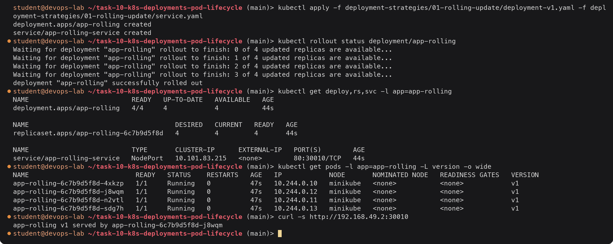

On first creation there is nothing to replace, so all four Pods are created at once. The
Deployment owns one ReplicaSet, `app-rolling-6c7b9d5f8d`, whose suffix is the hash of the
Pod template.

#### Update to v2 and watch old and new Pods

I used three terminals. Terminal 1 watched the Pods, terminal 2 sent a request every half
second, terminal 3 applied v2.

Terminal 3:

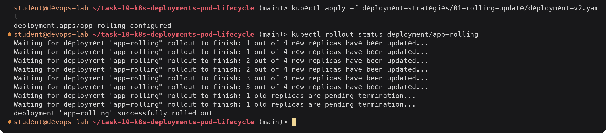

Terminal 1 (started before the apply):

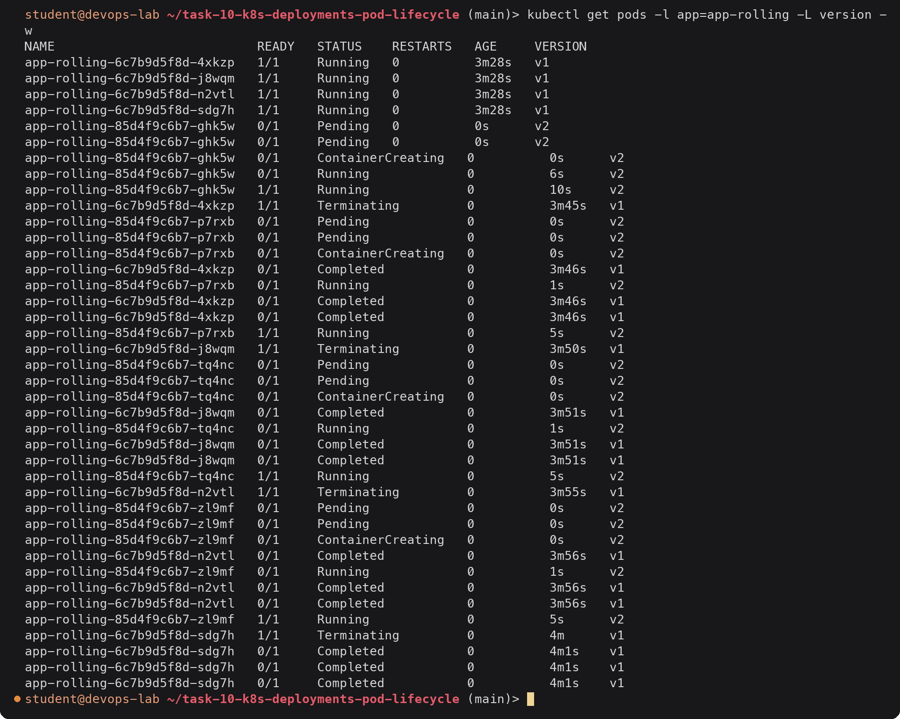

This is the rolling pattern exactly as configured. Each v2 Pod goes Pending ->
ContainerCreating -> Running 0/1 -> Running 1/1, and only when it reaches **1/1 (Ready)** does
a v1 Pod start terminating. Then the next v2 Pod is created. The first v2 Pod took 10 seconds
because `nginx:1.25-alpine` had to be pulled; the rest were faster because the image was
cached. A terminated nginx Pod briefly shows `Completed` (nginx exited 0 on the stop signal)
before it disappears.

A snapshot of the ReplicaSets taken in the middle of the rollout (after the second v2 Pod
was created):

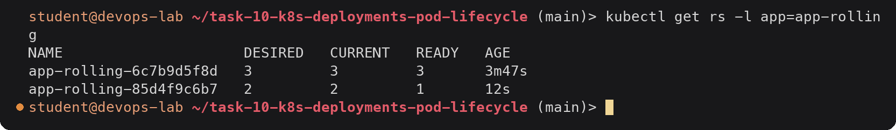

Old ReplicaSet scaled down to 3, new one scaled up to 2: 5 Pods total, which is
`replicas + maxSurge`, and 4 Ready, which is `replicas - maxUnavailable`.

Terminal 2, requests during the rollout:

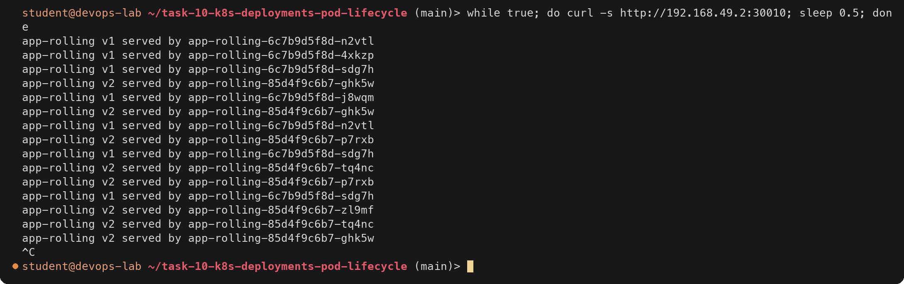

Not a single failed request, and for a while both versions answered side by side. That mix
is the trade-off of rolling updates: v1 and v2 must be able to run at the same time (same
API, compatible database schema).

#### After the rollout

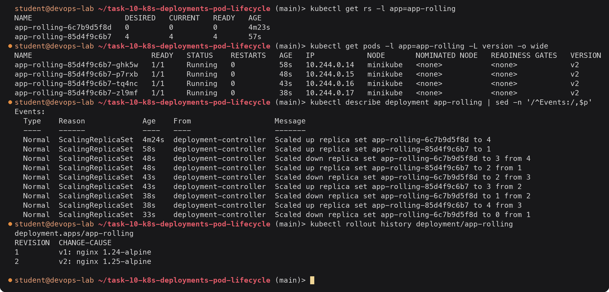

The Events list is the rollout written out step by step: one up, one down, repeated. The old
ReplicaSet is kept at 0 replicas (up to `revisionHistoryLimit: 5` of them) so a rollback is
just scaling it up again:

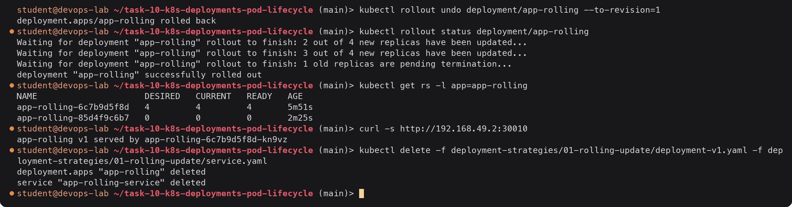

The rollback reused the same ReplicaSet `6c7b9d5f8d` (same template, same hash) and did
another rolling update in the opposite direction. (The status output starts at 2 because
the first two steps happened before I ran the command.)

---

### 02 Blue-green

Files: [`deployment-blue.yaml`](deployment-strategies/02-blue-green/deployment-blue.yaml),
[`deployment-green.yaml`](deployment-strategies/02-blue-green/deployment-green.yaml),
[`service.yaml`](deployment-strategies/02-blue-green/service.yaml).

Two complete Deployments run side by side: `app-blue` (v1, nginx 1.24) and `app-green` (v2,
nginx 1.25). Both Pods carry `app: myapp`, but they differ in `slot: blue` / `slot: green`.
The single Service selects on both labels, so changing one value in its selector moves all
traffic in one step.

```yaml
  selector:
    app: myapp
    slot: blue
```

#### Deploy blue (live) and green (idle)

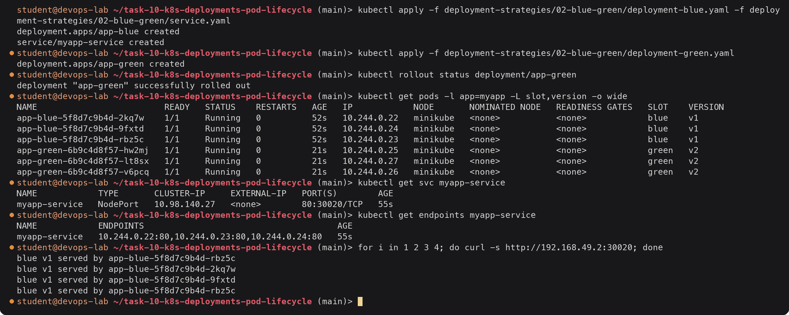

Six Pods are running, but the Service endpoints are only the three blue IPs (.22-.24), so
all users get v1. Green is fully deployed and Ready, but receives no traffic. This is
where it would be smoke tested, for example with `kubectl port-forward deploy/app-green 8080:80`.

#### Switch traffic to green

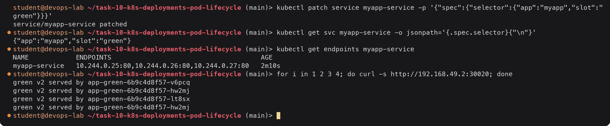

One patch moved every request to v2. The endpoints changed to the green IPs (.25-.27) and
no request returned a mix of versions. The ClusterIP and NodePort did not change, so clients
noticed nothing.

#### Roll back, then retire blue

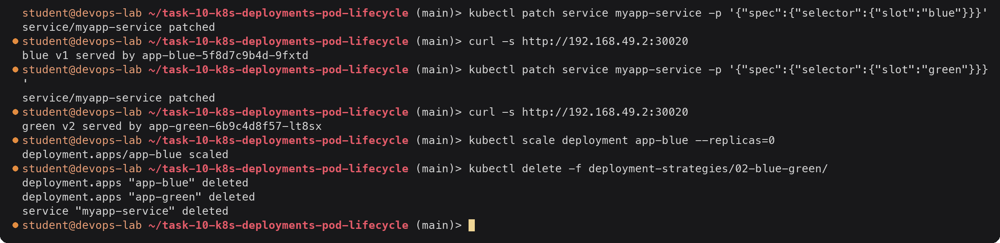

Rollback is as fast as the switch, because blue was still running. A strategic merge patch
only needs the key that changes (`slot`). In a real setup blue is kept around until green is
trusted, then scaled to 0 and becomes the target for the next release. The cost is running
double capacity during the change.

---

### 03 Canary

Files: [`deployment-stable.yaml`](deployment-strategies/03-canary/deployment-stable.yaml)
(9 replicas, v1), [`deployment-canary.yaml`](deployment-strategies/03-canary/deployment-canary.yaml)
(1 replica, v2), [`service.yaml`](deployment-strategies/03-canary/service.yaml).

Both Deployments label their Pods `app: myapp-canary`, with `track: stable` or
`track: canary`. The Service selects only `app: myapp-canary`, so it load balances across all
ten Pods. Plain Kubernetes has no weight setting; the split comes from the Pod ratio, 1 in 10.

#### Deploy

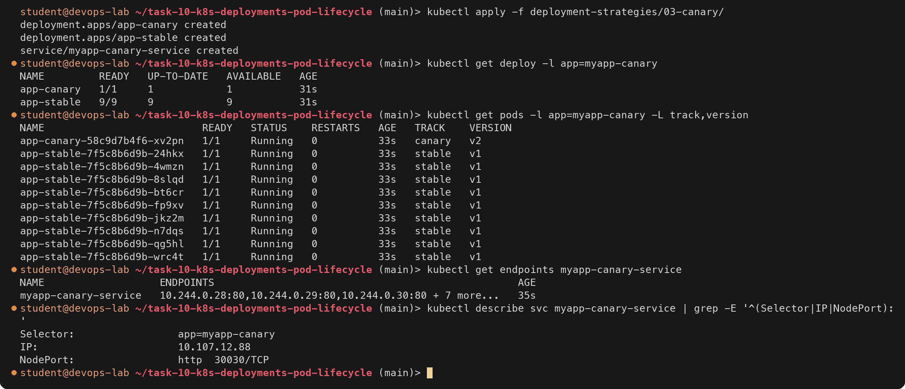

Ten endpoints behind one Service: nine stable (10.244.0.28-36) and one canary (10.244.0.37).

#### Measure the traffic split

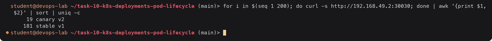

19 of 200 requests (9.5%) reached the canary, which matches the expected 10%. kube-proxy
picks a backend at random per connection, so a second run gave a slightly different number
(23 of 200); over many requests it converges to 1/10.

#### Increase the canary, then finish

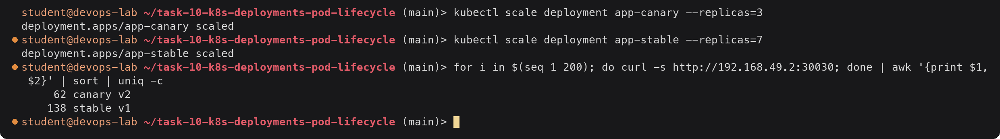

With 3 of 10 Pods on v2, about 30% of traffic (62/200 = 31%) went to the canary. If the
canary looked bad (errors, latency), the rollback would be `kubectl scale deployment
app-canary --replicas=0`, which removes it from the endpoints immediately. To complete the
release, the stable Deployment is updated to the v2 image and the canary is scaled to 0.

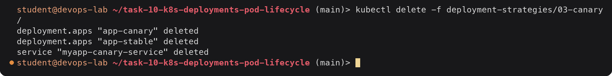

The limitation is visible here: to get 1% traffic I would need 99 stable Pods. Precise,
header-based or cookie-based splits need an ingress controller or a service mesh (for example
NGINX Ingress canary annotations, Istio, or Argo Rollouts).

---

### 04 Recreate

Files: [`deployment-v1.yaml`](deployment-strategies/04-recreate/deployment-v1.yaml),
[`deployment-v2.yaml`](deployment-strategies/04-recreate/deployment-v2.yaml),
[`service.yaml`](deployment-strategies/04-recreate/service.yaml).

```yaml
  strategy:
    type: Recreate   # delete every old Pod first, then create the new ones
```

#### Deploy v1

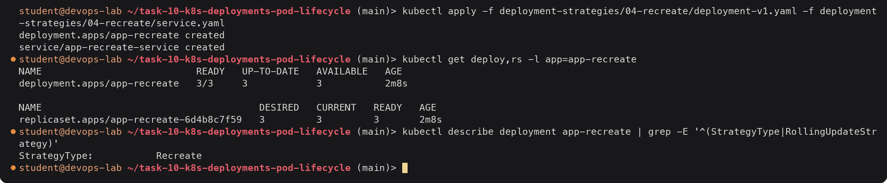

There is no `RollingUpdateStrategy` line, since surge and unavailable settings do not apply.

#### Update to v2 and watch

Terminal 1:

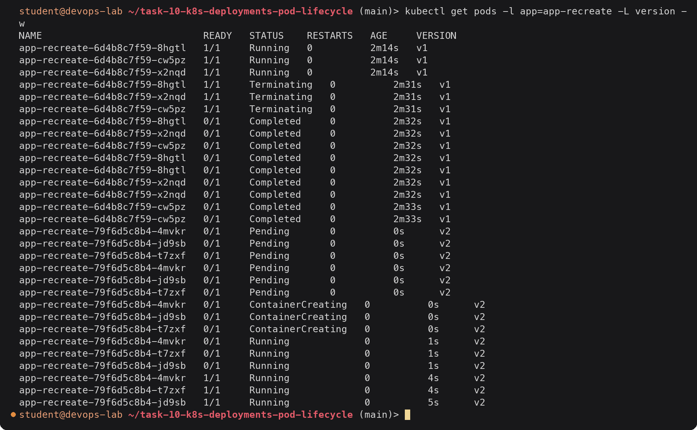

Terminal 3:

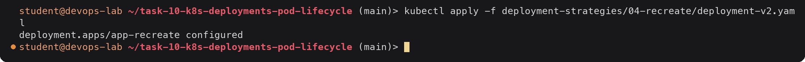

The order is the opposite of the rolling update. All three v1 Pods went to `Terminating` at
the same moment, and **no v2 Pod existed until the last v1 Pod was fully gone** (the final
`Completed` lines are the deletions). Only then were all three v2 Pods created together.

Terminal 2 during the update:

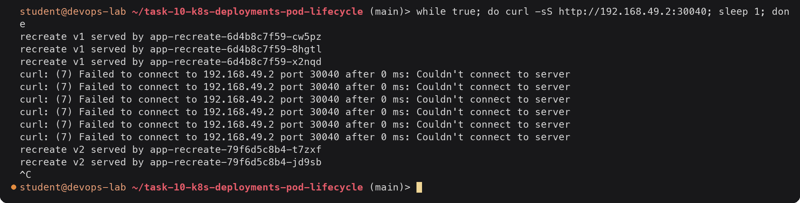

About six seconds of downtime. While the Service had no ready endpoints, kube-proxy rejected
connections to the NodePort, so curl failed straight away. The gap would be much longer for
an app that starts slowly or needs to pull a large image.

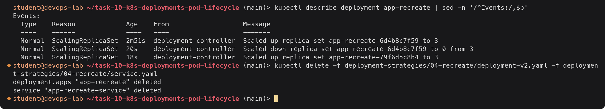

Two events: down to 0, then up to 3. Recreate is the right choice when two versions must
never run together, for example an app holding an exclusive lock on a volume
(ReadWriteOnce), or a schema migration that breaks the old version. It is also the simplest
option for dev environments where a short outage does not matter.

---

## Task 2: Pod lifecycle

### Phases and container states

A Pod's **phase** (`.status.phase`) is a one word summary of where the Pod is in its life:

| Phase | Meaning |
|---|---|
| `Pending` | Accepted by the API server, but at least one container is not running yet: still being scheduled, pulling images, or running init containers |
| `Running` | Bound to a node, all containers created, at least one is running or is being restarted |
| `Succeeded` | All containers exited with code 0 and will not be restarted |
| `Failed` | All containers have terminated and at least one exited non-zero (or was killed), and will not be restarted |
| `Unknown` | The node stopped reporting, so the state cannot be determined |

Each **container** also has its own state (`.status.containerStatuses[].state`):

| Container state | Typical reasons |
|---|---|
| `Waiting` | `ContainerCreating`, `PodInitializing`, `ErrImagePull`, `ImagePullBackOff`, `CrashLoopBackOff`, `CreateContainerConfigError` |
| `Running` | Started at a time; probes now apply |
| `Terminated` | `Completed` (exit 0), `Error` (non-zero exit), `OOMKilled`, with exit code and start/finish times |

The STATUS column in `kubectl get pods` is **neither** of these exactly. kubectl shows the
most useful reason it can find: a waiting or terminated container's reason, `Init:x/y` while
init containers run, `Terminating` when the Pod is being deleted, otherwise the phase. That
is why a Pod in `CrashLoopBackOff` is still in phase `Running`, as shown below.

Other lifecycle parts used in these examples:

- **Init containers** run one at a time, in order, each to completion, before any app container starts.
- **Hooks**: `postStart` runs right after a container is created (in parallel with its
  entrypoint); `preStop` runs before the container gets SIGTERM, inside the grace period.
- **restartPolicy** (`Always` default, `OnFailure`, `Never`) decides what the kubelet does when a
  container exits. Restarts back off exponentially: 10s, 20s, 40s ... up to 5 minutes.
- **Probes**: readiness controls whether the Pod receives Service traffic; liveness restarts a
  stuck container; startup holds off the other probes for slow starters.

All of the YAML is in [`pod-lifecycle/`](pod-lifecycle/). Each example was deleted with
`kubectl delete -f <file>` before the next one.

---

### 01 Running: [`01-running.yaml`](pod-lifecycle/01-running.yaml)

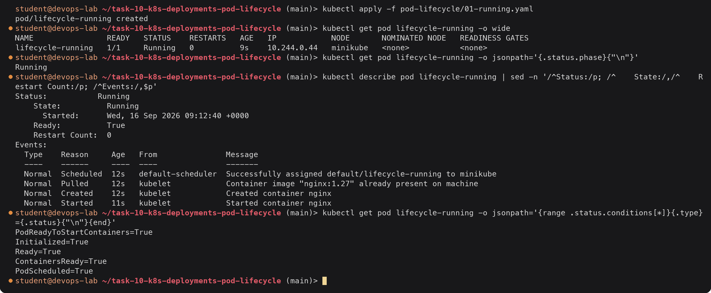

The normal path: scheduled, image already cached from task 9, container created and started.
Phase `Running`, container state `Running`, and all five Pod conditions `True`. The
conditions are the checkpoints the Pod passed: sandbox and network ready, init done,
containers ready, scheduled.

---

### 02 Pending: [`02-pending.yaml`](pod-lifecycle/02-pending.yaml)

The container requests 16 CPUs and 64 GiB of memory, far more than the node has.

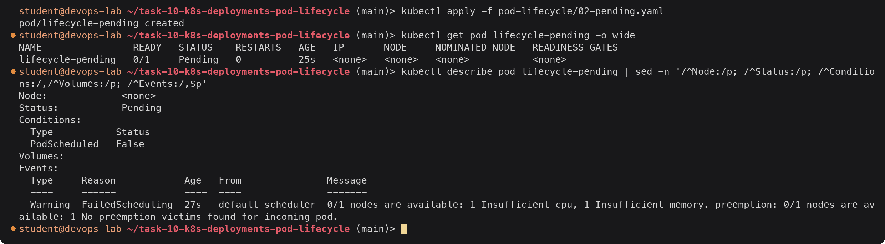

The Pod never got a node, so there is no IP and no container state at all, only the
`PodScheduled=False` condition. The scheduler's event says exactly why: the one node fails
both the CPU and memory filters, and evicting lower priority Pods would not help. A Pod stays
`Pending` like this until the request is lowered or a bigger node joins. Other common Pending
causes are an unbound PersistentVolumeClaim, a nodeSelector or taint nothing matches, or a
slow image pull.

---

### 03 Succeeded: [`03-succeeded.yaml`](pod-lifecycle/03-succeeded.yaml)

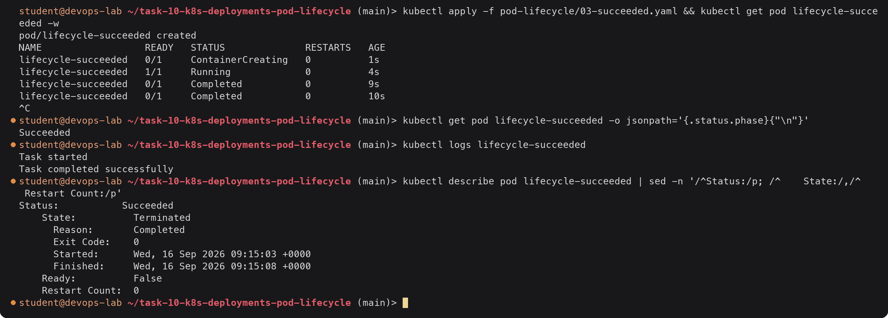

The container ran for 5 seconds and exited 0. With `restartPolicy: Never` the kubelet leaves it
alone, so the phase becomes `Succeeded` and STATUS shows the container's terminated reason,
`Completed`. The Pod object stays around (logs still readable) until deleted. This is how Job
Pods end.

---

### 04 Failed: [`04-failed.yaml`](pod-lifecycle/04-failed.yaml)

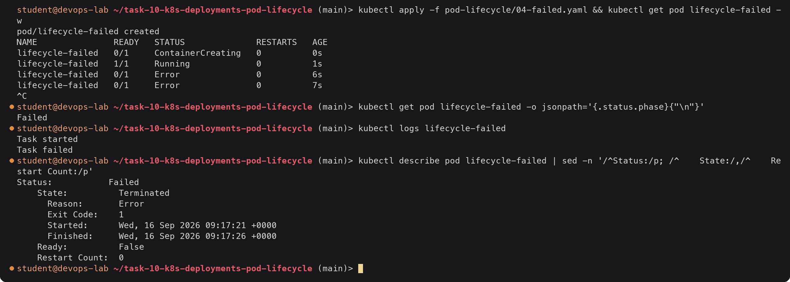

Same as 03 but `exit 1`. Non-zero exit plus `restartPolicy: Never` gives phase `Failed`,
container reason `Error`, exit code 1.

---

### 05 CrashLoopBackOff: [`05-crashloopbackoff.yaml`](pod-lifecycle/05-crashloopbackoff.yaml)

No `restartPolicy`, so it defaults to `Always`. The container exits 1 after 3 seconds.

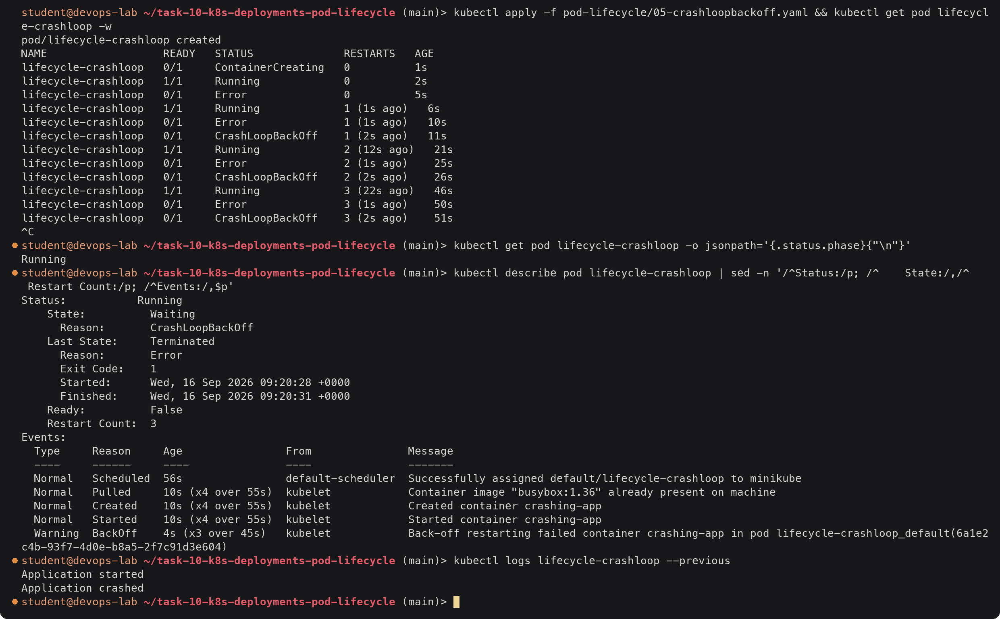

`CrashLoopBackOff` is not a phase, it is the container's **Waiting** reason while the kubelet
holds off before the next restart. The gaps between restarts grow (about 0, 10 and 20 seconds
here, then 40, 80 ... capped at 5 minutes), and the phase stays `Running` the whole time
because the Pod is still being restarted. `Last State` keeps the exit code of the previous
attempt, and `kubectl logs --previous` shows that attempt's output, which is the first thing
to check for a crashing app.

---

### 06 ImagePullBackOff: [`06-imagepullbackoff.yaml`](pod-lifecycle/06-imagepullbackoff.yaml)

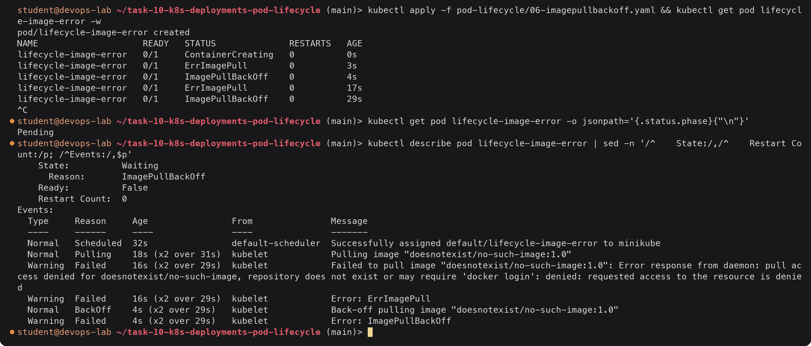

The Pod was scheduled, but the container could never be created, so the phase stays
`Pending`. The status alternates between `ErrImagePull` (a pull attempt just failed) and
`ImagePullBackOff` (waiting before the next attempt). The event shows the registry's real
answer, which separates a typo or missing tag from a private image that needs an
`imagePullSecret`.

---

### 07 Init containers: [`07-init-container.yaml`](pod-lifecycle/07-init-container.yaml)

Two init containers: `write-content` writes `index.html` into a shared `emptyDir`, then
`wait-for-deps` sleeps 10 seconds. nginx serves the shared volume.

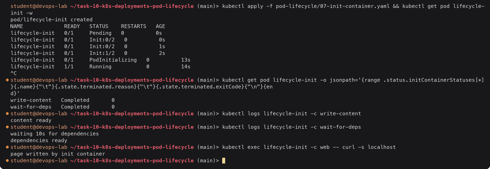

`Init:0/2` -> `Init:1/2` -> `PodInitializing` -> `Running` shows the init containers running
strictly one after another, and nginx starting only after both completed (the Pod phase is
`Pending` throughout initialisation). The page nginx served was written by the first init
container, which is the common pattern for preparing config, running migrations, or waiting
for a dependency. If an init container fails, the Pod shows `Init:Error` or
`Init:CrashLoopBackOff` and the app container never starts.

---

### 08 Lifecycle hooks: [`08-lifecycle-hooks.yaml`](pod-lifecycle/08-lifecycle-hooks.yaml)

`postStart` writes a timestamp to `/tmp/poststart.txt`. `preStop` writes a message to the main
process's stdout (`/proc/1/fd/1`, so it shows in `kubectl logs`) and sleeps 5 seconds. The
main process traps SIGTERM and logs when it arrives.

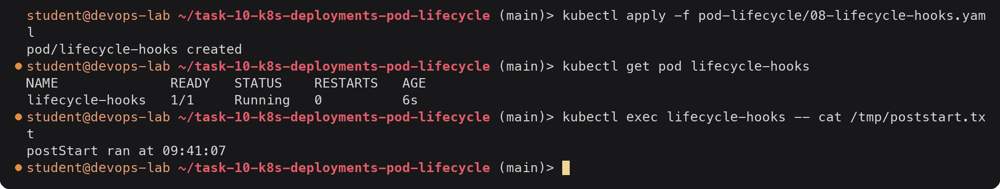

Terminal 2 followed the logs while terminal 1 deleted the Pod:

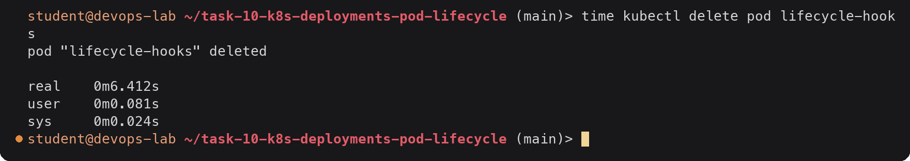

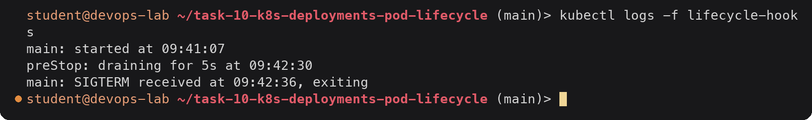

The order on deletion was: Pod marked Terminating (and removed from Service endpoints) ->
`preStop` ran and slept 5 seconds -> only then did the container get SIGTERM -> the trap
exited cleanly. The delete took about 6 seconds instead of being instant. Both hooks and
SIGTERM handling must fit within `terminationGracePeriodSeconds` (30 here); anything still
running after that gets SIGKILL. A failing `postStart` would kill the container and show a
`FailedPostStartHook` event.

---

### 09 restartPolicy variants: [`09-restart-policies.yaml`](pod-lifecycle/09-restart-policies.yaml)

Four Pods, each running a trivial command that either exits 0 or 1.

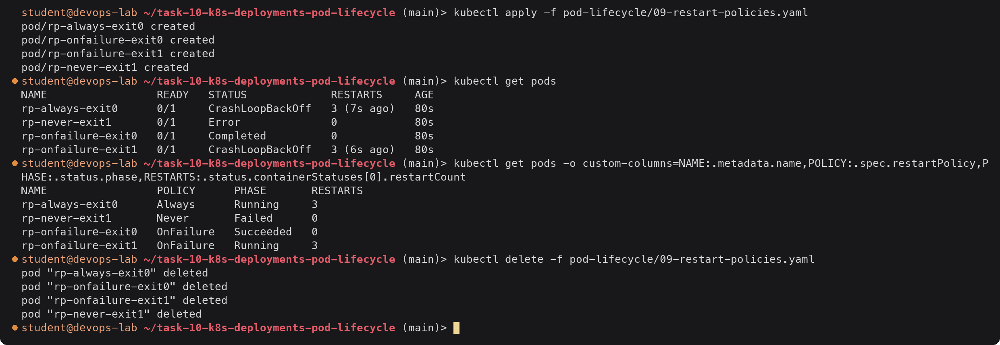

| Pod | Policy | Exit | Result |
|---|---|---|---|
| `rp-always-exit0` | Always | 0 | Restarted anyway, ends in `CrashLoopBackOff`, phase Running. `Always` does not care about the exit code, which is why Deployment Pods must be long-running processes |
| `rp-onfailure-exit0` | OnFailure | 0 | Not restarted, `Completed`, phase Succeeded |
| `rp-onfailure-exit1` | OnFailure | 1 | Restarted with back-off, `CrashLoopBackOff`, phase Running |
| `rp-never-exit1` | Never | 1 | Not restarted, `Error`, phase Failed |

Deployments only allow `Always`; Jobs only allow `OnFailure` or `Never`.

---

### 10 Liveness probe: [`10-liveness-probe.yaml`](pod-lifecycle/10-liveness-probe.yaml)

The app removes its health file after 20 seconds but keeps running, which simulates a hung
process. The probe (`test -f /tmp/healthy` every 5s, 2 failures allowed) catches it.

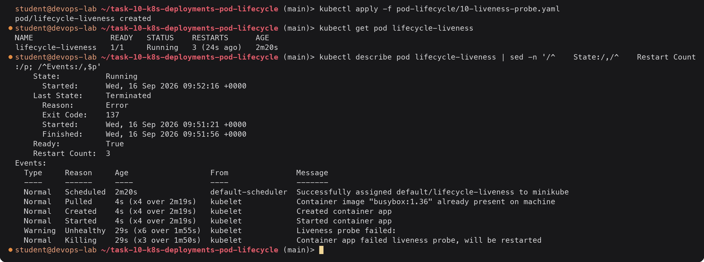

Unlike CrashLoopBackOff, the process never exited on its own. The kubelet killed it after two
failed probes: 6 failures and 3 kills in just over two minutes. Exit code 137 is 128 + 9
(SIGKILL): the shell ignored SIGTERM, so after the 5 second grace period it was killed. The
phase stays `Running` and RESTARTS keeps climbing, which is the sign of a liveness problem
rather than a crash. (The empty text after `Liveness probe failed:` is because `test` prints
nothing.)

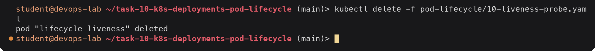

### Summary of what I observed

| File | STATUS seen | Phase | Container state | Why |
|---|---|---|---|---|
| 01-running | Running | Running | Running | Normal long-running process |
| 02-pending | Pending | Pending | (none) | Unschedulable: Insufficient cpu and memory |
| 03-succeeded | Completed | Succeeded | Terminated, Completed, exit 0 | One-shot, `restartPolicy: Never` |
| 04-failed | Error | Failed | Terminated, Error, exit 1 | One-shot failure, `restartPolicy: Never` |
| 05-crashloopbackoff | CrashLoopBackOff | Running | Waiting, CrashLoopBackOff | Exits 1, `Always` keeps restarting with back-off |
| 06-imagepullbackoff | ErrImagePull / ImagePullBackOff | Pending | Waiting, ImagePullBackOff | Image does not exist |
| 07-init-container | Init:0/2 -> Init:1/2 -> PodInitializing -> Running | Pending -> Running | init: Terminated Completed; app: Running | Init containers run first, in order |
| 08-lifecycle-hooks | Running -> Terminating | Running | Running | postStart on start, preStop delays SIGTERM by 5s |
| 09-restart-policies | CrashLoopBackOff / Completed / Error | Running / Succeeded / Failed | depends | restartPolicy combined with exit code |
| 10-liveness-probe | Running, RESTARTS rising | Running | Running, last state Terminated exit 137 | Liveness probe kills a hung container |

---

## Deliverables checklist

- [x] Rolling update: Deployment with `maxSurge: 1` / `maxUnavailable: 0`, update performed, old and new Pods shown with `rollout status`, `get rs` and `get pods -w`, plus rollback: [01 Rolling update](#01-rolling-update), [`deployment-strategies/01-rolling-update/`](deployment-strategies/01-rolling-update/)
- [x] Blue-green: blue and green Deployments, one Service, selector switched with `kubectl patch`, active version verified with curl: [02 Blue-green](#02-blue-green), [`deployment-strategies/02-blue-green/`](deployment-strategies/02-blue-green/)
- [x] Canary: 9 stable + 1 canary behind one Service sharing a label, about 10% traffic measured with a curl loop: [03 Canary](#03-canary), [`deployment-strategies/03-canary/`](deployment-strategies/03-canary/)
- [x] Recreate: all old Pods Terminating before new ones are created (`get pods -w`), downtime shown with curl: [04 Recreate](#04-recreate), [`deployment-strategies/04-recreate/`](deployment-strategies/04-recreate/)
- [x] Pod lifecycle YAMLs for Running, Pending, Succeeded, Failed, CrashLoopBackOff, ImagePullBackOff, init containers, postStart/preStop hooks, restartPolicy variants and a liveness probe, each applied with status, describe excerpt, output and explanation: [Task 2](#task-2-pod-lifecycle), [`pod-lifecycle/`](pod-lifecycle/)
- [x] Explanation of Pod phases and container states: [Phases and container states](#phases-and-container-states)
