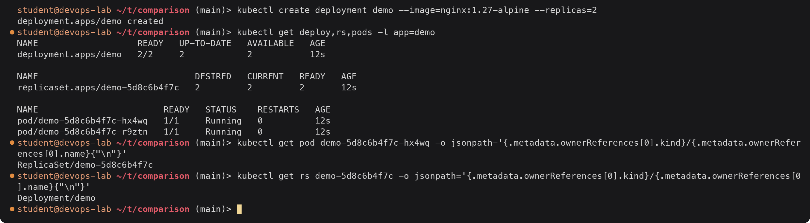
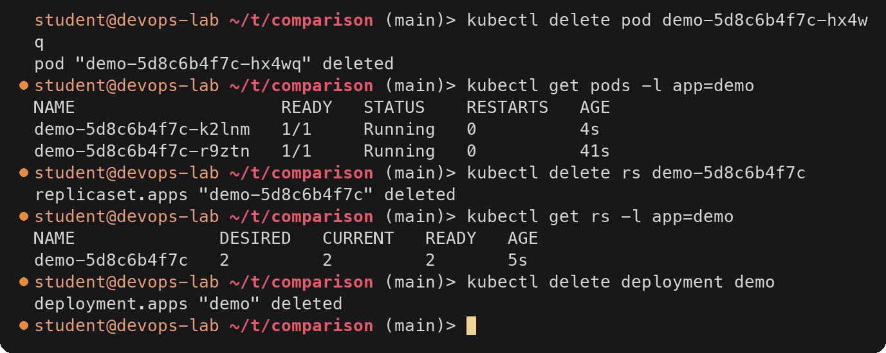
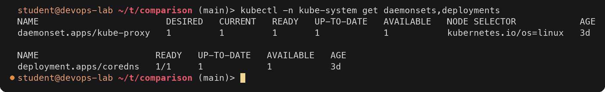

# Comparisons: Deployment, ReplicaSet, DaemonSet, StatefulSet and Service

> **Note:** Command output in this file is representative expected output for the lab environment
> described in [`../submission.md`](../submission.md), written as a learning reference. It was not
> captured from a live run, so IDs, timestamps and pod name hashes will differ when you run it yourself.

Part of [task 11](../submission.md), Task 2.

---

## 1. Deployment vs ReplicaSet

| | ReplicaSet | Deployment |
|---|---|---|
| **Purpose** | Keep exactly N copies of one Pod template running | Manage releases of a stateless app over time |
| **Pod management** | Creates/deletes Pods directly to match `replicas`, using its label selector | Never touches Pods directly; creates and scales ReplicaSets, which own the Pods |
| **Scaling** | `kubectl scale rs` works, but a Deployment above it would reset it | `kubectl scale deploy`, or HPA; the change is passed to the current ReplicaSet |
| **Rolling updates** | None. Editing its Pod template only affects Pods created later; existing Pods keep the old version | Built in: a template change creates a new ReplicaSet and moves Pods across according to `RollingUpdate` or `Recreate` |
| **Rollback / history** | None | Old ReplicaSets kept (`revisionHistoryLimit`), `kubectl rollout undo`, `pause`, `resume`, `status` |
| **Relationship** | Owned by a Deployment (`ownerReferences`); its name is `<deployment>-<pod-template-hash>` | Owns one ReplicaSet per template revision |
| **Use directly?** | Rarely. Only if you need custom update logic | Yes, the normal way to run stateless apps |

The chain of ownership on a live cluster:



<details><summary>Text version</summary>

```console
$ kubectl create deployment demo --image=nginx:1.27-alpine --replicas=2
deployment.apps/demo created
$ kubectl get deploy,rs,pods -l app=demo
NAME                   READY   UP-TO-DATE   AVAILABLE   AGE
deployment.apps/demo   2/2     2            2           12s

NAME                              DESIRED   CURRENT   READY   AGE
replicaset.apps/demo-5d8c6b4f7c   2         2         2       12s

NAME                        READY   STATUS    RESTARTS   AGE
pod/demo-5d8c6b4f7c-hx4wq   1/1     Running   0          12s
pod/demo-5d8c6b4f7c-r9ztn   1/1     Running   0          12s
$ kubectl get pod demo-5d8c6b4f7c-hx4wq -o jsonpath='{.metadata.ownerReferences[0].kind}/{.metadata.ownerReferences[0].name}{"\n"}'
ReplicaSet/demo-5d8c6b4f7c
$ kubectl get rs demo-5d8c6b4f7c -o jsonpath='{.metadata.ownerReferences[0].kind}/{.metadata.ownerReferences[0].name}{"\n"}'
Deployment/demo
```

</details>

Deployment -> ReplicaSet -> Pods. Self-healing is done by the ReplicaSet, and even the
ReplicaSet is healed by the Deployment:



<details><summary>Text version</summary>

```console
$ kubectl delete pod demo-5d8c6b4f7c-hx4wq
pod "demo-5d8c6b4f7c-hx4wq" deleted
$ kubectl get pods -l app=demo
NAME                    READY   STATUS    RESTARTS   AGE
demo-5d8c6b4f7c-k2lnm   1/1     Running   0          4s
demo-5d8c6b4f7c-r9ztn   1/1     Running   0          41s
$ kubectl delete rs demo-5d8c6b4f7c
replicaset.apps "demo-5d8c6b4f7c" deleted
$ kubectl get rs -l app=demo
NAME              DESIRED   CURRENT   READY   AGE
demo-5d8c6b4f7c   2         2         2       5s
$ kubectl delete deployment demo
deployment.apps "demo" deleted
```

</details>

The ReplicaSet replaced the deleted Pod with a new one (`k2lnm`). Deleting the ReplicaSet
also deleted its Pods (cascading delete), and the Deployment immediately recreated a
ReplicaSet with the same name, because the template and therefore the hash had not changed.
Deleting the Deployment removed everything.

---

## 2. Deployment vs DaemonSet vs StatefulSet

| | Deployment | DaemonSet | StatefulSet |
|---|---|---|---|
| **Use case** | Stateless apps where any replica is as good as another | One agent per node | Stateful apps where each replica has an identity and its own data |
| **Pod creation** | Through a ReplicaSet, all at once, random names `web-7d5f9c8b6c-4tqxm` | One Pod per matching node, created when a node joins, removed when it leaves | Ordered, one at a time: `web-0`, then `web-1` after `web-0` is Ready; deleted in reverse order |
| **Pod identity** | None; Pods are interchangeable and get new names when replaced | Tied to the node | Stable name and ordinal (`web-1` stays `web-1` after rescheduling) |
| **Scaling** | `replicas: N`, any order, HPA supported | No `replicas`; count = number of matching nodes (control with nodeSelector, affinity, tolerations) | `replicas: N`; scale up adds the next ordinal, scale down removes the highest first |
| **Updates** | RollingUpdate (surge/unavailable) or Recreate | RollingUpdate node by node (`maxUnavailable`, `maxSurge`) or OnDelete | RollingUpdate from highest ordinal down (with `partition` for staged rollouts) or OnDelete |
| **Networking** | Usually behind a ClusterIP Service; clients do not care which Pod answers | Often `hostNetwork`/`hostPort` to see node traffic; sometimes reached via the node IP | Needs a headless Service (`serviceName`) giving each Pod a DNS name `web-0.web-headless.ns.svc.cluster.local` |
| **Storage** | Shared or none; one PVC in the template would be shared by all replicas | Usually `hostPath` to read node files (logs, `/proc`, container runtime socket) | `volumeClaimTemplates`: one PVC per Pod (`data-web-0`, `data-web-1`), re-attached to the same ordinal, not deleted on scale down |
| **Examples** | nginx front end, REST APIs, web apps, workers | kube-proxy, CNI agents (Calico, Cilium), Fluent Bit, node-exporter, CSI node plugins | PostgreSQL, MySQL, MongoDB, Kafka, ZooKeeper, Elasticsearch, Redis cluster |

The cluster itself shows two of them. kube-proxy is a DaemonSet (one per node; this cluster
has one node) and CoreDNS is a Deployment:



<details><summary>Text version</summary>

```console
$ kubectl -n kube-system get daemonsets,deployments
NAME                        DESIRED   CURRENT   READY   UP-TO-DATE   AVAILABLE   NODE SELECTOR            AGE
daemonset.apps/kube-proxy   1         1         1       1            1           kubernetes.io/os=linux   3d

NAME                      READY   UP-TO-DATE   AVAILABLE   AGE
deployment.apps/coredns   1/1     1            1           3d
```

</details>

The StatefulSet behaviour (ordered creation, stable name `web-1` with a new IP after
deletion, per-Pod DNS) is shown in
[`../submission.md` section 05](../submission.md#05-headless-service-with-a-statefulset).

How to choose: if replacing a Pod with a fresh copy is fine, use a Deployment. If something
must run on every node, use a DaemonSet. If each replica needs its own stable name or its own
disk that survives rescheduling, use a StatefulSet.

---

## 3. ReplicaSet vs Service

They are often confused because both use a label selector over the same Pods, but they do
unrelated jobs.

| | ReplicaSet | Service |
|---|---|---|
| **Responsibility** | Lifecycle: make sure N Pods exist | Networking: give those Pods one stable address and spread traffic across them |
| **Acts on** | Pod objects (create, delete) | Network rules and DNS (EndpointSlices, kube-proxy, CoreDNS) |
| **Controller** | ReplicaSet controller in kube-controller-manager | EndpointSlice controller, plus kube-proxy on every node and CoreDNS |
| **Selector used to** | Count and own Pods | Find the Ready Pods to send traffic to |
| **Creates Pods?** | Yes | Never |
| **Gives an IP / DNS name?** | No | Yes: a ClusterIP and `name.namespace.svc.cluster.local` |
| **If deleted** | Its Pods are deleted | Pods keep running but lose their stable address (task 9, module 4 showed this) |

### Why a Service is needed

A ReplicaSet keeps Pods alive, but every replacement Pod gets a **new IP**. In
[task 10](../../task-10-k8s-deployments-pod-lifecycle/submission.md) a rolling update replaced
all four Pods, so their IPs went from 10.244.0.10-13 to 10.244.0.14-17. Any client that had
stored a Pod IP would have broken. Clients also would not know how many Pods exist or which
are Ready. The Service solves all three: one IP and DNS name that never change, an endpoint
list that follows the Pods automatically, and only Ready Pods in that list.

### How traffic reaches the Pods

```text
 client Pod: curl http://web-clusterip:8080
        |
        | 1. DNS: CoreDNS (10.96.0.10) answers web-clusterip.default.svc.cluster.local -> 10.103.45.120
        v
 packet to 10.103.45.120:8080   (the ClusterIP is virtual: no interface owns it)
        |
        | 2. kube-proxy's iptables rules in the node's network stack (KUBE-SERVICES chain)
        |    match the ClusterIP:port and DNAT to one Ready endpoint, chosen at random
        v
 10.244.0.62:80  (web-clusterip-7d5f9c8b6c-9hzkw)
        ^
        | 3. The endpoint list comes from the EndpointSlice controller, which watches
        |    Pods matching the selector app=web-clusterip and their readiness
        |
 ReplicaSet web-clusterip-7d5f9c8b6c keeps 3 such Pods alive (it knows nothing about the Service)
```

The ReplicaSet and the Service never talk to each other. They are connected only through the
labels on the Pods: the ReplicaSet puts `app=web-clusterip` on every Pod it creates, and the
Service selects Pods with `app=web-clusterip`. That loose coupling is what makes blue-green
and canary (task 10) possible: one Service can select Pods from several ReplicaSets.
