# CoreDNS in Kubernetes

> **Note:** Command output in this file is representative expected output for the lab environment
> described in [`../submission.md`](../submission.md), written as a learning reference. It was not
> captured from a live run, so IDs, timestamps and pod name hashes will differ when you run it yourself.

Part of [task 11](../submission.md), Task 4. Run on 2026-09-17 after the FQDN part and before
the clean up step in `submission.md`, so `web-clusterip` (`10.103.45.120`) still exists. The
client is `net-client` (`10.244.0.60`, netshoot image, which uses the musl resolver).

---

## 1. What is CoreDNS

CoreDNS is a DNS server written in Go, built as a chain of **plugins**: each line in its
config file (the Corefile) enables a plugin, and every query passes through the chain until a
plugin answers it. It is a CNCF graduated project and has been the default cluster DNS in
Kubernetes since v1.13, replacing the older `kube-dns` (which needed three containers:
kubedns, dnsmasq and a sidecar).

In a cluster it runs as an ordinary Deployment in `kube-system`, behind a Service that for
historical reasons is still named `kube-dns`:

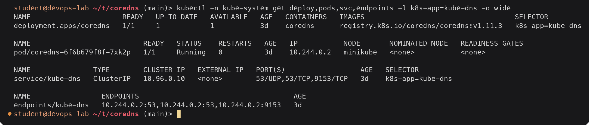

<details><summary>Text version</summary>

```console
$ kubectl -n kube-system get deploy,pods,svc,endpoints -l k8s-app=kube-dns -o wide
NAME                      READY   UP-TO-DATE   AVAILABLE   AGE   CONTAINERS   IMAGES                                    SELECTOR
deployment.apps/coredns   1/1     1            1           3d    coredns      registry.k8s.io/coredns/coredns:v1.11.3   k8s-app=kube-dns

NAME                           READY   STATUS    RESTARTS   AGE   IP           NODE       NOMINATED NODE   READINESS GATES
pod/coredns-6f6b679f8f-7xk2p   1/1     Running   0          3d    10.244.0.2   minikube   <none>           <none>

NAME               TYPE        CLUSTER-IP   EXTERNAL-IP   PORT(S)                  AGE   SELECTOR
service/kube-dns   ClusterIP   10.96.0.10   <none>        53/UDP,53/TCP,9153/TCP   3d    k8s-app=kube-dns

NAME                 ENDPOINTS                                     AGE
endpoints/kube-dns   10.244.0.2:53,10.244.0.2:53,10.244.0.2:9153   3d
```

</details>

kubeadm runs two replicas; minikube scales it down to one. Port 53 is DNS over UDP and TCP,
port 9153 is Prometheus metrics. The ClusterIP `10.96.0.10` is fixed (the tenth address of the
Service CIDR) because the kubelet writes it into every Pod's `/etc/resolv.conf`.

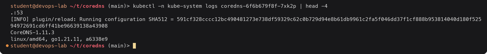

<details><summary>Text version</summary>

```console
$ kubectl -n kube-system logs coredns-6f6b679f8f-7xk2p | head -4
.:53
[INFO] plugin/reload: Running configuration SHA512 = 591cf328cccc12bc490481273e738df59329c62c0b729d94e8b61db9961c2fa5f046dd37f1cf888b953814040d180f52594972691cd6ff41be96639138a43908
CoreDNS-1.11.3
linux/amd64, go1.21.11, a6338e9
```

</details>

---

## 2. Why Kubernetes uses CoreDNS

- **Pods and Services are short-lived.** Pod IPs change on every restart and Services are
  created and deleted all the time. Apps need names that stay correct without anyone editing
  DNS records. CoreDNS's `kubernetes` plugin watches the API server and answers from live data.
- **Every program already speaks DNS.** Any language or tool can use `getaddrinfo()`; no client
  library or sidecar is needed for service discovery.
- **One small binary, flexible.** Caching, forwarding, rewriting, stub domains, metrics and
  health checks are all plugins configured in one ConfigMap, instead of the three cooperating
  processes kube-dns used.
- **It handles both worlds.** Cluster names (`*.cluster.local`) are answered locally; everything
  else is forwarded upstream, so Pods use one resolver for internal and external names.

---

## 3. Service discovery

```text
            watch Services, EndpointSlices, Namespaces
  kube-apiserver  ─────────────────────────────────────►  CoreDNS (kubernetes plugin)
                                                           in-memory view of the cluster
                                                                    ▲
                                                 DNS query, UDP 53  │
  Pod ── /etc/resolv.conf: nameserver 10.96.0.10 ── kube-proxy ─────┘
```

When I create a Service, CoreDNS learns about it within a moment through its watch and starts
answering for `<svc>.<ns>.svc.cluster.local`. When a headless Service's Pods change, the
EndpointSlice changes and CoreDNS's answer changes with it. No registration step exists.
The records it serves (A, SRV, CNAME, PTR, Pod records) are listed in
[`../fqdn/README.md`](../fqdn/README.md#2-kubernetes-service-dns).

---

## 4. How a query is resolved

### The Pod's `/etc/resolv.conf`

The kubelet writes this file into every Pod with the default `dnsPolicy: ClusterFirst`:

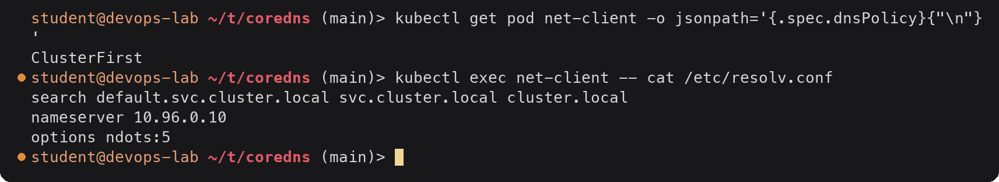

<details><summary>Text version</summary>

```console
$ kubectl get pod net-client -o jsonpath='{.spec.dnsPolicy}{"\n"}'
ClusterFirst
$ kubectl exec net-client -- cat /etc/resolv.conf
search default.svc.cluster.local svc.cluster.local cluster.local
nameserver 10.96.0.10
options ndots:5
```

</details>

| Line | Meaning |
|---|---|
| `nameserver 10.96.0.10` | Send every query to the kube-dns Service, which kube-proxy forwards to a CoreDNS Pod |
| `search default.svc.cluster.local svc.cluster.local cluster.local` | Suffixes to try on relative names. The first one contains the Pod's own namespace |
| `options ndots:5` | If a name has **fewer than 5 dots**, try the search suffixes **first**, and the name as typed last. With 5 or more dots, try it as typed first |

Why 5: a name like `web-0.web-headless.default.svc` has 4 dots and must still get
`.cluster.local` appended, so the threshold has to be higher than any in-cluster relative name.

### Watching it happen in the CoreDNS log

The minikube Corefile enables the `log` plugin, so every query is logged. Each line shows the
client, the query, the response code, flags, response size and duration.

A short Service name: 0 dots, so the first search domain is tried first and hits.

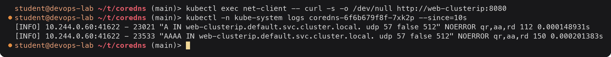

<details><summary>Text version</summary>

```console
$ kubectl exec net-client -- curl -s -o /dev/null http://web-clusterip:8080
$ kubectl -n kube-system logs coredns-6f6b679f8f-7xk2p --since=10s
[INFO] 10.244.0.60:41622 - 23021 "A IN web-clusterip.default.svc.cluster.local. udp 57 false 512" NOERROR qr,aa,rd 112 0.000148931s
[INFO] 10.244.0.60:41622 - 23533 "AAAA IN web-clusterip.default.svc.cluster.local. udp 57 false 512" NOERROR qr,aa,rd 150 0.000201383s
```

</details>

Two queries (A and AAAA, sent together by the resolver), both answered by CoreDNS itself
(`aa` = authoritative) in a fraction of a millisecond. The AAAA answer is NOERROR with no
address, since the cluster is IPv4 only.

An external name: `example.com` has 1 dot, fewer than 5, so all three search domains are
tried before the real name:

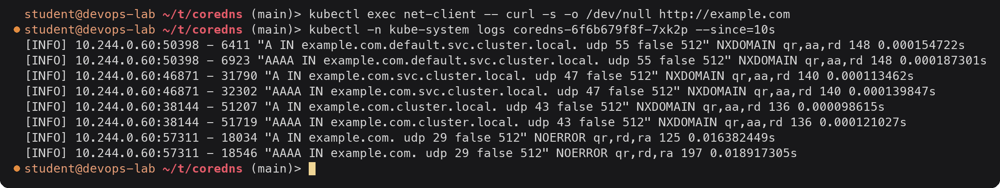

<details><summary>Text version</summary>

```console
$ kubectl exec net-client -- curl -s -o /dev/null http://example.com
$ kubectl -n kube-system logs coredns-6f6b679f8f-7xk2p --since=10s
[INFO] 10.244.0.60:50398 - 6411 "A IN example.com.default.svc.cluster.local. udp 55 false 512" NXDOMAIN qr,aa,rd 148 0.000154722s
[INFO] 10.244.0.60:50398 - 6923 "AAAA IN example.com.default.svc.cluster.local. udp 55 false 512" NXDOMAIN qr,aa,rd 148 0.000187301s
[INFO] 10.244.0.60:46871 - 31790 "A IN example.com.svc.cluster.local. udp 47 false 512" NXDOMAIN qr,aa,rd 140 0.000113462s
[INFO] 10.244.0.60:46871 - 32302 "AAAA IN example.com.svc.cluster.local. udp 47 false 512" NXDOMAIN qr,aa,rd 140 0.000139847s
[INFO] 10.244.0.60:38144 - 51207 "A IN example.com.cluster.local. udp 43 false 512" NXDOMAIN qr,aa,rd 136 0.000098615s
[INFO] 10.244.0.60:38144 - 51719 "AAAA IN example.com.cluster.local. udp 43 false 512" NXDOMAIN qr,aa,rd 136 0.000121027s
[INFO] 10.244.0.60:57311 - 18034 "A IN example.com. udp 29 false 512" NOERROR qr,rd,ra 125 0.016382449s
[INFO] 10.244.0.60:57311 - 18546 "AAAA IN example.com. udp 29 false 512" NOERROR qr,rd,ra 197 0.018917305s
```

</details>

Eight queries for one lookup: six wasted NXDOMAIN answers for the search domains, then the
real name, which CoreDNS **forwarded** upstream (`ra` = recursion available, no `aa`, and 16-19
ms instead of microseconds). This is the cost of `ndots:5` for external names.

The same lookup with a trailing dot (a true FQDN) skips the search list:

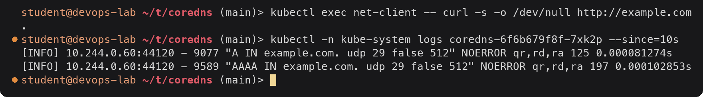

<details><summary>Text version</summary>

```console
$ kubectl exec net-client -- curl -s -o /dev/null http://example.com.
$ kubectl -n kube-system logs coredns-6f6b679f8f-7xk2p --since=10s
[INFO] 10.244.0.60:44120 - 9077 "A IN example.com. udp 29 false 512" NOERROR qr,rd,ra 125 0.000081274s
[INFO] 10.244.0.60:44120 - 9589 "AAAA IN example.com. udp 29 false 512" NOERROR qr,rd,ra 197 0.000102853s
```

</details>

Two queries instead of eight, and served from CoreDNS's `cache` (microseconds) since the
previous lookup was less than 30 seconds earlier.

### The full path

```text
1. App calls getaddrinfo("web-clusterip")
2. Resolver reads /etc/resolv.conf: 0 dots < ndots:5 -> try "web-clusterip.default.svc.cluster.local." first
3. UDP packet to 10.96.0.10:53 -> kube-proxy DNAT -> CoreDNS Pod 10.244.0.2:53
4. CoreDNS plugin chain:
     log         -> write the log line
     kubernetes  -> zone cluster.local matches; Service default/web-clusterip found -> A 10.103.45.120, TTL 30
   (for example.com the kubernetes plugin does not own the zone; hosts falls through; cache misses;
    forward sends it to the upstream resolver from the node's /etc/resolv.conf)
5. Answer goes back to the Pod; the app connects to 10.103.45.120:8080
```

---

## 5. Corefile configuration

The Corefile is stored in the `coredns` ConfigMap. This is the unmodified one minikube v1.34
creates for Kubernetes v1.31:

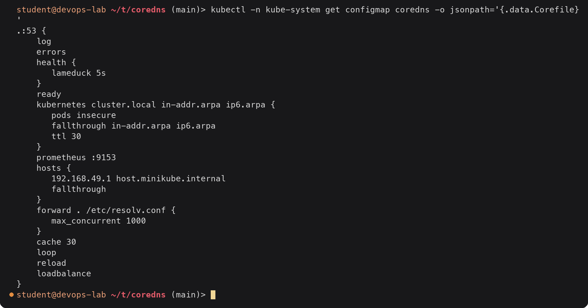

<details><summary>Text version</summary>

```console
$ kubectl -n kube-system get configmap coredns -o jsonpath='{.data.Corefile}'
.:53 {
    log
    errors
    health {
       lameduck 5s
    }
    ready
    kubernetes cluster.local in-addr.arpa ip6.arpa {
       pods insecure
       fallthrough in-addr.arpa ip6.arpa
       ttl 30
    }
    prometheus :9153
    hosts {
       192.168.49.1 host.minikube.internal
       fallthrough
    }
    forward . /etc/resolv.conf {
       max_concurrent 1000
    }
    cache 30
    loop
    reload
    loadbalance
}
```

</details>

It is the kubeadm default plus two minikube additions: `log` and the `hosts` block.

| Line | What it does |
|---|---|
| `.:53 {` | One server block for the root zone `.` (every name) on port 53 |
| `log` | Log every query to stdout (minikube addition; useful for learning, noisy in production) |
| `errors` | Log errors to stdout |
| `health { lameduck 5s }` | `http://:8080/health` for the liveness probe; on shutdown keeps answering for 5s so in-flight queries finish |
| `ready` | `http://:8181/ready` for the readiness probe, OK once all plugins are ready |
| `kubernetes cluster.local in-addr.arpa ip6.arpa` | Answers for the cluster domain and reverse lookups from the Kubernetes API |
| `  pods insecure` | Answer `a-b-c-d.ns.pod.cluster.local` for any IP without checking a Pod exists (kube-dns compatible) |
| `  fallthrough in-addr.arpa ip6.arpa` | Reverse lookups for IPs that are not cluster IPs are passed on to the next plugins instead of NXDOMAIN |
| `  ttl 30` | TTL of the answers it generates |
| `prometheus :9153` | Metrics endpoint (query counts, latency, cache hits) |
| `hosts { 192.168.49.1 host.minikube.internal; fallthrough }` | Static record so Pods can reach the host machine (minikube addition); other names fall through |
| `forward . /etc/resolv.conf { max_concurrent 1000 }` | Anything not answered above goes to the nameservers in the **CoreDNS Pod's** resolv.conf (inherited from the node, since CoreDNS uses `dnsPolicy: Default`); at most 1000 concurrent upstream queries |
| `cache 30` | Cache answers (positive and negative) for up to 30 seconds |
| `loop` | At start-up, detect a forwarding loop back to itself and stop (crash) rather than loop forever |
| `reload` | Re-read the Corefile when the ConfigMap changes (checked about every 30s); no restart needed |
| `loadbalance` | Shuffle the order of A/AAAA records in each answer (round-robin DNS, visible with the headless Service) |

The order of lines inside the block does not matter: CoreDNS runs plugins in a fixed order
compiled into the binary.

Common customisations, made with `kubectl -n kube-system edit configmap coredns`:

```text
# send a private domain to the company DNS server (stub domain)
corp.example:53 {
    errors
    cache 30
    forward . 10.10.0.53
}

# inside the .:53 block: make an old name an alias of a Service
rewrite name legacy-db.default.svc.cluster.local postgres.data.svc.cluster.local
```

---

## 6. Troubleshooting DNS

A checklist, in the order I would go through it, with the commands and what healthy output
looks like on this cluster.

### Step 1: Can the Pod resolve the API server's name?

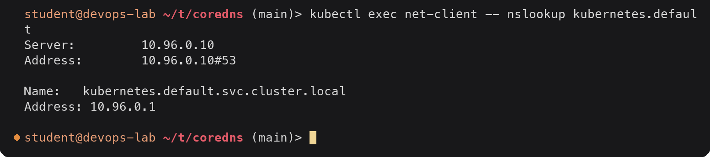

<details><summary>Text version</summary>

```console
$ kubectl exec net-client -- nslookup kubernetes.default
Server:		10.96.0.10
Address:	10.96.0.10#53

Name:	kubernetes.default.svc.cluster.local
Address: 10.96.0.1

```

</details>

If this works, cluster DNS is fine and the problem is the name being looked up (wrong
namespace, typo, Service missing). If it fails, continue.

### Step 2: Is the Pod pointed at CoreDNS?

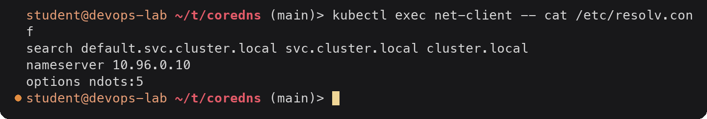

<details><summary>Text version</summary>

```console
$ kubectl exec net-client -- cat /etc/resolv.conf
search default.svc.cluster.local svc.cluster.local cluster.local
nameserver 10.96.0.10
options ndots:5
```

</details>

The nameserver must be the kube-dns ClusterIP. Pods with `hostNetwork: true` need
`dnsPolicy: ClusterFirstWithHostNet` to get this; `dnsPolicy: Default` gives the node's resolver.

### Step 3: Is CoreDNS running and behind the Service?

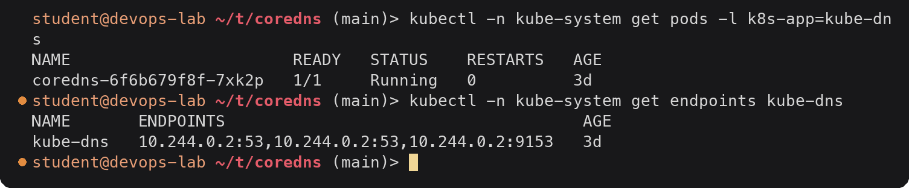

<details><summary>Text version</summary>

```console
$ kubectl -n kube-system get pods -l k8s-app=kube-dns
NAME                       READY   STATUS    RESTARTS   AGE
coredns-6f6b679f8f-7xk2p   1/1     Running   0          3d
$ kubectl -n kube-system get endpoints kube-dns
NAME       ENDPOINTS                                     AGE
kube-dns   10.244.0.2:53,10.244.0.2:53,10.244.0.2:9153   3d
```

</details>

### Step 4: Do the CoreDNS logs show errors?

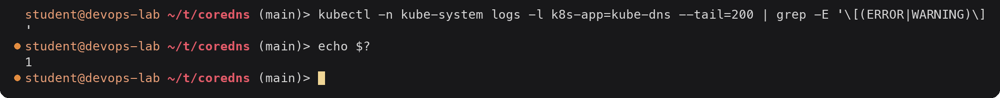

<details><summary>Text version</summary>

```console
$ kubectl -n kube-system logs -l k8s-app=kube-dns --tail=200 | grep -E '\[(ERROR|WARNING)\]'
$ echo $?
1
```

</details>

No errors. Typical ones are `[ERROR] plugin/errors: ... i/o timeout` (upstream DNS unreachable),
`Loop (127.0.0.1:xxxx -> :53) detected` from the `loop` plugin (CoreDNS crash-looping because
the node's resolv.conf points at a local stub such as systemd-resolved's `127.0.0.53`), and API
connection errors from the `kubernetes` plugin.

### Step 5: Does the Service actually exist where I think?

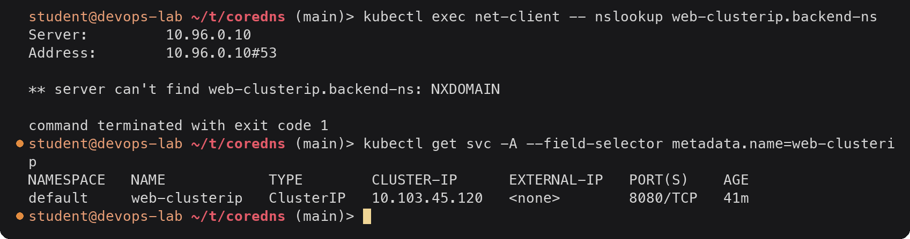

<details><summary>Text version</summary>

```console
$ kubectl exec net-client -- nslookup web-clusterip.backend-ns
Server:		10.96.0.10
Address:	10.96.0.10#53

** server can't find web-clusterip.backend-ns: NXDOMAIN

command terminated with exit code 1
$ kubectl get svc -A --field-selector metadata.name=web-clusterip
NAMESPACE   NAME            TYPE        CLUSTER-IP      EXTERNAL-IP   PORT(S)    AGE
default     web-clusterip   ClusterIP   10.103.45.120   <none>        8080/TCP   41m
```

</details>

NXDOMAIN is a real answer from a working DNS server: the name does not exist. Here the
Service is in `default`, not `backend-ns`.

### A failure on purpose: no CoreDNS endpoints

To see what a broken cluster DNS looks like, I scaled CoreDNS to zero:

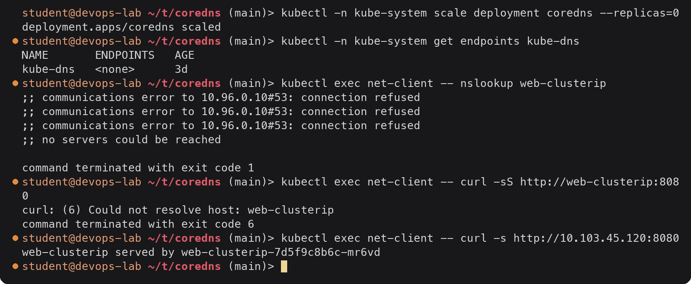

<details><summary>Text version</summary>

```console
$ kubectl -n kube-system scale deployment coredns --replicas=0
deployment.apps/coredns scaled
$ kubectl -n kube-system get endpoints kube-dns
NAME       ENDPOINTS   AGE
kube-dns   <none>      3d
$ kubectl exec net-client -- nslookup web-clusterip
;; communications error to 10.96.0.10#53: connection refused
;; communications error to 10.96.0.10#53: connection refused
;; communications error to 10.96.0.10#53: connection refused
;; no servers could be reached

command terminated with exit code 1
$ kubectl exec net-client -- curl -sS http://web-clusterip:8080
curl: (6) Could not resolve host: web-clusterip
command terminated with exit code 6
$ kubectl exec net-client -- curl -s http://10.103.45.120:8080
web-clusterip served by web-clusterip-7d5f9c8b6c-mr6vd
```

</details>

The difference from step 5 is important: here there is **no answer at all** ("no servers
could be reached"), not NXDOMAIN. With no endpoints behind `10.96.0.10`, kube-proxy rejects the
packets. The Service itself was fine the whole time: curling the ClusterIP directly worked.
So "could not resolve host" plus "IP works" means DNS, not the app.

The fix, and confirmation:

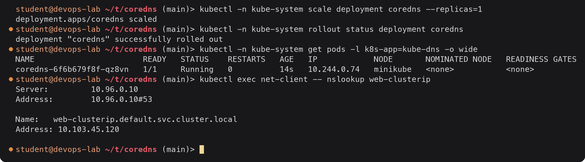

<details><summary>Text version</summary>

```console
$ kubectl -n kube-system scale deployment coredns --replicas=1
deployment.apps/coredns scaled
$ kubectl -n kube-system rollout status deployment coredns
deployment "coredns" successfully rolled out
$ kubectl -n kube-system get pods -l k8s-app=kube-dns -o wide
NAME                       READY   STATUS    RESTARTS   AGE   IP            NODE       NOMINATED NODE   READINESS GATES
coredns-6f6b679f8f-qz8vn   1/1     Running   0          14s   10.244.0.74   minikube   <none>           <none>
$ kubectl exec net-client -- nslookup web-clusterip
Server:		10.96.0.10
Address:	10.96.0.10#53

Name:	web-clusterip.default.svc.cluster.local
Address: 10.103.45.120

```

</details>

The new CoreDNS Pod has a new IP (10.244.0.74), but clients did not need to know: they still
use the Service IP `10.96.0.10`. That is the same Service mechanism from Task 1 protecting
DNS itself.

### Common problems

| Symptom | Likely cause | Check / fix |
|---|---|---|
| `NXDOMAIN` / "could not resolve host" for a Service | Wrong namespace or name; Service not created | `kubectl get svc -A`; use `name.namespace` |
| Timeouts, "no servers could be reached" | CoreDNS Pods down or not Ready; NetworkPolicy blocking UDP/TCP 53 to `kube-system` | Steps 3-4; allow egress to `k8s-app=kube-dns` on port 53 |
| Internal names work, external names fail | Upstream DNS from the node unreachable | CoreDNS logs (`i/o timeout`); `forward` target; node's `/etc/resolv.conf` |
| CoreDNS in `CrashLoopBackOff` with "Loop ... detected" | Node resolv.conf points at a local stub (`127.0.0.53`) | Point kubelet `resolvConf` at `/run/systemd/resolve/resolv.conf`, or forward to a real IP |
| External lookups slow | `ndots:5` makes every external name try 3 search domains first (section 4) | Use trailing dots for external hosts, or set `dnsConfig.options: [{name: ndots, value: "2"}]` in the Pod spec |
| Name resolves but connection fails | Not a DNS problem: Service has no endpoints (selector or readiness) | `kubectl get endpoints <svc>` |
| Changed the Corefile, nothing happened | `reload` checks about every 30s; syntax error keeps the old config | `kubectl -n kube-system logs deploy/coredns` for `plugin/reload` messages |

Lowering `ndots` for one Pod:

```yaml
spec:
  dnsConfig:
    options:
      - name: ndots
        value: "2"
```

With `ndots:2`, `example.com` (1 dot) still goes through the search list, but `api.example.com`
(2 dots) is tried as written first. Short in-cluster names like `web-clusterip` keep working.
