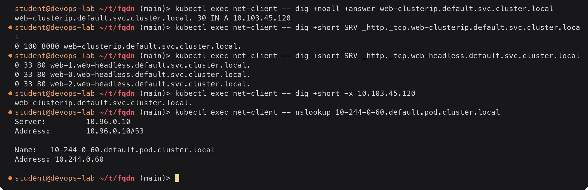
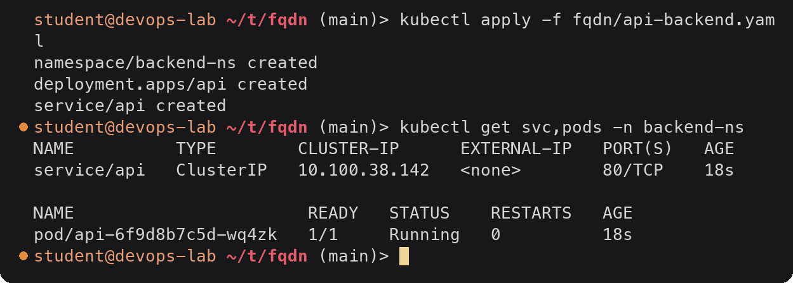
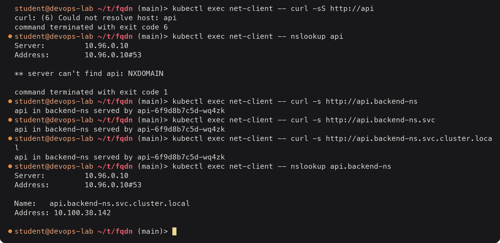
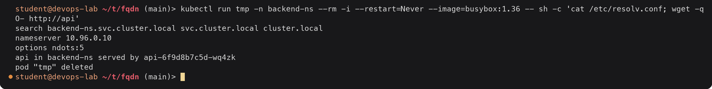
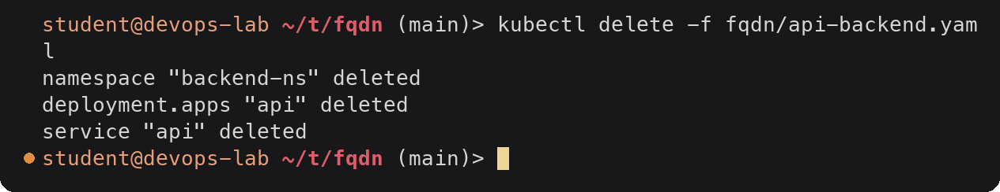

# FQDN and Kubernetes Service DNS

> **Note:** Command output in this file is representative expected output for the lab environment
> described in [`../submission.md`](../submission.md), written as a learning reference. It was not
> captured from a live run, so IDs, timestamps and pod name hashes will differ when you run it yourself.

Part of [task 11](../submission.md), Task 3. These commands were run on 2026-09-17 before the
clean up step in `submission.md`, while `web-clusterip` (ClusterIP `10.103.45.120`) and the
`web-headless` StatefulSet were still deployed. The client is the `net-client` Pod
(`10.244.0.60`) in the `default` namespace. Extra file: [`api-backend.yaml`](api-backend.yaml).

---

## 1. What is an FQDN

A **Fully Qualified Domain Name** is a name that spells out every label up to the DNS root, so
it means the same thing no matter where it is looked up. Strictly it ends with a dot, which
stands for the root:

```text
web-clusterip.default.svc.cluster.local.
                                       ^ root
```

A name that is not fully qualified (`web-clusterip`, `api.backend-ns`) is **relative**: the
resolver completes it by appending the domains from the `search` line of `/etc/resolv.conf`.
Inside Kubernetes almost everyone uses relative names, and the search list turns them into
FQDNs. The FQDN is what CoreDNS actually stores and answers for.

---

## 2. Kubernetes Service DNS

Every Service automatically gets DNS records from CoreDNS. Nobody registers them by hand:
CoreDNS watches Services and EndpointSlices through the API server and answers from that.

| Service type | Record for `<svc>.<ns>.svc.cluster.local` |
|---|---|
| ClusterIP / NodePort / LoadBalancer | `A` (and `AAAA` on IPv6) -> the ClusterIP |
| Headless (`clusterIP: None`) | `A` records -> every Ready Pod IP; plus one record per Pod if they have a hostname and subdomain (StatefulSet) |
| ExternalName | `CNAME` -> the external name |
| Any Service with named ports | `SRV` `_<port-name>._<protocol>.<svc>.<ns>.svc.cluster.local` -> port and target |

Pods also get records of the form `<ip-with-dashes>.<ns>.pod.cluster.local`, and a reverse
(PTR) record exists for each ClusterIP.



<details><summary>Text version</summary>

```console
$ kubectl exec net-client -- dig +noall +answer web-clusterip.default.svc.cluster.local
web-clusterip.default.svc.cluster.local. 30 IN A 10.103.45.120
$ kubectl exec net-client -- dig +short SRV _http._tcp.web-clusterip.default.svc.cluster.local
0 100 8080 web-clusterip.default.svc.cluster.local.
$ kubectl exec net-client -- dig +short SRV _http._tcp.web-headless.default.svc.cluster.local
0 33 80 web-1.web-headless.default.svc.cluster.local.
0 33 80 web-0.web-headless.default.svc.cluster.local.
0 33 80 web-2.web-headless.default.svc.cluster.local.
$ kubectl exec net-client -- dig +short -x 10.103.45.120
web-clusterip.default.svc.cluster.local.
$ kubectl exec net-client -- nslookup 10-244-0-60.default.pod.cluster.local
Server:		10.96.0.10
Address:	10.96.0.10#53

Name:	10-244-0-60.default.pod.cluster.local
Address: 10.244.0.60

```

</details>

- The A record has a TTL of 30 seconds, set by `ttl 30` in the Corefile.
- The SRV record tells a client the **port** too (8080, the Service port, named `http`). For the
  headless Service there is one SRV entry per Pod, pointing at each Pod's own name.
- The reverse lookup maps the ClusterIP back to the Service FQDN.
- The Pod record works because the minikube Corefile has `pods insecure` (it answers for any IP
  without checking that a Pod has it). Pod records are rarely useful; use Services.

---

## 3. Naming convention

```text
   web-clusterip . default . svc . cluster.local
   └─────┬─────┘   └──┬──┘   └┬┘   └─────┬─────┘
     Service name  Namespace  fixed   cluster domain
     metadata.name             "svc"  (kubelet --cluster-domain, default cluster.local)
```

| Record for | Format | Example from this task |
|---|---|---|
| Service | `<service>.<namespace>.svc.<cluster-domain>` | `web-clusterip.default.svc.cluster.local` |
| StatefulSet Pod via headless Service | `<pod>.<service>.<namespace>.svc.<cluster-domain>` | `web-0.web-headless.default.svc.cluster.local` |
| Named port (SRV) | `_<port>._<proto>.<service>.<namespace>.svc.<cluster-domain>` | `_http._tcp.web-clusterip.default.svc.cluster.local` |
| Pod by IP | `<a-b-c-d>.<namespace>.pod.<cluster-domain>` | `10-244-0-60.default.pod.cluster.local` |
| ExternalName | CNAME on the Service name | `external-api.default.svc.cluster.local` -> `example.com.` |

Names must be valid DNS labels (lowercase, digits, `-`, max 63 characters), which is why
Kubernetes enforces that format for Service names.

---

## 4. Namespace-based DNS

The namespace is part of the name, so the same Service name can exist in many namespaces
without clashing, and the short name only works inside the same namespace. To show this I
created a Service `api` in a second namespace with [`api-backend.yaml`](api-backend.yaml):



<details><summary>Text version</summary>

```console
$ kubectl apply -f fqdn/api-backend.yaml
namespace/backend-ns created
deployment.apps/api created
service/api created
$ kubectl get svc,pods -n backend-ns
NAME          TYPE        CLUSTER-IP      EXTERNAL-IP   PORT(S)   AGE
service/api   ClusterIP   10.100.38.142   <none>        80/TCP    18s

NAME                       READY   STATUS    RESTARTS   AGE
pod/api-6f9d8b7c5d-wq4zk   1/1     Running   0          18s
```

</details>

### From the `default` namespace



<details><summary>Text version</summary>

```console
$ kubectl exec net-client -- curl -sS http://api
curl: (6) Could not resolve host: api
command terminated with exit code 6
$ kubectl exec net-client -- nslookup api
Server:		10.96.0.10
Address:	10.96.0.10#53

** server can't find api: NXDOMAIN

command terminated with exit code 1
$ kubectl exec net-client -- curl -s http://api.backend-ns
api in backend-ns served by api-6f9d8b7c5d-wq4zk
$ kubectl exec net-client -- curl -s http://api.backend-ns.svc
api in backend-ns served by api-6f9d8b7c5d-wq4zk
$ kubectl exec net-client -- curl -s http://api.backend-ns.svc.cluster.local
api in backend-ns served by api-6f9d8b7c5d-wq4zk
$ kubectl exec net-client -- nslookup api.backend-ns
Server:		10.96.0.10
Address:	10.96.0.10#53

Name:	api.backend-ns.svc.cluster.local
Address: 10.100.38.142

```

</details>

From `default`, the bare name `api` fails: the search list only tries
`api.default.svc.cluster.local`, `api.svc.cluster.local` and `api.cluster.local`, and none
exists. Adding the namespace (`api.backend-ns`) works because the second search domain turns it
into `api.backend-ns.svc.cluster.local`. The full FQDN always works.

### From inside `backend-ns`



<details><summary>Text version</summary>

```console
$ kubectl run tmp -n backend-ns --rm -i --restart=Never --image=busybox:1.36 -- sh -c 'cat /etc/resolv.conf; wget -qO- http://api'
search backend-ns.svc.cluster.local svc.cluster.local cluster.local
nameserver 10.96.0.10
options ndots:5
api in backend-ns served by api-6f9d8b7c5d-wq4zk
pod "tmp" deleted
```

</details>

A Pod in `backend-ns` gets `backend-ns.svc.cluster.local` as its first search domain, so for it
the short name `api` works. The search list is generated per Pod from the Pod's own namespace.

### Which name to use

| Caller is in | Name to use | Why |
|---|---|---|
| Same namespace | `api` | Shortest; follows the app if the whole namespace is copied (dev/staging/prod) |
| Another namespace | `api.backend-ns` or `api.backend-ns.svc.cluster.local` | The namespace has to be stated |
| Config that must be unambiguous, or performance-sensitive code | `api.backend-ns.svc.cluster.local.` (trailing dot) | Skips the search list entirely, one DNS query (see [CoreDNS, ndots](../coredns/README.md#4-how-a-query-is-resolved)) |

---

## 5. Pod to Service communication

What happens for `curl http://api.backend-ns` from `net-client`:

```text
net-client (10.244.0.60, namespace default)
 |
 | 1. Resolver reads /etc/resolv.conf: "api.backend-ns" has 1 dot < ndots:5,
 |    so it tries the search domains in order
 v
CoreDNS (Service kube-dns 10.96.0.10 -> Pod coredns-6f6b679f8f-7xk2p)
 |   api.backend-ns.default.svc.cluster.local  -> NXDOMAIN
 |   api.backend-ns.svc.cluster.local          -> A 10.100.38.142
 v
net-client opens TCP to 10.100.38.142:80
 |
 | 2. kube-proxy's iptables rules on the node DNAT 10.100.38.142:80 -> 10.244.0.73:80
 v
api-6f9d8b7c5d-wq4zk (10.244.0.73, namespace backend-ns)
```

Two separate systems are involved: **DNS** (CoreDNS) only turns the name into the ClusterIP,
and **kube-proxy** turns the ClusterIP into a Pod IP. Namespaces separate names, not
networks: by default any Pod can reach any Service in any namespace. Blocking that needs a
NetworkPolicy (with a CNI that enforces it).

The environment variables Kubernetes also injects (`API_SERVICE_HOST`, ...) are an older
discovery method that only covers Services in the same namespace that existed before the Pod
started, which is why DNS is the method to rely on.



<details><summary>Text version</summary>

```console
$ kubectl delete -f fqdn/api-backend.yaml
namespace "backend-ns" deleted
deployment.apps "api" deleted
service "api" deleted
```

</details>

---

## Quick reference

```text
same namespace          ->  curl http://web-clusterip:8080
other namespace         ->  curl http://api.backend-ns
full FQDN               ->  curl http://api.backend-ns.svc.cluster.local
absolute (no search)    ->  curl http://api.backend-ns.svc.cluster.local.
one StatefulSet Pod     ->  curl http://web-0.web-headless
port discovery (SRV)    ->  dig SRV _http._tcp.web-clusterip.default.svc.cluster.local
```
