# Kubernetes Services, FQDN and CoreDNS

> **Note:** Command output in this file is representative expected output for the lab environment
> below, written as a learning reference. It was not captured from a live run, so IDs, timestamps
> and pod name hashes will differ when you run it yourself.

| Item | Value |
|---|---|
| Host | Ubuntu 24.04 LTS, hostname `devops-lab`, user `student` |
| Shell prompt in output | `student@devops-lab:~/task-11-k8s-services-dns$` (shortened to `$` below) |
| Docker | 27.3.1 |
| Minikube | v1.34.0, docker driver, 2 CPU / 4096 MB, profile `minikube` |
| Kubernetes | v1.31.0, single node `minikube`, node InternalIP `192.168.49.2` |
| kubectl | v1.31.1 client |
| Pod CIDR / Service CIDR | 10.244.0.0/16 / 10.96.0.0/12, kube-dns ClusterIP 10.96.0.10 |
| Date of run | 2026-09-17 |

Same minikube cluster as tasks 9 and 10 (created on 2026-09-14). All commands are run from this folder.

```text
task-11-k8s-services-dns/
├── submission.md                 this file (Task 1, links to the others)
├── services/
│   ├── client-pod.yaml           net-client: curl, nslookup, dig
│   ├── 01-clusterip/             app-deployment.yaml  service.yaml
│   ├── 02-nodeport/              app-deployment.yaml  service.yaml
│   ├── 03-loadbalancer/          app-deployment.yaml  service.yaml
│   ├── 04-externalname/          service.yaml
│   └── 05-headless/              statefulset.yaml  service.yaml
├── comparison/README.md          Task 2: Deployment / ReplicaSet / DaemonSet / StatefulSet / Service
├── fqdn/README.md                Task 3: FQDN and Service DNS   (+ api-backend.yaml)
└── coredns/README.md             Task 4: CoreDNS
```

| Task | Where |
|---|---|
| Task 1: the five Service types | this file, below |
| Task 2: comparisons | [`comparison/README.md`](comparison/README.md) |
| Task 3: FQDN | [`fqdn/README.md`](fqdn/README.md) |
| Task 4: CoreDNS | [`coredns/README.md`](coredns/README.md) |

---

## Task 1: Kubernetes Service types

A Service gives a changing set of Pods one stable name and address. The type decides where
that address can be reached from.

| Type | Gets a ClusterIP | Reachable from | Endpoints | Typical use |
|---|---|---|---|---|
| ClusterIP | Yes | Inside the cluster only | Pods matched by selector | Internal APIs, databases |
| NodePort | Yes | Inside + `<any node IP>:30000-32767` | Pods matched by selector | Simple external access, dev, behind an external LB |
| LoadBalancer | Yes | Inside + NodePort + an external IP | Pods matched by selector | Production external access on a cloud |
| ExternalName | No | Inside (DNS only) | None | A cluster-local alias for an external hostname |
| Headless (`clusterIP: None`) | No | Inside (DNS returns Pod IPs) | Pods matched by selector | StatefulSets, client-side load balancing, peer discovery |

Each type builds on the previous: a NodePort Service is also a ClusterIP Service, and a
LoadBalancer Service is also a NodePort Service.

All Deployments write a one line page like `web-clusterip served by <pod name>`, so every
curl shows which Pod answered.

### The test client

[`services/client-pod.yaml`](services/client-pod.yaml) runs `nicolaka/netshoot`, which has
curl, nslookup and dig.

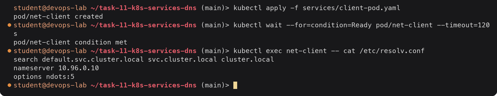

The client's DNS server is `10.96.0.10`, the kube-dns Service (CoreDNS). The search list is
why short names like `web-clusterip` work; this is covered in [`fqdn/README.md`](fqdn/README.md)
and [`coredns/README.md`](coredns/README.md).

---

### 01 ClusterIP

Files: [`app-deployment.yaml`](services/01-clusterip/app-deployment.yaml) (3 replicas),
[`service.yaml`](services/01-clusterip/service.yaml). The Service listens on port 8080 and
forwards to the container port named `http` (80).

#### Deploy and verify

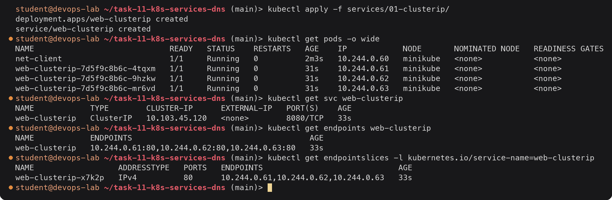

The Service got a virtual IP `10.103.45.120` from the Service CIDR. Its endpoints are exactly
the three Pod IPs on port 80; the Endpoints controller found them through the selector
`app=web-clusterip` and only lists Pods that are Ready. EndpointSlices are the newer form of
the same data, and what kube-proxy actually reads.

#### Test connectivity from inside the cluster

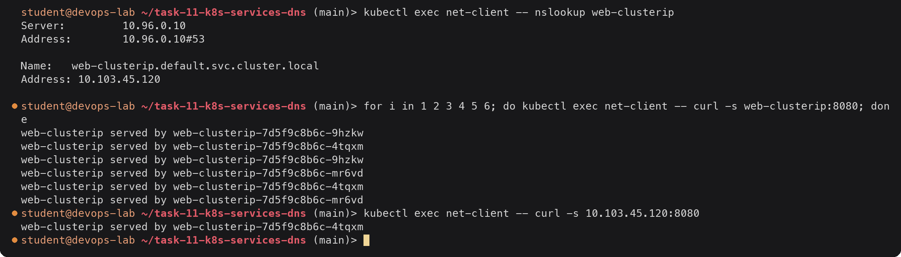

The short name resolved to the ClusterIP (not to a Pod IP), and requests to that one address
were spread across all three Pods. The ClusterIP is not bound to any interface; kube-proxy's
iptables rules on the node rewrite the destination to a random ready Pod.

#### And from outside the cluster

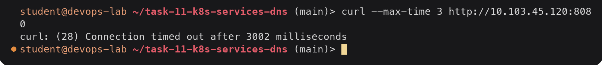

From my host the ClusterIP is unreachable: there is no route to 10.96.0.0/12 outside the
node. That is the point of ClusterIP, it is internal only.

---

### 02 NodePort

Files: [`app-deployment.yaml`](services/02-nodeport/app-deployment.yaml) (2 replicas),
[`service.yaml`](services/02-nodeport/service.yaml) (`nodePort: 30080`).

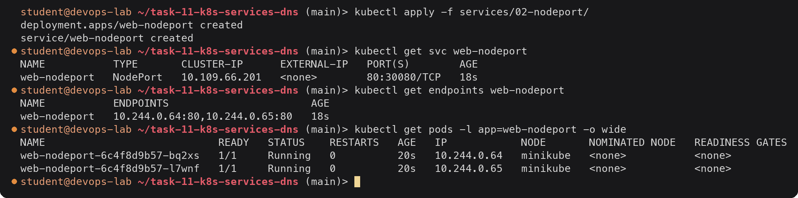

`PORT(S) 80:30080/TCP` means: Service port 80 on the ClusterIP, and port 30080 on every node.

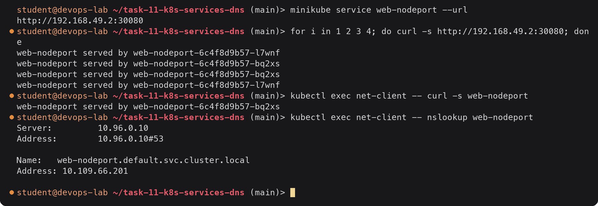

From the host, `<node IP>:30080` reached both Pods. Inside the cluster the same Service still
works by name on port 80, because a NodePort Service is a ClusterIP Service with an extra port
on each node. The downsides: the high port number, and clients have to know a node IP. On a
multi-node cluster any node's IP works, even one not running a backing Pod.

---

### 03 LoadBalancer (with `minikube tunnel`)

Files: [`app-deployment.yaml`](services/03-loadbalancer/app-deployment.yaml) (3 replicas),
[`service.yaml`](services/03-loadbalancer/service.yaml).

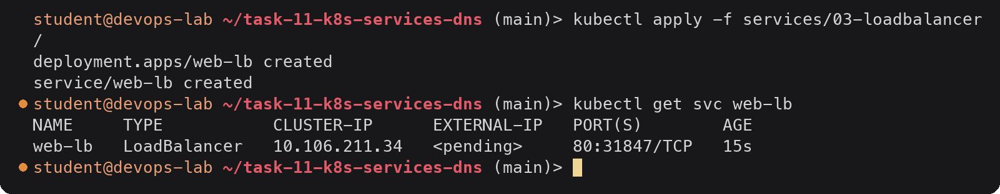

`EXTERNAL-IP` stays `<pending>`. On a cloud, the cloud-controller-manager would now create a
cloud load balancer and write its address back. Minikube has no cloud, so nothing fills it in.
The Service already got a random NodePort (31847), which is what a cloud LB would forward to.

`minikube tunnel` plays the cloud's part. It runs in the foreground in a second terminal:

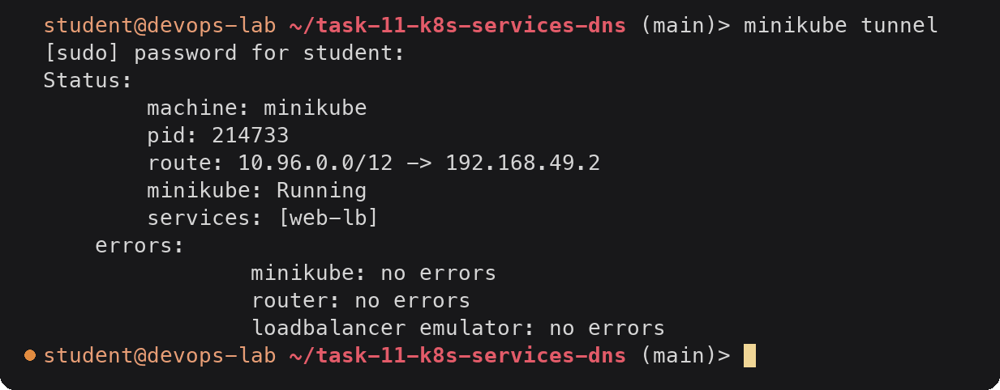

Back in the first terminal:

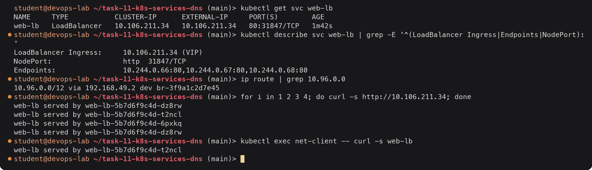

On Linux with the docker driver, the tunnel adds a host route for the whole Service CIDR via
the minikube node and sets the Service's external IP to its ClusterIP. That is why
`EXTERNAL-IP` equals `CLUSTER-IP` here; on a cloud it would be a public IP or hostname. Once
the external IP is set, the host can reach the Service on plain port 80. When I stopped the
tunnel with Ctrl+C, the route was removed and `EXTERNAL-IP` went back to `<pending>`.

---

### 04 ExternalName

File: [`service.yaml`](services/04-externalname/service.yaml). No Deployment: this Service
points outside the cluster.

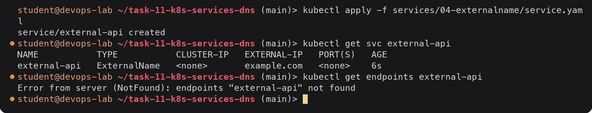

No ClusterIP, no ports, no endpoints. The only thing this Service does is exist in DNS.

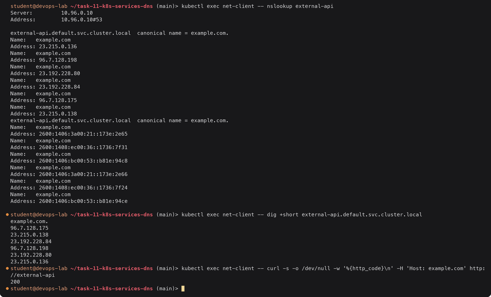

CoreDNS answered `external-api.default.svc.cluster.local` with a **CNAME** to `example.com.`,
then resolved that through the upstream DNS. Traffic goes straight from the Pod to the
external server; kube-proxy is not involved. Because it is only a DNS alias, the HTTP `Host`
header is still `external-api` unless set, which is why I passed `Host: example.com` (TLS
certificates have the same issue). The use case is letting apps use a fixed in-cluster name for
something external, such as a managed database, so it can later be swapped for an in-cluster
Service without changing the apps.

---

### 05 Headless Service with a StatefulSet

Files: [`statefulset.yaml`](services/05-headless/statefulset.yaml) (3 replicas,
`serviceName: web-headless`), [`service.yaml`](services/05-headless/service.yaml) (`clusterIP: None`).
The Service is created first because the StatefulSet refers to it.

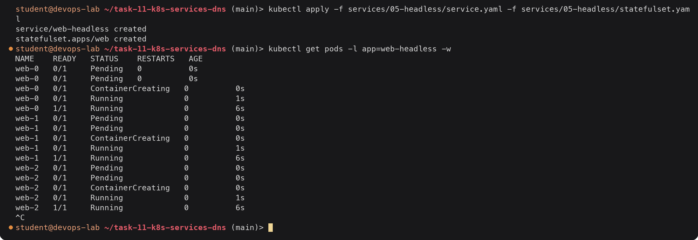

StatefulSet Pods have fixed ordinal names (`web-0`, `web-1`, `web-2`) instead of random
suffixes, and they are created in order: `web-1` only started after `web-0` was Ready.

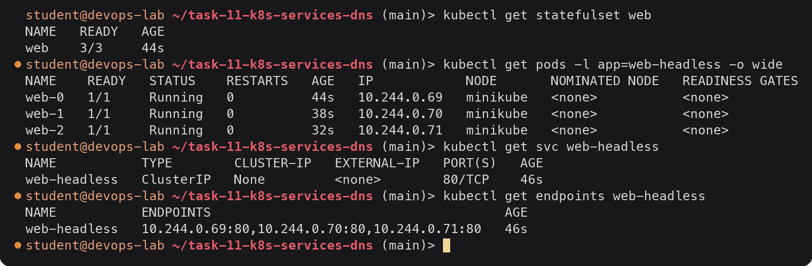

`CLUSTER-IP None`: there is no virtual IP and kube-proxy writes no rules for it. The
endpoints are tracked as usual.

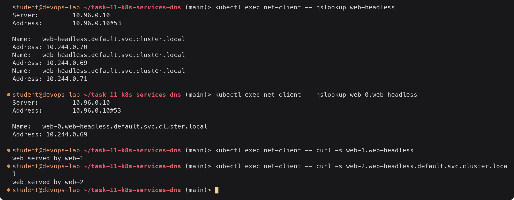

Two differences from ClusterIP are visible:

1. The Service name resolves to **all Pod IPs** (three A records, order shuffled by CoreDNS's
   `loadbalance` plugin) instead of one virtual IP. The client picks which one to use.
2. Each Pod has **its own DNS name** `<pod>.<service>.<namespace>.svc.cluster.local`, so a
   client can address a specific replica, for example the primary database `db-0`.

Stable identity across restarts:

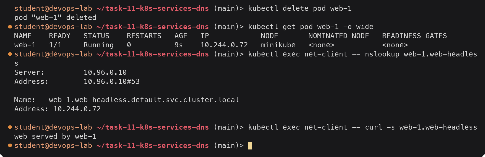

The replacement Pod came back with the **same name** `web-1` but a new IP (.72), and its DNS
record followed. Peers that use the DNS name keep working, which is what clustered databases
(MongoDB replica sets, Kafka, ZooKeeper, etcd) depend on.

### Clean up

The FQDN and CoreDNS parts ([`fqdn/README.md`](fqdn/README.md),
[`coredns/README.md`](coredns/README.md)) were done at this point, while these Services and
`net-client` still existed. Afterwards:

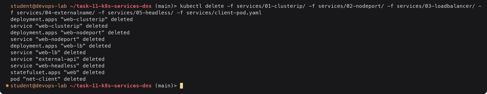

### What I verified for each type

| Type | Service | `get svc` shows | Endpoints | Tested with | Result |
|---|---|---|---|---|---|
| ClusterIP | `web-clusterip` | `10.103.45.120`, `8080/TCP` | 3 Pod IPs | curl + nslookup from `net-client`; curl from host | Works inside, unreachable from host |
| NodePort | `web-nodeport` | `80:30080/TCP` | 2 Pod IPs | curl `192.168.49.2:30080` from host, curl by name inside | Works both ways |
| LoadBalancer | `web-lb` | `<pending>`, then `10.106.211.34` with tunnel | 3 Pod IPs | curl external IP from host | Works while `minikube tunnel` runs |
| ExternalName | `external-api` | `example.com`, no ClusterIP | none | nslookup/dig (CNAME), curl | CNAME to example.com |
| Headless | `web-headless` | `None` | 3 Pod IPs | nslookup Service and per-Pod names, curl `web-1.web-headless` | DNS returns Pod IPs, stable per-Pod names |

---

## Task 2, 3 and 4

- **Task 2, comparisons**: Deployment vs ReplicaSet, Deployment vs DaemonSet vs StatefulSet,
  ReplicaSet vs Service: [`comparison/README.md`](comparison/README.md)
- **Task 3, FQDN**: what an FQDN is, Service DNS naming, namespaces, Pod to Service
  communication, with nslookup output: [`fqdn/README.md`](fqdn/README.md)
- **Task 4, CoreDNS**: what it is, how queries resolve (`resolv.conf`, search domains,
  `ndots:5`), the minikube Corefile, and DNS troubleshooting: [`coredns/README.md`](coredns/README.md)

---

## Deliverables checklist

- [x] ClusterIP: YAML, deploy, `get svc` / endpoints, curl and nslookup from a client Pod: [01 ClusterIP](#01-clusterip), [`services/01-clusterip/`](services/01-clusterip/)
- [x] NodePort: YAML, deploy, verify, curl via node IP and in-cluster: [02 NodePort](#02-nodeport), [`services/02-nodeport/`](services/02-nodeport/)
- [x] LoadBalancer via `minikube tunnel`: YAML, `<pending>` then external IP, curl: [03 LoadBalancer](#03-loadbalancer-with-minikube-tunnel), [`services/03-loadbalancer/`](services/03-loadbalancer/)
- [x] ExternalName: YAML, no endpoints, CNAME shown with nslookup and dig: [04 ExternalName](#04-externalname), [`services/04-externalname/`](services/04-externalname/)
- [x] Headless with StatefulSet: YAML, Pod IPs in DNS, per-Pod DNS names, stable identity: [05 Headless](#05-headless-service-with-a-statefulset), [`services/05-headless/`](services/05-headless/)
- [x] Deployment vs ReplicaSet, Deployment vs DaemonSet vs StatefulSet, ReplicaSet vs Service: [`comparison/README.md`](comparison/README.md)
- [x] FQDN, Service DNS, naming convention, namespace-based DNS, Pod to Service communication with examples: [`fqdn/README.md`](fqdn/README.md)
- [x] CoreDNS: purpose, service discovery, query resolution, Corefile, troubleshooting with commands and output: [`coredns/README.md`](coredns/README.md)
