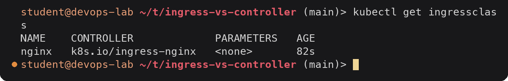

# Ingress vs Ingress Controller

People often say "the Ingress" when they mean two different things. One is a piece of
configuration stored in the API server, the other is a program that actually moves packets.

## What is an Ingress

An Ingress is a Kubernetes API object (`networking.k8s.io/v1`, kind `Ingress`). It describes how
HTTP and HTTPS traffic from outside the cluster should reach Services inside it:

- which **host names** to accept (`demo.local`, `api.demo.local`)
- which **paths** go to which Service and port (`/` to `web-svc:80`, `/api` to `api-svc:80`)
- optional **TLS**: which Secret holds the certificate for which hosts
- an optional **default backend** for requests that match no rule
- which **IngressClass** (which controller) should handle it

It is just data. Creating an Ingress in a cluster that has no controller is accepted by the API
server, shows up in `kubectl get ingress`, and does absolutely nothing: no port is opened, the
`ADDRESS` column stays empty.

```yaml
apiVersion: networking.k8s.io/v1
kind: Ingress
metadata:
  name: demo-ingress
spec:
  ingressClassName: nginx
  rules:
    - host: demo.local
      http:
        paths:
          - path: /api
            pathType: Prefix
            backend:
              service:
                name: api-svc
                port:
                  number: 80
```

## What is an Ingress Controller

An Ingress Controller is a workload running in (or next to) the cluster. It:

1. watches the API server for Ingress, Service, EndpointSlice and Secret objects,
2. translates the rules into the configuration of a real proxy or load balancer,
3. receives the external traffic and forwards it, usually straight to pod IPs from the endpoints
   (not through the Service ClusterIP),
4. writes the address it is reachable on back into `status.loadBalancer` of the Ingress (that is
   the `ADDRESS` column).

Kubernetes does not ship one. `kube-controller-manager` has controllers for Deployments, Services
and so on, but none for Ingress. You install one yourself, which is what
`minikube addons enable ingress` does (it deploys ingress-nginx into the `ingress-nginx`
namespace).

## The difference

| | Ingress | Ingress Controller |
|---|---|---|
| What it is | An API object (YAML), stored in etcd | A running program (pods, a Deployment or DaemonSet) |
| Who creates it | The application team, per app | The platform/cluster team, once per cluster (or per class) |
| Contents | Hosts, paths, backends, TLS secret name | Proxy software (NGINX, Envoy, HAProxy) or a cloud LB integration |
| Handles traffic | No | Yes |
| Works alone | No, ignored without a controller | Runs, but routes nothing without Ingress objects |
| Comparable to | A routing table / config file | The router reading that table |
| Check with | `kubectl get ingress`, `kubectl describe ingress` | `kubectl get pods -n ingress-nginx`, controller logs |

## Why both are needed

Separating the two is the same idea as the rest of Kubernetes: you declare the desired state and a
controller makes it happen.

- **Portability.** The same Ingress YAML works on minikube with ingress-nginx and on EKS with the
  AWS Load Balancer Controller. Only `ingressClassName` (and maybe some annotations) change.
- **Separation of duties.** Developers own the routing for their app; the platform team owns the
  edge proxy, its scaling, TLS defaults and security settings.
- **Choice of implementation.** NGINX, Envoy, HAProxy or a cloud load balancer can be swapped
  without changing how applications describe their routes.
- **One entry point.** One controller (behind one LoadBalancer or NodePort) can serve hundreds of
  Ingress objects, instead of one cloud load balancer per Service.

## IngressClass

A cluster can run more than one controller, for example an internal and an external one. The
`IngressClass` object names a controller, and each Ingress picks one with `spec.ingressClassName`:



<details><summary>Text version</summary>

```console
$ kubectl get ingressclass
NAME    CONTROLLER             PARAMETERS   AGE
nginx   k8s.io/ingress-nginx   <none>       82s
```

</details>

```yaml
apiVersion: networking.k8s.io/v1
kind: IngressClass
metadata:
  name: nginx
  annotations:
    ingressclass.kubernetes.io/is-default-class: "true"   # used when an Ingress sets no class
spec:
  controller: k8s.io/ingress-nginx
```

If an Ingress names a class that no controller claims, every controller ignores it. That is
troubleshooting scenario 3 in this task. The old `kubernetes.io/ingress.class` annotation did the
same job before `ingressClassName` existed and is deprecated.

## Examples of Ingress Controllers

| Controller | Data plane | Notes |
|---|---|---|
| **ingress-nginx** (Kubernetes project) | NGINX | Used in this task via the minikube addon. Configured with `nginx.ingress.kubernetes.io/*` annotations (rewrite, rate limits, auth, canary). Class controller name `k8s.io/ingress-nginx`. Not the same project as F5's "NGINX Ingress Controller", which uses `nginx.org/*` annotations. |
| **Traefik** | Traefik (Go) | Default in k3s. Auto-discovers routes, built-in Let's Encrypt, also has its own `IngressRoute` CRD. |
| **HAProxy Ingress / HAProxy Kubernetes Ingress Controller** | HAProxy | Strong performance and fine-grained load balancing options. |
| **AWS Load Balancer Controller** | AWS ALB (for Ingress), NLB (for Services) | Does not run a proxy in the cluster. Each Ingress (or group of Ingresses) becomes an Application Load Balancer, configured through `alb.ingress.kubernetes.io/*` annotations, and can send traffic straight to pod IPs (`target-type: ip`). |
| Others | Envoy-based (Contour, Emissary), Istio gateway, GKE Ingress, Kong, Azure Application Gateway | |

The newer **Gateway API** (`Gateway`, `HTTPRoute`) is the successor to Ingress with the same
split: a `GatewayClass` plays the role of the IngressClass, and most of the controllers above
implement it too.

## Request flow in this task

```text
curl -H "Host: demo.local" http://192.168.49.2/api
        |
        v
minikube node 192.168.49.2, port 80 (hostPort of the controller pod)
        |
        v
ingress-nginx-controller pod      <-- built its nginx.conf from Ingress "demo-ingress"
        |  host demo.local, prefix /api -> upstream default-api-svc-80
        v
api pod 10.244.0.13:5678 or 10.244.0.14:5678 (endpoints of api-svc)
```
