# Kubernetes Ingress, ConfigMaps and Secrets

> **Note:** Command output in this file is representative expected output for the lab environment
> below, written as a learning reference. It was not captured from a live run, so IDs, timestamps
> and pod name hashes will differ when you run it yourself.

## Lab environment

| Item | Value |
|---|---|
| Host | Ubuntu 24.04 LTS, hostname `devops-lab`, user `student` |
| Shell prompt in output | `student@devops-lab:~/task-12-ingress-configmaps-secrets$` |
| Docker | 27.3.1 |
| Minikube | v1.34.0, docker driver, 2 CPU / 4096 MB, profile `minikube` |
| Kubernetes | v1.31.0, single node `minikube`, node InternalIP `192.168.49.2` |
| kubectl | v1.31.1 client |
| Pod CIDR / Service CIDR | 10.244.0.0/16 / 10.96.0.0/12, kube-dns ClusterIP 10.96.0.10 |
| Date of run | 2026-09-19 |

All commands are run from the task folder. Files used:

```text
task-12-ingress-configmaps-secrets/
├── submission.md
├── 01-configmap/
│   ├── app-config.yaml          # ConfigMaps app-config (env keys) and app-config-files (file keys)
│   └── config-demo-pod.yaml     # Pod using env, envFrom and a volume mount
├── 02-secret/
│   ├── db-secret.yaml           # Secret with obviously fake demo values
│   └── secret-demo-pod.yaml     # Pod using secretKeyRef env vars and a secret volume
├── 03-ingress/
│   ├── apps.yaml                # two apps (web, api) + ClusterIP Services
│   └── ingress.yaml             # host + path routing
├── ingress-vs-controller/
│   └── README.md                # Task 4
└── troubleshooting/
    ├── README.md                # Task 5, five scenarios
    └── manifests/               # the broken manifests used in Task 5
```

Quick check that the cluster is up before starting:

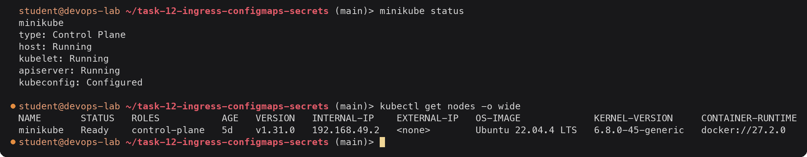

The node runs the kicbase image (Ubuntu 22.04 inside the minikube container) and uses Docker as the
container runtime, which is the default for the docker driver.

---

## Task 1: ConfigMap

A ConfigMap holds non-sensitive configuration outside the image, so the same image can run in dev,
staging and production with different settings. I split the configuration into two ConfigMaps
because they are consumed differently:

- `app-config` holds plain key/value pairs that become environment variables.
- `app-config-files` holds whole files (`app.properties`, `theme.txt`) that get mounted into the container.

If I put a multi-line file key into the same ConfigMap that is used with `envFrom`, the file would
also turn into an odd multi-line environment variable, so keeping them apart is cleaner.

### 1.1 Create the ConfigMap

[`01-configmap/app-config.yaml`](01-configmap/app-config.yaml):

```yaml
apiVersion: v1
kind: ConfigMap
metadata:
  name: app-config
  labels:
    app: yatri
data:
  ENVIRONMENT: "production"
  LOG_LEVEL: "INFO"
  APP_PORT: "5000"
  DEFAULT_CURRENCY: "INR"
  MAX_BOOKING_DAYS: "30"
---
apiVersion: v1
kind: ConfigMap
metadata:
  name: app-config-files
  labels:
    app: yatri
data:
  app.properties: |
    feature.dark_mode=true
    cache.ttl_seconds=300
    max.upload.mb=25
  theme.txt: |
    color=teal
    font=Ubuntu Mono
```

Values are quoted because ConfigMap data must be strings. An unquoted `5000` is an integer in YAML
and the API server rejects it.

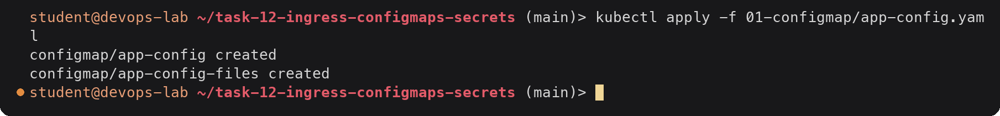

The same `app-config` could also be created imperatively, which is handy for quick tests:

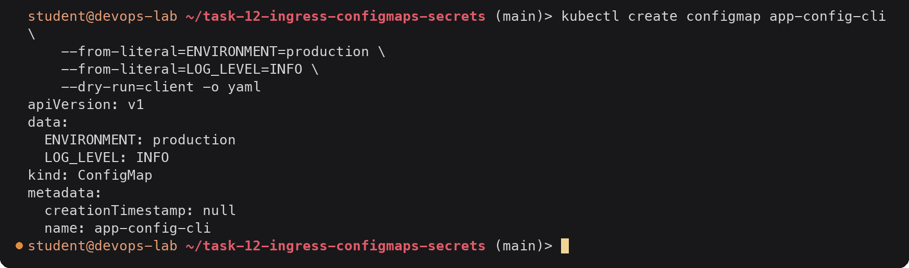

`--dry-run=client -o yaml` only prints the object, nothing is created. I keep the declarative file as
the source of truth.

### 1.2 Store values and inspect them

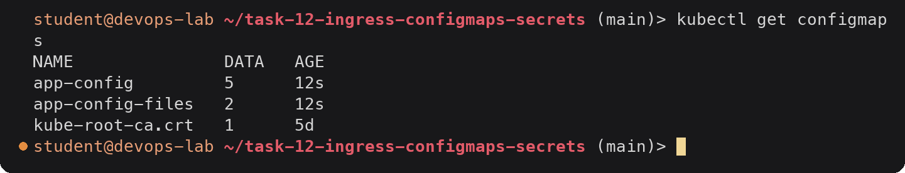

`DATA` is the number of keys. `kube-root-ca.crt` is created automatically in every namespace and is
not mine.

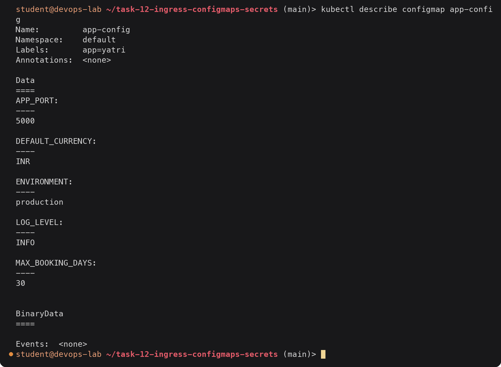

Keys are listed in alphabetical order and the values are shown in clear text. That is fine for a
ConfigMap and is exactly why passwords never go in one.

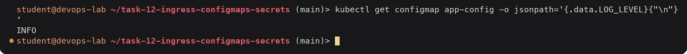

### 1.3 Inject the ConfigMap into a Pod

[`01-configmap/config-demo-pod.yaml`](01-configmap/config-demo-pod.yaml) uses all three methods at once:

```yaml
      env:
        - name: APP_LOG_LEVEL            # 1. one key, under a new name
          valueFrom:
            configMapKeyRef:
              name: app-config
              key: LOG_LEVEL
      envFrom:
        - configMapRef:                  # 2. every key of app-config
            name: app-config
      volumeMounts:
        - name: config-files             # 3. every key of app-config-files as a file
          mountPath: /etc/config
          readOnly: true
  volumes:
    - name: config-files
      configMap:
        name: app-config-files
```

| Method | What ends up in the container | Updated while the Pod runs? |
|---|---|---|
| `env` + `configMapKeyRef` | one environment variable, name of my choice | No, needs a restart |
| `envFrom` + `configMapRef` | one environment variable per key, same names as the keys | No, needs a restart |
| `volumes` + `configMap` | one file per key under the mount path | Yes, kubelet refreshes the files (not with `subPath`) |

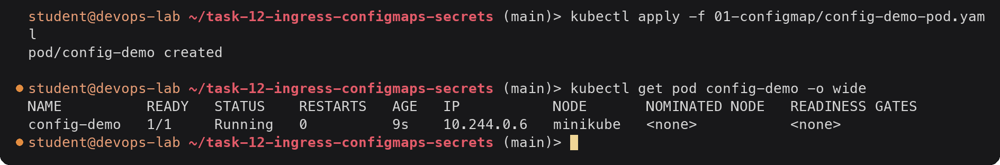

### 1.4 Verify inside the container

Environment variables:

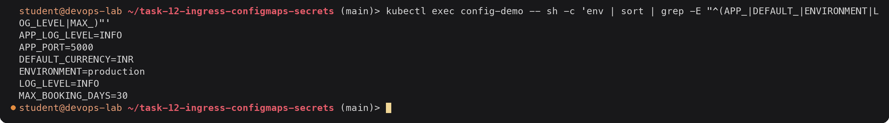

All five keys came in through `envFrom`, and `APP_LOG_LEVEL` came in through the single
`configMapKeyRef`. The value is the same, only the name differs.

Mounted files:

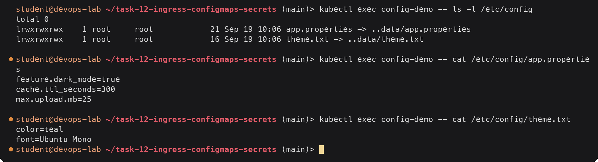

Each key became a file. The files are symlinks into a hidden `..data` directory. When the ConfigMap
changes, kubelet writes a new timestamped directory and swaps the `..data` link in one step, so the
application never sees a half written file.

### 1.5 What happens on an update

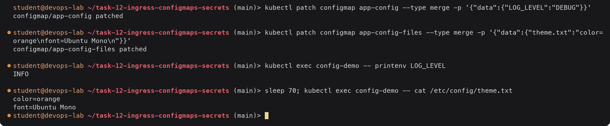

The environment variable still says `INFO`: environment variables are copied into the process once
when the container starts. The mounted file changed on its own after about a minute (kubelet sync
period plus its ConfigMap cache). To pick up the new environment value the Pod has to be recreated
(for a Deployment, `kubectl rollout restart`). I put both values back afterwards:

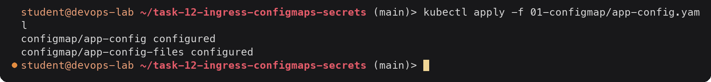

---

## Task 2: Secret

### 2.1 Create the Secret

[`02-secret/db-secret.yaml`](02-secret/db-secret.yaml):

```yaml
# DEMO VALUES ONLY.
apiVersion: v1
kind: Secret
metadata:
  name: db-secret
  labels:
    app: yatri
type: Opaque
data:
  # echo -n "demo_user" | base64
  DB_USER: ZGVtb191c2Vy
  # echo -n "demo-password-not-real" | base64
  DB_PASSWORD: ZGVtby1wYXNzd29yZC1ub3QtcmVhbA==
  # echo -n "demo_db" | base64
  DB_NAME: ZGVtb19kYg==
```

**This file is committed only because it contains obviously fake demo values** (`demo_user`,
`demo-password-not-real`, `demo_db`) that are not used anywhere else. It exists so the homework can
be reproduced. A Secret manifest with real values would not be committed (see 2.5).

The values under `data:` must be base64. I encoded them with `echo -n`, because plain `echo` adds a
newline that ends up inside the secret (this is troubleshooting scenario 1):

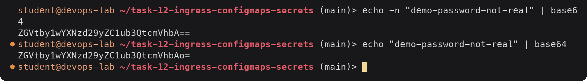

The alternative is `stringData:`, where you write plain text and the API server encodes it for you.

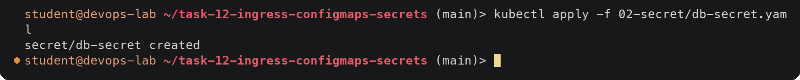

Imperative equivalent, useful because the value never has to be typed into a file:

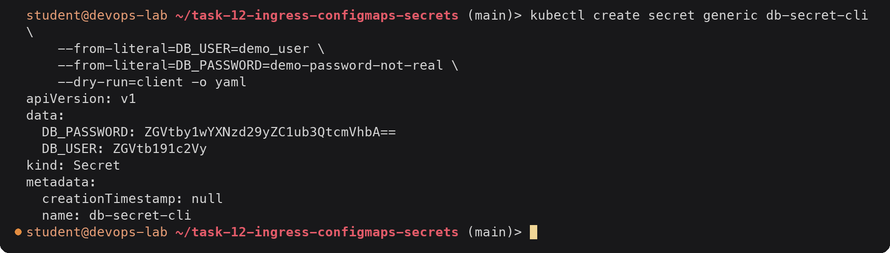

### 2.2 Store values and inspect them

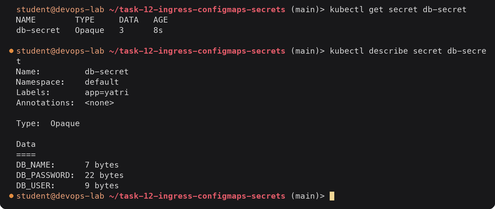

`describe` only prints the size of each value. `demo-password-not-real` is 22 characters, so 22 bytes
confirms there is no hidden newline.

But anyone allowed to `get` the Secret can read it:

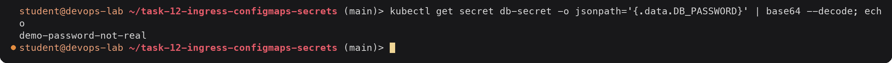

### 2.3 Inject the Secret into a Pod

[`02-secret/secret-demo-pod.yaml`](02-secret/secret-demo-pod.yaml) uses individual `secretKeyRef`
environment variables and also mounts the whole Secret as files:

```yaml
      env:
        - name: DB_USER
          valueFrom:
            secretKeyRef:
              name: db-secret
              key: DB_USER
        # DB_PASSWORD and DB_NAME the same way
      volumeMounts:
        - name: db-credentials
          mountPath: /etc/secrets
          readOnly: true
  volumes:
    - name: db-credentials
      secret:
        secretName: db-secret
        defaultMode: 0400
```

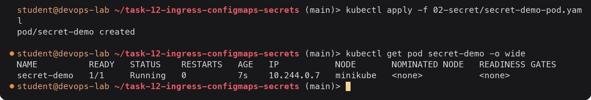

### 2.4 Verify inside the container

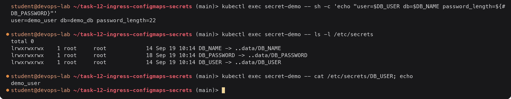

The container sees plain text: Kubernetes decodes the base64 before handing the value over. I
printed the length of the password instead of the password itself, which is the habit to keep in
real logs. Secret volumes are backed by tmpfs on the node, so the files are never written to the
node's disk, and `defaultMode: 0400` makes them readable only by the file owner.

### 2.5 Why Secrets must not be committed to Git

1. **Base64 is encoding, not encryption.** There is no key. `base64 --decode` (shown above) turns
   the value back into the password in one command. A Secret YAML in Git is the same as the
   password in Git.
2. **Git never forgets.** Deleting the file in a later commit leaves the value in history, in every
   clone and in every fork. Once pushed, the only real fix is to rotate the credential.
3. **Repositories get shared widely.** CI systems, contractors, forks and mirrors all get a copy.
   Public repositories are scanned by bots for credentials within minutes.
4. **Even in the cluster a plain Secret is weak by default.** It is stored base64 in etcd unless
   encryption at rest is configured on the API server. Access must be limited with RBAC
   (`get`/`list` on `secrets`).

Ways to keep secrets out of plain YAML in Git:

| Tool | Idea | What lives in Git |
|---|---|---|
| Sealed Secrets (Bitnami) | A controller in the cluster holds a private key. `kubeseal` encrypts a Secret with the public key into a `SealedSecret`, which only that controller can decrypt. | Encrypted `SealedSecret` YAML, safe to commit |
| External Secrets Operator | An `ExternalSecret` object says "fetch key X from AWS Secrets Manager / GCP Secret Manager / Vault" and the operator creates the Kubernetes Secret. | Only the reference, no value |
| SOPS (with age, PGP or cloud KMS) | Encrypts the values inside a YAML file and leaves the keys readable. Decrypted at deploy time (Flux, Argo CD plugin, helm-secrets). | YAML with encrypted values |
| HashiCorp Vault | Central secret store with audit logs, leases and dynamic credentials. Injected via the Vault Agent sidecar, the CSI driver or External Secrets. | Nothing, only Vault paths and roles |

Other habits: add `*secret*.yaml` patterns to `.gitignore` for local files, run a scanner such as
`gitleaks` as a pre-commit hook, enable etcd encryption at rest, and use RBAC so only the workloads
that need a Secret can read it.

---

## Task 3: Ingress

### 3.1 Enable the ingress addon

I set `MINIKUBE_IN_STYLE=false` so minikube prints plain text instead of emoji.

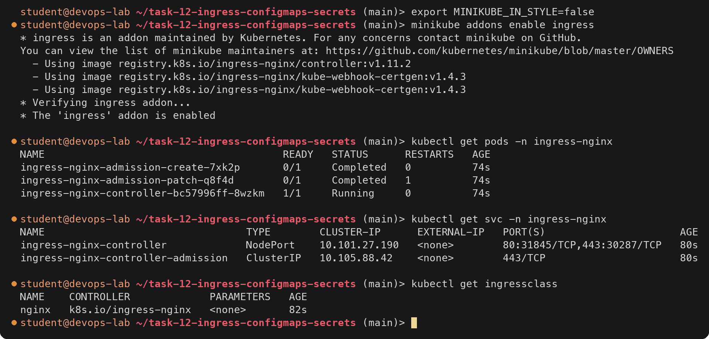

The two `admission` pods are one-off Jobs that create the TLS certificate for the validating
webhook, so `Completed` is their normal state. The controller pod is the actual NGINX reverse
proxy. In minikube it also binds host ports 80 and 443 on the node, which is why the node IP
`192.168.49.2` answers on port 80. The `nginx` IngressClass is what my Ingress refers to.

### 3.2 Deploy two apps and their Services

[`03-ingress/apps.yaml`](03-ingress/apps.yaml) has two Deployments (`web` and `api`, 2 replicas each)
running `hashicorp/http-echo`, plus a ClusterIP Service for each. Every response includes the pod
name, using the `$(POD_NAME)` substitution from the Downward API:

```yaml
          env:
            - name: POD_NAME
              valueFrom:
                fieldRef:
                  fieldPath: metadata.name
          args:
            - "-listen=:5678"
            - "-text=Hello from the WEB app (pod $(POD_NAME))"
```

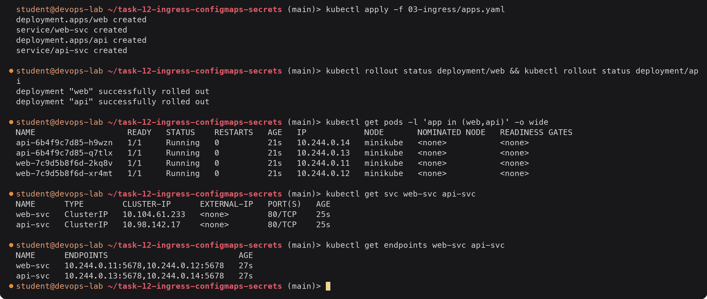

Both Services are ClusterIP, so nothing is reachable from outside the cluster yet. The endpoints
confirm each Service has found its two pods on port 5678.

### 3.3 Create the Ingress (host and path routing)

[`03-ingress/ingress.yaml`](03-ingress/ingress.yaml):

```yaml
apiVersion: networking.k8s.io/v1
kind: Ingress
metadata:
  name: demo-ingress
  labels:
    app: demo
spec:
  ingressClassName: nginx
  rules:
    - host: demo.local              # host rule 1
      http:
        paths:
          - path: /                 # path routing: everything else -> web
            pathType: Prefix
            backend:
              service:
                name: web-svc
                port:
                  number: 80
          - path: /api              # path routing: /api, /api/... -> api
            pathType: Prefix
            backend:
              service:
                name: api-svc
                port:
                  number: 80
    - host: api.demo.local          # host rule 2: whole host -> api
      http:
        paths:
          - path: /
            pathType: Prefix
            backend:
              service:
                name: api-svc
                port:
                  number: 80
```

With `pathType: Prefix` the longest matching prefix wins, so the order of the two paths does not
matter. Prefix matching works on whole path segments: `/api` matches `/api` and `/api/orders` but
not `/apiv2`. No rewrite annotation is needed because http-echo answers on any path.

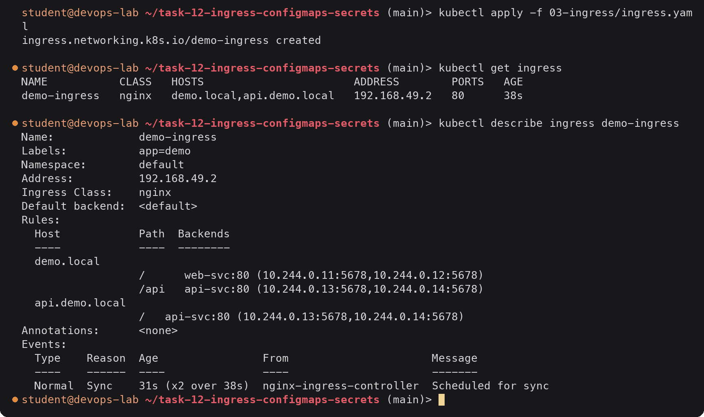

`ADDRESS` takes a few seconds to appear; it is filled in by the controller once it has picked the
Ingress up, so an empty address is the first sign that no controller owns the Ingress. The
`Backends` column resolves each Service to its pod IPs, which proves the Service names and ports
are right.

### 3.4 Access with a Host header

The Ingress decides on the `Host` header, so I can test it without any DNS by setting the header
myself:

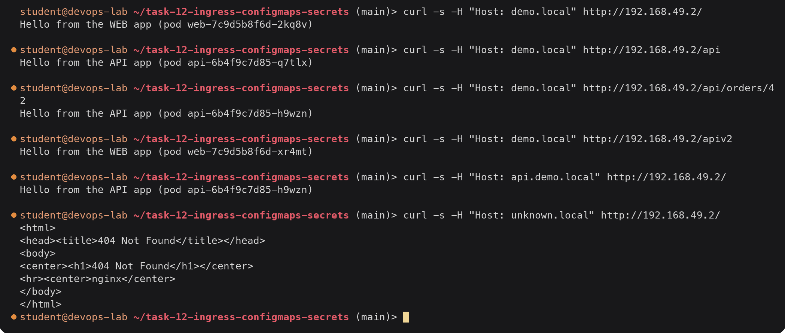

| Request | Matched rule | Served by |
|---|---|---|
| `demo.local/` | host `demo.local`, path `/` | web |
| `demo.local/api` | host `demo.local`, path `/api` | api |
| `demo.local/api/orders/42` | host `demo.local`, path `/api` (prefix) | api |
| `demo.local/apiv2` | host `demo.local`, path `/` (`/api` is not a segment prefix of `/apiv2`) | web |
| `api.demo.local/` | host `api.demo.local` | api |
| `unknown.local/` | no rule | controller default backend, 404 |

The pod name changes between requests to the same app, so the Service is also load balancing
across the replicas behind the Ingress.

### 3.5 Access through /etc/hosts

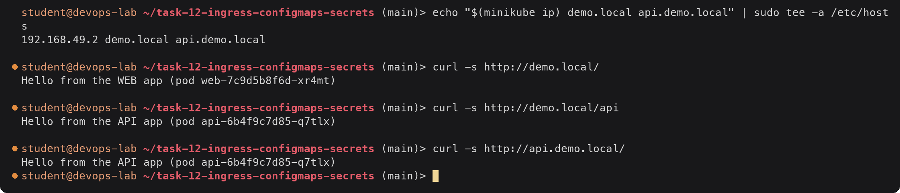

Now curl puts the right `Host` header in by itself. The same names would work in a browser on this
machine.

### 3.6 Verify routing from the controller side

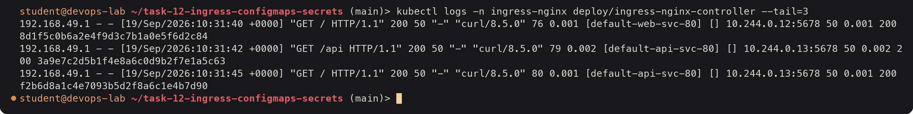

The access log shows the upstream chosen for every request: `[default-web-svc-80]` for `/` on
`demo.local`, `[default-api-svc-80]` for `/api` and for `api.demo.local`, together with the pod IP
that answered. The client is `192.168.49.1`, the host's address on the minikube docker network.

---

## Task 4: Ingress vs Ingress Controller

Written up in [`ingress-vs-controller/README.md`](ingress-vs-controller/README.md). In short: an
**Ingress** is a Kubernetes API object that only describes HTTP routing rules; an **Ingress
Controller** is a running program (ingress-nginx, Traefik, HAProxy, AWS Load Balancer Controller)
that watches those objects and configures a real proxy or load balancer from them. Without a
controller an Ingress does nothing, and `ingressClassName` (an `IngressClass`) decides which
controller handles which Ingress.

---

## Task 5: Troubleshooting

The course `troubleshooting/` folder has one scenario (the base64 trailing newline). I reproduced
that one and added the four problems I actually ran into or that the course notes warn about while
doing Tasks 1 to 3. The full write-up, with commands, root cause, fix and before/after output for
each, is in [`troubleshooting/README.md`](troubleshooting/README.md). The broken manifests are in
[`troubleshooting/manifests/`](troubleshooting/manifests/).

| # | Scenario | Symptom | Root cause | Fix |
|---|---|---|---|---|
| 1 | Secret trailing newline (course `secret-base64-gotcha.md`) | App gets a password one byte too long, auth fails | Value encoded with `echo` instead of `echo -n`, base64 contains `\n` | Re-encode with `echo -n` (or use `stringData`), re-apply, restart Pod |
| 2 | Pod stuck in `CreateContainerConfigError` | Pod never starts | `envFrom` references ConfigMap `app-confg` which does not exist | Fix the name, recreate the Pod |
| 3 | Ingress has no ADDRESS, curl gives 404 | Default backend 404 | `ingressClassName: traefik`, no controller for that class | `ingressClassName: nginx` |
| 4 | Ingress returns 503 on `/api` | 503 Service Temporarily Unavailable | Backend Service name `api-service` does not exist (`api-svc`) | Correct Service name in the Ingress |
| 5 | Changed ConfigMap value not visible in the app | Env var still has old value | Env vars are set only at container start | `kubectl rollout restart`, or mount as a volume |

---

## Cleanup

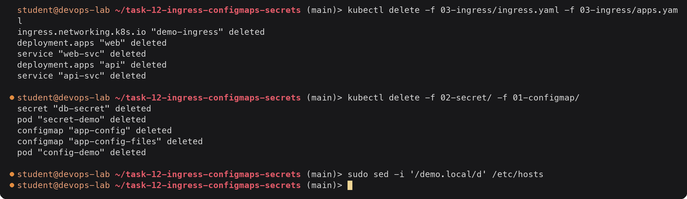

I left the ingress addon enabled for the following tasks.

---

## Deliverables checklist

- [x] ConfigMap YAML: [`01-configmap/app-config.yaml`](01-configmap/app-config.yaml), consumed by [`01-configmap/config-demo-pod.yaml`](01-configmap/config-demo-pod.yaml) via env, envFrom and a volume (Task 1)
- [x] ConfigMap verified inside the container with `kubectl exec ... env` and `cat` of the mounted files (Task 1.4)
- [x] Secret YAML with demo-only values: [`02-secret/db-secret.yaml`](02-secret/db-secret.yaml), consumed by [`02-secret/secret-demo-pod.yaml`](02-secret/secret-demo-pod.yaml) (Task 2)
- [x] Secret verified inside the container (Task 2.4)
- [x] Why Secrets must not go into Git, and Sealed Secrets / External Secrets / SOPS / Vault (Task 2.5)
- [x] Ingress addon enabled, two apps + Services: [`03-ingress/apps.yaml`](03-ingress/apps.yaml) (Task 3.1, 3.2)
- [x] Ingress YAML with host and path routing: [`03-ingress/ingress.yaml`](03-ingress/ingress.yaml) (Task 3.3)
- [x] Routing verified with curl Host header, /etc/hosts and controller logs (Task 3.4 to 3.6)
- [x] Ingress vs Ingress Controller README: [`ingress-vs-controller/README.md`](ingress-vs-controller/README.md) (Task 4)
- [x] Troubleshooting docs: [`troubleshooting/README.md`](troubleshooting/README.md) and [`troubleshooting/manifests/`](troubleshooting/manifests/) (Task 5)
