# Troubleshooting: ConfigMaps, Secrets and Ingress

> **Note:** Command output in this file is representative expected output for the lab environment
> described in [`../submission.md`](../submission.md), written as a learning reference. It was not
> captured from a live run, so IDs, timestamps and pod name hashes will differ when you run it yourself.

Scenario 1 is the one from the course `troubleshooting/secret-base64-gotcha.md`. Scenarios 2 to 5 are
the other failures that come up with the same objects. Every scenario starts from the working
setup of Tasks 1 to 3 (ConfigMaps, `db-secret`, `web`/`api` apps and `demo-ingress` applied) and
follows the same steps: identify, investigate, root cause, fix, verify.

The broken manifests are in [`manifests/`](manifests/). The fixed versions are the normal files in
`01-configmap/`, `02-secret/` and `03-ingress/`.

| # | Scenario | Broken manifest |
|---|---|---|
| 1 | Secret value with a trailing newline | [`manifests/newline-secret.yaml`](manifests/newline-secret.yaml) |
| 2 | Pod stuck in `CreateContainerConfigError` | [`manifests/missing-configmap-pod.yaml`](manifests/missing-configmap-pod.yaml) |
| 3 | Ingress ignored, no ADDRESS, 404 | [`manifests/wrong-ingressclass.yaml`](manifests/wrong-ingressclass.yaml) |
| 4 | Ingress returns 503 | [`manifests/wrong-backend-service.yaml`](manifests/wrong-backend-service.yaml) |
| 5 | ConfigMap change not picked up | commands only |

---

## Scenario 1: Secret contains a trailing newline

**Problem statement.** The app reads `DB_PASSWORD` from `db-secret` and the database rejects it,
although "the password is definitely correct". The Secret was written by hand with
`echo "demo-password-not-real" | base64`.

### Reproduce

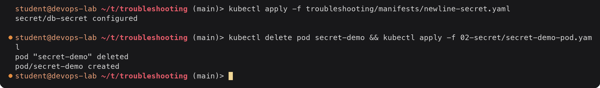

<details><summary>Text version</summary>

```console
$ kubectl apply -f troubleshooting/manifests/newline-secret.yaml
secret/db-secret configured

$ kubectl delete pod secret-demo && kubectl apply -f 02-secret/secret-demo-pod.yaml
pod "secret-demo" deleted
pod/secret-demo created
```

</details>

The Pod is recreated because Secret values in environment variables are only read when the
container starts.

### Identify

The Pod is `Running`, so `kubectl get pods` shows nothing wrong. The symptom only shows in the
application (with PostgreSQL it would be `FATAL: password authentication failed for user ...`).
I simulate the login check with a plain string comparison:

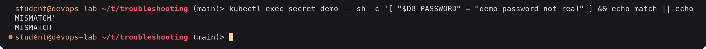

<details><summary>Text version</summary>

```console
$ kubectl exec secret-demo -- sh -c '[ "$DB_PASSWORD" = "demo-password-not-real" ] && echo match || echo MISMATCH'
MISMATCH
```

</details>

### Investigate

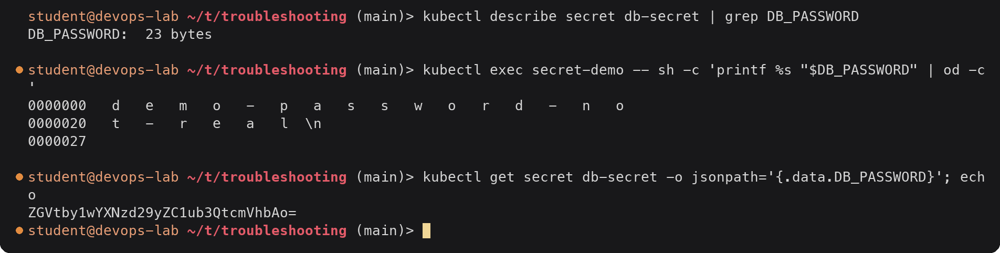

<details><summary>Text version</summary>

```console
$ kubectl describe secret db-secret | grep DB_PASSWORD
DB_PASSWORD:  23 bytes

$ kubectl exec secret-demo -- sh -c 'printf %s "$DB_PASSWORD" | od -c'
0000000   d   e   m   o   -   p   a   s   s   w   o   r   d   -   n   o
0000020   t   -   r   e   a   l  \n
0000027

$ kubectl get secret db-secret -o jsonpath='{.data.DB_PASSWORD}'; echo
ZGVtby1wYXNzd29yZC1ub3QtcmVhbAo=
```

</details>

The password has 22 characters but the Secret holds 23 bytes, and `od -c` shows the extra byte is
`\n`. The base64 ending in `Ao=` is the tell-tale sign. Depending on the length of the value, a
trailing newline shows up at the end of the base64 as `Cg==`, `Ao=` or `K`.

### Root cause

`echo` appends a newline to its output, so `echo "demo-password-not-real" | base64` encodes
`demo-password-not-real\n`. Kubernetes stores and delivers exactly those bytes, and the database
compares them byte for byte.

### Fix

Encode with `echo -n` (or put the plain value under `stringData:` and let the API server encode it),
apply the correct Secret and restart the consumer:

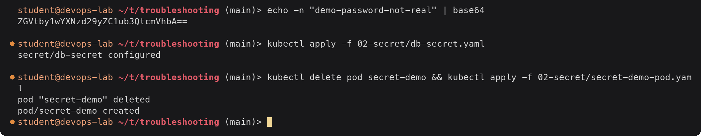

<details><summary>Text version</summary>

```console
$ echo -n "demo-password-not-real" | base64
ZGVtby1wYXNzd29yZC1ub3QtcmVhbA==

$ kubectl apply -f 02-secret/db-secret.yaml
secret/db-secret configured

$ kubectl delete pod secret-demo && kubectl apply -f 02-secret/secret-demo-pod.yaml
pod "secret-demo" deleted
pod/secret-demo created
```

</details>

### Verify

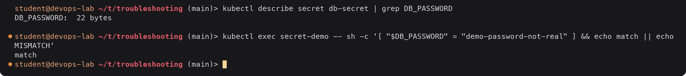

<details><summary>Text version</summary>

```console
$ kubectl describe secret db-secret | grep DB_PASSWORD
DB_PASSWORD:  22 bytes

$ kubectl exec secret-demo -- sh -c '[ "$DB_PASSWORD" = "demo-password-not-real" ] && echo match || echo MISMATCH'
match
```

</details>

| | Before | After |
|---|---|---|
| base64 in Secret | `...cmVhbAo=` | `...cmVhbA==` |
| Size in `describe` | 23 bytes | 22 bytes |
| Comparison in Pod | MISMATCH | match |

---

## Scenario 2: Pod stuck in CreateContainerConfigError

**Problem statement.** A new Pod that should read `app-config` through `envFrom` never starts.

### Reproduce and identify

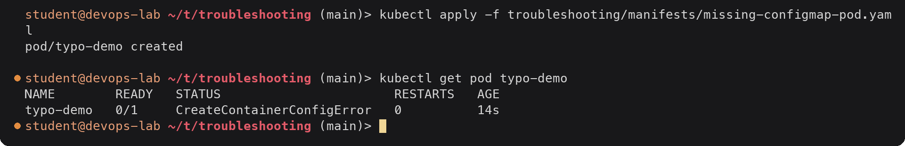

<details><summary>Text version</summary>

```console
$ kubectl apply -f troubleshooting/manifests/missing-configmap-pod.yaml
pod/typo-demo created

$ kubectl get pod typo-demo
NAME        READY   STATUS                       RESTARTS   AGE
typo-demo   0/1     CreateContainerConfigError   0          14s
```

</details>

`CreateContainerConfigError` means the image was pulled fine but kubelet could not build the
container's configuration (environment, mounts) from the Pod spec.

### Investigate

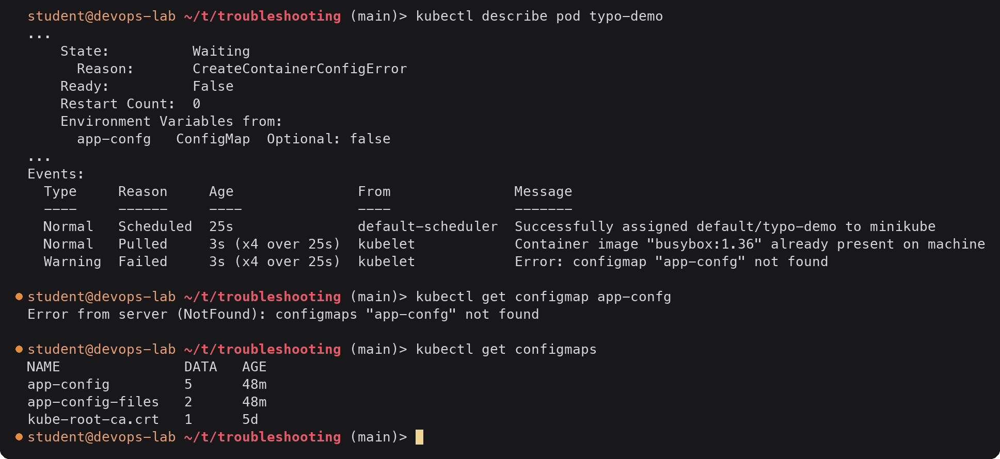

<details><summary>Text version</summary>

```console
$ kubectl describe pod typo-demo
...
    State:          Waiting
      Reason:       CreateContainerConfigError
    Ready:          False
    Restart Count:  0
    Environment Variables from:
      app-confg   ConfigMap  Optional: false
...
Events:
  Type     Reason     Age               From               Message
  ----     ------     ----              ----               -------
  Normal   Scheduled  25s               default-scheduler  Successfully assigned default/typo-demo to minikube
  Normal   Pulled     3s (x4 over 25s)  kubelet            Container image "busybox:1.36" already present on machine
  Warning  Failed     3s (x4 over 25s)  kubelet            Error: configmap "app-confg" not found

$ kubectl get configmap app-confg
Error from server (NotFound): configmaps "app-confg" not found

$ kubectl get configmaps
NAME               DATA   AGE
app-config         5      48m
app-config-files   2      48m
kube-root-ca.crt   1      5d
```

</details>

### Root cause

The Pod references `app-confg` (missing "i"). The ConfigMap is `app-config`. Because the reference
is not `optional: true`, kubelet refuses to start the container and retries.

### Fix

Most Pod spec fields cannot be changed on a running Pod, so I deleted it and applied the corrected
spec:

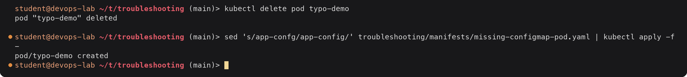

<details><summary>Text version</summary>

```console
$ kubectl delete pod typo-demo
pod "typo-demo" deleted

$ sed 's/app-confg/app-config/' troubleshooting/manifests/missing-configmap-pod.yaml | kubectl apply -f -
pod/typo-demo created
```

</details>

(Creating a ConfigMap called `app-confg` would also have unblocked it, kubelet keeps retrying, but
that would hide the typo instead of fixing it.)

### Verify

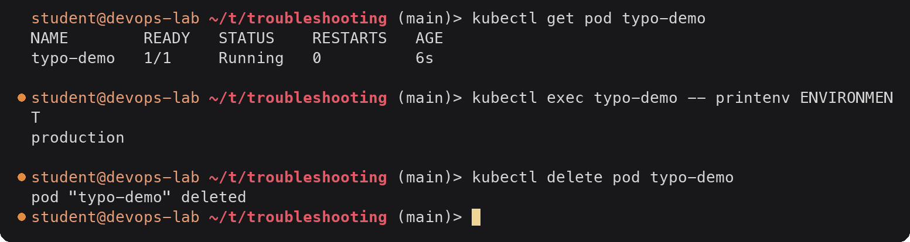

<details><summary>Text version</summary>

```console
$ kubectl get pod typo-demo
NAME        READY   STATUS    RESTARTS   AGE
typo-demo   1/1     Running   0          6s

$ kubectl exec typo-demo -- printenv ENVIRONMENT
production

$ kubectl delete pod typo-demo
pod "typo-demo" deleted
```

</details>

The same status and a similar message (`Error: secret "..." not found`, or
`Error: couldn't find key DB_PASS in Secret default/db-secret`) appear for a missing Secret or a
missing key.

---

## Scenario 3: Ingress ignored, no ADDRESS, every request returns 404

**Problem statement.** An Ingress copied from another cluster is applied. `kubectl get ingress` shows
it, but `curl -H "Host: demo.local"` returns NGINX's 404 page for every path.

### Reproduce and identify

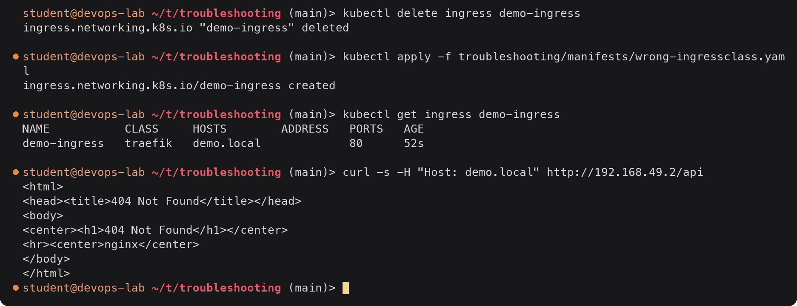

<details><summary>Text version</summary>

```console
$ kubectl delete ingress demo-ingress
ingress.networking.k8s.io "demo-ingress" deleted

$ kubectl apply -f troubleshooting/manifests/wrong-ingressclass.yaml
ingress.networking.k8s.io/demo-ingress created

$ kubectl get ingress demo-ingress
NAME           CLASS     HOSTS        ADDRESS   PORTS   AGE
demo-ingress   traefik   demo.local             80      52s

$ curl -s -H "Host: demo.local" http://192.168.49.2/api
<html>
<head><title>404 Not Found</title></head>
<body>
<center><h1>404 Not Found</h1></center>
<hr><center>nginx</center>
</body>
</html>
```

</details>

`ADDRESS` is still empty after almost a minute. The 404 comes from ingress-nginx's default backend,
so the controller is alive but has no rule for `demo.local`.

### Investigate

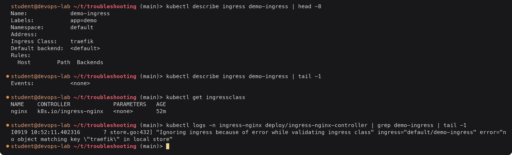

<details><summary>Text version</summary>

```console
$ kubectl describe ingress demo-ingress | head -8
Name:             demo-ingress
Labels:           app=demo
Namespace:        default
Address:
Ingress Class:    traefik
Default backend:  <default>
Rules:
  Host        Path  Backends

$ kubectl describe ingress demo-ingress | tail -1
Events:           <none>

$ kubectl get ingressclass
NAME    CONTROLLER             PARAMETERS   AGE
nginx   k8s.io/ingress-nginx   <none>       52m

$ kubectl logs -n ingress-nginx deploy/ingress-nginx-controller | grep demo-ingress | tail -1
I0919 10:52:11.402316       7 store.go:432] "Ignoring ingress because of error while validating ingress class" ingress="default/demo-ingress" error="no object matching key \"traefik\" in local store"
```

</details>

No `Sync` events, the only IngressClass in the cluster is `nginx`, and the controller log says
outright that it is ignoring the Ingress.

### Root cause

`spec.ingressClassName: traefik` refers to a class that does not exist here. Each controller only
handles Ingresses of its own class, so nothing programs the route.

### Fix

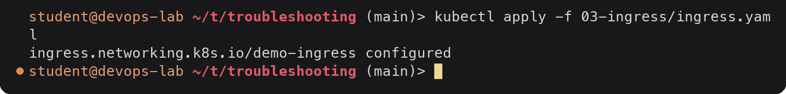

<details><summary>Text version</summary>

```console
$ kubectl apply -f 03-ingress/ingress.yaml
ingress.networking.k8s.io/demo-ingress configured
```

</details>

### Verify

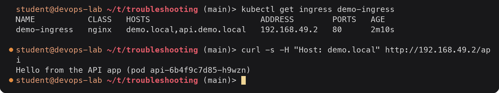

<details><summary>Text version</summary>

```console
$ kubectl get ingress demo-ingress
NAME           CLASS   HOSTS                       ADDRESS        PORTS   AGE
demo-ingress   nginx   demo.local,api.demo.local   192.168.49.2   80      2m10s

$ curl -s -H "Host: demo.local" http://192.168.49.2/api
Hello from the API app (pod api-6b4f9c7d85-h9wzn)
```

</details>

| | Before | After |
|---|---|---|
| CLASS | traefik | nginx |
| ADDRESS | empty | 192.168.49.2 |
| `curl ... /api` | 404 from default backend | API app answers |

---

## Scenario 4: Ingress returns 503 Service Temporarily Unavailable

**Problem statement.** After a refactor `/` still works but `/api` returns 503.

### Reproduce and identify

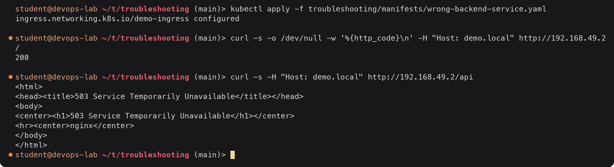

<details><summary>Text version</summary>

```console
$ kubectl apply -f troubleshooting/manifests/wrong-backend-service.yaml
ingress.networking.k8s.io/demo-ingress configured

$ curl -s -o /dev/null -w '%{http_code}\n' -H "Host: demo.local" http://192.168.49.2/
200

$ curl -s -H "Host: demo.local" http://192.168.49.2/api
<html>
<head><title>503 Service Temporarily Unavailable</title></head>
<body>
<center><h1>503 Service Temporarily Unavailable</h1></center>
<hr><center>nginx</center>
</body>
</html>
```

</details>

A 503 (instead of 404) means the controller did match a rule but has no healthy upstream for it.

### Investigate

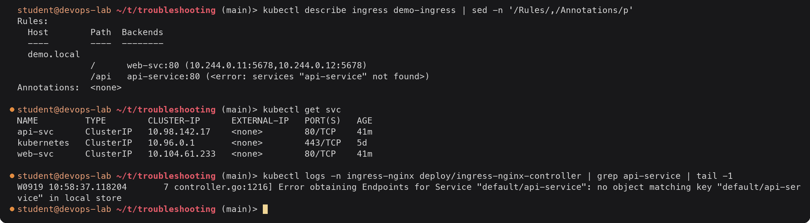

<details><summary>Text version</summary>

```console
$ kubectl describe ingress demo-ingress | sed -n '/Rules/,/Annotations/p'
Rules:
  Host        Path  Backends
  ----        ----  --------
  demo.local
              /      web-svc:80 (10.244.0.11:5678,10.244.0.12:5678)
              /api   api-service:80 (<error: services "api-service" not found>)
Annotations:  <none>

$ kubectl get svc
NAME         TYPE        CLUSTER-IP      EXTERNAL-IP   PORT(S)   AGE
api-svc      ClusterIP   10.98.142.17    <none>        80/TCP    41m
kubernetes   ClusterIP   10.96.0.1       <none>        443/TCP   5d
web-svc      ClusterIP   10.104.61.233   <none>        80/TCP    41m

$ kubectl logs -n ingress-nginx deploy/ingress-nginx-controller | grep api-service | tail -1
W0919 10:58:37.118204       7 controller.go:1216] Error obtaining Endpoints for Service "default/api-service": no object matching key "default/api-service" in local store
```

</details>

`describe ingress` resolves every backend to endpoints and prints an error for the one that does
not exist. `kubectl get svc` shows the real name is `api-svc`.

### Root cause

The Ingress backend points at Service `api-service`, which does not exist. With no endpoints for the
upstream, ingress-nginx answers 503. The same 503 appears when the Service exists but has no ready
endpoints (wrong selector, pods not ready), and the same `describe ingress` check finds that case too.

### Fix


<details><summary>Text version</summary>

```console
$ kubectl apply -f 03-ingress/ingress.yaml
ingress.networking.k8s.io/demo-ingress configured
```

</details>

### Verify

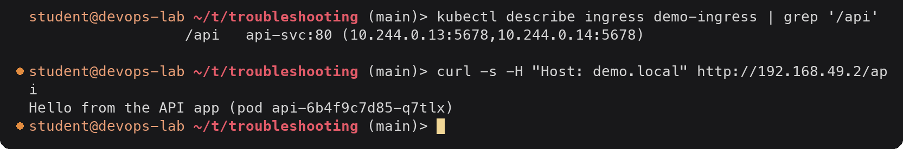

<details><summary>Text version</summary>

```console
$ kubectl describe ingress demo-ingress | grep '/api'
                  /api   api-svc:80 (10.244.0.13:5678,10.244.0.14:5678)

$ curl -s -H "Host: demo.local" http://192.168.49.2/api
Hello from the API app (pod api-6b4f9c7d85-q7tlx)
```

</details>

---

## Scenario 5: ConfigMap updated but the application still uses the old value

**Problem statement.** `LOG_LEVEL` was changed to `DEBUG` in `app-config`, but the running app keeps
logging at `INFO`.

### Reproduce

A small Deployment that takes every key of `app-config` as environment variables:

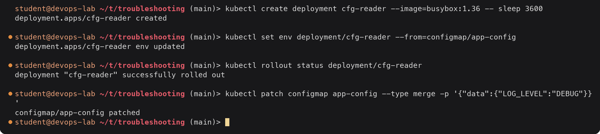

<details><summary>Text version</summary>

```console
$ kubectl create deployment cfg-reader --image=busybox:1.36 -- sleep 3600
deployment.apps/cfg-reader created

$ kubectl set env deployment/cfg-reader --from=configmap/app-config
deployment.apps/cfg-reader env updated

$ kubectl rollout status deployment/cfg-reader
deployment "cfg-reader" successfully rolled out

$ kubectl patch configmap app-config --type merge -p '{"data":{"LOG_LEVEL":"DEBUG"}}'
configmap/app-config patched
```

</details>

### Identify and investigate

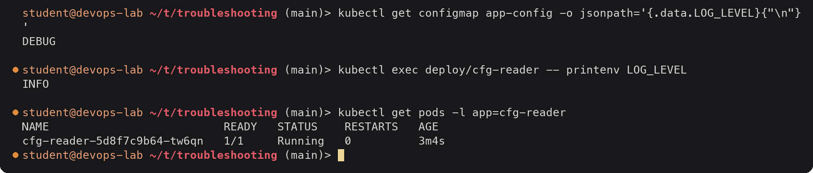

<details><summary>Text version</summary>

```console
$ kubectl get configmap app-config -o jsonpath='{.data.LOG_LEVEL}{"\n"}'
DEBUG

$ kubectl exec deploy/cfg-reader -- printenv LOG_LEVEL
INFO

$ kubectl get pods -l app=cfg-reader
NAME                          READY   STATUS    RESTARTS   AGE
cfg-reader-5d8f7c9b64-tw6qn   1/1     Running   0          3m4s
```

</details>

The ConfigMap has the new value, the Pod does not, and the Pod is older than the change.

### Root cause

Environment variables are resolved once, when kubelet creates the container. Kubernetes does not
restart Pods when a ConfigMap or Secret they reference changes. (Mounted ConfigMap files are
refreshed, as shown in Task 1.5, but only if the app re-reads them and the mount does not use
`subPath`.)

### Fix

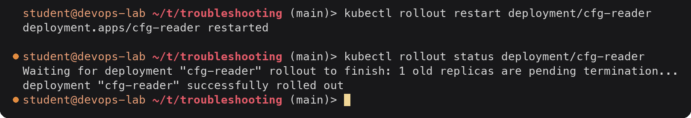

<details><summary>Text version</summary>

```console
$ kubectl rollout restart deployment/cfg-reader
deployment.apps/cfg-reader restarted

$ kubectl rollout status deployment/cfg-reader
Waiting for deployment "cfg-reader" rollout to finish: 1 old replicas are pending termination...
deployment "cfg-reader" successfully rolled out
```

</details>

### Verify

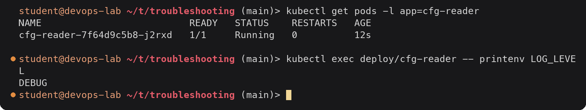

<details><summary>Text version</summary>

```console
$ kubectl get pods -l app=cfg-reader
NAME                          READY   STATUS    RESTARTS   AGE
cfg-reader-7f64d9c5b8-j2rxd   1/1     Running   0          12s

$ kubectl exec deploy/cfg-reader -- printenv LOG_LEVEL
DEBUG
```

</details>

New ReplicaSet hash, new Pod, new value. For automatic restarts on config changes, a common pattern
is to put a hash of the ConfigMap into a Pod template annotation (Helm's `checksum/config`), or to
run a tool such as Stakater Reloader.

Cleanup:

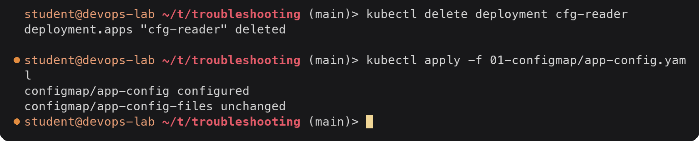

<details><summary>Text version</summary>

```console
$ kubectl delete deployment cfg-reader
deployment.apps "cfg-reader" deleted

$ kubectl apply -f 01-configmap/app-config.yaml
configmap/app-config configured
configmap/app-config-files unchanged
```

</details>

---

## Checklist I use for these objects

| Symptom | First command | What to look for |
|---|---|---|
| `CreateContainerConfigError` | `kubectl describe pod` | `Error: configmap/secret "..." not found`, missing key |
| `ContainerCreating` for long | `kubectl describe pod` | `FailedMount` for a ConfigMap/Secret volume |
| Wrong config value in app | `kubectl exec ... printenv` vs `kubectl get cm -o yaml` | Pod older than the change, extra bytes in Secret |
| Ingress has no ADDRESS | `kubectl get ingressclass`, controller logs | Class mismatch, controller not running |
| 404 from nginx | `kubectl describe ingress` | Host/path does not match any rule |
| 503 from nginx | `kubectl describe ingress`, `kubectl get endpoints` | Missing Service or no ready endpoints |
