# Kubernetes Volumes and Persistent Storage

> **Note:** Command output in this file is representative expected output for the lab environment
> described in [`../submission.md`](../submission.md), written as a learning reference. It was not
> captured from a live run, so IDs, timestamps and pod name hashes will differ when you run it yourself.

A container's own filesystem is thrown away whenever the container is recreated. Volumes are how a
Pod gets storage that outlives a container restart (emptyDir), comes from the node (hostPath), or
outlives the Pod entirely (PersistentVolumes).

| Type | Lifetime | Where the data lives | Typical use |
|---|---|---|---|
| `emptyDir` | Same as the Pod | Node disk (or RAM with `medium: Memory`) | Scratch space, cache, sharing files between containers of one Pod |
| `hostPath` | Same as the node directory | A fixed directory on the node | Node agents (log collectors, CNI); single-node labs. Avoid for apps |
| PersistentVolume (PV) | Independent of any Pod | Whatever backs it: cloud disk, NFS, hostPath, ... | The storage resource itself, cluster scoped |
| PersistentVolumeClaim (PVC) | Until the claim is deleted | Bound to one PV | A Pod's request for storage, namespaced |
| StorageClass | Cluster object | Describes how to create PVs | Dynamic provisioning, picking disk types |

Files in this folder:

| File | Shows |
|---|---|
| [`emptydir-pod.yaml`](emptydir-pod.yaml) | emptyDir shared by two containers |
| [`hostpath-pod.yaml`](hostpath-pod.yaml) | hostPath |
| [`static-pv.yaml`](static-pv.yaml) + [`static-pvc-pod.yaml`](static-pvc-pod.yaml) | Static provisioning: hand-made PV + PVC + Pod |
| [`dynamic-pvc.yaml`](dynamic-pvc.yaml) | Dynamic provisioning with the default StorageClass |
| [`storageclass-retain.yaml`](storageclass-retain.yaml) | Custom StorageClass (Retain, WaitForFirstConsumer) |

All commands below are run from inside this folder (`~/task-13-storage-hpa-probes/01-kubernetes-volumes`).

---

## 1. emptyDir

An `emptyDir` is created empty when the Pod is scheduled to a node and deleted when the Pod is
removed. It survives container restarts inside the Pod, and every container in the Pod can mount
it, which makes it the standard way for sidecars to share files.

```yaml
  containers:
    - name: writer
      image: busybox:1.36
      command: ["sh", "-c", "while true; do echo \"$(date -u +%H:%M:%S) written by writer\" >> /cache/log.txt; sleep 5; done"]
      volumeMounts:
        - name: cache
          mountPath: /cache
    - name: reader
      image: busybox:1.36
      command: ["sh", "-c", "touch /cache/log.txt; tail -f /cache/log.txt"]
      volumeMounts:
        - name: cache
          mountPath: /cache
          readOnly: true
  volumes:
    - name: cache
      emptyDir:
        sizeLimit: 64Mi
```

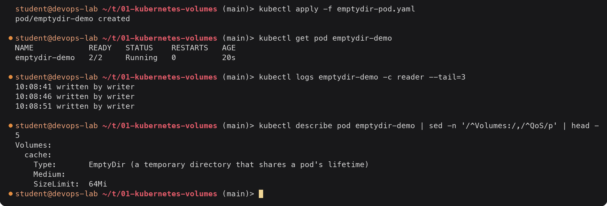

<details><summary>Text version</summary>

```console
$ kubectl apply -f emptydir-pod.yaml
pod/emptydir-demo created

$ kubectl get pod emptydir-demo
NAME            READY   STATUS    RESTARTS   AGE
emptydir-demo   2/2     Running   0          20s

$ kubectl logs emptydir-demo -c reader --tail=3
10:08:41 written by writer
10:08:46 written by writer
10:08:51 written by writer

$ kubectl describe pod emptydir-demo | sed -n '/^Volumes:/,/^QoS/p' | head -5
Volumes:
  cache:
    Type:       EmptyDir (a temporary directory that shares a pod's lifetime)
    Medium:
    SizeLimit:  64Mi
```

</details>

The `reader` container prints lines that only the `writer` container wrote, so both see the same
directory. `sizeLimit` makes kubelet evict the Pod if the volume grows past 64Mi.

Data is lost with the Pod:

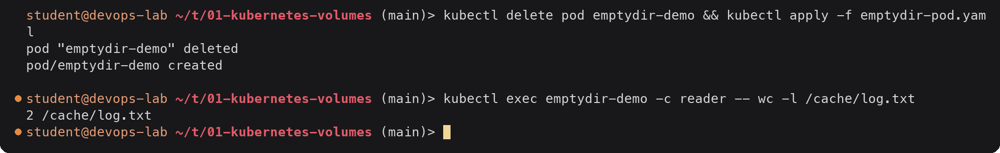

<details><summary>Text version</summary>

```console
$ kubectl delete pod emptydir-demo && kubectl apply -f emptydir-pod.yaml
pod "emptydir-demo" deleted
pod/emptydir-demo created

$ kubectl exec emptydir-demo -c reader -- wc -l /cache/log.txt
2 /cache/log.txt
```

</details>

Only the two lines written since the new Pod started are there; the old file went with the old Pod.

---

## 2. hostPath

`hostPath` mounts a directory from the node into the Pod. The data stays on that node after the Pod
is gone, but a Pod scheduled on another node sees a different (empty) directory, and a writable
hostPath is a security risk (a container can touch the node's files). It is fine for learning on a
single-node minikube and for system DaemonSets, not for application data.

```yaml
  volumes:
    - name: host-storage
      hostPath:
        path: /tmp/hostpath-data
        type: DirectoryOrCreate
```

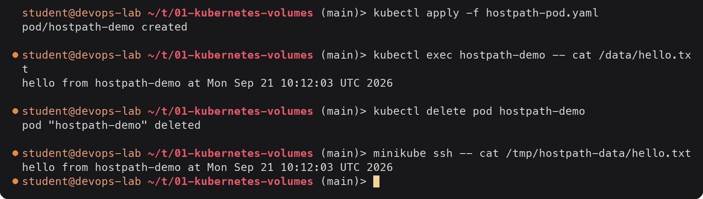

<details><summary>Text version</summary>

```console
$ kubectl apply -f hostpath-pod.yaml
pod/hostpath-demo created

$ kubectl exec hostpath-demo -- cat /data/hello.txt
hello from hostpath-demo at Mon Sep 21 10:12:03 UTC 2026

$ kubectl delete pod hostpath-demo
pod "hostpath-demo" deleted

$ minikube ssh -- cat /tmp/hostpath-data/hello.txt
hello from hostpath-demo at Mon Sep 21 10:12:03 UTC 2026
```

</details>

After the Pod was deleted the file is still on the node. With the docker driver the "node" is the
`minikube` container, so I used `minikube ssh` to look; the directory does not exist on the Ubuntu
host itself.

---

## 3. PersistentVolume and PersistentVolumeClaim (static provisioning)

The split between PV and PVC separates *who provides* storage from *who uses* it:

- A **PersistentVolume** is a piece of storage in the cluster, with a capacity, access modes and a
  reclaim policy. It is cluster scoped (no namespace).
- A **PersistentVolumeClaim** is a namespaced request: "I need 500Mi, ReadWriteOnce, class X".
  Kubernetes binds it to one PV that satisfies it, one to one.
- A Pod only refers to the PVC by name, so the Pod spec does not care whether the storage is an
  EBS disk, NFS or a node directory.

Access modes: `ReadWriteOnce` (RWO, mounted read-write by one node), `ReadOnlyMany` (ROX),
`ReadWriteMany` (RWX, many nodes, needs e.g. NFS/EFS), `ReadWriteOncePod` (exactly one Pod).

Reclaim policies: `Retain` keeps the PV and data after the PVC is deleted (PV goes to `Released`
and an admin cleans it up), `Delete` removes the PV and the underlying storage.

[`static-pv.yaml`](static-pv.yaml):

```yaml
apiVersion: v1
kind: PersistentVolume
metadata:
  name: manual-pv
spec:
  storageClassName: manual
  capacity:
    storage: 1Gi
  accessModes:
    - ReadWriteOnce
  persistentVolumeReclaimPolicy: Retain
  hostPath:
    path: /data/manual-pv
    type: DirectoryOrCreate
---
apiVersion: v1
kind: PersistentVolumeClaim
metadata:
  name: manual-pvc
spec:
  storageClassName: manual
  accessModes:
    - ReadWriteOnce
  resources:
    requests:
      storage: 500Mi
```

`storageClassName: manual` on both is important. The course's `02-persistent-storage/pvc.yaml` has
no class; on minikube the admission plugin fills in the default class `standard`, so that claim gets
a brand new dynamically provisioned volume and the hand-made PV stays `Available`. Matching class
names (or `storageClassName: ""` on both) forces the claim onto the static PV.

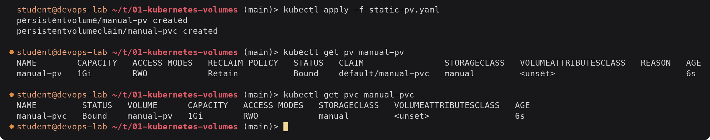

<details><summary>Text version</summary>

```console
$ kubectl apply -f static-pv.yaml
persistentvolume/manual-pv created
persistentvolumeclaim/manual-pvc created

$ kubectl get pv manual-pv
NAME        CAPACITY   ACCESS MODES   RECLAIM POLICY   STATUS   CLAIM                STORAGECLASS   VOLUMEATTRIBUTESCLASS   REASON   AGE
manual-pv   1Gi        RWO            Retain           Bound    default/manual-pvc   manual         <unset>                          6s

$ kubectl get pvc manual-pvc
NAME         STATUS   VOLUME      CAPACITY   ACCESS MODES   STORAGECLASS   VOLUMEATTRIBUTESCLASS   AGE
manual-pvc   Bound    manual-pv   1Gi        RWO            manual         <unset>                 6s
```

</details>

The claim asked for 500Mi but shows `CAPACITY 1Gi`: binding gives the claim the whole PV, a PV is
never split between claims.

Use it from a Pod and prove the data outlives the Pod:

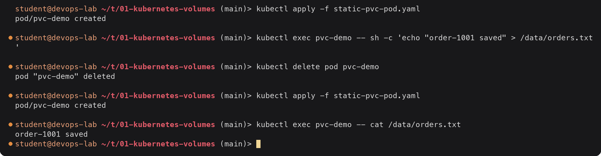

<details><summary>Text version</summary>

```console
$ kubectl apply -f static-pvc-pod.yaml
pod/pvc-demo created

$ kubectl exec pvc-demo -- sh -c 'echo "order-1001 saved" > /data/orders.txt'

$ kubectl delete pod pvc-demo
pod "pvc-demo" deleted

$ kubectl apply -f static-pvc-pod.yaml
pod/pvc-demo created

$ kubectl exec pvc-demo -- cat /data/orders.txt
order-1001 saved
```

</details>

Then the reclaim policy. Deleting the claim leaves a `Retain` volume and its data behind:

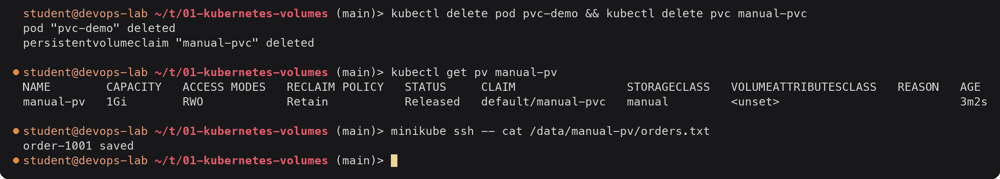

<details><summary>Text version</summary>

```console
$ kubectl delete pod pvc-demo && kubectl delete pvc manual-pvc
pod "pvc-demo" deleted
persistentvolumeclaim "manual-pvc" deleted

$ kubectl get pv manual-pv
NAME        CAPACITY   ACCESS MODES   RECLAIM POLICY   STATUS     CLAIM                STORAGECLASS   VOLUMEATTRIBUTESCLASS   REASON   AGE
manual-pv   1Gi        RWO            Retain           Released   default/manual-pvc   manual         <unset>                          3m2s

$ minikube ssh -- cat /data/manual-pv/orders.txt
order-1001 saved
```

</details>

`Released` means the PV still remembers its old claim and will not bind to a new one until an admin
removes `spec.claimRef` or deletes and recreates the PV. That is deliberate: someone has to decide
what happens to the old data.

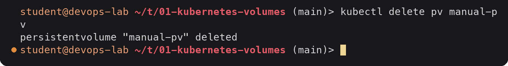

<details><summary>Text version</summary>

```console
$ kubectl delete pv manual-pv
persistentvolume "manual-pv" deleted
```

</details>

---

## 4. StorageClass

A StorageClass describes *how* to create volumes: which provisioner (CSI driver) to call, with which
parameters, which reclaim policy, and when to bind. minikube ships one, marked as the default:

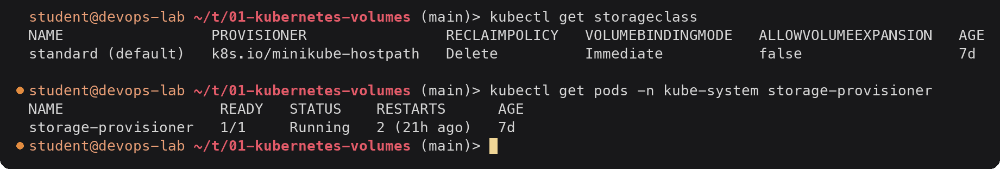

<details><summary>Text version</summary>

```console
$ kubectl get storageclass
NAME                 PROVISIONER                RECLAIMPOLICY   VOLUMEBINDINGMODE   ALLOWVOLUMEEXPANSION   AGE
standard (default)   k8s.io/minikube-hostpath   Delete          Immediate           false                  7d

$ kubectl get pods -n kube-system storage-provisioner
NAME                  READY   STATUS    RESTARTS      AGE
storage-provisioner   1/1     Running   2 (21h ago)   7d
```

</details>

`k8s.io/minikube-hostpath` is implemented by the `storage-provisioner` pod. It creates each volume as
a directory under `/tmp/hostpath-provisioner/<namespace>/<pvc-name>` on the node. On a cloud cluster
the same column would show something like `ebs.csi.aws.com` with parameters such as `type: gp3`.

| Field | Meaning |
|---|---|
| `provisioner` | Who creates the volume |
| `parameters` | Provisioner specific (disk type, IOPS, filesystem) |
| `reclaimPolicy` | `Delete` (default) or `Retain` for the PVs it creates |
| `volumeBindingMode` | `Immediate` provisions as soon as the PVC exists; `WaitForFirstConsumer` waits until a Pod using it is scheduled, so the volume is created in the right zone/node |
| `allowVolumeExpansion` | Whether a PVC's size can be increased later |

---

## 5. Dynamic provisioning

With dynamic provisioning nobody writes a PV. The PVC names a StorageClass (or gets the default),
and the provisioner creates a PV that fits.

[`dynamic-pvc.yaml`](dynamic-pvc.yaml):

```yaml
apiVersion: v1
kind: PersistentVolumeClaim
metadata:
  name: dynamic-pvc
spec:
  storageClassName: standard
  accessModes:
    - ReadWriteOnce
  resources:
    requests:
      storage: 500Mi
```

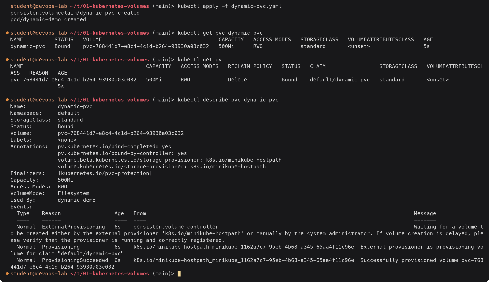

<details><summary>Text version</summary>

```console
$ kubectl apply -f dynamic-pvc.yaml
persistentvolumeclaim/dynamic-pvc created
pod/dynamic-demo created

$ kubectl get pvc dynamic-pvc
NAME          STATUS   VOLUME                                     CAPACITY   ACCESS MODES   STORAGECLASS   VOLUMEATTRIBUTESCLASS   AGE
dynamic-pvc   Bound    pvc-768441d7-e8c4-4c1d-b264-93930a03c032   500Mi      RWO            standard       <unset>                 5s

$ kubectl get pv
NAME                                       CAPACITY   ACCESS MODES   RECLAIM POLICY   STATUS   CLAIM                 STORAGECLASS   VOLUMEATTRIBUTESCLASS   REASON   AGE
pvc-768441d7-e8c4-4c1d-b264-93930a03c032   500Mi      RWO            Delete           Bound    default/dynamic-pvc   standard       <unset>                          5s

$ kubectl describe pvc dynamic-pvc
Name:          dynamic-pvc
Namespace:     default
StorageClass:  standard
Status:        Bound
Volume:        pvc-768441d7-e8c4-4c1d-b264-93930a03c032
Labels:        <none>
Annotations:   pv.kubernetes.io/bind-completed: yes
               pv.kubernetes.io/bound-by-controller: yes
               volume.beta.kubernetes.io/storage-provisioner: k8s.io/minikube-hostpath
               volume.kubernetes.io/storage-provisioner: k8s.io/minikube-hostpath
Finalizers:    [kubernetes.io/pvc-protection]
Capacity:      500Mi
Access Modes:  RWO
VolumeMode:    Filesystem
Used By:       dynamic-demo
Events:
  Type    Reason                 Age   From                                                                                     Message
  ----    ------                 ----  ----                                                                                     -------
  Normal  ExternalProvisioning   6s    persistentvolume-controller                                                              Waiting for a volume to be created either by the external provisioner 'k8s.io/minikube-hostpath' or manually by the system administrator. If volume creation is delayed, please verify that the provisioner is running and correctly registered.
  Normal  Provisioning           6s    k8s.io/minikube-hostpath_minikube_1162a7c7-95eb-4b68-a345-65aa4f11c96e  External provisioner is provisioning volume for claim "default/dynamic-pvc"
  Normal  ProvisioningSucceeded  6s    k8s.io/minikube-hostpath_minikube_1162a7c7-95eb-4b68-a345-65aa4f11c96e  Successfully provisioned volume pvc-768441d7-e8c4-4c1d-b264-93930a03c032
```

</details>

The events show the whole chain: the PV controller sees a claim for an external provisioner, the
minikube provisioner creates the volume, and the claim binds. The PV is named `pvc-<uid of the
claim>` and inherits `Delete` from the class. The UID in the PV name matches the PVC:

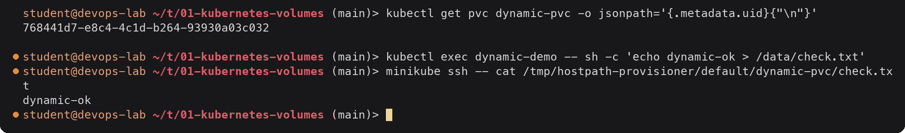

<details><summary>Text version</summary>

```console
$ kubectl get pvc dynamic-pvc -o jsonpath='{.metadata.uid}{"\n"}'
768441d7-e8c4-4c1d-b264-93930a03c032

$ kubectl exec dynamic-demo -- sh -c 'echo dynamic-ok > /data/check.txt'
$ minikube ssh -- cat /tmp/hostpath-provisioner/default/dynamic-pvc/check.txt
dynamic-ok
```

</details>

With `Delete`, removing the claim removes the volume too:

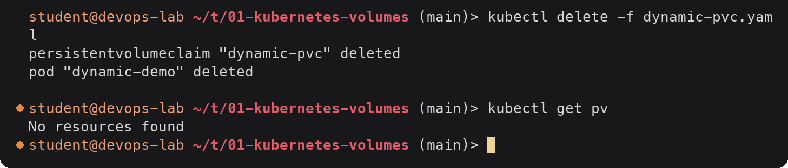

<details><summary>Text version</summary>

```console
$ kubectl delete -f dynamic-pvc.yaml
persistentvolumeclaim "dynamic-pvc" deleted
pod "dynamic-demo" deleted

$ kubectl get pv
No resources found
```

</details>

### Custom StorageClass: Retain and WaitForFirstConsumer

[`storageclass-retain.yaml`](storageclass-retain.yaml) defines `standard-retain` with the same
provisioner but `reclaimPolicy: Retain` and `volumeBindingMode: WaitForFirstConsumer`, plus a PVC and
a Pod. To see the binding mode I applied the objects one at a time:

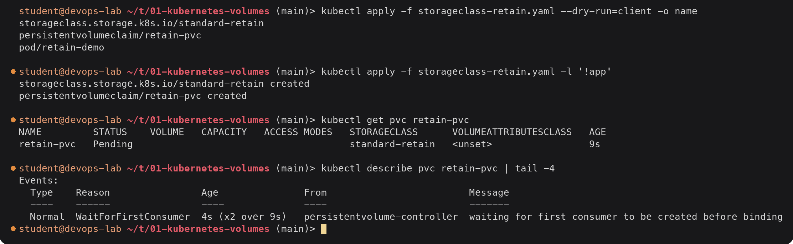

<details><summary>Text version</summary>

```console
$ kubectl apply -f storageclass-retain.yaml --dry-run=client -o name
storageclass.storage.k8s.io/standard-retain
persistentvolumeclaim/retain-pvc
pod/retain-demo

$ kubectl apply -f storageclass-retain.yaml -l '!app'
storageclass.storage.k8s.io/standard-retain created
persistentvolumeclaim/retain-pvc created

$ kubectl get pvc retain-pvc
NAME         STATUS    VOLUME   CAPACITY   ACCESS MODES   STORAGECLASS      VOLUMEATTRIBUTESCLASS   AGE
retain-pvc   Pending                                      standard-retain   <unset>                 9s

$ kubectl describe pvc retain-pvc | tail -4
Events:
  Type    Reason                Age               From                         Message
  ----    ------                ----              ----                         -------
  Normal  WaitForFirstConsumer  4s (x2 over 9s)   persistentvolume-controller  waiting for first consumer to be created before binding
```

</details>

`-l '!app'` selects only the objects without an `app` label, so the Pod is held back. The claim stays
`Pending` on purpose: no Pod uses it yet, so nothing has been provisioned. Now the Pod:

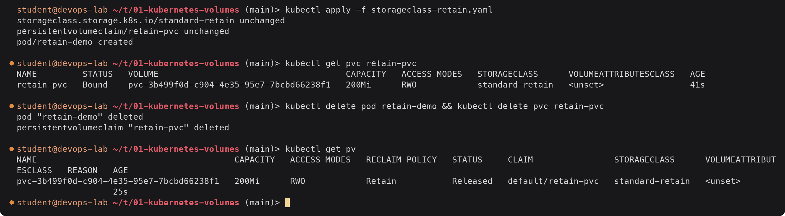

<details><summary>Text version</summary>

```console
$ kubectl apply -f storageclass-retain.yaml
storageclass.storage.k8s.io/standard-retain unchanged
persistentvolumeclaim/retain-pvc unchanged
pod/retain-demo created

$ kubectl get pvc retain-pvc
NAME         STATUS   VOLUME                                     CAPACITY   ACCESS MODES   STORAGECLASS      VOLUMEATTRIBUTESCLASS   AGE
retain-pvc   Bound    pvc-3b499f0d-c904-4e35-95e7-7bcbd66238f1   200Mi      RWO            standard-retain   <unset>                 41s

$ kubectl delete pod retain-demo && kubectl delete pvc retain-pvc
pod "retain-demo" deleted
persistentvolumeclaim "retain-pvc" deleted

$ kubectl get pv
NAME                                       CAPACITY   ACCESS MODES   RECLAIM POLICY   STATUS     CLAIM                STORAGECLASS      VOLUMEATTRIBUTESCLASS   REASON   AGE
pvc-3b499f0d-c904-4e35-95e7-7bcbd66238f1   200Mi      RWO            Retain           Released   default/retain-pvc   standard-retain   <unset>                          25s
```

</details>

Provisioning happened only when the Pod appeared, and because of `Retain` the PV survived the claim.
I removed the leftovers by hand:

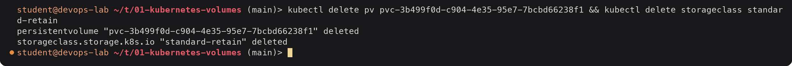

<details><summary>Text version</summary>

```console
$ kubectl delete pv pvc-3b499f0d-c904-4e35-95e7-7bcbd66238f1 && kubectl delete storageclass standard-retain
persistentvolume "pvc-3b499f0d-c904-4e35-95e7-7bcbd66238f1" deleted
storageclass.storage.k8s.io "standard-retain" deleted
```

</details>

---

## 6. Static vs dynamic, summary

| | Static provisioning | Dynamic provisioning |
|---|---|---|
| Who creates the PV | An admin, by hand | The StorageClass provisioner, on demand |
| What the user writes | PVC that matches an existing PV | PVC naming a StorageClass (or none, for the default) |
| PV name | Chosen by the admin (`manual-pv`) | `pvc-<claim uid>` |
| Size | Claim gets the whole PV (asked 500Mi, got 1Gi) | Exactly what was asked (500Mi) |
| Fits | Pre-existing disks, NFS shares, labs | Almost everything on cloud clusters |

Order of objects when a Pod needs persistent data:

```text
StorageClass  --(provisioner creates)-->  PersistentVolume
                                               ^
                                               | bound 1:1
Pod --(volumes.persistentVolumeClaim)--> PersistentVolumeClaim
```
