# Kubernetes Storage, HPA and Probes

> **Note:** Command output in this file is representative expected output for the lab environment
> below, written as a learning reference. It was not captured from a live run, so IDs, timestamps
> and pod name hashes will differ when you run it yourself.

## Lab environment

| Item | Value |
|---|---|
| Host | Ubuntu 24.04 LTS, hostname `devops-lab`, user `student` |
| Shell prompt in output | `student@devops-lab:~/task-13-storage-hpa-probes$` |
| Docker | 27.3.1 |
| Minikube | v1.34.0, docker driver, 2 CPU / 4096 MB, profile `minikube` |
| Kubernetes | v1.31.0, single node `minikube`, node InternalIP `192.168.49.2` |
| kubectl | v1.31.1 client |
| Pod CIDR / Service CIDR | 10.244.0.0/16 / 10.96.0.0/12, kube-dns ClusterIP 10.96.0.10 |
| Date of run | 2026-09-21 |

```text
task-13-storage-hpa-probes/
├── submission.md
├── 01-kubernetes-volumes/
│   ├── README.md                 # Task 1 write-up
│   ├── emptydir-pod.yaml
│   ├── hostpath-pod.yaml
│   ├── static-pv.yaml            # PV + PVC (static provisioning)
│   ├── static-pvc-pod.yaml
│   ├── dynamic-pvc.yaml          # PVC + Pod (dynamic provisioning)
│   └── storageclass-retain.yaml  # custom StorageClass + PVC + Pod
├── 02-hpa/
│   ├── hpa.yml                   # php-apache Deployment + Service + HPA
│   └── load-generator.yaml       # optional non-interactive load generator
└── 03-mini-project/
    ├── namespace.yaml
    ├── pvc.yaml
    ├── deployment.yaml           # 2 replicas, startup/readiness/liveness probes, PVC mount
    ├── service.yaml
    ├── hpa.yaml
    └── load-generator.yaml
```

---

## Task 1: Kubernetes volumes

The full write-up with YAML and output is in
[`01-kubernetes-volumes/README.md`](01-kubernetes-volumes/README.md). It covers:

| Topic | Demo | What it showed |
|---|---|---|
| emptyDir | Two containers (writer/reader) sharing `/cache` | Shared between containers, gone when the Pod is deleted |
| hostPath | Pod writes to `/tmp/hostpath-data` on the node | File still on the node (`minikube ssh`) after the Pod is deleted |
| PersistentVolume + PersistentVolumeClaim | Hand-made 1Gi PV, 500Mi PVC, both class `manual` | Claim binds to the whole PV (shows 1Gi); data survives Pod deletion; `Retain` leaves the PV `Released` |
| StorageClass | `standard (default)`, provisioner `k8s.io/minikube-hostpath` | What a class defines: provisioner, reclaim policy, binding mode, expansion |
| Dynamic provisioning | PVC only, class `standard` | PV `pvc-<uid>` created automatically, deleted with the claim (`Delete`) |
| Custom StorageClass | `standard-retain` with `WaitForFirstConsumer` | PVC stays `Pending` until a Pod uses it; PV kept after the claim is deleted |

The minikube default class used throughout:

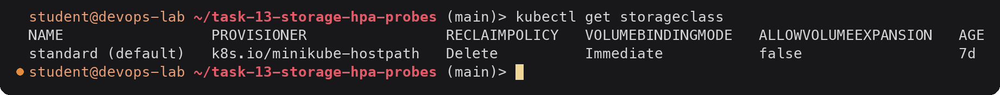

One gotcha worth repeating here: the course's static PV example (`02-persistent-storage`) has no
`storageClassName` on the PVC. On minikube the default class is filled in automatically, so the
claim gets a new dynamically provisioned volume and never binds to the hand-made PV. Setting the
same `storageClassName` on both (I used `manual`) fixes that.

---

## Task 2: Horizontal Pod Autoscaler

### 2.1 How the HPA decides

The HPA controller (part of `kube-controller-manager`) runs every 15 seconds. For a CPU target it
reads the pods' CPU usage from the Metrics API (served by metrics-server), divides it by the pods'
CPU **request**, and computes:

```text
desiredReplicas = ceil( currentReplicas * currentUtilization / targetUtilization )
```

It ignores changes within a 10% tolerance, caps the result to `minReplicas`/`maxReplicas`, and then
applies the `behavior` rules: scale up quickly (by default up to +4 pods or +100% every 15s), scale
down only after the recommendation has stayed lower for the 300 second stabilization window.

Two things are required, otherwise the target shows `<unknown>`: metrics-server must be running,
and the containers must have a CPU request.

### 2.2 Enable metrics-server

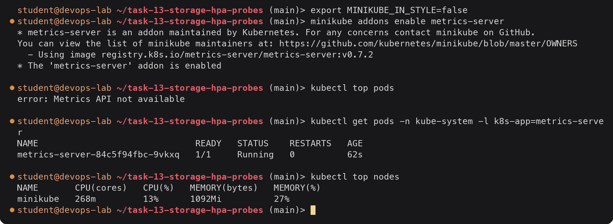

The first `kubectl top` failed because metrics-server needs a minute to start and collect its first
samples. After that the Metrics API answers.

### 2.3 Deploy the app and the HPA (`hpa.yml`)

[`02-hpa/hpa.yml`](02-hpa/hpa.yml) contains three objects. The Deployment runs
`registry.k8s.io/hpa-example`, an Apache + PHP image whose `index.php` runs a CPU heavy loop on
every request and returns `OK!`:

```yaml
          resources:
            requests:
              cpu: 200m      # 100% utilization = 200m
            limits:
              cpu: 500m      # one pod can use at most 500m = 250%
```

The HPA (autoscaling/v2):

```yaml
apiVersion: autoscaling/v2
kind: HorizontalPodAutoscaler
metadata:
  name: php-apache
spec:
  scaleTargetRef:
    apiVersion: apps/v1
    kind: Deployment
    name: php-apache
  minReplicas: 1
  maxReplicas: 10
  metrics:
    - type: Resource
      resource:
        name: cpu
        target:
          type: Utilization
          averageUtilization: 50
  behavior:                         # defaults, written out
    scaleUp:
      stabilizationWindowSeconds: 0
      ...
    scaleDown:
      stabilizationWindowSeconds: 300
      ...
```

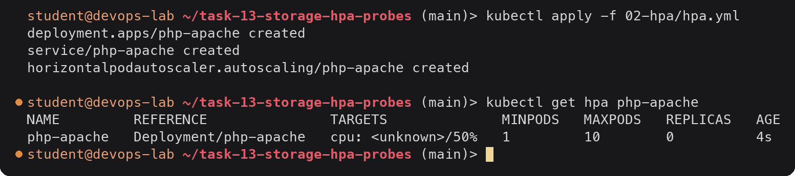

Right after creation the HPA has no metrics yet and has not read the Deployment's replica count, so
it shows `<unknown>` and 0 replicas. Thirty seconds later:

### 2.4 Verify the HPA

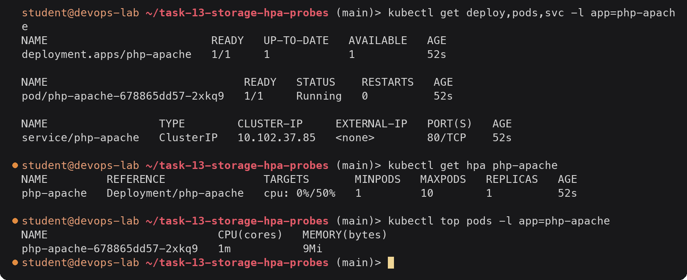

Idle, the pod uses 1m of its 200m request, which rounds to 0%.

### 2.5 Generate load

In a second terminal I started the load generator from the course: a busybox pod that requests the
page in a tight loop.

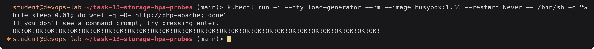

(The same thing without an interactive terminal: `kubectl apply -f 02-hpa/load-generator.yaml`.)

### 2.6 Observe CPU and scaling

In a third terminal I kept a watch on the HPA. The load started at about AGE 3m30s:

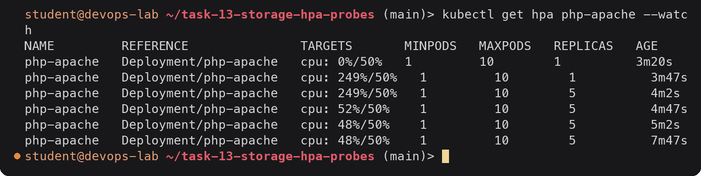

(The columns shift because `--watch` sizes them from the first row.)

What happened, step by step:

| AGE | Reading | Calculation | Action |
|---|---|---|---|
| 3m47s | 249% with 1 pod | ceil(1 x 249 / 50) = ceil(4.98) = 5 | Scale-up policy allows max(+4 pods, +100%) = up to 5, so it goes straight from 1 to 5 |
| 4m2s | still the old sample | | `REPLICAS` now 5, new pods starting |
| 4m47s | 52% with 5 pods | 5 x 52 / 50 = 5.2, ratio 1.04 | Within the 10% tolerance, no change |
| 5m2s onwards | 48% | ceil(5 x 0.96) = 5 | Stable at 5 |

249% is the ceiling for one pod here: the 500m limit divided by the 200m request. With five pods the
same load is spread to roughly 96m per pod, just under the 100m (50% of 200m) target.

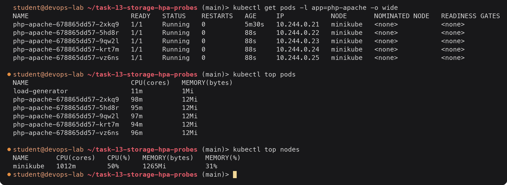

The five pods average 96m, which is 48% of the 200m request, matching the HPA. All four new pods
have the same ReplicaSet hash `678865dd57`: the HPA only changes `spec.replicas` of the Deployment,
it does not change the pod template.

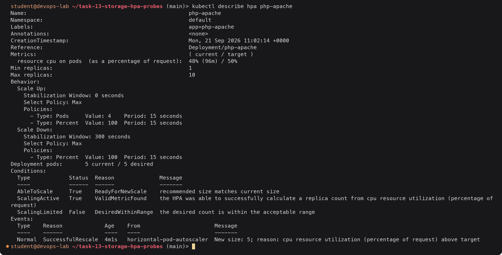

`Metrics` shows both the percentage and the absolute average (96m). The `SuccessfulRescale` event
records the scale-up and its reason. `ScalingActive True` confirms the metric pipeline works.

A side note on capacity: the node has 2 CPUs. System pods (API server, etcd, CoreDNS, scheduler,
controller manager, ingress controller, metrics-server) request 950m, and five php-apache pods
request another 1000m:

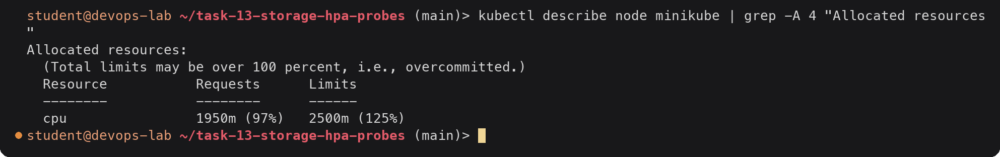

A sixth replica would stay `Pending` with `Insufficient cpu`. The HPA can only add pods; on a real
cluster the Cluster Autoscaler (or Karpenter) would add a node for them.

### 2.7 Stop the load and observe scale-down

I pressed Ctrl+C in the load generator terminal:

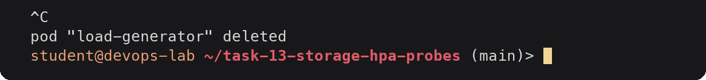

The watch continued:

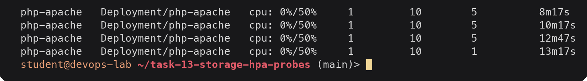

CPU dropped to 0% within one metrics interval, but the replica count stayed at 5 for five more
minutes. That is the scale-down stabilization window: the HPA uses the highest recommendation of
the last 300 seconds, and the last recommendation of 5 was made at about 8m02s. At 13m17s it is out
of the window and the HPA goes straight to `minReplicas` (the scale-down policy allows removing 100%
of the extra pods per 15 seconds). This prevents flapping when traffic dips for a moment.

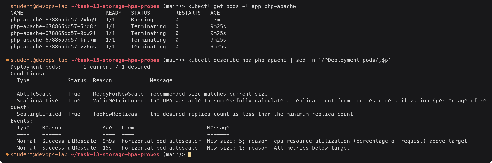

`ScalingLimited True TooFewReplicas`: at 0% the formula gives 0 replicas, and `minReplicas: 1` holds
it at one. The second event is the scale-down.

### 2.8 Summary of the HPA run

| Phase | CPU (HPA) | Replicas |
|---|---|---|
| Idle | 0% | 1 |
| Load starts | 249% | 1 -> 5 (one step) |
| Under load | 48% | 5 |
| Load stopped | 0% | 5 for ~5 min (stabilization) |
| After window | 0% | 1 |

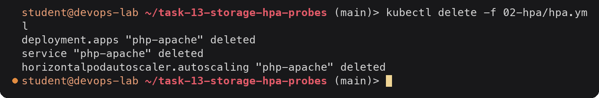

---

## Task 3: Mini project, production-ready web app

The course mini project combines the three topics: a PVC for data in `/data`, an HPA between 2 and 5
replicas at 50% CPU, and startup/readiness/liveness probes, in its own namespace. My files are in
[`03-mini-project/`](03-mini-project/). They follow the course files with three small changes:
`storageClassName: standard` is written out in the PVC, comments explain the probe settings and
the `Recreate` strategy, and a `load-generator.yaml` was added.

```text
                     Service web-service (ClusterIP :80)
                               |
               +---------------+---------------+
               |                               |
        Pod web-app (nginx)             Pod web-app (nginx)      <- 2..5 replicas, HPA web-app-hpa (50% CPU)
        startup / readiness / liveness  startup / readiness / liveness
               |                               |
               +---------- /data --------------+
                               |
                 PVC web-data (500Mi, RWO, class standard)
                               |
                 PV pvc-... (k8s.io/minikube-hostpath)
```

### 3.1 Probes used

```yaml
          startupProbe:
            httpGet: { path: /, port: 80 }
            failureThreshold: 30
            periodSeconds: 2
          readinessProbe:
            httpGet: { path: /, port: 80 }
            initialDelaySeconds: 5
            periodSeconds: 5
            timeoutSeconds: 2
            failureThreshold: 2
          livenessProbe:
            httpGet: { path: /, port: 80 }
            initialDelaySeconds: 5
            periodSeconds: 5
            timeoutSeconds: 2
            failureThreshold: 3
```

| Probe | Question it answers | On failure | Settings here |
|---|---|---|---|
| Startup | Has the app finished starting? | Container restarted after `failureThreshold` failures; liveness and readiness are not run until it succeeds | Up to 30 x 2s = 60s to start |
| Readiness | Can this pod take traffic right now? | Pod removed from Service endpoints, **not** restarted | 2 failures (about 10s) to go unready |
| Liveness | Is the process still healthy? | kubelet kills and restarts the container | 3 failures (about 15s) to restart |

The startup probe protects slow-starting apps from being killed by the liveness probe during boot.
nginx starts in well under a second, so here it passes on the first try; it matters for something
like a JVM app.

### 3.2 Deploy

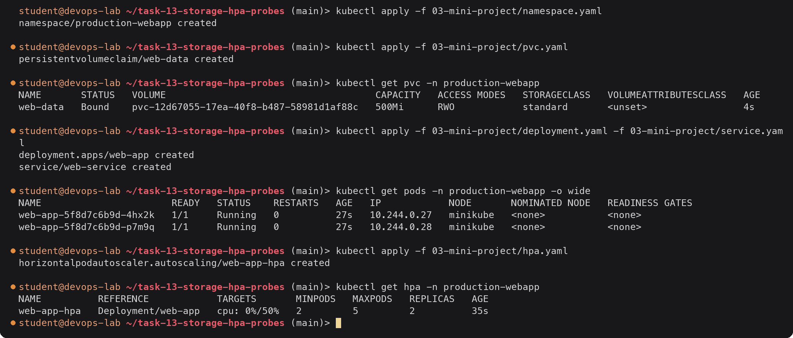

The PVC was bound immediately because the `standard` class uses `Immediate` binding. Both pods mount
the same claim; that works with `ReadWriteOnce` because RWO is enforced per node and minikube has one
node.

### 3.3 Verify the probes

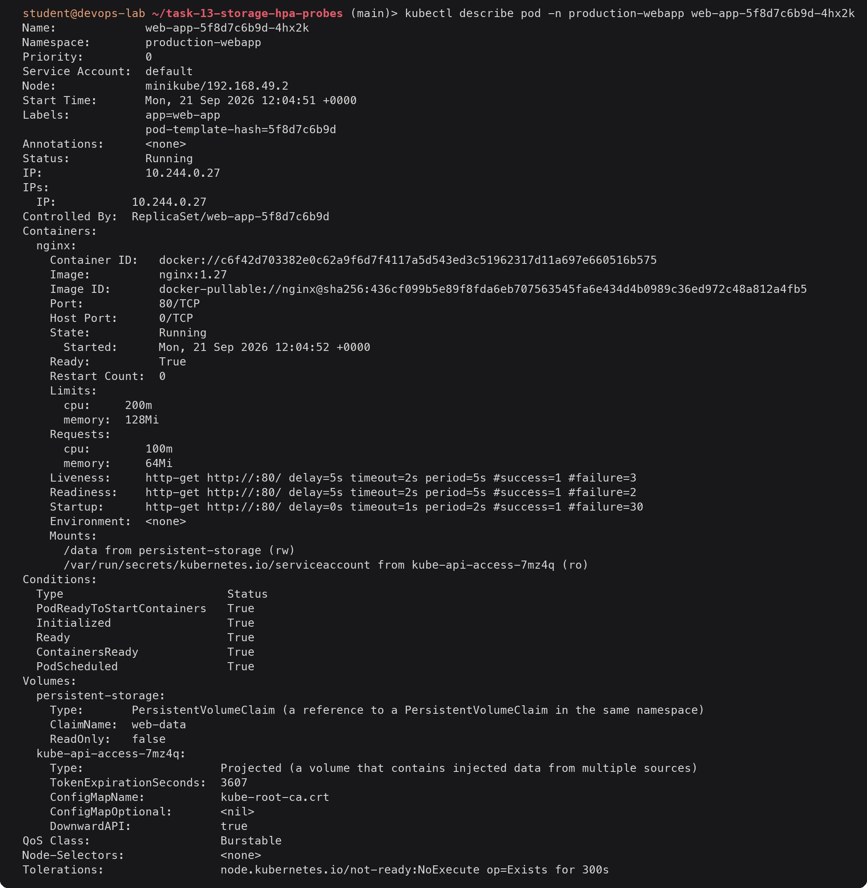

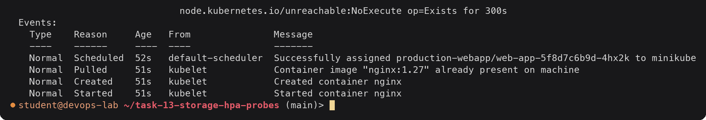

All three probes are listed with their effective settings (the startup probe shows the defaults
`delay=0s timeout=1s` for the fields I did not set). There are no `Unhealthy` events, so every probe
is passing. QoS is `Burstable` because requests are lower than limits.

### 3.4 Verify storage persistence

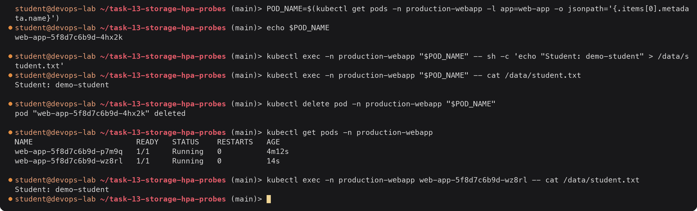

The ReplicaSet replaced the deleted pod with `wz8rl`, and the new pod reads the file that was
written by a pod that no longer exists. The data lives on the PersistentVolume, not in the pod.

### 3.5 Verify the Service

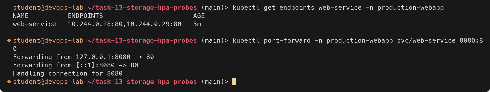

In another terminal:

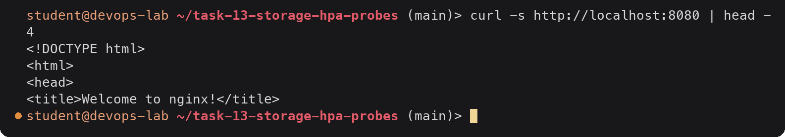

The endpoints are the two ready pods (`p7m9q` at .28 and the new `wz8rl` at .29).

### 3.6 Trigger HPA scaling

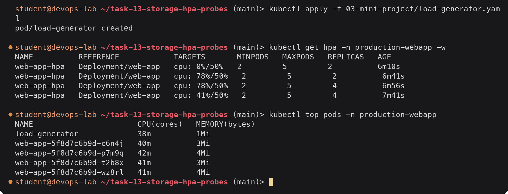

At 78% with 2 pods the HPA calculated ceil(2 x 78 / 50) = ceil(3.12) = 4 and scaled to 4. With four
pods the load spreads to about 41m each (41%), and ceil(4 x 41 / 50) = 4, so it stays at 4. The new
pods `c6n4j` and `t2b8x` only received traffic after their readiness probe passed.

Stop the load and wait for the stabilization window:

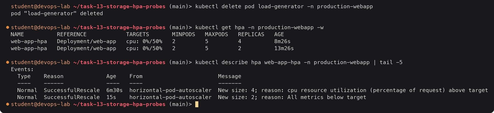

Back to `minReplicas: 2` about five minutes after the load stopped.

### 3.7 Bonus challenge: lower the HPA target to 30%

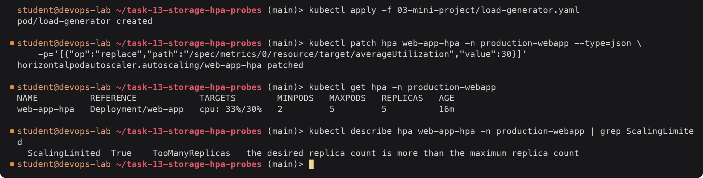

With a 30% target the same load wants ceil(4 x 41 / 30) = 6 pods, so the HPA went to the maximum of
5 and reports `TooManyReplicas`. Even at 5 pods it stays slightly above target (33%). A lower target
means earlier and bigger scale-outs, at the cost of more idle capacity. I put the original target
back and stopped the load:

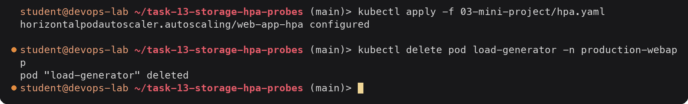

### 3.8 Bonus challenge: readiness gating

Change the readiness path to something that returns 404:

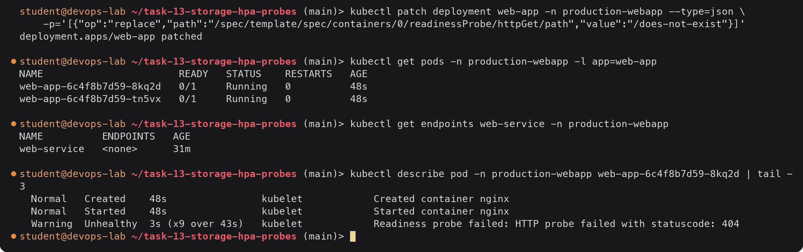

The pods are `Running` (the process is fine, liveness on `/` passes, `RESTARTS` stays 0) but `0/1`
ready, so the Service has no endpoints and every request to `web-service` would fail. Because of the
`Recreate` strategy the old, healthy pods were stopped before the new ones started, so this change
took the whole app offline. With `RollingUpdate` the rollout would have stalled with the old pods
still serving, which is one reason `Recreate` should only be used when it is really needed.

Revert:

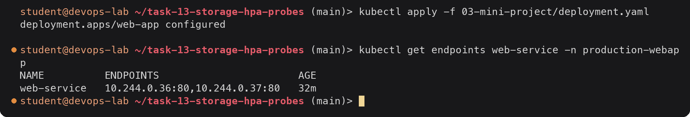

### 3.9 Bonus challenge: liveness restart loop

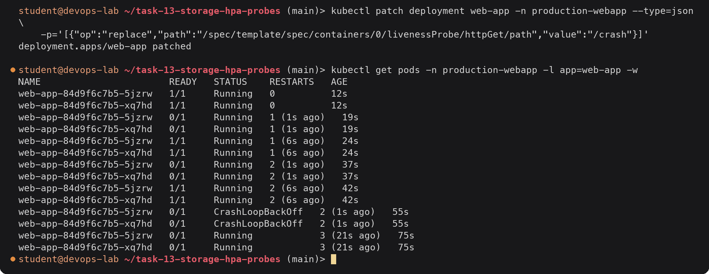

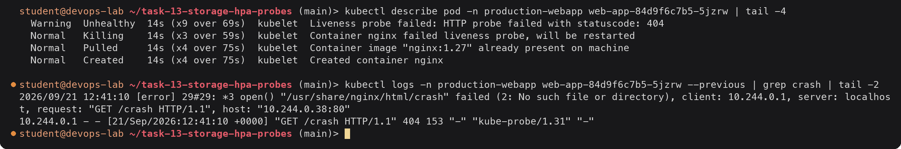

Every ~17 seconds (startup probe passes, 5s initial delay, then three failures 5s apart) kubelet
kills the container. After a few restarts the restart back-off kicks in and the pod shows
`CrashLoopBackOff` between attempts. `kubectl logs --previous` shows the probe requests from
kubelet (`kube-probe/1.31`, from the node bridge address `10.244.0.1`) getting 404. This is what a
wrong liveness probe does in production: a perfectly healthy app is restarted forever, so a
liveness probe should check only "is the process stuck", never a dependency or a page that might
not exist.

Revert and confirm everything is healthy again:

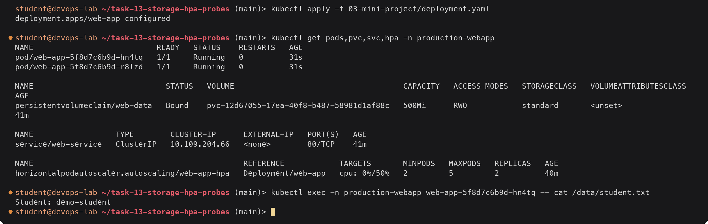

The pod template hash is back to `5f8d7c6b9d` because the template is identical to the original
one; Kubernetes reused the original ReplicaSet. The file written in 3.4 survived every rollout.

### 3.10 Troubleshooting notes from the mini project

| Issue | How it showed | Check | Cause / fix |
|---|---|---|---|
| HPA `cpu: <unknown>/50%` | First seconds after creating any HPA | `kubectl top pods` | Metrics not collected yet. Permanently `<unknown>` means metrics-server is missing or the container has no CPU request |
| PVC `Pending` | Only with `WaitForFirstConsumer` class (Task 1) | `kubectl describe pvc` | `waiting for first consumer` is normal; otherwise check `kubectl get sc` for a default class |
| Pods `0/1 Running`, no endpoints | Challenge 3.8 | `kubectl describe pod`, `kubectl get endpoints` | Readiness probe path wrong |
| Restarts climbing, CrashLoopBackOff | Challenge 3.9 | `kubectl describe pod` events, `kubectl logs --previous` | Liveness probe path wrong |

Cleanup:

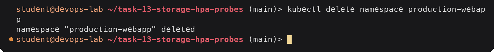

Deleting the namespace deletes the PVC, and because the `standard` class uses `Delete`, the PV and
its data on the node go with it.

---

## Deliverables checklist

- [x] Volumes documentation with YAML and output (emptyDir, hostPath, PV, PVC, StorageClass, dynamic provisioning): [`01-kubernetes-volumes/README.md`](01-kubernetes-volumes/README.md) and its YAML files (Task 1)
- [x] HPA manifest `hpa.yml` (Deployment with CPU requests, Service, autoscaling/v2 HPA): [`02-hpa/hpa.yml`](02-hpa/hpa.yml) (Task 2.3)
- [x] metrics-server enabled, HPA verified with `get hpa`, `top pods` (Task 2.2, 2.4)
- [x] Load generator, CPU increase and scale-up observed with `get hpa --watch`, `get pods`, `top pods`, `describe hpa` (Task 2.5, 2.6)
- [x] Scale-down after the load stops, with the 5 minute stabilization window explained (Task 2.7)
- [x] Mini project manifests with startup, readiness and liveness probes, PVC and HPA: [`03-mini-project/`](03-mini-project/) (Task 3)
- [x] Mini project verification: probes, storage persistence, Service, HPA scaling, bonus challenges (Task 3.3 to 3.9)
