# Kubernetes Troubleshooting

> **Note:** Command output in this file is representative expected output for the lab environment
> below, written as a learning reference. It was not captured from a live run, so IDs, timestamps
> and pod name hashes will differ when you run it yourself.

## Lab environment

| Item | Value |
|---|---|
| Host | Ubuntu 24.04 LTS, hostname `devops-lab`, user `student` |
| Shell prompt in output | `student@devops-lab:~/task-14-k8s-troubleshooting$` |
| Docker | 27.3.1 |
| Minikube | v1.34.0, docker driver, 2 CPU / 4096 MB, profile `minikube` |
| Kubernetes | v1.31.0, single node `minikube`, node InternalIP `192.168.49.2` |
| kubectl | v1.31.1 client |
| Pod CIDR / Service CIDR | 10.244.0.0/16 / 10.96.0.0/12, kube-dns ClusterIP 10.96.0.10 |
| Date of run | 2026-09-23 |

The `ingress` and `metrics-server` addons are still enabled from tasks 12 and 13.

```text
task-14-k8s-troubleshooting/
├── submission.md
├── 01-kubectl-basics/
│   ├── demo-pods.yaml               # get-demo, describe-demo, logs-demo, exec-demo, events-demo
│   └── web-deployment.yaml          # 2 x nginx, used for -o wide and scenario 5
├── 02-scenarios/
│   ├── 01-crashloopbackoff/         # broken.yaml, fixed.yaml
│   ├── 02-imagepullbackoff/         # broken.yaml, fixed.yaml  (ImagePullBackOff + ErrImagePull)
│   ├── 03-pending/                  # broken.yaml, broken-nodeselector.yaml, fixed.yaml
│   ├── 04-containercreating/        # broken.yaml, fixed.yaml
│   ├── 05-service-connectivity/     # deployment.yaml, broken-service.yaml, fixed-service.yaml
│   ├── 06-dns/                      # server.yaml, broken-client.yaml, fixed-client.yaml, dns-test-pod.yaml
│   ├── 07-pod-networking/           # broken.yaml, fixed.yaml
│   └── 08-configuration/            # broken/fixed-secret-key.yaml, broken/fixed-oomkilled.yaml
└── 03-mini-project/                 # deployment.yaml, service.yaml, broken-pod.yaml, fixed-pod.yaml, broken-service.yaml
```

The course `scenarios/` folder (the "triage gauntlet") maps onto Task 2 like this: scenario-1
crashloop is 2.1, scenario-2 imagepull is 2.2, scenario-3 pending is 2.3, scenario-4 dns-failure is
2.6, scenario-5 oomkilled is 2.8b.

---

## Task 1: kubectl troubleshooting commands

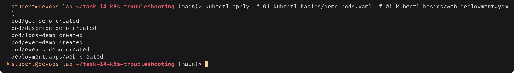

### 1.1 kubectl get

`get` lists objects with a one-line summary each. It answers "what exists and what state is it in".

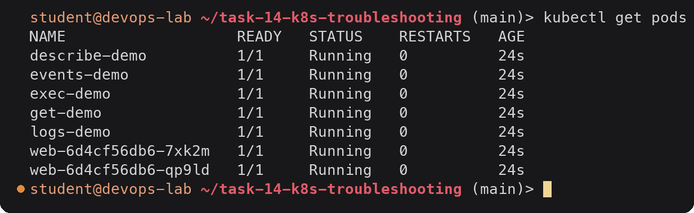

| Column | Meaning |
|---|---|
| READY | ready containers / total containers |
| STATUS | Pod phase or the reason a container is waiting (`CrashLoopBackOff`, `ImagePullBackOff`, ...) |
| RESTARTS | Container restarts, with time of the last one, e.g. `3 (40s ago)` |
| AGE | Time since the object was created |

Useful variations:

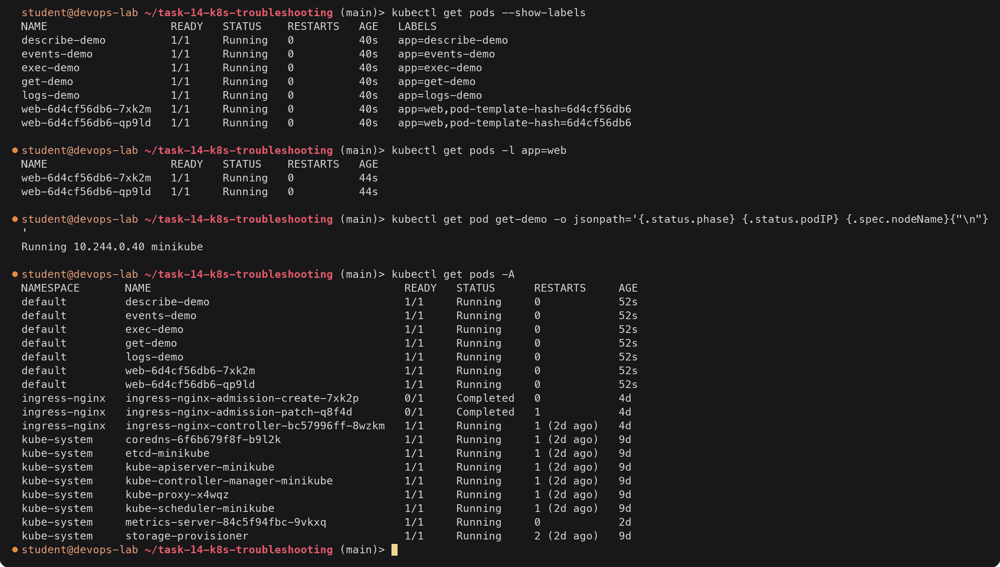

`--show-labels` is the quickest way to compare pod labels with a Service selector. `-o jsonpath`
pulls single fields for scripts. `-A` shows all namespaces, which is where control plane problems
show up (here everything is healthy; the restarts are from a host reboot two days ago).

### 1.2 kubectl get -o wide

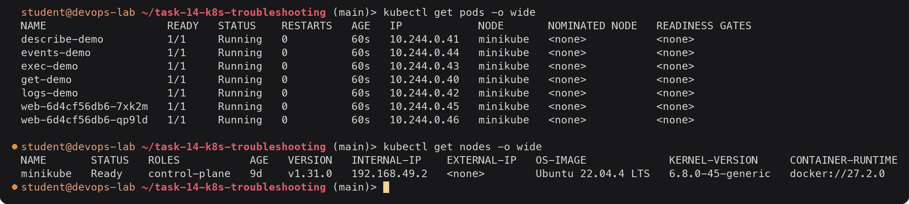

`-o wide` adds the pod IP and the node. The IP is what a Service's endpoints should list, and the
node column matters on multi-node clusters (all pods on one node, a node `NotReady`). A Pending pod
shows `<none>` as its node. For nodes it adds the IPs, OS, kernel and container runtime.

### 1.3 kubectl describe

`describe` combines the object's spec, its status and the **events** related to it into one
readable report. `get` tells you *that* something is wrong, `describe` usually tells you *why*.

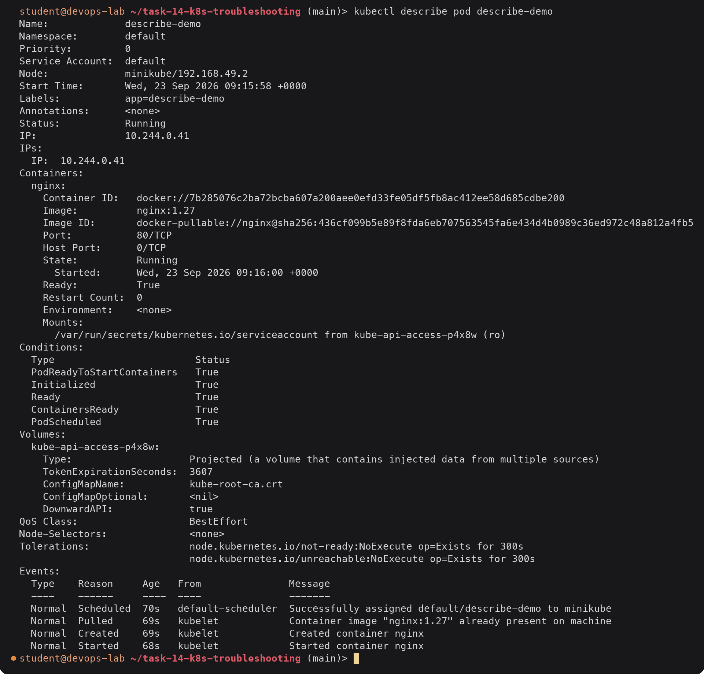

The parts I read first when something is broken:

| Section | Tells me |
|---|---|
| `Node` | Whether it was scheduled at all |
| `State` / `Last State` / `Reason` / `Exit Code` | Why a container is waiting or why it died last time (`Error`, `OOMKilled`, `Completed`) |
| `Restart Count` | Whether it is crash looping |
| `Limits` / `Requests` | Resource settings (absent here, so QoS is `BestEffort`) |
| `Liveness` / `Readiness` | Probe settings, if any |
| `Environment`, `Mounts`, `Volumes` | Which ConfigMaps/Secrets/PVCs it depends on |
| `Conditions` | Scheduled, initialized, ready |
| `Events` | Scheduler and kubelet messages: pull errors, mount errors, probe failures, back-off |

`describe` works for every object: `kubectl describe svc`, `describe node`, `describe pvc`,
`describe ingress`.

### 1.4 kubectl logs

`logs` prints what the container wrote to stdout and stderr. It answers "what does the application
itself say".

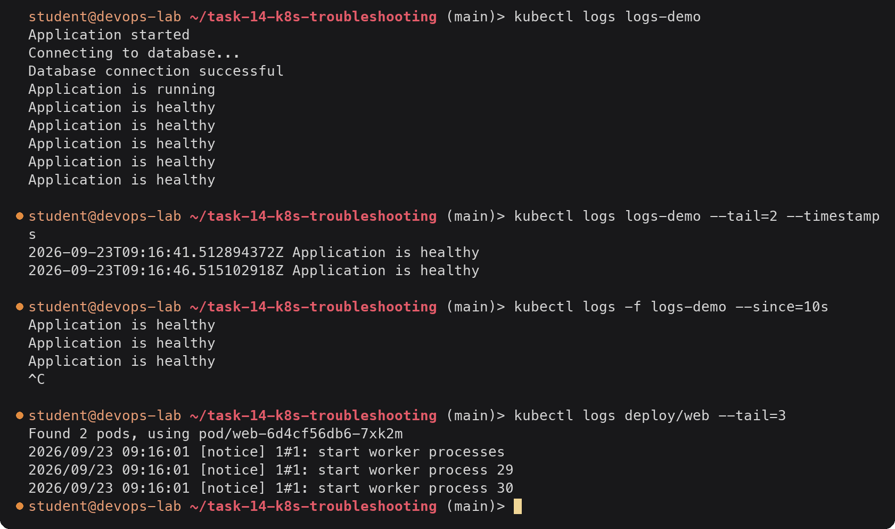

| Option | Use |
|---|---|
| `--tail=N`, `--since=10m` | Limit output |
| `-f` | Follow (stream) new lines |
| `--timestamps` | Prefix each line with the time it was written |
| `-c <container>` | Pick a container in a multi-container pod |
| `--previous` / `-p` | Logs of the **previous** container instance. Essential for `CrashLoopBackOff`, because the current instance may not have printed anything yet |
| `deploy/<name>`, `-l app=web` | Logs from a Deployment's pod or all pods with a label |

`logs` only works once a container has started. For `Pending`, `ContainerCreating` or image pull
errors there are no logs, and `describe` is the tool to use.

### 1.5 kubectl exec

`exec` runs a command inside a running container. I use it to test from the application's point
of view: is the port open, does DNS resolve, is the config file there, is the env var set.

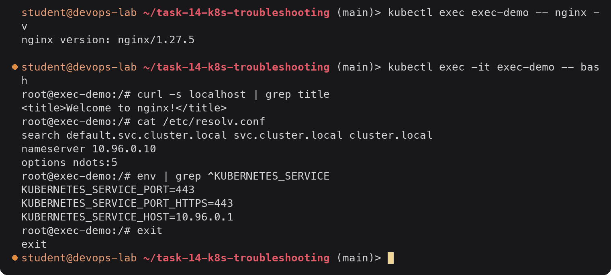

`--` separates kubectl's own flags from the command. `-it` gives an interactive terminal. Minimal
images may have no `bash` (use `sh`) or no tools at all (distroless); then
`kubectl debug -it <pod> --image=busybox:1.36 --target=<container>` attaches a temporary debug
container instead.

### 1.6 Events

Events are short-lived records (kept one hour by default) written by the scheduler, kubelet and
controllers. `describe` shows the events of one object; these commands show them across objects:

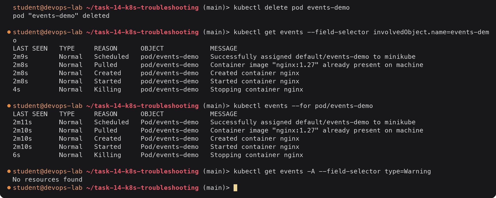

Events outlive the pod for a while, which helped here: the pod is gone but its history is still
visible. `kubectl events` (the newer command) sorts by time by default; with `kubectl get events`
add `--sort-by=.lastTimestamp`. Filtering on `type=Warning` across all namespaces is a good first
look at a cluster; empty means nothing is currently complaining.

### 1.7 kubectl explain

`explain` prints the API documentation for any field, straight from the cluster's API server, so it
matches the cluster's version. Useful when a manifest is rejected or a field does not behave as
expected.

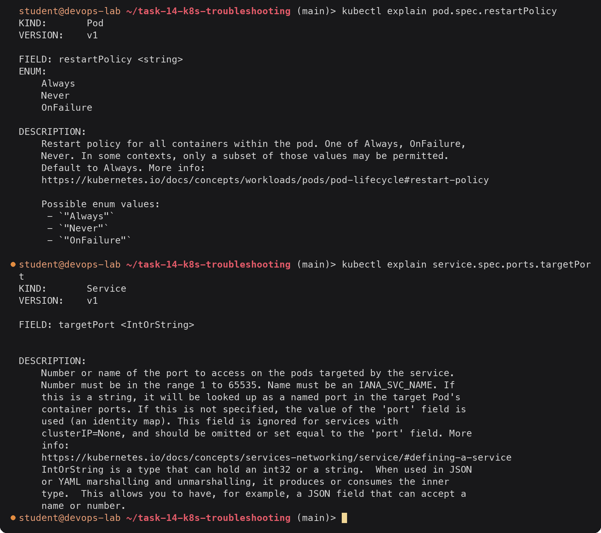

The first answers why a finished container gets restarted (default `Always`, see 2.1). The second
is exactly the field that is wrong in scenario 2.5. `kubectl explain deployment.spec --recursive`
prints the whole tree of fields.

### 1.8 kubectl top

`top` shows live CPU and memory use from metrics-server, which is needed to spot a pod near its
memory limit (OOMKilled risk), CPU throttling, or a node that is full.

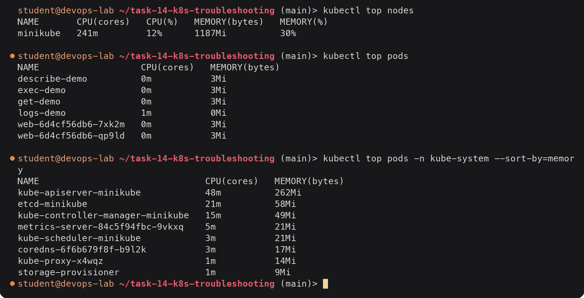

`top` shows *usage*; `describe node` shows *requests*, which is what the scheduler uses. A node can
look idle in `top` and still refuse new pods because its requests are fully booked (scenario 2.3).
`kubectl top pods --containers` breaks it down per container.

### 1.9 Order I use them in

```text
get (what/where) -> describe (why, events) -> logs (app's view, --previous) -> exec (test from inside)
                 -> events (cluster-wide) -> top (resources) -> explain (is my YAML right?)
```

Cleanup of the demo pods (the `web` Deployment stays for scenario 2.5):

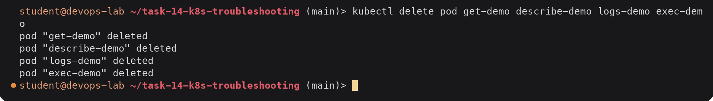

---

## Task 2: Troubleshooting scenarios

Every scenario follows the same structure: problem statement, broken YAML, identify, investigate,
root cause, fix (fixed YAML), verify.

### 2.1 CrashLoopBackOff

**Problem statement.** A Python service (course scenario-1) never stays up.

**Broken YAML** ([`02-scenarios/01-crashloopbackoff/broken.yaml`](02-scenarios/01-crashloopbackoff/broken.yaml)):

```yaml
      command:
        - "python3"
        - "-c"
        - |
          import os, sys
          db_url = os.environ.get("DATABASE_URL")
          if not db_url:
              print("[FATAL ERROR]: DATABASE_URL environment variable is MISSING!", file=sys.stderr)
              sys.exit(1)
          print("Application started successfully!")
```

**Identify**

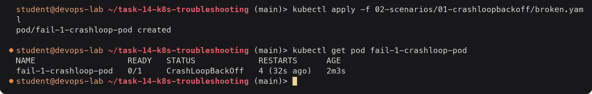

`CrashLoopBackOff` means the container starts, exits, and kubelet waits longer and longer (10s, 20s,
40s, ... up to 5 minutes) before each restart.

**Investigate**

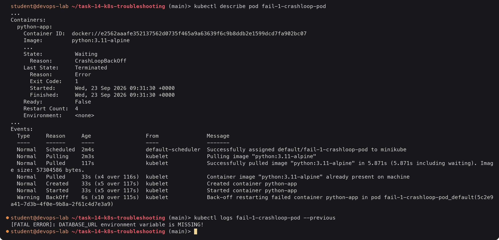

The image pulls and the container starts fine (`Created`, `Started`), so it is not an image or
scheduling problem. `Last State: Terminated, Reason: Error, Exit Code: 1`, started and finished in
the same second: the process exits immediately. `Environment: <none>` and the log line give the
reason.

**Root cause.** The application requires `DATABASE_URL` and exits with code 1 when it is missing.
The Pod spec provides no environment at all.

A second, hidden problem: even with the variable set, the original script prints "started
successfully" and then **ends**. With the default `restartPolicy: Always` (see `kubectl explain`
above) kubelet restarts a container that exits with code 0 too, so the pod would still crash loop,
just with `Last State: Completed`.

**Fix** ([`02-scenarios/01-crashloopbackoff/fixed.yaml`](02-scenarios/01-crashloopbackoff/fixed.yaml)): a ConfigMap
provides `DATABASE_URL`, and the process keeps running like a real service:

```yaml
apiVersion: v1
kind: ConfigMap
metadata:
  name: crashloop-app-config
data:
  DATABASE_URL: "postgres://demo_user@postgres-db.production.svc.cluster.local:5432/demo_db"
---
...
      envFrom:
        - configMapRef:
            name: crashloop-app-config
      command:
        - "python3"
        - "-c"
        - |
          ...
          print("Application started successfully!", flush=True)
          while True:
              time.sleep(30)
```

Environment variables of an existing Pod cannot be changed, so the Pod is recreated:

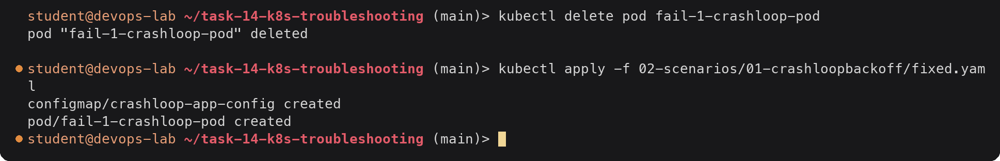

**Verify**

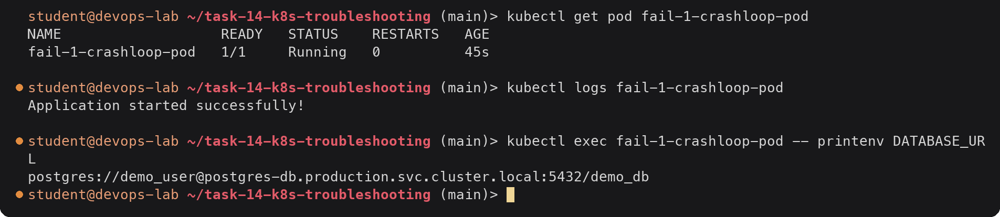

| | Before | After |
|---|---|---|
| STATUS | CrashLoopBackOff | Running |
| RESTARTS | 4 and climbing | 0 |
| Log | `[FATAL ERROR]: DATABASE_URL ... MISSING!` | `Application started successfully!` |

### 2.2 ImagePullBackOff and ErrImagePull

**Problem statement.** Two new pods never start. One uses the course image
`yatri-api-service:v999-invalid-tag-does-not-exist`, the other `nginx:this-image-does-not-exist`.

**Broken YAML** ([`02-scenarios/02-imagepullbackoff/broken.yaml`](02-scenarios/02-imagepullbackoff/broken.yaml)):

```yaml
    - name: web-app
      image: yatri-api-service:v999-invalid-tag-does-not-exist   # pod fail-2-imagepull-pod
---
    - name: app
      image: nginx:this-image-does-not-exist                      # pod image-demo
```

**Identify**

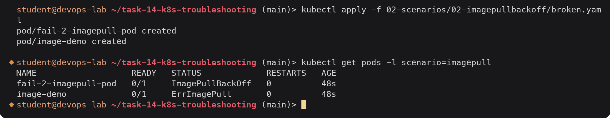

The two statuses are the same problem at different moments. `ErrImagePull` is shown right after a
pull attempt failed. kubelet then waits before retrying (back-off growing up to 5 minutes) and shows
`ImagePullBackOff` while waiting. A broken image alternates between the two.

**Investigate**

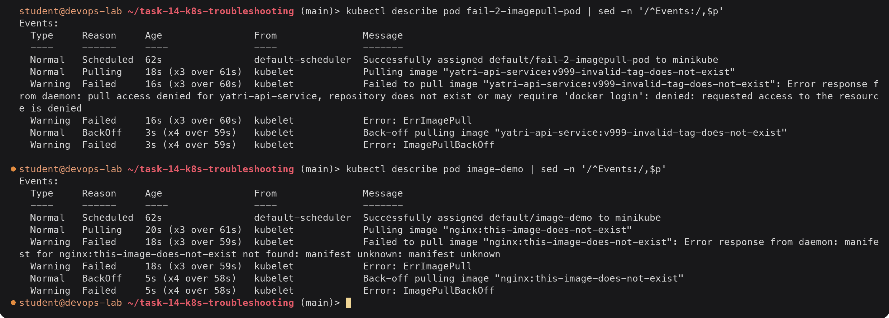

I reproduced the pull on the node to rule out anything Kubernetes specific:

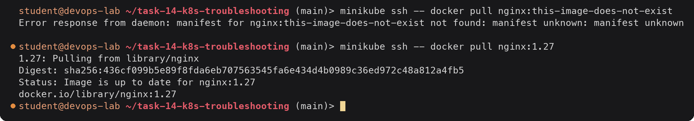

**Root cause.** The two messages point at different parts of the image reference:

| Message | Meaning | Pod |
|---|---|---|
| `manifest for nginx:... not found: manifest unknown` | Registry and repository exist, the **tag** does not | `image-demo` |
| `pull access denied ..., repository does not exist or may require 'docker login'` | The **repository** does not exist under that name (unqualified names mean `docker.io/library/...`), or it is private and needs credentials | `fail-2-imagepull-pod` |

Other causes with the same status: a private registry without `imagePullSecrets`
(`unauthorized`), a typo in the registry host (`no such host`), Docker Hub rate limits
(`toomanyrequests`), or a node without internet access (`i/o timeout`).

**Fix** ([`02-scenarios/02-imagepullbackoff/fixed.yaml`](02-scenarios/02-imagepullbackoff/fixed.yaml)): point both at an
image that exists. For the course image the real fix is the full reference of the image the team
actually pushed (for example `ghcr.io/devops-student/yatri-api-service:v1.0.0`) plus an
`imagePullSecret` if the registry is private; `nginx:1.27` stands in so the file works anywhere.

```yaml
      image: nginx:1.27
```

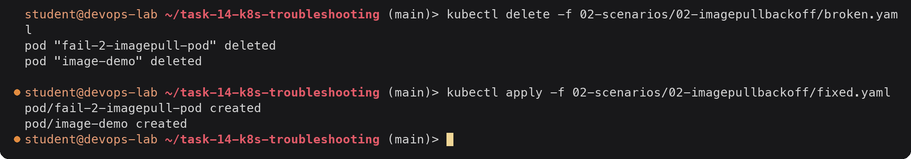

(`image` is one of the few Pod fields that can be changed in place, so
`kubectl set image pod/image-demo app=nginx:1.27` would also work.)

**Verify**

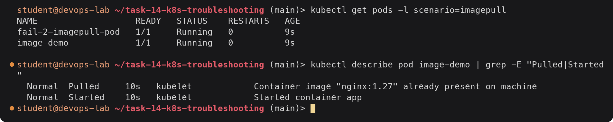

### 2.3 Pending

**Problem statement.** A pod (course scenario-3) has been `Pending` for minutes and has no IP.

**Broken YAML** ([`02-scenarios/03-pending/broken.yaml`](02-scenarios/03-pending/broken.yaml)):

```yaml
      resources:
        requests:
          cpu: "500"        # 500 whole CPUs
          memory: "1000Gi"
```

**Identify**

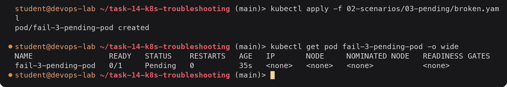

`Pending` with `NODE <none>` means the scheduler has not found a node for it. No container exists
yet, so there is nothing for `kubectl logs`.

**Investigate**

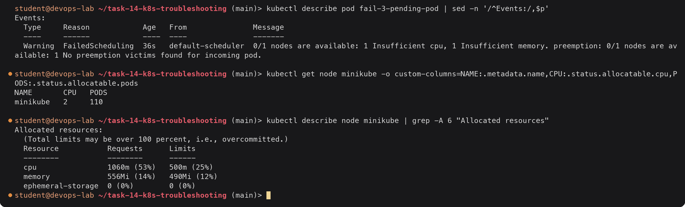

The scheduler message is precise: of 1 node, 1 has too little CPU and too little memory, and
evicting lower priority pods (preemption) would not help either. The node only has 2 CPUs in total.

**Root cause.** The requests (500 CPUs, 1000Gi memory) are larger than any node in the cluster.
The scheduler places pods by **requests**, not by real usage, so the pod can never be scheduled.

The same status with a different cause, from course `08-pending-pods`
([`broken-nodeselector.yaml`](02-scenarios/03-pending/broken-nodeselector.yaml)):

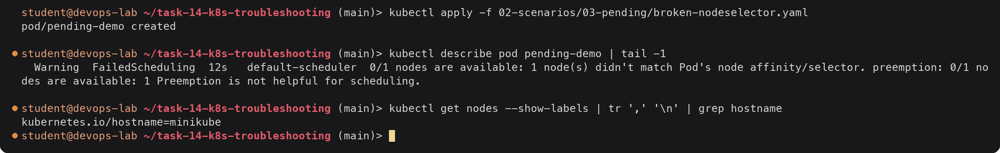

The `nodeSelector` asks for `kubernetes.io/hostname: node-that-does-not-exist`; the only node is
labelled `minikube`. Other causes of `Pending`: taints without tolerations, a PVC that cannot bind,
or too many pods on the node.

**Fix** ([`02-scenarios/03-pending/fixed.yaml`](02-scenarios/03-pending/fixed.yaml)): realistic requests, and no
impossible nodeSelector. Resources of a running pod cannot be edited here, so both are recreated.

```yaml
      resources:
        requests:
          cpu: 100m
          memory: 128Mi
        limits:
          cpu: 250m
          memory: 256Mi
```

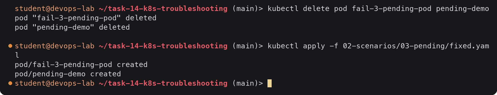

**Verify**

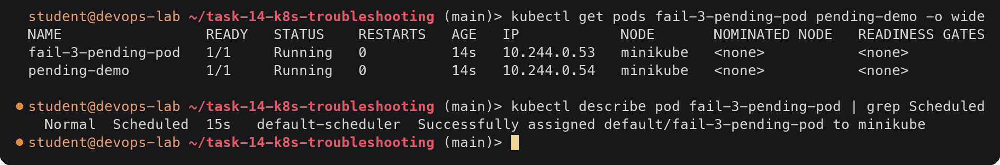

| | Before | After |
|---|---|---|
| STATUS / NODE | Pending / `<none>` | Running / minikube |
| Event | `FailedScheduling ... Insufficient cpu, Insufficient memory` | `Scheduled ... to minikube` |

### 2.4 ContainerCreating (missing ConfigMap volume)

**Problem statement.** A pod has shown `ContainerCreating` for several minutes. It is normal for a
few seconds while an image is pulled, not for minutes.

**Broken YAML** ([`02-scenarios/04-containercreating/broken.yaml`](02-scenarios/04-containercreating/broken.yaml)):

```yaml
      volumeMounts:
        - name: app-settings
          mountPath: /etc/app
  volumes:
    - name: app-settings
      configMap:
        name: app-settings      # never created
```

**Identify**

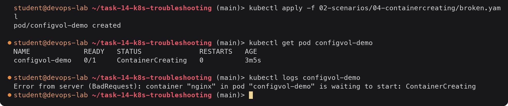

**Investigate**

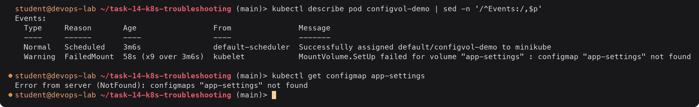

The pod was scheduled, but kubelet cannot prepare the volume, so it never creates the container.

**Root cause.** The pod mounts ConfigMap `app-settings`, which does not exist in the namespace.
For a volume (unlike `envFrom`, which gives `CreateContainerConfigError`) the symptom is a pod stuck
in `ContainerCreating` with `FailedMount` events. A missing Secret, a PVC that is not bound, or a
CSI driver that fails show up the same way.

**Fix** ([`02-scenarios/04-containercreating/fixed.yaml`](02-scenarios/04-containercreating/fixed.yaml)): create the
ConfigMap. The pod spec is unchanged, and kubelet keeps retrying the mount, so the pod does not even
have to be recreated:

```yaml
apiVersion: v1
kind: ConfigMap
metadata:
  name: app-settings
data:
  settings.ini: |
    [app]
    mode=production
    workers=2
```

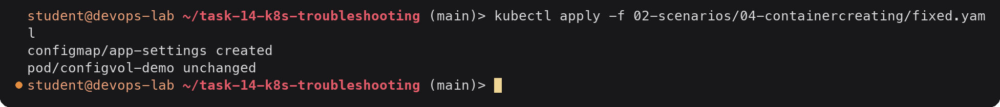

**Verify**

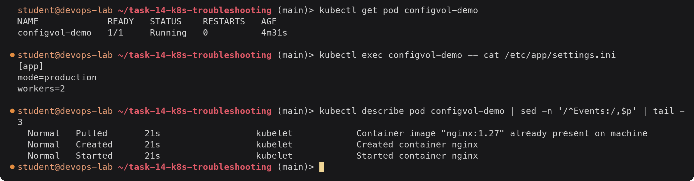

It started on the next mount retry. (If the ConfigMap is genuinely optional, `configMap.optional:
true` lets the pod start without it.)

### 2.5 Service connectivity (selector and targetPort mismatch, empty endpoints)

**Problem statement.** The `web` Deployment from Task 1 runs fine, but requests to the
`web-service` Service fail.

**Broken YAML** ([`02-scenarios/05-service-connectivity/broken-service.yaml`](02-scenarios/05-service-connectivity/broken-service.yaml)):

```yaml
spec:
  selector:
    app: web-app        # pods are labelled app: web
  ports:
    - port: 80
      targetPort: 8080  # nginx listens on 80
```

**Identify**

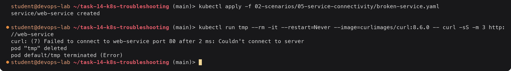

The name resolved (otherwise curl would say `Could not resolve host`), but the connection was
refused at once. kube-proxy rejects connections to a Service that has no endpoints.

**Investigate**

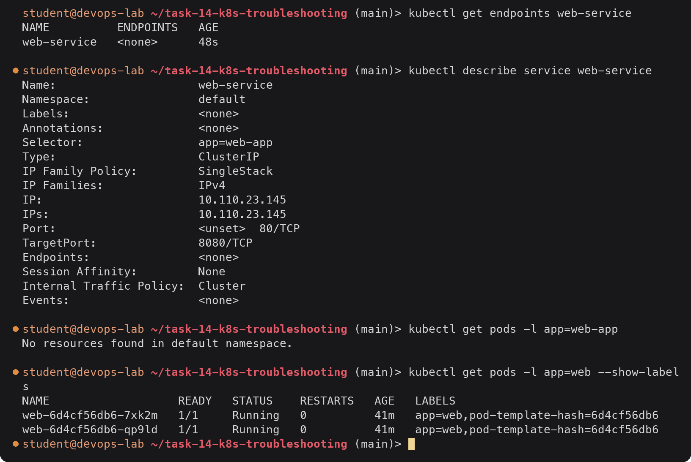

Selector `app=web-app` matches no pod; the pods carry `app=web`. That explains the empty endpoints.
I fixed only the selector first to see whether anything else was wrong:

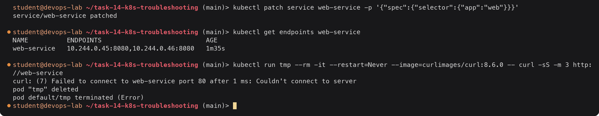

Endpoints exist now but point at port **8080**. Checking what the pods actually expose and testing
a pod IP directly:

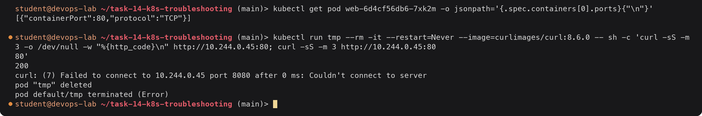

**Root cause.** Two mistakes in the Service: the selector did not match the pod labels (no
endpoints at all), and `targetPort: 8080` sent traffic to a port where nginx is not listening
(nginx listens on 80). `port` is what clients use on the Service, `targetPort` is the port on the
pod.

**Fix** ([`02-scenarios/05-service-connectivity/fixed-service.yaml`](02-scenarios/05-service-connectivity/fixed-service.yaml)):

```yaml
spec:
  selector:
    app: web
  ports:
    - port: 80
      targetPort: 80
```

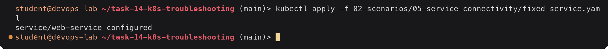

**Verify**

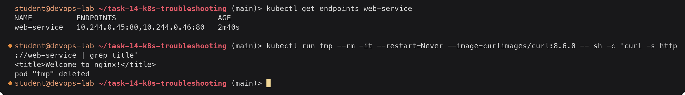

| | Before | After selector fix | After full fix |
|---|---|---|---|
| Endpoints | `<none>` | `...:8080` | `10.244.0.45:80,10.244.0.46:80` |
| curl web-service | connection refused | connection refused | nginx page |

### 2.6 DNS issue

**Problem statement.** A client pod in namespace `default` cannot reach the `orders-api` service
that the backend team deployed in namespace `production` (the same kind of failure as course
scenario-4, where the host name was simply misspelled).

**Broken YAML** ([`02-scenarios/06-dns/broken-client.yaml`](02-scenarios/06-dns/broken-client.yaml); the server is
[`02-scenarios/06-dns/server.yaml`](02-scenarios/06-dns/server.yaml)):

```yaml
      args:
        - |
          while true; do
            curl -sSf -o /dev/null --connect-timeout 3 http://orders-api && echo "OK: orders-api reachable"
            sleep 10
          done
```

**Identify**

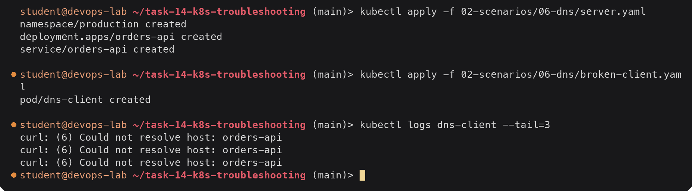

`curl: (6)` is a name resolution failure, a different layer from the `(7)` connection failures in
2.5.

**Investigate.** First, is cluster DNS itself healthy?

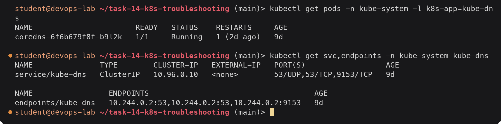

CoreDNS is running and has endpoints. Next, test lookups from inside the cluster with the course's
`dnsutils` pod:

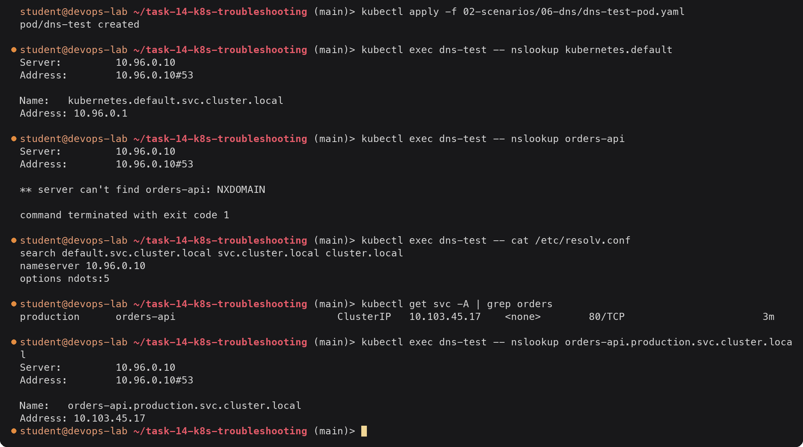

DNS works in general (`kubernetes.default` resolves) and the full name of the service resolves.
Only the short name fails. `resolv.conf` shows why: a short name is tried with the search domains
`default.svc.cluster.local`, `svc.cluster.local`, `cluster.local`, so `orders-api` becomes
`orders-api.default.svc.cluster.local`, and there is no such Service in `default`.

**Root cause.** Service DNS names are `<service>.<namespace>.svc.cluster.local`. A short name only
works inside the Service's own namespace. The client is in `default`, the Service in `production`.

**Fix** ([`02-scenarios/06-dns/fixed-client.yaml`](02-scenarios/06-dns/fixed-client.yaml)):

```yaml
            curl -sSf -o /dev/null --connect-timeout 3 http://orders-api.production.svc.cluster.local && echo "OK: orders-api reachable"
```

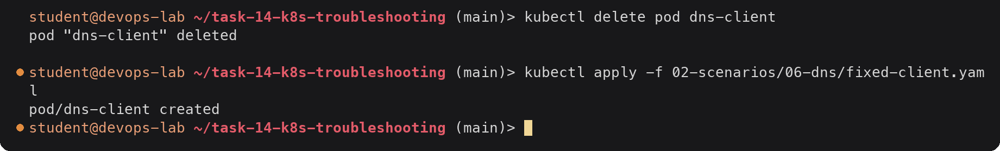

**Verify**

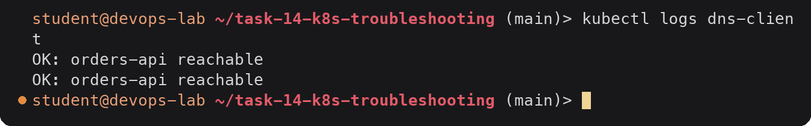

How I check DNS issues in general:

| Check | Command | Points to |
|---|---|---|
| CoreDNS running? | `kubectl get pods -n kube-system -l k8s-app=kube-dns` | CoreDNS down: nothing resolves |
| Any name resolves? | `nslookup kubernetes.default` | If this fails: CoreDNS, kube-dns Service, or network policy blocking port 53 |
| Service exists, which namespace? | `kubectl get svc -A` | Wrong namespace or misspelled name |
| Full name resolves? | `nslookup <svc>.<ns>.svc.cluster.local` | Works: client uses the wrong name |
| Pod's resolver config | `cat /etc/resolv.conf` | Custom `dnsPolicy`/`dnsConfig` |
| CoreDNS errors | `kubectl logs -n kube-system -l k8s-app=kube-dns` | Upstream (external) DNS problems |

### 2.7 Pod networking issue

**Problem statement.** The `inventory` Deployment is `Running` and `1/1` ready, its Service has
endpoints, yet every request from other pods is refused.

**Broken YAML** ([`02-scenarios/07-pod-networking/broken.yaml`](02-scenarios/07-pod-networking/broken.yaml)):

```yaml
        - name: api
          image: python:3.12-alpine
          command: ["python", "-u", "-m", "http.server", "8080", "--bind", "127.0.0.1"]
```

**Identify**

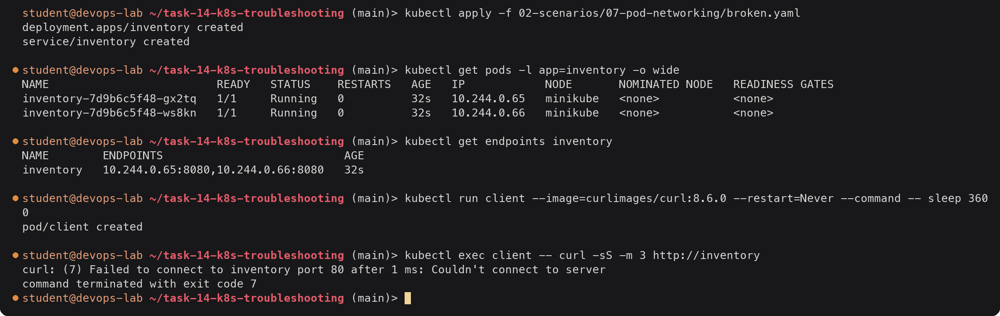

Unlike 2.5, the endpoints look correct: right pods, right port.

**Investigate.** Narrow it down, layer by layer. Is the pod network working between these two pods
at all? Try a known-good pod (nginx from `web`) and then the inventory pod IP directly, bypassing
the Service:

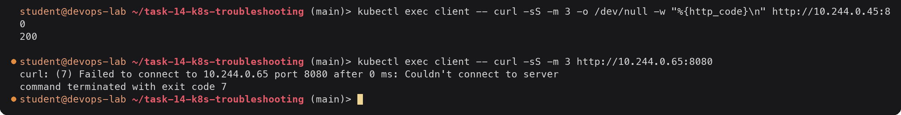

Pod-to-pod traffic works (the nginx pod answers), and the Service is not the problem (the pod IP
fails too). An immediate refusal (not a timeout) means the packet reached the pod and nothing was
listening there. Look inside the pod:

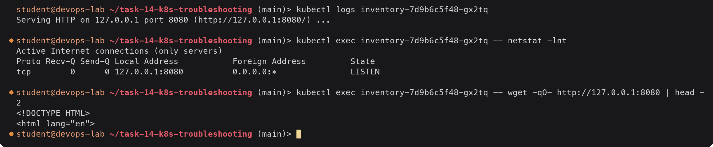

**Root cause.** The server listens on `127.0.0.1:8080`, the loopback interface inside the pod's
network namespace. It answers requests from inside the pod only. Traffic from other pods and from
the Service arrives on the pod's `eth0` address (`10.244.0.65`), where nothing listens, so the
kernel refuses it. The pods still show `1/1` because there is no readiness probe, so Kubernetes
had no way to notice.

**Fix** ([`02-scenarios/07-pod-networking/fixed.yaml`](02-scenarios/07-pod-networking/fixed.yaml)): bind to all
interfaces, and add a readiness probe so this kind of fault shows up as `0/1` next time (kubelet
probes the pod IP, so a 127.0.0.1-only server would fail it).

```yaml
          command: ["python", "-u", "-m", "http.server", "8080", "--bind", "0.0.0.0"]
          readinessProbe:
            tcpSocket:
              port: 8080
            periodSeconds: 5
```

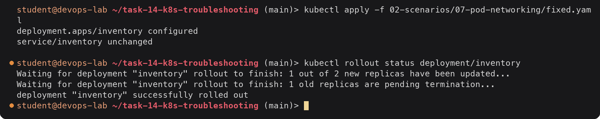

**Verify**

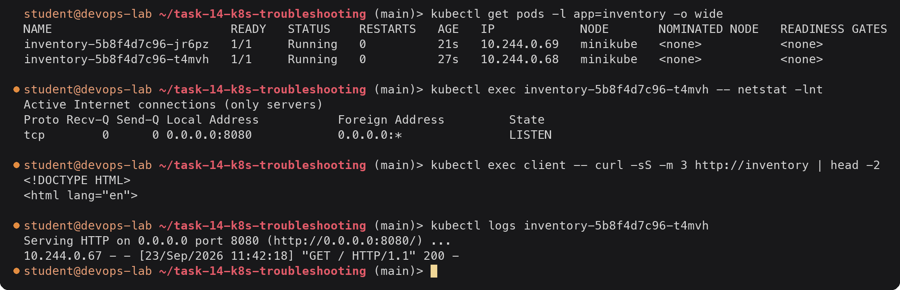

The request is logged with the client pod's IP (`10.244.0.67`). Other pod networking causes I would
check the same way: a NetworkPolicy that denies the traffic (shows as a timeout, not a refusal; on
minikube it needs a CNI that enforces policies, e.g. `--cni=calico`), the CNI or kube-proxy pods
failing on a node, or the container listening on a different port than `containerPort`/`targetPort`.

### 2.8 Configuration issues

#### a) Secret key that does not exist (`CreateContainerConfigError`)

**Problem statement.** A pod using a Secret for its database password never starts.

**Broken YAML** ([`02-scenarios/08-configuration/broken-secret-key.yaml`](02-scenarios/08-configuration/broken-secret-key.yaml),
demo values only):

```yaml
stringData:
  DB_USER: demo_user
  DB_PASSWORD: demo-password-not-real
---
        - name: DB_PASSWORD
          valueFrom:
            secretKeyRef:
              name: app-secret
              key: DB_PASS          # the key is DB_PASSWORD
```

**Identify and investigate**

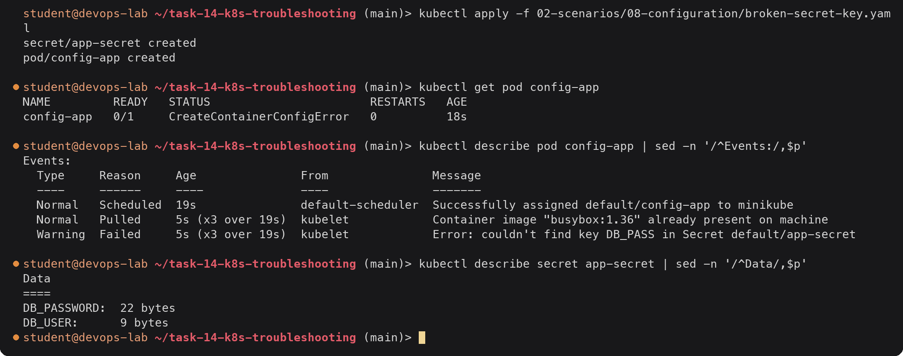

**Root cause.** The pod references key `DB_PASS`; the Secret has `DB_PASSWORD`. kubelet cannot
build the environment, so it never creates the container. (A missing ConfigMap or Secret gives the
same status with `Error: secret "..." not found`.)

**Fix** ([`02-scenarios/08-configuration/fixed-secret-key.yaml`](02-scenarios/08-configuration/fixed-secret-key.yaml)):
`key: DB_PASSWORD`. The env of a pod cannot be edited, so recreate it:

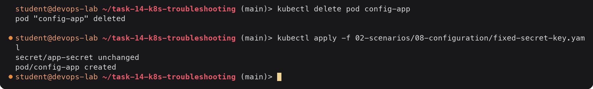

**Verify**

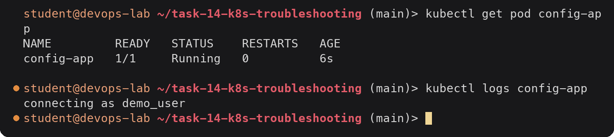

#### b) Memory limit too low for the workload (OOMKilled, course scenario-5)

**Problem statement.** A data processing pod restarts over and over and its logs are empty.

**Broken YAML** ([`02-scenarios/08-configuration/broken-oomkilled.yaml`](02-scenarios/08-configuration/broken-oomkilled.yaml)):

```yaml
        - |
          print("Allocating memory rapidly...")
          chunks = []
          for i in range(100):
              chunks.append(b"x" * (10 * 1024 * 1024))
      resources:
        limits:
          memory: "20Mi"
```

(The course comment says "200MB", but 100 chunks of 10 MiB kept in a list is about 1000 MiB.)

**Identify**

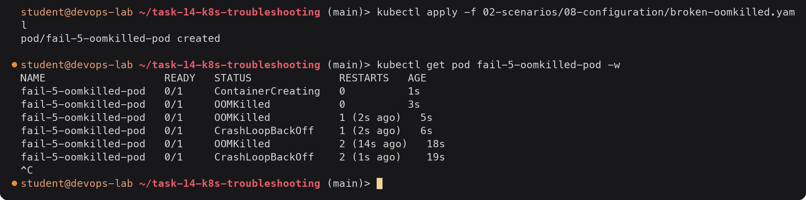

**Investigate**

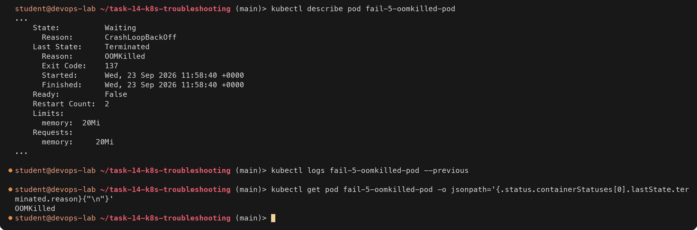

`Reason: OOMKilled`, `Exit Code: 137` (128 + signal 9, SIGKILL): the kernel killed the process for
going over the container's memory limit. The logs are empty although the script prints a line
first: Python buffers stdout when it is not a terminal, and a SIGKILL gives it no chance to flush.
`Requests` equals the limit because only a limit was set.

**Root cause.** A configuration mismatch between the workload and its resources: the code holds
about 1000 MiB in memory and the limit is 20Mi.

**Fix** ([`02-scenarios/08-configuration/fixed-oomkilled.yaml`](02-scenarios/08-configuration/fixed-oomkilled.yaml)):
fix the memory use (process one chunk at a time instead of keeping all of them), give it a limit
with headroom, flush the log lines, and since it is a run-to-completion task use
`restartPolicy: OnFailure`. Raising the limit to over 1Gi would also stop the OOM kill, but would
only hide the leak.

```yaml
  restartPolicy: OnFailure
  ...
          for i in range(100):
              chunk = b"x" * (10 * 1024 * 1024)
              total += len(chunk)
              del chunk
          print(f"Done, processed {total // (1024 * 1024)} MiB", flush=True)
      resources:
        requests:
          memory: "48Mi"
        limits:
          memory: "64Mi"
```

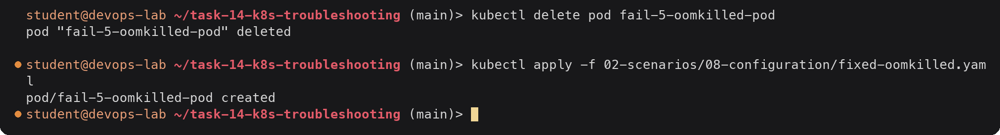

**Verify**

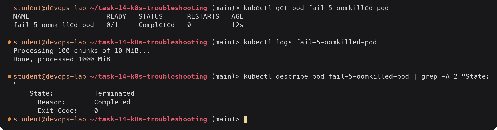

### 2.9 Summary of Task 2

| # | Status / symptom | Where the answer was | Root cause | Fix |
|---|---|---|---|---|
| 2.1 | CrashLoopBackOff | `logs --previous`, `Last State` exit code 1 | Required env var missing (and process exits) | ConfigMap + `envFrom`, keep process running |
| 2.2 | ImagePullBackOff / ErrImagePull | `describe` events | Tag (`manifest unknown`) or repository (`pull access denied`) does not exist | Correct image reference |
| 2.3 | Pending | `describe` FailedScheduling | Requests larger than the node; nodeSelector matches no node | Realistic requests, correct selector |
| 2.4 | ContainerCreating | `describe` FailedMount | ConfigMap used as volume does not exist | Create the ConfigMap |
| 2.5 | Service refuses connections | `get endpoints`, `describe svc`, `--show-labels` | Selector mismatch, wrong targetPort | `selector: app: web`, `targetPort: 80` |
| 2.6 | `Could not resolve host` | `nslookup` from a pod, `resolv.conf` | Short name used across namespaces | `<svc>.<ns>.svc.cluster.local` |
| 2.7 | Connection refused on pod IP | `netstat -lnt` inside the pod | App bound to 127.0.0.1 | Bind 0.0.0.0, add readiness probe |
| 2.8a | CreateContainerConfigError | `describe` events | Secret key name wrong | Correct key |
| 2.8b | OOMKilled, exit 137 | `describe` Last State | Memory use far above limit | Fix memory use, sensible limit |

Cleanup:

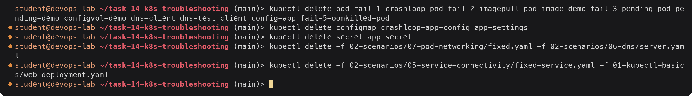

---

## Task 3: Mini project, troubleshooting challenge

The course mini project: deploy an nginx app with a Deployment and Service, check it, then
investigate a broken pod and a broken Service. Files in [`03-mini-project/`](03-mini-project/):
`deployment.yaml`, `service.yaml` and `broken-pod.yaml` are the course files; `fixed-pod.yaml` and
`broken-service.yaml` are mine.

### 3.1 Deploy the application

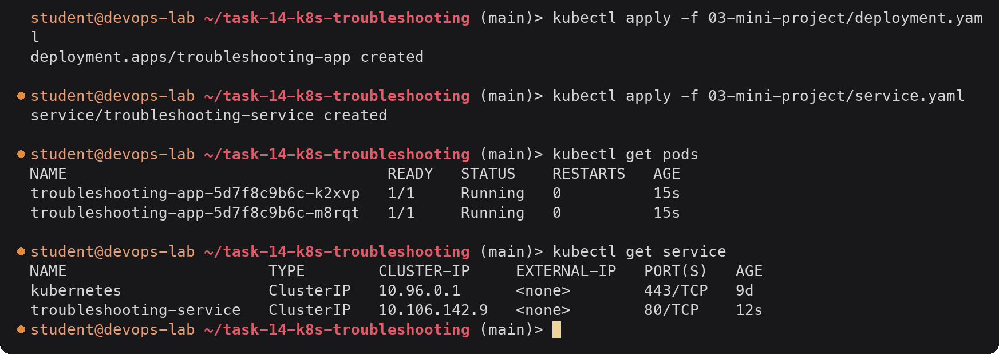

### 3.2 Check the application

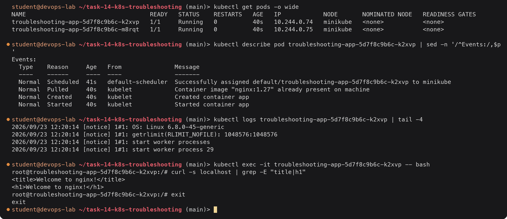

Everything is healthy: scheduled, started, nginx logs show a clean start, and nginx answers inside
the container.

### 3.3 Check the Service and endpoints

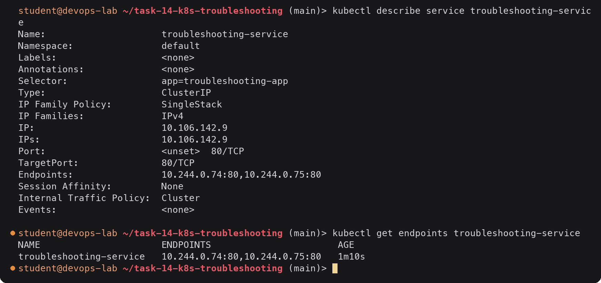

Selector `app=troubleshooting-app` matches the pod template labels, `TargetPort` 80 is nginx's
port, and the endpoints are exactly the two pod IPs from `get pods -o wide`.

### 3.4 Create the broken pod and troubleshoot it

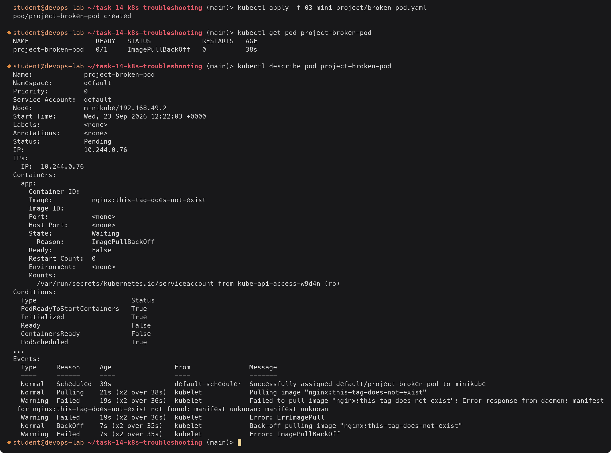

Note `Status: Pending` with an IP and `PodScheduled True`: the pod is placed and has its network
sandbox, only the container image is missing.

**Answers (course section 7):**

| Question | Answer |
|---|---|
| 1. What is the Pod status? | `ImagePullBackOff` (alternating with `ErrImagePull`); Pod phase `Pending`, `READY 0/1` |
| 2. What is the actual error? | `Failed to pull image "nginx:this-tag-does-not-exist": ... manifest for nginx:this-tag-does-not-exist not found: manifest unknown` |
| 3. Which command helped find the reason? | `kubectl describe pod project-broken-pod`, the `Events` section (`kubectl get` only shows the status) |
| 4. What is wrong with the image? | The repository `nginx` exists on Docker Hub but the tag `this-tag-does-not-exist` does not, so there is no manifest to pull |
| 5. How would you fix it? | Use an existing tag, e.g. `nginx:1.27` ([`fixed-pod.yaml`](03-mini-project/fixed-pod.yaml)), then recreate the pod (or `kubectl set image`) |

The fix:

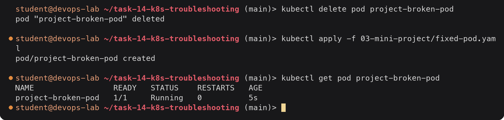

### 3.5 Service troubleshooting challenge

Break the selector ([`broken-service.yaml`](03-mini-project/broken-service.yaml) is
`service.yaml` with `app: wrong-app`):

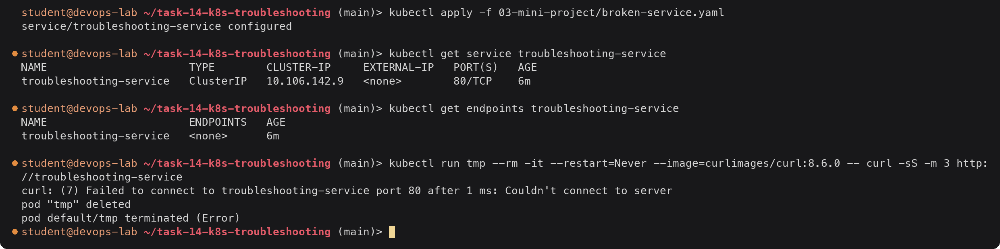

`get service` looks perfectly normal; only the endpoints reveal the problem.

### 3.6 Find the root cause

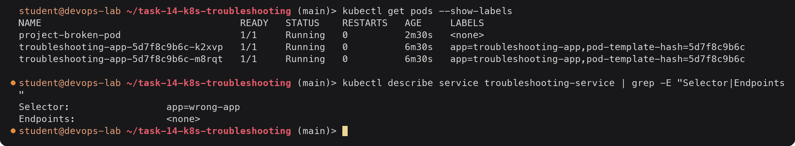

Pod label `app=troubleshooting-app`, Service selector `app=wrong-app`: no pod matches, so the
endpoints controller has nothing to add. Fix by applying the original Service:

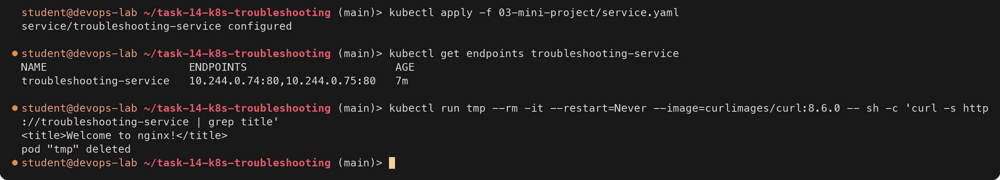

### 3.7 Final checklist run, including DNS

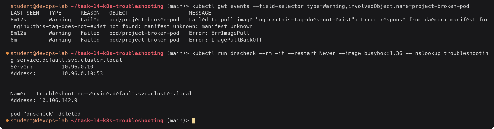

The warnings for this pod are all from before it was fixed (events stay for an hour), and the Service name resolves
to its ClusterIP `10.106.142.9`.

### 3.8 Troubleshooting table (course section 11)

| Problem | What I Saw | Command I Used | Root Cause | Fix |
|---|---|---|---|---|
| **Broken Pod** | `project-broken-pod` `0/1 ImagePullBackOff`, never started | `kubectl get pod`, `kubectl describe pod` (Events) | Container image cannot be pulled | Recreate with a valid image (`fixed-pod.yaml`) |
| **Service Problem** | Service exists with a ClusterIP, but `ENDPOINTS <none>` and connections refused | `kubectl get endpoints`, `kubectl describe service`, `kubectl get pods --show-labels` | Selector `app=wrong-app` does not match pod label `app=troubleshooting-app` | Selector back to `app: troubleshooting-app` (`service.yaml`) |
| **Image Problem** | `Failed to pull image ... manifest for nginx:this-tag-does-not-exist not found: manifest unknown` | `kubectl describe pod`, `minikube ssh -- docker pull ...` | Tag `this-tag-does-not-exist` does not exist in the `nginx` repository | Use an existing tag such as `nginx:1.27` |

### 3.9 README questions (course section 12)

1. **What does `kubectl get` tell us?** Which objects exist and a one-line state for each: for pods
   READY, STATUS, RESTARTS and AGE (plus IP and node with `-o wide`). It is the first look: is it
   there, is it running, is it restarting.

2. **What is the difference between `get` and `describe`?** `get` is a short summary (or the raw
   object with `-o yaml`). `describe` is a detailed human-readable report that also pulls in related
   information, most importantly the Events, plus container state, last termination reason, exit
   code, mounts and probe settings. `get` shows *what* is wrong, `describe` usually shows *why*.

3. **Why do we use `kubectl logs`?** To see what the application printed to stdout/stderr: stack
   traces, "missing variable", "cannot connect to database". It is the application's view, while
   events are Kubernetes' view. `--previous` shows the logs of the container that crashed.

4. **When would you use `kubectl exec`?** When the pod is running but does not behave: to check
   from inside the container whether the app listens on the expected address and port, whether DNS
   resolves, whether config files and env vars are what I expect, and whether another Service is
   reachable from there.

5. **What does `CrashLoopBackOff` mean?** The container starts and then exits (error, OOM kill or
   even a normal exit with `restartPolicy: Always`) again and again, and kubelet waits with growing
   delays (10s, 20s, 40s ... up to 5 minutes) between restarts. The cause is in the app or its
   configuration; `logs --previous` and `Last State` in `describe` show it.

6. **What does `ImagePullBackOff` mean?** kubelet failed to pull the container image
   (`ErrImagePull`) and is waiting before trying again. Causes: wrong name or tag, the repository
   does not exist, a private registry without credentials, rate limits, no network to the registry.

7. **Why can a Pod remain `Pending`?** The scheduler cannot find a node that fits: not enough
   unrequested CPU or memory, a `nodeSelector`/affinity no node matches, taints without tolerations,
   a PVC that cannot bind, or no Ready nodes. `describe pod` shows a `FailedScheduling` event with
   the exact reason.

8. **Why can a Service have no endpoints?** Its selector matches no pods (typo or label
   mismatch), the matching pods are in a different namespace, or the pods exist but are not Ready
   (failing readiness probe), in which case they are kept out of the ready endpoints.

9. **What is the relationship between a Service selector and Pod labels?** The Service selector is a
   label query. The endpoints controller continuously finds all Ready pods in the same namespace
   whose labels match the selector and puts their IPs (with `targetPort`) into the Service's
   endpoints. No match means no endpoints; there is no other link between a Service and its pods.

10. **What is Kubernetes DNS?** CoreDNS running in `kube-system` behind the `kube-dns` Service
    (10.96.0.10 here). Every pod's `/etc/resolv.conf` points at it. It gives each Service the name
    `<service>.<namespace>.svc.cluster.local` resolving to its ClusterIP (and per-pod records for
    headless Services). Short names work inside the same namespace thanks to the search domains;
    across namespaces use at least `<service>.<namespace>`.

Cleanup:

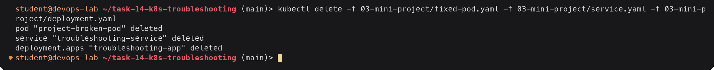

---

## Deliverables checklist

- [x] Commands with output and explanation: `get`, `get -o wide`, `describe`, `logs`, `exec`, events, `explain`, `top` (Task 1)
- [x] Problem statement, broken YAML, investigation steps, root cause, fixed YAML, verification for CrashLoopBackOff (2.1), ImagePullBackOff/ErrImagePull (2.2), Pending (2.3), ContainerCreating (2.4), Service connectivity (2.5), DNS (2.6), Pod networking (2.7), Configuration issues (2.8)
- [x] Broken and fixed manifests: [`02-scenarios/`](02-scenarios/)
- [x] Before/after output and summary table (2.1 to 2.9)
- [x] Mini project completed: deploy, check, broken pod questions, Service selector challenge, troubleshooting table, README questions answered: [`03-mini-project/`](03-mini-project/) and Task 3
