# Helm Homework: Charts, Releases, Upgrade and Rollback

> **Note:** Command output in this file is representative expected output for the lab environment
> below, written as a learning reference. It was not captured from a live run, so IDs, timestamps
> and pod name hashes will differ when you run it yourself.

## Lab environment

| Item | Value |
|---|---|
| Host | Ubuntu 24.04 LTS, hostname `devops-lab`, user `student` |
| Docker | 27.3.1 |
| Minikube | v1.34.0, docker driver, 2 CPU / 4096 MB, profile `minikube` |
| Kubernetes | v1.31.0, single node `minikube`, node InternalIP `192.168.49.2` |
| kubectl | v1.31.1 client |
| Helm | v3.16.2 |
| Pod CIDR / Service CIDR | 10.244.0.0/16 / 10.96.0.0/12, kube-dns ClusterIP 10.96.0.10 |

## Files in this folder

| Path | What it is |
|---|---|
| [`notes-chart/Chart.yaml`](notes-chart/Chart.yaml) | Chart metadata (name, chart version, app version) |
| [`notes-chart/values.yaml`](notes-chart/values.yaml) | Default (development) values: 1 replica, `nginx:1.24`, NodePort 30090 |
| [`notes-chart/values-prod.yaml`](notes-chart/values-prod.yaml) | Production overrides: 3 replicas, `nginx:1.25`, NodePort 30091 |
| [`notes-chart/templates/_helpers.tpl`](notes-chart/templates/_helpers.tpl) | Shared label helpers |
| [`notes-chart/templates/configmap.yaml`](notes-chart/templates/configmap.yaml) | App settings plus the `index.html` page nginx serves |
| [`notes-chart/templates/deployment.yaml`](notes-chart/templates/deployment.yaml) | Deployment with probes, resources and a config checksum annotation |
| [`notes-chart/templates/service.yaml`](notes-chart/templates/service.yaml) | NodePort Service |
| [`notes-chart/templates/NOTES.txt`](notes-chart/templates/NOTES.txt) | Message printed after install/upgrade |
| [`notes-chart/templates/tests/test-connection.yaml`](notes-chart/templates/tests/test-connection.yaml) | `helm test` hook that fetches the page through the Service |
| [`README.md`](README.md) | Short guide to the folder and a quick-start |

---

## Task 1: Helm commands hands-on

Helm is the package manager for Kubernetes. A **chart** is a folder of templated
Kubernetes YAML plus default values. Installing a chart creates a **release**, and every
install, upgrade or rollback of that release is stored as a numbered **revision** (Helm 3
keeps them as Secrets of type `helm.sh/release.v1` in the release namespace).

For this task I used the scaffold chart that `helm create` generates, because it is a
complete, working chart (nginx Deployment, Service, ServiceAccount and a test hook).

### helm version

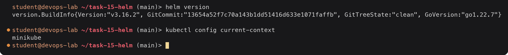

Helm talks to whatever cluster the current kubeconfig context points at, so it is worth
checking the context before installing anything.

### helm create

**What it does:** generates a new chart folder with a standard layout and a working nginx
example in the templates.

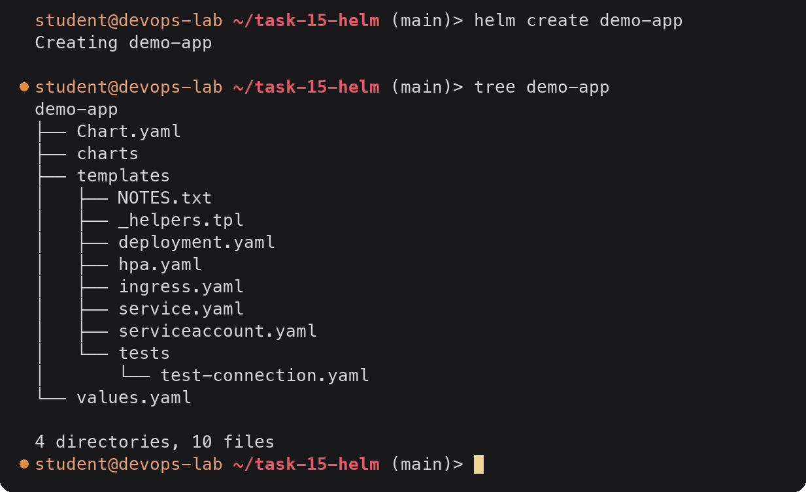

`Chart.yaml` holds metadata, `values.yaml` holds defaults, `templates/` holds the Go
templates that become Kubernetes objects, and `charts/` is where dependencies go. The
generated `values.yaml` uses `nginx` with an empty tag, so the image tag falls back to the
chart's `appVersion` (`1.16.0`). `tree` does not show the hidden `.helmignore` file.

### helm install

**What it does:** renders the chart templates with the values, sends the objects to the
cluster and records revision 1 of a new release.

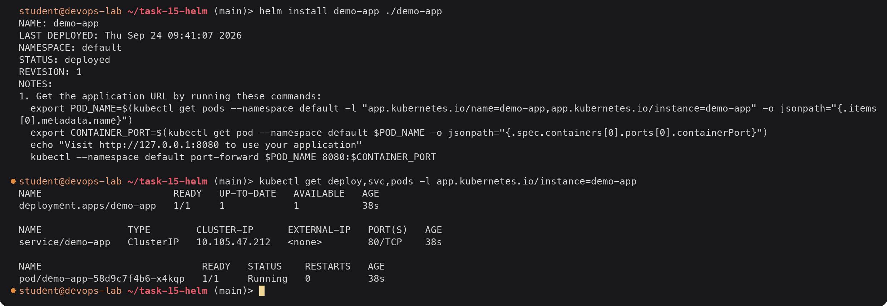

The release name `demo-app` is the first argument and the chart path is the second. The
text under `NOTES:` comes from `templates/NOTES.txt`. "STATUS: deployed" only means the
objects were accepted by the API server; it does not wait for pods unless `--wait` is
used.

### helm list

**What it does:** lists releases in the current namespace (`-A` for all namespaces).

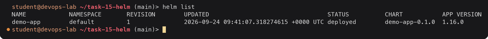

### helm status

**What it does:** shows the current state of one release and prints its notes again.

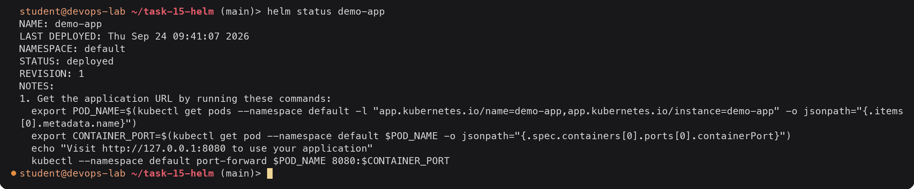

Useful when you come back to a cluster and need to know which revision is live.

### helm get values / manifest / notes / all

**What they do:** read back what Helm stored for a release. `values` shows the values the
user supplied (`--all` adds the chart defaults), `manifest` shows the rendered YAML that
was applied, `notes` shows the rendered NOTES.txt, and `all` prints everything together.

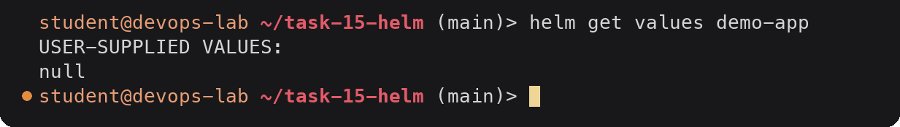

`null` because I installed with no `-f` or `--set`. Everything came from the chart
defaults.

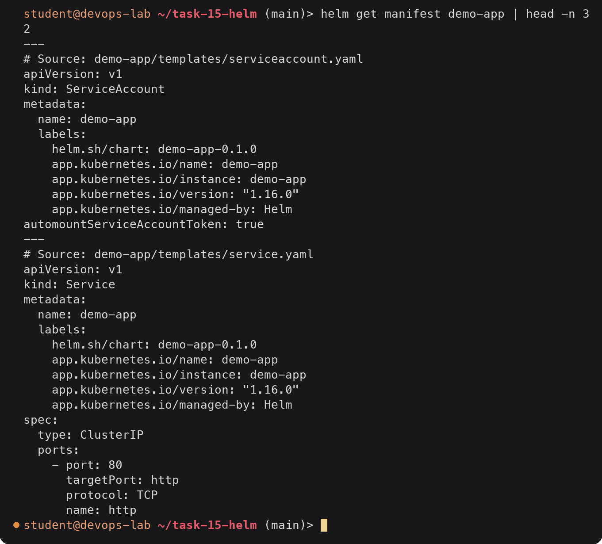

Each object is preceded by a `# Source:` comment naming the template it came from, which
makes it easy to trace a field back to the file that produced it.

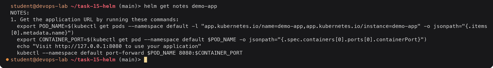

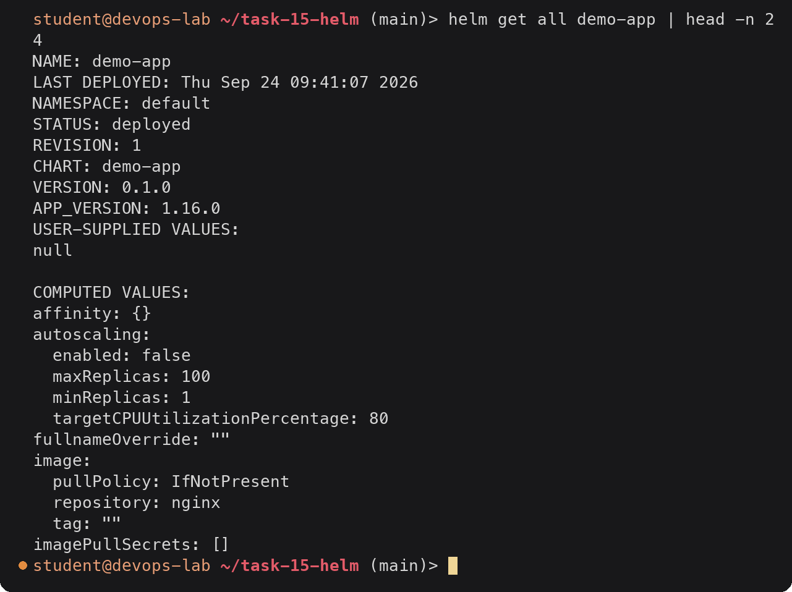

`helm get all` continues with `HOOKS:` (the test pod), `MANIFEST:` and `NOTES:`; I cut it
with `head` because it is long. `COMPUTED VALUES` is the full merged set of values the
templates actually saw.

### helm upgrade

**What it does:** renders the chart again with new values (or a new chart version) and
applies the difference, creating the next revision.

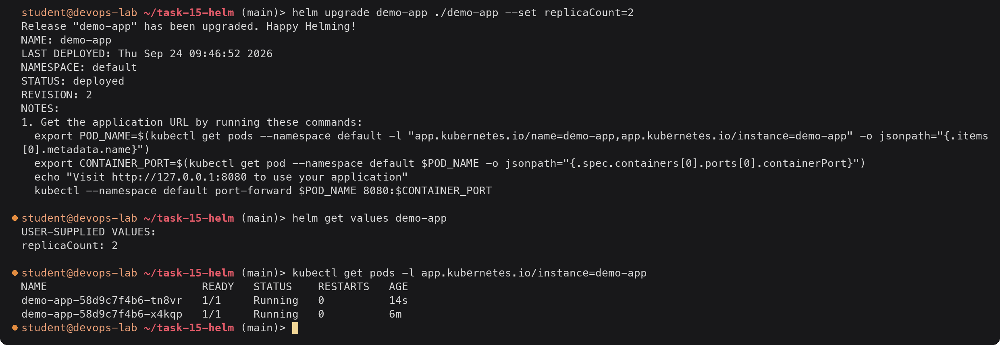

Only the replica count changed, so the pod template is identical and the existing pod
kept its name; Kubernetes just added a second pod from the same ReplicaSet.

### helm history

**What it does:** lists every stored revision of a release.

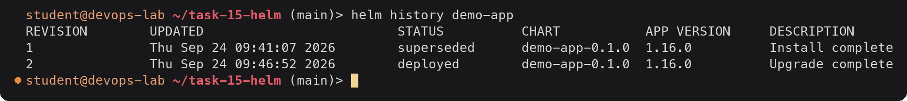

Only one revision is ever `deployed`; older ones become `superseded`.

### helm rollback

**What it does:** re-applies the stored manifest of an earlier revision. It records the
rollback as a **new** revision instead of rewriting history.

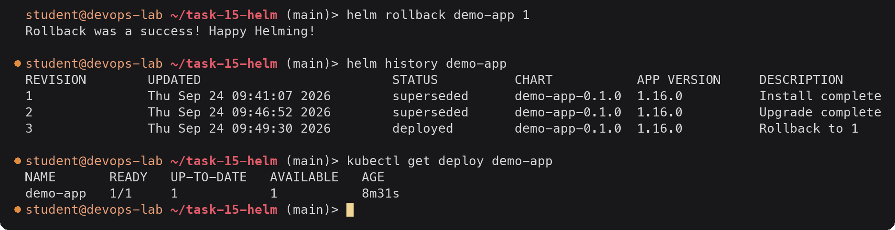

Revision 3 has the same content as revision 1, so the Deployment went back to 1 replica.
Task 2 walks through rollback in more detail.

### helm repo add / update / list

**What they do:** `repo add` registers a chart repository under a local name,
`repo update` downloads the latest index of every added repo, and `repo list` shows what is
registered.

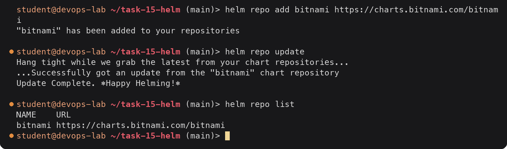

The repo index is cached under `~/.cache/helm/repository/`, so `helm search repo` works
offline after an update.

### helm search repo / hub

**What they do:** `search repo` searches the indexes of repos you have added locally;
`search hub` searches Artifact Hub, the public catalog of charts from many publishers.

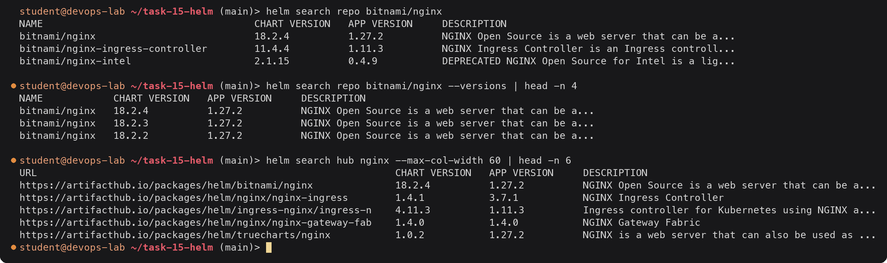

`CHART VERSION` is the version of the packaging, `APP VERSION` is the version of the
software inside it. `search hub` only finds charts; to install one you still add its repo
with `helm repo add` (or install it from an OCI registry).

### helm uninstall

**What it does:** deletes every object the release created and removes the release
records (`--keep-history` keeps the records so `helm history` still works).

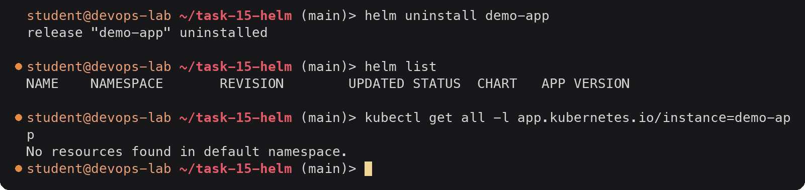

### Command summary

| Command | What it does |
|---|---|
| `helm create <name>` | Scaffold a new chart folder |
| `helm install <release> <chart>` | Create a release (revision 1) |
| `helm list [-A]` | List releases |
| `helm status <release>` | Current state and notes of a release |
| `helm get values\|manifest\|notes\|all <release>` | Read back stored values, rendered YAML, notes, or everything |
| `helm upgrade <release> <chart>` | Apply new values or chart version, next revision |
| `helm history <release>` | List all revisions |
| `helm rollback <release> <rev>` | Re-apply an old revision as a new revision |
| `helm uninstall <release>` | Delete the release and its objects |
| `helm repo add\|update\|list` | Manage chart repositories |
| `helm search repo\|hub <keyword>` | Search added repos or Artifact Hub |

---

## Task 2: Complete rollback workflow

This uses the `notes-chart` from Task 3 (folder [`notes-chart/`](notes-chart/)). The plan:

| Step | Action | Expected state |
|---|---|---|
| 1 | Install with defaults | Revision 1: `nginx:1.24`, 1 replica |
| 2 | Upgrade with `values-prod.yaml` | Revision 2: `nginx:1.25`, 3 replicas |
| 3 | Upgrade again with a tag that does not exist | Revision 3: new pod stuck in `ImagePullBackOff` |
| 4 | Roll back to revision 2 | Revision 4: `nginx:1.25`, 3 replicas, healthy |

### Step 1: Install (revision 1)

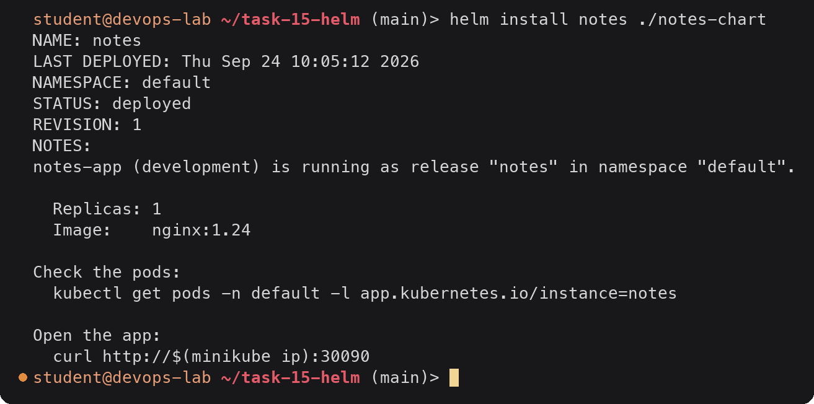

### Verify revision 1

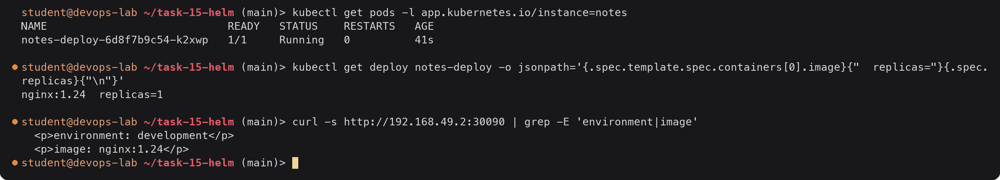

One pod running `nginx:1.24`, and the page served through the NodePort confirms the
development config.

### Step 2: Upgrade to production values (revision 2)

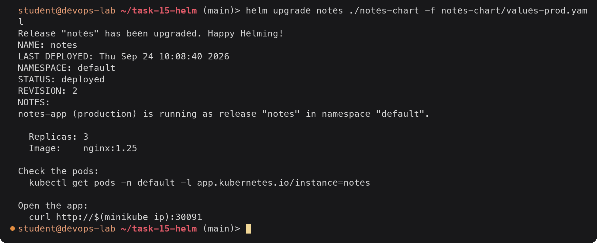

### Verify revision 2

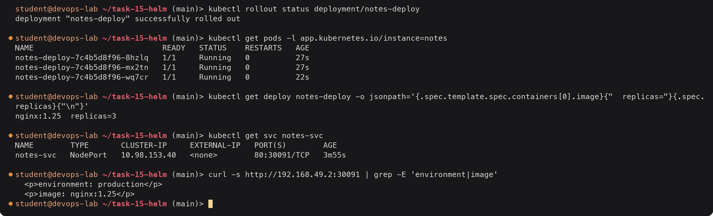

The pod-template hash changed from `6d8f7b9c54` to `7c4b5d8f96` because both the image and
the config checksum annotation changed, so all pods were replaced. The Service kept its
ClusterIP and only its NodePort moved to 30091 as set in `values-prod.yaml`.

### Step 3: Upgrade again with a bad image (revision 3)

To have something worth rolling back from, I set an image tag that does not exist. Note
the `-f notes-chart/values-prod.yaml` is repeated: `helm upgrade` starts from the chart
defaults each time, so leaving it out would also silently drop back to 1 replica.

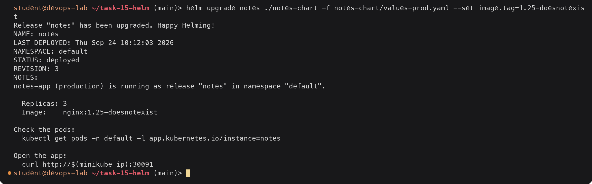

Helm reports `deployed` because, without `--wait`, it only checks that the API server
accepted the change.

### Verify revision 3

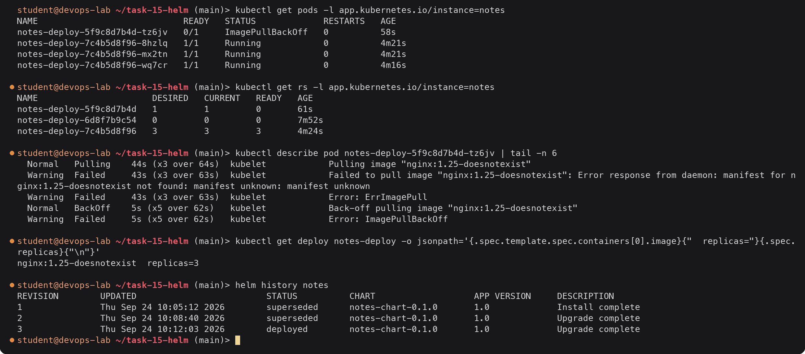

The rolling update strategy (25% max surge, 25% max unavailable, which rounds to 1 extra
pod and 0 unavailable for 3 replicas) created one new pod and then stopped, because that
pod never became ready. The three old pods are still serving, so users are not affected,
but the rollout is stuck. Helm history shows revision 3 as `deployed` even though it is
broken; Helm does not track pod health.

### Step 4: Roll back to revision 2 (creates revision 4)

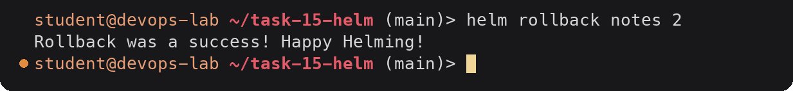

### Verify after rollback

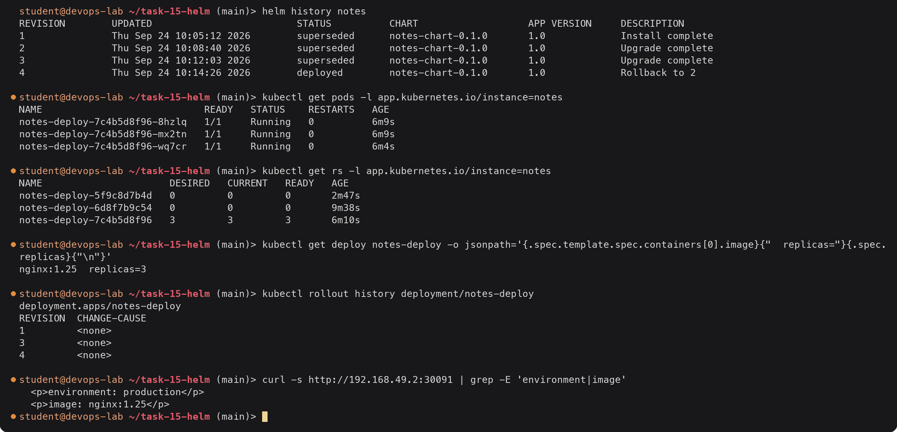

What this shows:

- `helm rollback notes 2` did not delete revision 3. It wrote **revision 4** with
  description "Rollback to 2", and revision 4 is now the deployed one.
- The image is back to `nginx:1.25` with 3 replicas, and the broken ReplicaSet was scaled
  to 0.
- The three healthy pods kept their names and ages. Revision 4's pod template is identical
  to revision 2's, so it has the same pod-template hash (`7c4b5d8f96`) and the Deployment
  simply reused that ReplicaSet instead of creating new pods.
- The Deployment's own rollout history (1, 3, 4) is separate from Helm's history (1-4).
  Kubernetes renumbers a ReplicaSet when it is reused, so its old revision 2 became 4.

The stored values show the difference between the revisions:

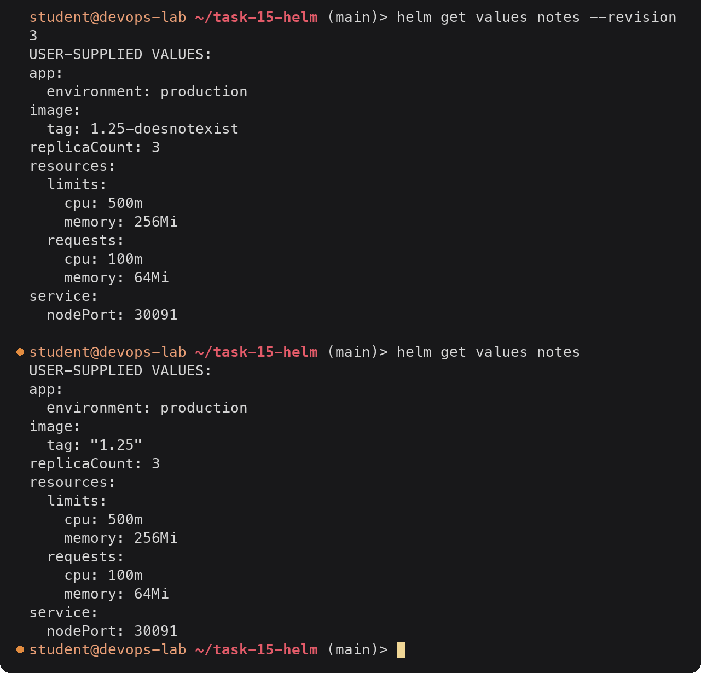

### Automatic rollback with --atomic

The broken release above sat as `deployed` until I noticed it. Adding `--wait` makes Helm
wait for pods to be ready, and `--atomic` (which implies `--wait`) rolls back by itself if
they are not ready in time:

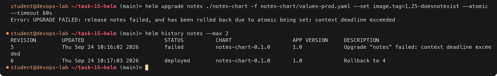

Revision 5 is marked `failed` and Helm created revision 6 by rolling back to 4. In a CI/CD
pipeline this is the safer way to upgrade.

### Clean up

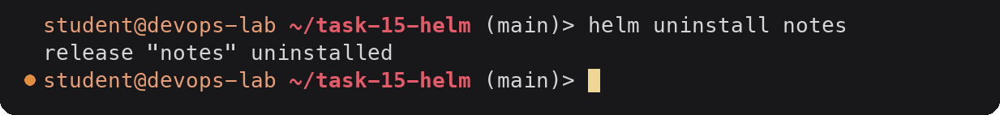

---

## Task 3: Helm mini project (notes-chart)

The course mini project packages a "Notes" web app (nginx standing in for the real app)
with dev and prod values files. I wrote the chart in [`notes-chart/`](notes-chart/) and
added a few things on top of the course version so it behaves well under upgrade and
rollback.

### Chart layout

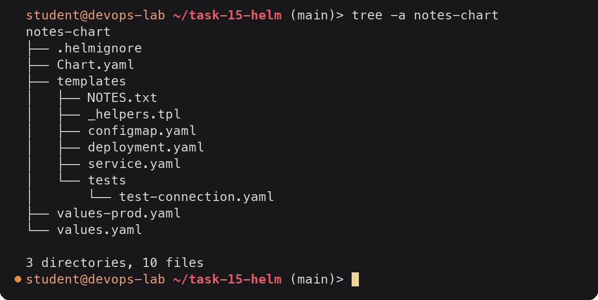

### What each part does

| File | Notes |
|---|---|
| `Chart.yaml` | `apiVersion: v2`, `name: notes-chart`, chart `version: 0.1.0`, `appVersion: "1.0"`. |
| `values.yaml` | Defaults for development: `replicaCount: 1`, `image.tag: "1.24"`, NodePort 30090, `app.environment: development`, small resource requests/limits. |
| `values-prod.yaml` | Only the keys that change for production: 3 replicas, `nginx:1.25`, NodePort 30091, `environment: production`, bigger resources. Helm deep-merges it over `values.yaml`. |
| `_helpers.tpl` | `notes-chart.selectorLabels` (name + instance, never changes) and `notes-chart.labels` (adds chart, version, managed-by, environment). |
| `configmap.yaml` | `APP_NAME` and `ENVIRONMENT` as env vars, plus an `index.html` that shows the app name, environment, release and image. |
| `deployment.yaml` | Loads the env vars with `envFrom`, mounts `index.html` over nginx's default page, has readiness and liveness probes, and a `checksum/config` annotation. |
| `service.yaml` | NodePort Service; the `nodePort` field is only set when a value is given. |
| `NOTES.txt` | Prints replicas, image and the right `curl` command after install/upgrade. |
| `tests/test-connection.yaml` | A busybox pod that fetches the page through the Service and checks the environment line. Run with `helm test`. |

Differences from the course version and why:

- **`checksum/config` annotation.** A ConfigMap change alone does not restart pods. The
  annotation is a SHA-256 of the rendered ConfigMap, so when the config changes the pod
  template changes and Kubernetes rolls the pods. It is also why the rollback in Task 2
  produced exactly the same pod-template hash as revision 2.
- **Selector labels kept separate from other labels.** A Deployment's selector is
  immutable. The `environment` label changes between dev and prod, so it is on the pods
  but not in the selector; otherwise the dev-to-prod upgrade would fail.
- **Different NodePort for prod (30091).** NodePorts are cluster-wide, so a dev and a prod
  release with the same port cannot both exist. The course used 30090 for both.
- **Probes and resources**, so `--wait`/`--atomic` have a real readiness signal and the
  pods have sensible limits.

### Step 1: Lint

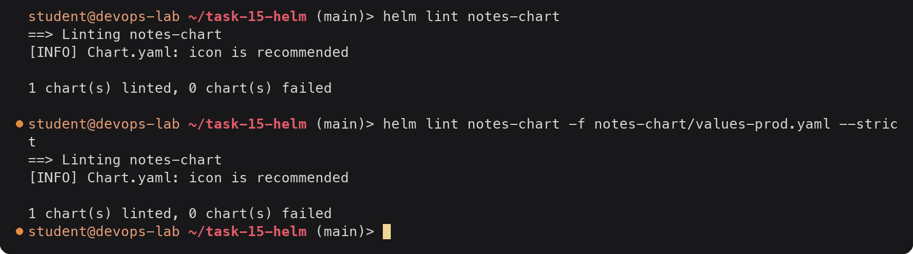

The chart passes with both values files. The only message is an informational one about
the optional `icon` field.

### Step 2: Render locally

`helm template` renders the YAML without touching the cluster, which is the quickest way
to check that every `{{ }}` was replaced correctly.

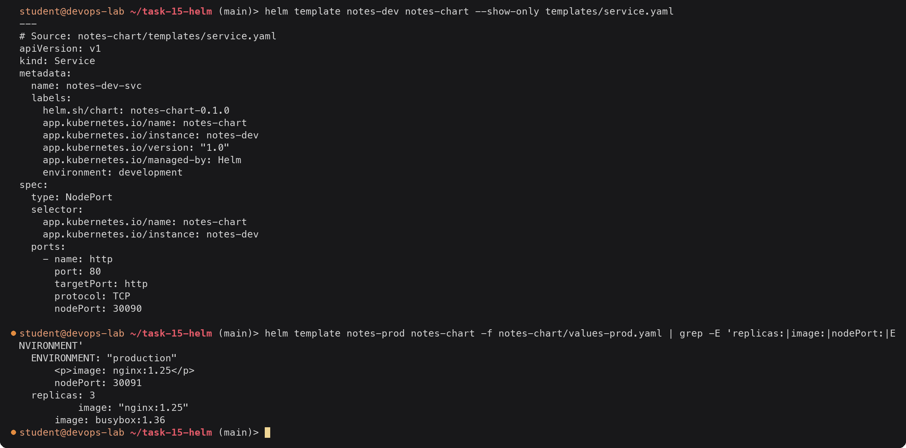

The last `image:` line is the busybox test pod; `helm template` includes hook templates.

### Step 3: Install the development release

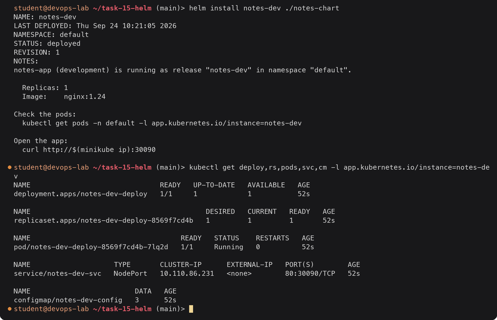

The ConfigMap has 3 keys: `APP_NAME`, `ENVIRONMENT` and `index.html`.

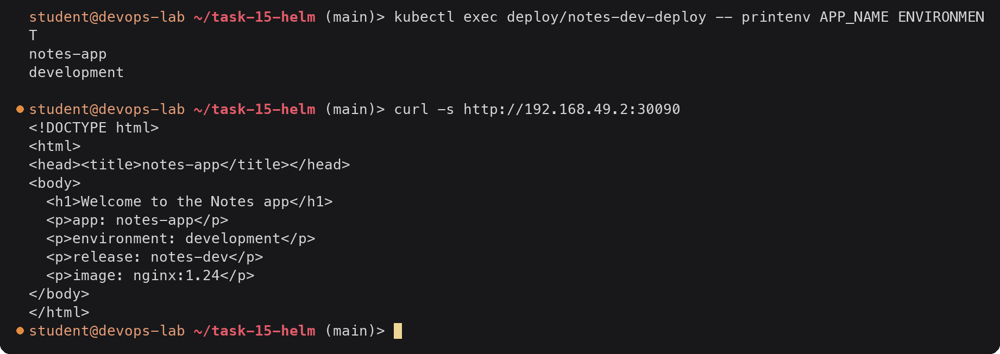

### Step 4: Install the production release in its own namespace

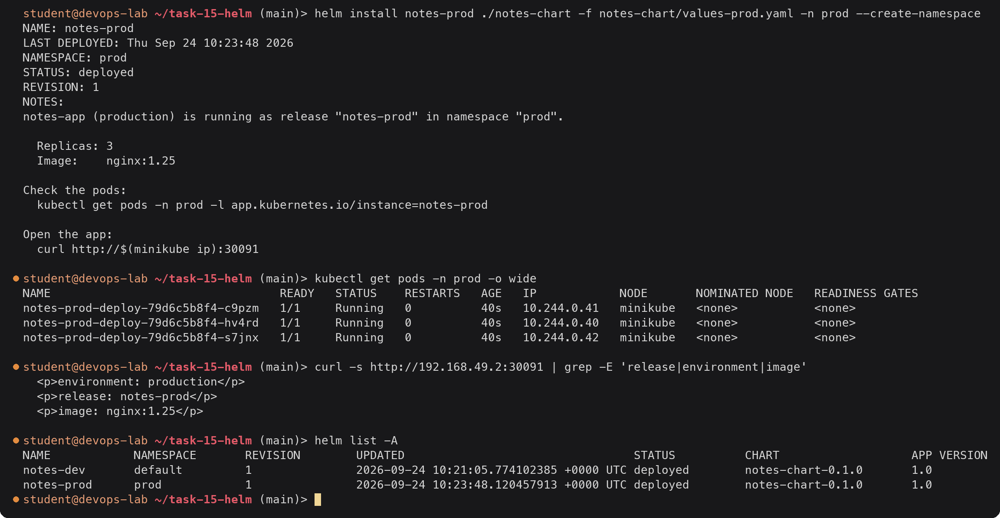

Same chart, two releases, different values: dev has 1 pod on `nginx:1.24`, prod has 3
pods on `nginx:1.25`, each with its own NodePort.

### Step 5: helm test

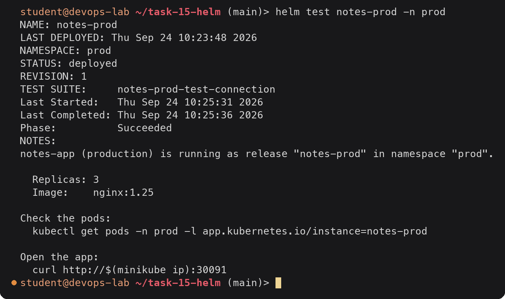

The test pod reached `notes-prod-svc` over cluster DNS and found
`environment: production` in the page, so the Service, the pods and the config all line
up.

### Step 6: Upgrade, bad upgrade and rollback on the dev release

The full workflow with verification is in Task 2. Here is the short version on
`notes-dev`, following the course steps (upgrade to prod values, break it, roll back to 2):

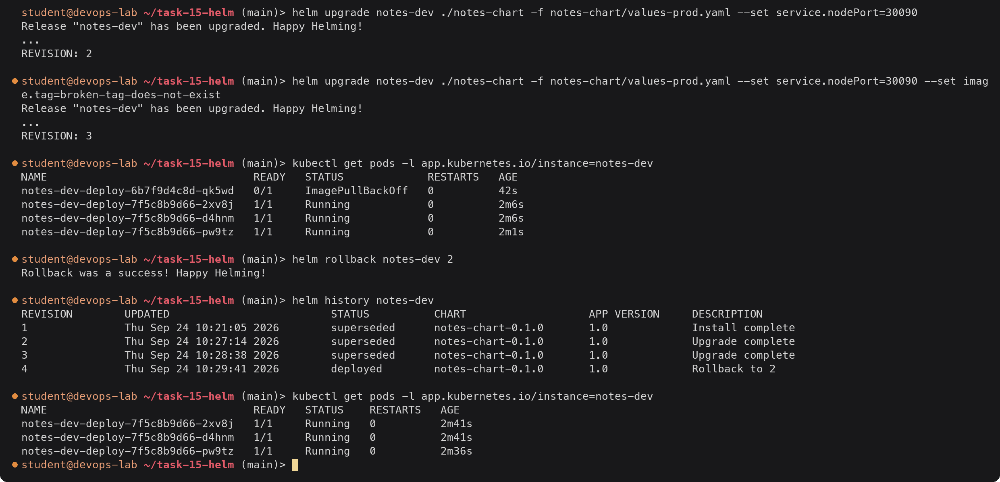

(The `...` lines stand for the same NOTES block shown earlier.) I kept the dev release on
NodePort 30090 with `--set service.nodePort=30090` so it would not collide with
`notes-prod`, which already owns 30091.

### Step 7: Clean up

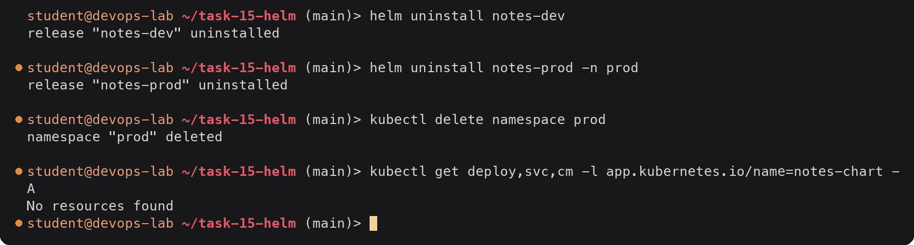

`helm uninstall` does not delete a namespace that `--create-namespace` made, so I removed
`prod` by hand.

---

## Install / upgrade / rollback quick reference

```bash
# validate
helm lint notes-chart
helm template notes notes-chart -f notes-chart/values-prod.yaml

# install (dev defaults) and preview an install without applying it
helm install notes ./notes-chart
helm install notes ./notes-chart --dry-run --debug

# upgrade; always pass the same -f files again, values are not remembered between upgrades
helm upgrade notes ./notes-chart -f notes-chart/values-prod.yaml
helm upgrade --install notes ./notes-chart -f notes-chart/values-prod.yaml   # install if missing
helm upgrade notes ./notes-chart -f notes-chart/values-prod.yaml --atomic --timeout 2m

# inspect
helm list
helm status notes
helm history notes
helm get values notes --revision 2

# roll back (creates a new revision)
helm rollback notes 2
helm rollback notes          # no number = previous revision

# remove
helm uninstall notes
```

`--reuse-values` exists to keep the previous revision's values on upgrade, but it ignores
new defaults added to the chart, so passing the values files explicitly is more
predictable.

---

## Deliverables checklist

- [x] Helm chart: [`notes-chart/`](notes-chart/) (passes `helm lint`, see Task 3 Step 1)
- [x] `values.yaml`: [`notes-chart/values.yaml`](notes-chart/values.yaml), plus [`notes-chart/values-prod.yaml`](notes-chart/values-prod.yaml)
- [x] Templates: [`notes-chart/templates/`](notes-chart/templates/) (ConfigMap, Deployment, Service, NOTES.txt, helpers, test hook)
- [x] Helm commands hands-on (create, install, list, status, get, upgrade, history, rollback, uninstall, repo, search): Task 1
- [x] Complete rollback workflow with history and kubectl image/replica verification: Task 2
- [x] Mini project completed with own chart: Task 3
- [x] Install / upgrade / rollback docs: Task 2, Task 3 and the quick reference section
- [x] README: [`README.md`](README.md)
