# CI/CD with GitHub Actions Homework

> **Note:** Command output in this file is representative expected output for the lab environment
> below, written as a learning reference. It was not captured from a live run, so IDs, timestamps
> and pod name hashes will differ when you run it yourself.

## Lab environment

| Item | Value |
|---|---|
| Host | Ubuntu 24.04 LTS, hostname `devops-lab`, user `student` |
| Docker | 27.3.1 |
| GitHub | user/org placeholder `devops-student`, repo `devops-homework` |
| Container registry | `ghcr.io/devops-student/...` |
| GitHub-hosted runner | `ubuntu-latest` (Ubuntu 24.04 image) |
| Deploy target in CD | kind cluster created inside the runner by `helm/kind-action` |

## Files in this folder

| Path | What it is |
|---|---|
| [`app/calculator.py`](app/calculator.py) | Pure calculator functions (add, subtract, multiply, divide) |
| [`app/main.py`](app/main.py) | Flask API: `/`, `/health`, `/api/<op>?a=&b=` |
| [`tests/test_calculator.py`](tests/test_calculator.py) | Unit tests for the functions |
| [`tests/test_api.py`](tests/test_api.py) | API tests using Flask's test client |
| [`requirements.txt`](requirements.txt) / [`requirements-dev.txt`](requirements-dev.txt) | Runtime deps (Flask, gunicorn) / test and lint deps |
| [`setup.cfg`](setup.cfg) | flake8 and pytest settings |
| [`Dockerfile`](Dockerfile) | `python:3.12-slim`, non-root user, gunicorn, healthcheck |
| [`.dockerignore`](.dockerignore) | Keeps tests, k8s files and caches out of the image |
| [`k8s/deployment.yaml`](k8s/deployment.yaml), [`k8s/service.yaml`](k8s/service.yaml) | Manifests the CD pipeline deploys |
| [`.github/workflows/ci.yml`](.github/workflows/ci.yml) | CI pipeline: lint, security check, tests + coverage, Docker build, artifacts |
| [`.github/workflows/cd.yml`](.github/workflows/cd.yml) | CD pipeline: push image to GHCR, deploy to a kind cluster with an environment secret, smoke test |
| [`README.md`](README.md) | Short guide and quick start |

### Where the workflow files have to live

GitHub only runs workflow files that are in `.github/workflows/` **at the root of the
repository**. A `.github` folder inside a subfolder (like this one) is ignored. This
homework repo holds many tasks, so I kept the canonical copy here next to the code and
copied both files to the repo root:

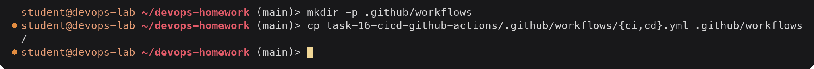

Because the code lives in a subfolder, both workflows set
`defaults.run.working-directory: task-16-cicd-github-actions` and `APP_DIR` for the
actions that take paths, and the CI trigger has a `paths:` filter so other tasks do not
start it. To use this folder as a repository of its own instead, push it as the repo root
and change `APP_DIR`, `working-directory` and the path filters to `.`.

---

## Part 1: Concepts

### CI vs CD

| | Continuous Integration (CI) | Continuous Delivery / Deployment (CD) |
|---|---|---|
| Question it answers | "Is this change good?" | "Get the good change to where it runs." |
| Triggered by | Every push and pull request | A change that passed CI (here: CI finishing successfully on `main`) |
| Typical work | Lint, unit tests, build, package | Push an image to a registry, deploy to an environment, smoke test |
| Output | Pass/fail signal, test reports, a build artifact | A running release in an environment |
| In this project | [`ci.yml`](.github/workflows/ci.yml) | [`cd.yml`](.github/workflows/cd.yml) |

**Continuous Delivery** means every passing change is ready to release, but a human may
approve the final step to production. **Continuous Deployment** means it goes out with no
manual step. My CD workflow deploys to `staging` automatically; adding "Required
reviewers" to the `staging` (or a `production`) environment in the repo settings would turn
it into delivery with an approval gate, without changing the YAML.

### CI/CD pipeline

A pipeline is the ordered set of automated stages a change passes through from commit to
running software. If a stage fails, later stages do not run, which is what keeps broken
code out of the registry and the cluster.

```text
 git push ──► CI ─────────────────────────────────────────┐
              ├─ Lint (flake8)          ┐                 │
              ├─ Security check         ├─ in parallel    │
              ├─ Test (Python 3.11)     │                 │
              ├─ Test (Python 3.12)     ┘                 │
              └─ Build Docker image  (needs all four)     │
                   └─ artifacts: test reports, image tar  │
                                                          ▼
          CD (workflow_run: CI completed with success on main)
              ├─ Build and push image to GHCR  ──► ghcr.io/devops-student/cicd-demo:sha-xxxxxxx
              └─ Deploy to staging (kind)      (environment: staging, secret APP_SECRET_KEY)
                   ├─ create kind cluster, load image
                   ├─ kubectl apply, rollout status
                   └─ smoke test (version, environment, secret flag)
```

### GitHub Actions

GitHub's built-in automation service. It watches repository events (push, pull request,
tag, schedule, manual dispatch, another workflow finishing) and runs the workflows that
listen for them on runners. Reusable building blocks are called **actions** and are used
with `uses:` (for example `actions/checkout@v5`, `docker/build-push-action@v6`).

### Key terms, and where they appear in this project

| Term | Meaning | In this project |
|---|---|---|
| **Workflow** | A YAML file in `.github/workflows/` with triggers (`on:`) and jobs | `ci.yml` (name `CI`), `cd.yml` (name `CD`) |
| **Event / trigger** | What starts a workflow | CI: `push` and `pull_request` to `main`, `workflow_dispatch`. CD: `workflow_run` of CI, `workflow_dispatch` |
| **Job** | A group of steps that runs on one runner. Jobs run in parallel unless linked with `needs:` | CI: `lint`, `security`, `test` (matrix of 2), `build` (`needs: [lint, security, test]`). CD: `build-and-push`, `deploy-staging` (`needs: build-and-push`) |
| **Step** | One command (`run:`) or one action (`uses:`) inside a job. Steps run in order and share the job's filesystem | e.g. "Install dependencies", "Run tests with coverage", "Upload test report" |
| **Runner** | The machine that executes a job. GitHub-hosted runners are fresh VMs per job; self-hosted runners are your own machines | All jobs use `runs-on: ubuntu-latest` (2 vCPU GitHub-hosted VM with Docker preinstalled) |
| **Matrix** | Runs the same job with different inputs | `python-version: ["3.11", "3.12"]` gives two test jobs |
| **Secrets** | Encrypted values exposed only to workflows, masked as `***` in logs | `GITHUB_TOKEN` (automatic, used to push to GHCR), `APP_SECRET_KEY` (environment secret on `staging`) |
| **Environment** | A named deployment target with its own secrets and optional protection rules | `environment: staging` on the deploy job |
| **Artifacts** | Files a job uploads so they survive after the runner is destroyed, downloadable from the run page or with `gh run download` | `test-report-py3.11`, `test-report-py3.12` (JUnit XML + coverage XML/HTML), `cicd-demo-image` (image tarball) |
| **Build** | Turning source into something runnable | `docker build` in CI (load only), build and push in CD |
| **Test** | Automatically checking behaviour | 17 pytest tests, coverage must be at least 90% (`--cov-fail-under=90`) |
| **Pipeline execution** | One run of a workflow, with its jobs, logs, status and artifacts | Part 4 below |

How secrets are handled here:

- `GITHUB_TOKEN` is created by GitHub for every run and expires when the run ends. The
  `build-and-push` job asks for `packages: write` with a `permissions:` block, which is all
  it needs to push to GHCR. No personal access token is stored.
- `APP_SECRET_KEY` is stored as an **environment secret** on `staging`, so only jobs that
  declare `environment: staging` can read it. The deploy job checks that it is set and
  fails early with a clear error if not, then puts it into a Kubernetes Secret. It is
  passed through `env:` rather than written inline in the script, and the app only reports
  whether a key is configured, never the value (there is a test for that).
- The workflow default is `permissions: contents: read`, and each job only raises what it
  needs.

---

## Part 2: The application

A small Flask calculator API, extending the calculator from the course's final pipeline
project with an HTTP layer so it can be deployed and smoke tested.

| Endpoint | Response |
|---|---|
| `GET /` | `{"service": "cicd-demo", "version": ..., "environment": ..., "secret_configured": ...}` |
| `GET /health` | `{"status": "ok"}` |
| `GET /api/<op>?a=<n>&b=<n>` | `op` is `add`, `subtract`, `multiply`, `divide`; 400 on bad input or divide by zero, 404 on unknown op |

`version` comes from the `APP_VERSION` build argument, which the pipeline sets to the git
commit SHA. That lets the CD smoke test prove the cluster is running the exact commit that
was tested.

### Lint and test locally

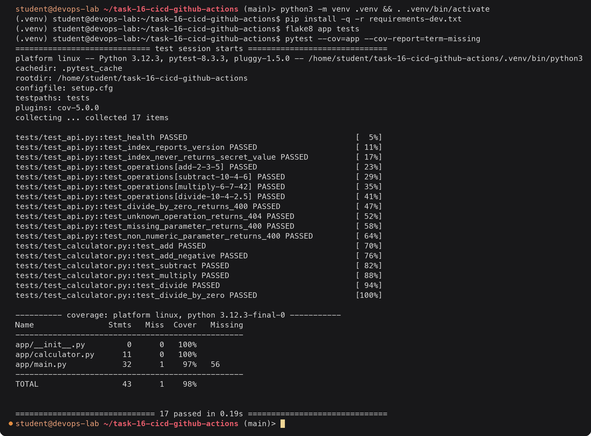

flake8 prints nothing when there are no problems. The one uncovered line is the
`app.run(...)` under `if __name__ == "__main__":`, which only runs when the file is
started directly.

### Build and run the image locally

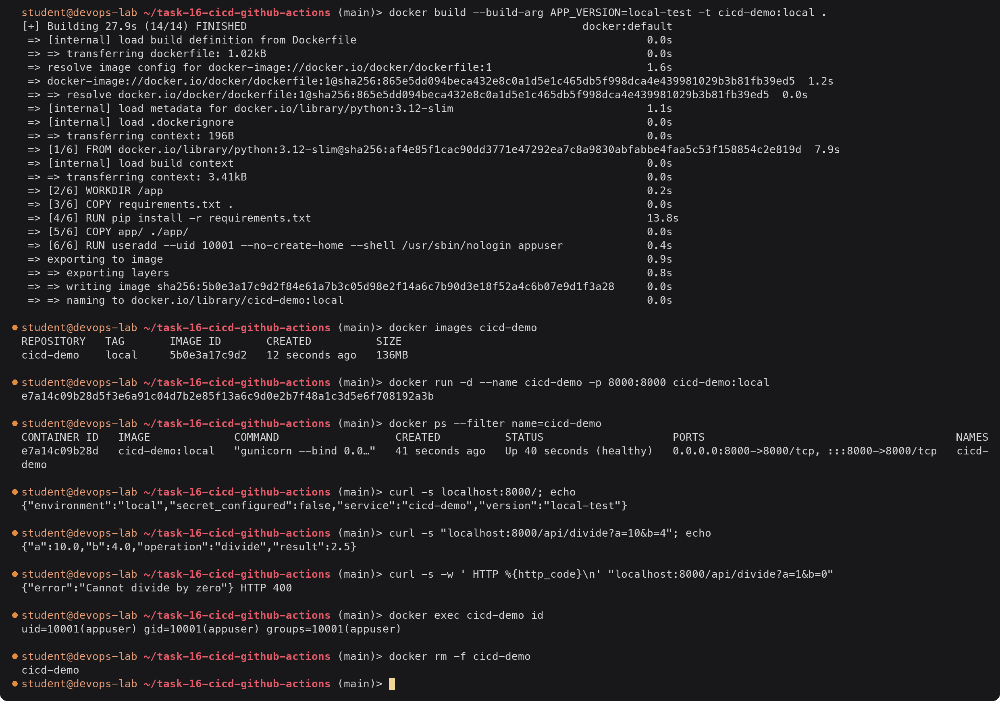

The container reports `healthy` from the Dockerfile `HEALTHCHECK`, runs as the
unprivileged `appuser`, and the version passed at build time shows up in `GET /`.

---

## Part 3: The pipelines

### CI pipeline ([`ci.yml`](.github/workflows/ci.yml))

| Job | Runs on | Depends on | What it does |
|---|---|---|---|
| `lint` | ubuntu-latest | none | Installs flake8, runs `flake8 app tests` |
| `security` | ubuntu-latest | none | Fails if `.env`, `*.pem`, `*.key` or `id_rsa*` files were committed (the course's basic check) |
| `test` (x2) | ubuntu-latest | none | Matrix over Python 3.11 and 3.12. Installs deps with pip caching, runs pytest with JUnit XML, coverage XML and HTML, fails under 90% coverage. Uploads `reports/` as `test-report-py<version>` **even if tests fail** (`if: always()`) so failures can be inspected |
| `build` | ubuntu-latest | `lint`, `security`, `test` | Builds the image with Buildx (GitHub Actions layer cache), runs it and smoke tests `/health` and `/api/add`, saves it with `docker save` and uploads it as the `cicd-demo-image` artifact, writes a job summary |

Other details:

- `concurrency: ci-${{ github.ref }}` with `cancel-in-progress: true` cancels an older CI
  run on the same branch when a newer commit is pushed.
- `fail-fast: false` on the matrix lets both Python versions finish so I can see if a
  failure is version specific.
- CI never pushes anything, so it is safe to run on pull requests from forks.

### CD pipeline ([`cd.yml`](.github/workflows/cd.yml))

| Job | Depends on | What it does |
|---|---|---|
| `build-and-push` | CI succeeded on a push to `main` (or manual dispatch) | Checks out the exact commit CI tested (`workflow_run.head_sha`), logs in to `ghcr.io` with `GITHUB_TOKEN`, builds and pushes `ghcr.io/<owner>/cicd-demo:sha-<7 chars>` and `:latest`, with OCI labels linking the package to the repo |
| `deploy-staging` | `build-and-push` | Runs in the `staging` environment. Verifies `APP_SECRET_KEY` exists, creates a kind cluster with `helm/kind-action`, pulls the image from GHCR and loads it into kind, creates the `cicd-demo-secret` Kubernetes Secret, applies `k8s/` with the new image, waits for the rollout, smoke tests through `kubectl port-forward` (checks version = commit SHA, environment = staging, secret configured), dumps pod details if anything fails |

Why `workflow_run` instead of putting everything in one file: CD only starts after the
whole CI workflow has finished successfully, CI stays free of registry write permissions,
and the two can be re-run independently. The `if:` on `build-and-push` also checks
`workflow_run.event == 'push'` so a CI run for a pull request never deploys.

The kind cluster lives only for the duration of the job, so this is a real Kubernetes
deploy (real Deployment, Secret, Service, rollout and probes) without needing a cluster
reachable from the internet. For a real staging cluster the kind step would be replaced by
a kubeconfig stored as an environment secret.

### Repository setup

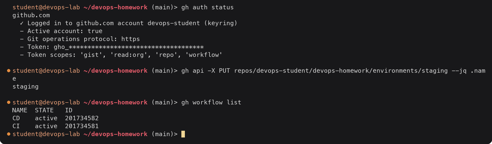

The `workflow` token scope is needed to push changes to files under `.github/workflows/`.
`gh workflow list` confirms GitHub picked both files up from the repo root. The
`APP_SECRET_KEY` secret is deliberately not set yet; the first CD run shows what happens.

---

## Part 4: Pipeline execution

This is the console view of the runs (in place of browser screenshots). Three pushes to
`main` were made:

1. `Add cicd-demo app with CI and CD workflows`: CI passes, CD fails on the missing secret,
   the secret is added and the failed job re-run.
2. `Break add() to check the CI gate`: `add()` changed to `return a + b + 1`. CI fails, the
   Docker build is skipped and CD does not deploy.
3. `Fix add() after the CI gate test`: CI passes and CD deploys.

### Output: all runs

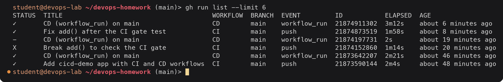

`✓` is success, `X` failure and `-` skipped. Every CI run was followed by a CD run, but
the one after the failed CI was skipped by the `if:` condition, so the broken commit never
reached the registry or the cluster. The `CD` title comes from `run-name:` in `cd.yml`.

### Output: first CD run, missing secret, re-run

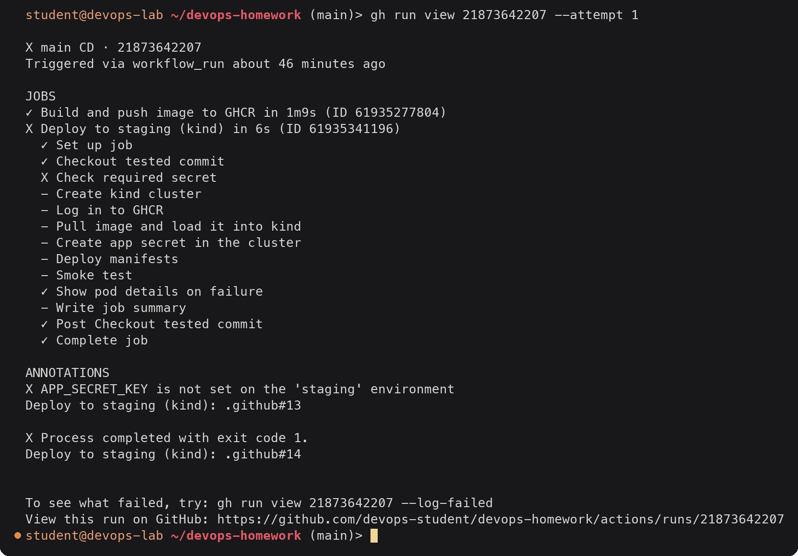

The deploy job stopped at the secret check before creating anything. The failure-only step
still ran (its commands are `|| true` because there is no cluster yet). Then I added the
secret to the `staging` environment and re-ran only the failed job:

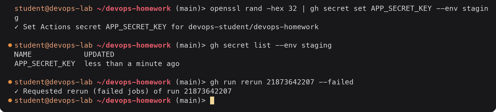

Piping the value in means it never appears in the shell history. GitHub does not show the
value again after it is saved; `gh secret list` only shows the name and update time.

### Output: CI run (success)

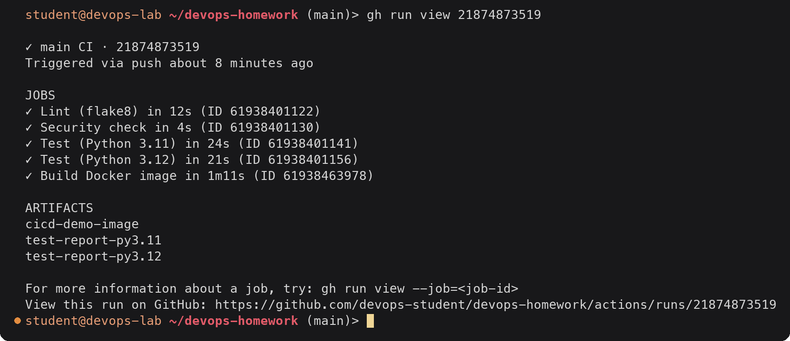

The four independent jobs ran at the same time on separate runners; `Build Docker image`
started only after all of them passed, which is why the whole run (1m58s) is roughly the
slowest test job plus the build.

Steps of one test job and of the build job:

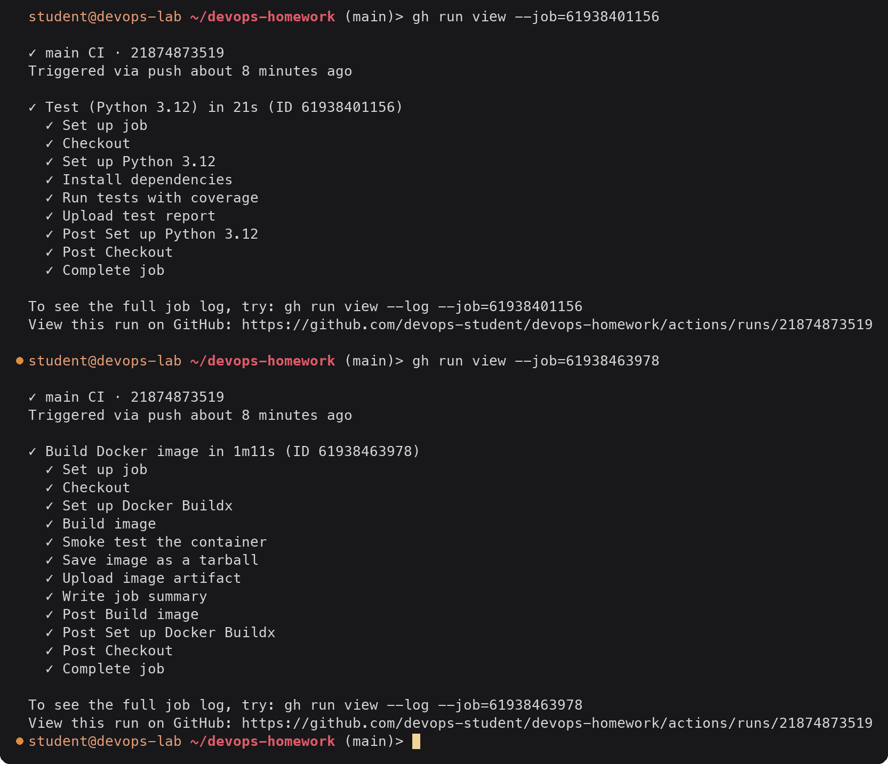

`Set up job` and `Complete job` are added by the runner, and the `Post ...` steps are
cleanup hooks of the actions used earlier (for example `setup-python` saving the pip
cache).

The test step's log, with the runner's timestamps. `gh run view --log` prints
`job<TAB>step<TAB>timestamp line`, so I filter on the step name, keep the third field and
drop the `##[group]` block where the runner echoes the script:

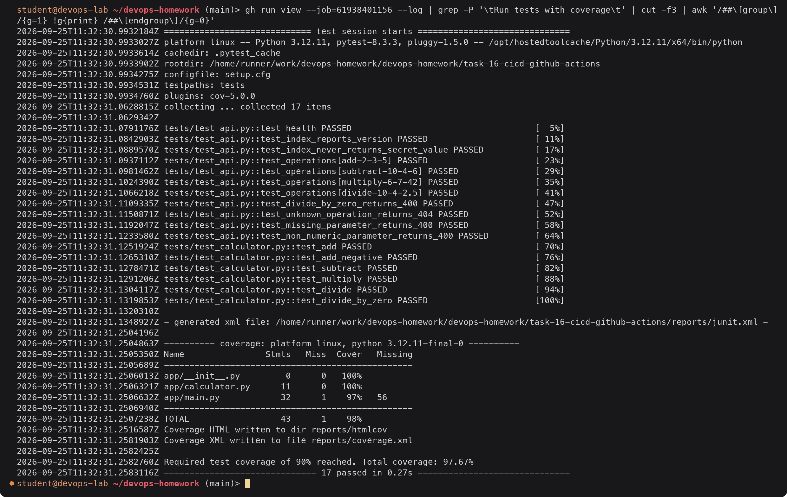

The build job's smoke test, run against the freshly built image on the runner:

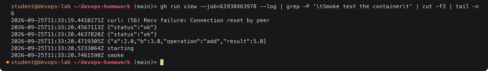

The first `curl` hit the container before gunicorn was listening, which is why the step
retries in a loop. The health status was still `starting` because the Docker healthcheck
had not run its first probe yet; the step does not depend on it.

### Output: artifacts

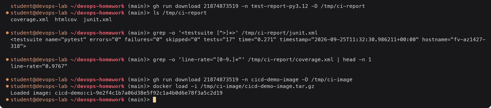

The test reports are what you would open to see why a test failed; `htmlcov/index.html` is
the browsable coverage report. The image artifact is the exact image CI tested, loadable on
any machine with Docker. Artifacts expire after the `retention-days` set in `ci.yml` (14
days for reports, 3 for the image, which is large).

### Output: CD run (success)

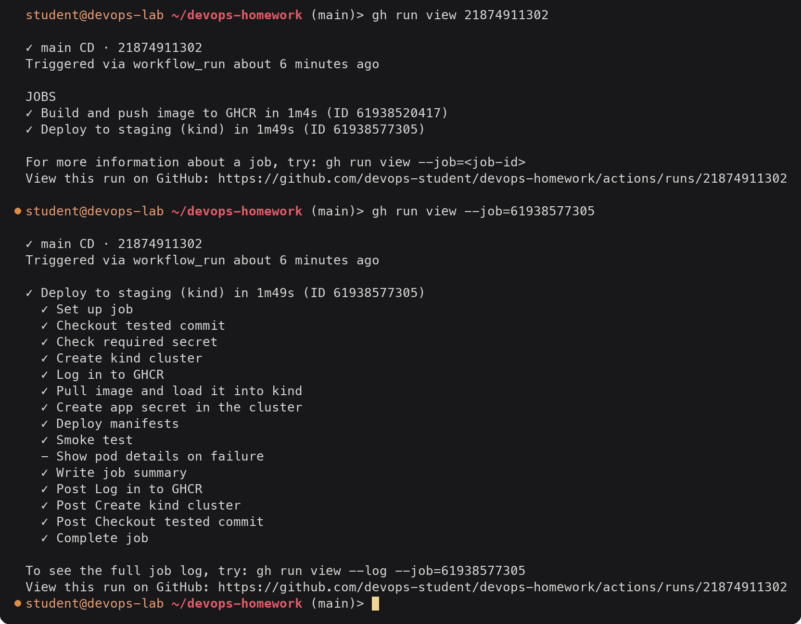

`Show pod details on failure` is skipped because it has `if: failure()`. `Post Create kind
cluster` deletes the kind cluster at the end.

The interesting parts of the deploy job log. I saved the log once and used a small shell
function to print one step's output without the job name, step name, timestamp and the
`##[group]` block (where the runner echoes the script and its `env:`, with the secret shown
as `***`):

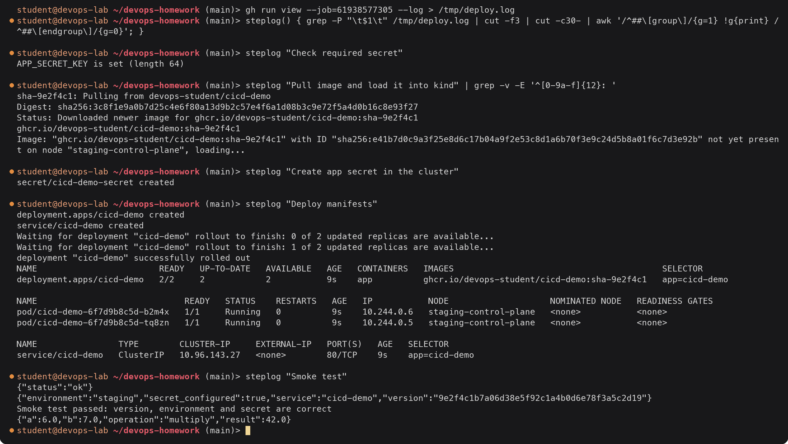

What this proves:

- The secret was available to the job (only its length is printed) and reached the pods
  through the Kubernetes Secret (`secret_configured: true`).
- The image came from GHCR, tagged with the short SHA of the commit CI tested.
- Both replicas passed their readiness probes before `rollout status` returned.
- The running version is the full SHA `9e2f4c1b...`, the same commit as the CI run
  `21874873519`.

### Output: the image in GHCR

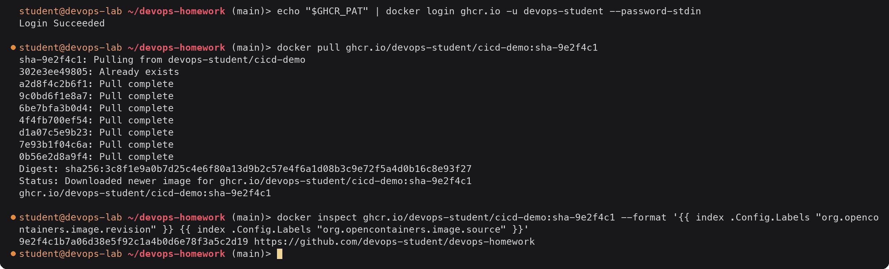

New GHCR packages are private, so pulling from outside Actions needs a login with a
personal access token that has `read:packages`. The `source` label links the package to
the repository, which is what lets the repo's `GITHUB_TOKEN` push new versions to it.

### Output: failure scenario (CI gate)

With `add()` changed to `return a + b + 1`:

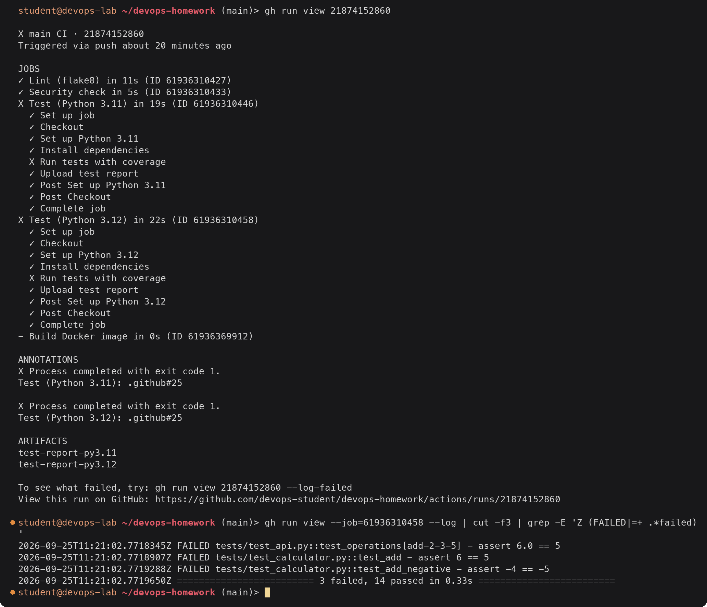

The test jobs failed on both Python versions, `Upload test report` still ran because of
`if: always()` (so the JUnit file with the failures is downloadable), and the build job
was skipped because of `needs:`. The matching CD run (`21874197731`) was skipped by its
`if:` condition, so nothing was pushed or deployed. Pushing the fix produced the green
runs shown above.

---

## Deliverables checklist

- [x] Source code: [`app/`](app/) with unit tests in [`tests/`](tests/) (17 tests, 98% coverage)
- [x] Dockerfile: [`Dockerfile`](Dockerfile) (+ [`.dockerignore`](.dockerignore))
- [x] Workflows: [`.github/workflows/ci.yml`](.github/workflows/ci.yml) and [`.github/workflows/cd.yml`](.github/workflows/cd.yml), copied to the repo root to run (see "Where the workflow files have to live")
- [x] CI pipeline: lint, security check, matrix tests, Docker build, test report / coverage / image artifacts (Part 3)
- [x] CD pipeline: build and push to GHCR with `GITHUB_TOKEN`, deploy to kind in the `staging` environment using the `APP_SECRET_KEY` secret, smoke test (Part 3, manifests in [`k8s/`](k8s/))
- [x] Pipeline output: `gh run list`, `gh run view` for CI and CD, job steps, logs, artifacts, a failed run and a re-run (Part 4)
- [x] Concepts: CI vs CD, CI/CD pipeline, GitHub Actions, workflow, jobs, steps, runners, secrets, artifacts, build, test, pipeline execution (Part 1)
- [x] README: [`README.md`](README.md)
