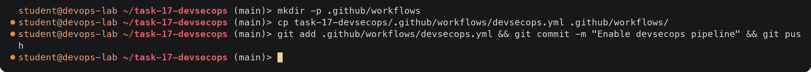
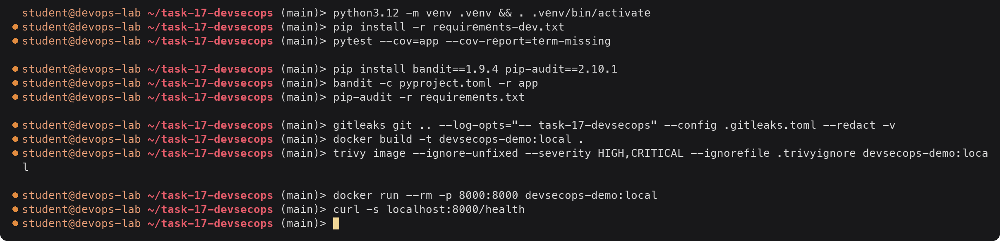
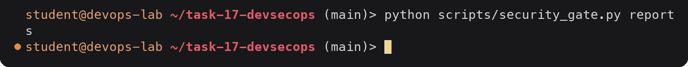

# devsecops-demo

A small Flask API with a complete CI/CD pipeline that has security checks built in.
The full write-up with pipeline runs and tool output is in [`submission.md`](submission.md).

## Pipeline

```
build ─► unit-test ─┬─► SAST (Bandit) ──────┐
                    ├─► SCA (pip-audit) ────┤
                    └─► Secrets (Gitleaks) ─┤
                                            ▼
                     docker-build ─► image-scan (Trivy)
                                            │
          SAST + SCA + secrets + image ─────┴─► security-gate
                                                     │  (main only)
                                                     ▼
                                             push (GHCR) ─► deploy (kind)
```

| Stage | Tool | Blocks the release when |
|---|---|---|
| Build | pip, compileall | dependencies do not install or code does not compile |
| Unit test | pytest + pytest-cov | a test fails or coverage drops below 90 % |
| SAST | Bandit 1.9.4 | an issue with severity HIGH (confidence MEDIUM or HIGH) |
| SCA | pip-audit 2.10.1 | any known vulnerability in a pinned runtime dependency |
| Secret scan | Gitleaks 8.21.2 | any finding in any commit that touched this folder |
| Docker build | docker | build fails, or the image user is root |
| Image scan | Trivy 0.58.1 | any HIGH or CRITICAL CVE that has a fix |
| Security gate | `scripts/security_gate.py` | any of the four scanner rules above |
| Push | docker/login-action, GHCR | only runs on push to `main` after the gate passes |
| Deploy | kind + kubectl | rollout does not finish in 120 s or smoke test fails |

The scanners run in report mode and upload JSON reports. The security gate job is the
only place that decides pass or fail, so one run shows every finding from every tool
instead of stopping at the first one.

## Layout

```
task-17-devsecops/
├── .github/workflows/devsecops.yml   pipeline (copy to repo root to run it, see below)
├── app/app.py                        Flask API
├── tests/test_app.py                 14 unit tests
├── scripts/security_gate.py          reads all reports, exits 1 on blocking findings
├── Dockerfile                        multi-stage, runs as UID 10001
├── k8s/                              namespace (PSA restricted), deployment, service
├── .gitleaks.toml                    Gitleaks rules and allowlist
├── .trivyignore                      Trivy accepted-risk list (with expiry policy)
├── pyproject.toml                    Bandit and coverage config
├── requirements.txt                  pinned runtime dependencies
└── requirements-dev.txt              test dependencies
```

## Enabling the workflow

GitHub only runs workflow files that sit in `.github/workflows/` at the root of the
repository. The copy inside this folder is the source of truth for the task; to run it:



<details><summary>Text version</summary>

```console
$ mkdir -p .github/workflows
$ cp task-17-devsecops/.github/workflows/devsecops.yml .github/workflows/
$ git add .github/workflows/devsecops.yml && git commit -m "Enable devsecops pipeline" && git push
```

</details>

The workflow uses `APP_DIR: task-17-devsecops` and `paths:` filters, so it only runs when
this folder changes. If this folder is pushed as its own repository, set `APP_DIR` and the
`defaults.run.working-directory` to `.` and drop the `paths:` filters.

No secrets need to be created. `GITHUB_TOKEN` is enough to push to GHCR (the push job
asks for `packages: write`) and to pull the image back into kind. The image name uses
`github.repository_owner`, which must be lowercase for Docker; rename it in `IMAGE_NAME`
if the owner has capitals.

## Running it locally



<details><summary>Text version</summary>

```console
$ python3.12 -m venv .venv && . .venv/bin/activate
$ pip install -r requirements-dev.txt
$ pytest --cov=app --cov-report=term-missing

$ pip install bandit==1.9.4 pip-audit==2.10.1
$ bandit -c pyproject.toml -r app
$ pip-audit -r requirements.txt

$ gitleaks git .. --log-opts="-- task-17-devsecops" --config .gitleaks.toml --redact -v
$ docker build -t devsecops-demo:local .
$ trivy image --ignore-unfixed --severity HIGH,CRITICAL --ignorefile .trivyignore devsecops-demo:local

$ docker run --rm -p 8000:8000 devsecops-demo:local
$ curl -s localhost:8000/health
```

</details>

Running the gate against a folder of reports:



<details><summary>Text version</summary>

```console
$ python scripts/security_gate.py reports
```

</details>

## Deploying to a real cluster

The deploy job creates a kind cluster inside the runner, which proves the manifests and
the image work but throws the cluster away afterwards. For a long-lived cluster:

1. Create a service account in the cluster with rights only on the `devsecops-demo`
   namespace and export a kubeconfig for it.
2. Store it base64 encoded as the repository secret `KUBE_CONFIG`.
3. Replace the "Create kind cluster" step with:

   ```yaml
   - name: Configure kubeconfig
     run: |
       mkdir -p ~/.kube
       echo "${{ secrets.KUBE_CONFIG }}" | base64 -d > ~/.kube/config
       chmod 600 ~/.kube/config
   ```

4. Put the deploy job behind a GitHub environment (`environment: production`) with a
   required reviewer, so a person approves each production rollout.

## Security controls in the image and manifests

| Control | Where |
|---|---|
| Non-root user, fixed UID/GID 10001 | `Dockerfile` (`USER 10001:10001`), checked again in the `docker-build` job |
| Multi-stage build, no compilers or pip cache in the final image | `Dockerfile` |
| Production server (gunicorn), Flask debug never enabled | `Dockerfile` `CMD`, Bandit B201 |
| `runAsNonRoot`, `runAsUser: 10001`, seccomp `RuntimeDefault` | `k8s/deployment.yaml` pod `securityContext` |
| `allowPrivilegeEscalation: false`, `readOnlyRootFilesystem: true`, drop ALL capabilities | `k8s/deployment.yaml` container `securityContext` |
| No service account token mounted | `automountServiceAccountToken: false` |
| CPU and memory limits | `k8s/deployment.yaml` |
| Pod Security Admission `restricted` enforced on the namespace | `k8s/namespace.yaml` |
| Least-privilege `GITHUB_TOKEN` (`contents: read` by default) | workflow `permissions:` |
| Scanner binaries pinned and verified against release checksums | workflow install steps |
