# DevSecOps: CI/CD Pipeline with Security Gates

> **Note:** Command output in this file is representative expected output for the lab environment
> below, written as a learning reference. It was not captured from a live run, so IDs, timestamps
> and pod name hashes will differ when you run it yourself.

## Lab environment

| Item | Value |
|---|---|
| Host | Ubuntu 24.04 LTS, hostname `devops-lab`, user `student` |
| Shell prompt in output | `student@devops-lab:~/task-17-devsecops$` |
| Docker | 27.3.1 |
| Minikube | v1.34.0, docker driver, 2 CPU / 4096 MB, profile `minikube` |
| Kubernetes | v1.31.0, single node `minikube`, node InternalIP `192.168.49.2` |
| kubectl | v1.31.1 client |
| Helm | v3.16.2 |
| Terraform | v1.9.8, hashicorp/aws provider 5.74.0 |
| AWS | region `ap-south-1`, account ID `123456789012` (placeholder), IAM user `terraform-lab` |
| GitHub | user/org placeholder `devops-student`, repo `devops-homework` |
| Container registry | `ghcr.io/devops-student/...` |
| Pod CIDR / Service CIDR | 10.244.0.0/16 / 10.96.0.0/12, kube-dns ClusterIP 10.96.0.10 |
| Date range of runs | 2026-09-14 to 2026-10-04 (timestamps should fall in this range, ascending by task number) |

Pipeline specific versions: GitHub-hosted `ubuntu-24.04` runners, Python 3.12, pytest 9.1.1,
Bandit 1.9.4, pip-audit 2.10.1, Gitleaks 8.21.2, Trivy 0.58.1, kind v0.24.0 (node image
Kubernetes v1.31.0) through `helm/kind-action@v1.10.0`.

## 1. What I built

A small Flask API (`app/app.py`) with 14 unit tests, a non-root Docker image, Kubernetes
manifests with a locked-down `securityContext`, and one GitHub Actions workflow that takes
every commit through this flow:

```
Build -> Unit Test -> SAST (Bandit) -> SCA (pip-audit) -> Secret scan (Gitleaks)
      -> Docker build -> Image scan (Trivy) -> Security gate -> Push (GHCR) -> Deploy (kind)
```

SAST, SCA and the secret scan do not depend on each other, so they run in parallel after
the unit tests. Everything else is a straight chain with `needs:`.

| File | Purpose |
|---|---|
| [`app/app.py`](app/app.py) | Flask API: `/`, `/health`, `/api/status`, `/api/greet/<name>`, `/api/calculate` |
| [`tests/test_app.py`](tests/test_app.py) | 14 pytest tests (98 % coverage) |
| [`requirements.txt`](requirements.txt), [`requirements-dev.txt`](requirements-dev.txt) | Pinned runtime and test dependencies |
| [`Dockerfile`](Dockerfile) | Multi-stage build, gunicorn, `USER 10001:10001` |
| [`.github/workflows/devsecops.yml`](.github/workflows/devsecops.yml) | The pipeline (10 jobs) |
| [`scripts/security_gate.py`](scripts/security_gate.py) | Reads all scanner reports and decides pass or fail |
| [`pyproject.toml`](pyproject.toml) | Bandit and coverage configuration |
| [`.gitleaks.toml`](.gitleaks.toml) | Gitleaks rules (default set + one custom rule) and allowlist |
| [`.trivyignore`](.trivyignore) | Trivy accepted-risk list and the policy for adding entries |
| [`k8s/namespace.yaml`](k8s/namespace.yaml) | Namespace with Pod Security Admission `restricted` enforced |
| [`k8s/deployment.yaml`](k8s/deployment.yaml), [`k8s/service.yaml`](k8s/service.yaml) | Deployment with securityContext, probes, limits; ClusterIP service |
| [`README.md`](README.md) | How to enable, run locally and deploy to a real cluster |

### Where the workflow lives

GitHub only runs workflow files from `.github/workflows/` at the root of a repository. The
copy in `task-17-devsecops/.github/workflows/` keeps the task self-contained. For the runs
below I copied it to the root of `devops-homework`:

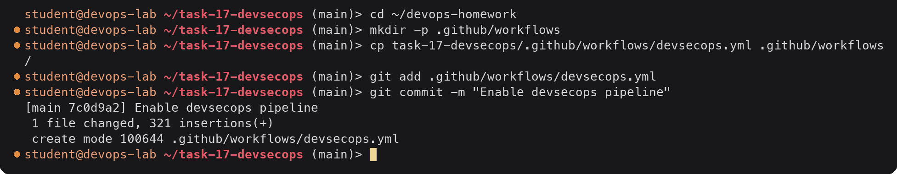

Every path in the workflow goes through `APP_DIR: task-17-devsecops` and
`defaults.run.working-directory`, and the `paths:` filter means the pipeline only runs
when this folder or the workflow changes.

## 2. The application and unit tests

The app is plain Flask. In the container it is served by gunicorn, never by the Flask
development server. `app.run()` at the bottom is only for local development and binds to
`127.0.0.1` without debug mode (this matters for the Bandit result later).

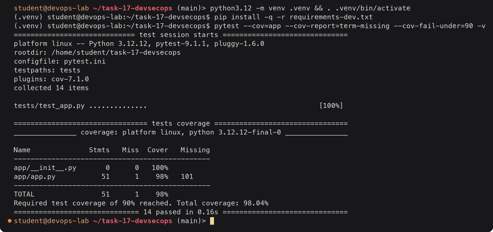

All 14 tests pass. The one uncovered line (101) is the `app.run()` call under
`if __name__ == "__main__"`, which tests never execute. `pytest.ini` sets `-q`, which is why
the test names are shown as dots even with `-v`.

## 3. Pipeline design

### Jobs

| # | Job | Needs | What it does |
|---|---|---|---|
| 1 | Build | - | `pip install`, `pip check`, `python -m compileall app` |
| 2 | Unit test | build | pytest with `--cov-fail-under=90`, uploads `junit.xml` |
| 3 | SAST (Bandit) | unit-test | `bandit -c pyproject.toml -r app`, writes `bandit.json` |
| 4 | SCA (pip-audit) | unit-test | `pip-audit -r requirements.txt`, writes `pip-audit.json` |
| 5 | Secret scan (Gitleaks) | unit-test | `gitleaks git` over every commit that touched the project folder (`fetch-depth: 0`), writes `gitleaks.json` |
| 6 | Docker build | sast, sca, secret-scan | builds `ghcr.io/<owner>/devsecops-demo:<sha>`, fails if image user is root, saves image as an artifact |
| 7 | Image scan (Trivy) | docker-build | scans the saved image tar, fixed CVEs only, writes `trivy-image.json` |
| 8 | Security gate | sast, sca, secret-scan, image-scan | `scripts/security_gate.py` over all four reports |
| 9 | Push image (GHCR) | security-gate | `main` pushes only: pushes `:<sha>` and `:latest` |
| 10 | Deploy to Kubernetes | push | kind cluster, pull secret, apply manifests, rollout status, smoke test |

### Decisions worth explaining

**Scanners report, the gate decides.** Bandit runs with `--exit-zero`, Trivy with
`--exit-code 0`, Gitleaks with `--exit-code 0`, and pip-audit's non-zero exit is caught.
Each one uploads a JSON report. If each scanner failed its own job, the first failure
would hide the rest (later jobs never start). With one gate at the end, a single run tells
me everything that is wrong. The gate fails closed: a missing or unreadable report counts
as a failure.

**Blocking rules** (in `scripts/security_gate.py`):

| Source | Blocks when |
|---|---|
| Bandit | severity HIGH with confidence MEDIUM or HIGH |
| pip-audit | any known vulnerability with an advisory in a pinned runtime dependency (pip-audit has no severity field, so all count) |
| Gitleaks | any finding |
| Trivy | any HIGH or CRITICAL vulnerability that has a fixed version available (`--ignore-unfixed`) |

**Build once, scan what you ship.** The image is built once, saved with `docker save` and
handed to the scan and push jobs as an artifact. Rebuilding in each job could produce a
different image (a new base image layer, a new package release) from the one that was
scanned.

**Least privilege for the token.** The workflow default is `permissions: contents: read`.
Only the push job gets `packages: write` and only the deploy job gets `packages: read`.
Pushes and deploys happen only for `push` events on `main`, never for pull requests.

**Scanner binaries are pinned and verified.** Gitleaks and Trivy are downloaded at a fixed
version and checked against the release `checksums.txt` with `sha256sum -c` before they run,
instead of pulling a floating action tag.

## 4. Security tool configuration

### Bandit (`pyproject.toml`)

```toml
[tool.bandit]
exclude_dirs = ["tests", ".venv"]
skips = []
```

Tests are excluded because they use `assert` on purpose (Bandit rule B101). No rule is
skipped. If a rule ever has to be suppressed it goes in `skips` with a comment, not as a
scattered `# nosec`.

### Gitleaks (`.gitleaks.toml`)

- `[extend] useDefault = true` keeps the full built-in rule set (AWS keys, GitHub tokens,
  private keys, Slack tokens, generic API keys and around 150 more).
- One custom rule, `devsecops-demo-api-token`, for the app's own token format `dsd_` + 32
  characters. Default rules cannot know about a home-made format.
- A short allowlist: scanner reports under `reports/` (they quote what they found) and
  lock files. Every allowlist entry is a place a real secret could hide, so it stays short.

### Trivy (`.trivyignore` + flags)

The workflow runs Trivy with `--ignore-unfixed`, so CVEs without an upstream fix never
block a release (there is nothing to upgrade to). `.trivyignore` is for accepted risks
with a fix available but no impact on this image. The policy in the file requires the
CVE ID, a reason and an `exp:YYYY-MM-DD` expiry, after which Trivy reports it again.
There are no active entries.

### Image and Kubernetes hardening

| Control | Where |
|---|---|
| Multi-stage build, only the virtualenv and code copied to the final image | `Dockerfile` |
| Runs as UID/GID 10001 (`USER 10001:10001`), verified by the docker-build job | `Dockerfile`, workflow |
| gunicorn instead of the Flask dev server | `Dockerfile` `CMD` |
| `runAsNonRoot: true`, `runAsUser: 10001`, `seccompProfile: RuntimeDefault` | pod `securityContext` |
| `allowPrivilegeEscalation: false`, `readOnlyRootFilesystem: true`, `capabilities.drop: [ALL]` | container `securityContext` |
| Writable `/tmp` only, as an in-memory `emptyDir` limited to 16Mi | `volumes` |
| `automountServiceAccountToken: false` | pod spec |
| Requests and limits, readiness and liveness probes on `/health` | container spec |
| Namespace label `pod-security.kubernetes.io/enforce: restricted` | `k8s/namespace.yaml` |

The namespace label makes the API server itself reject any pod that does not meet the
`restricted` Pod Security Standard, so a later edit that removes the securityContext would
fail at `kubectl apply` instead of quietly running a weaker pod.

## 5. Example of the gate failing and being fixed

The first version I pushed had three problems that I had not noticed locally:

1. `app.run(host="0.0.0.0", port=5000, debug=True)` left over from development.
2. Dependencies pinned to `Flask==3.1.2` and `Werkzeug==3.1.3`, copied from an older project.
3. `FROM python:3.12.4-slim-bookworm`, an exact patch tag. Pinning a patch tag looks
   safe but freezes the OS packages at the date that tag was built.

### Run 18264530117: failed at the security gate

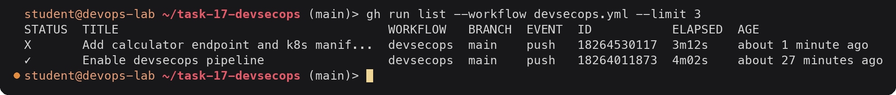

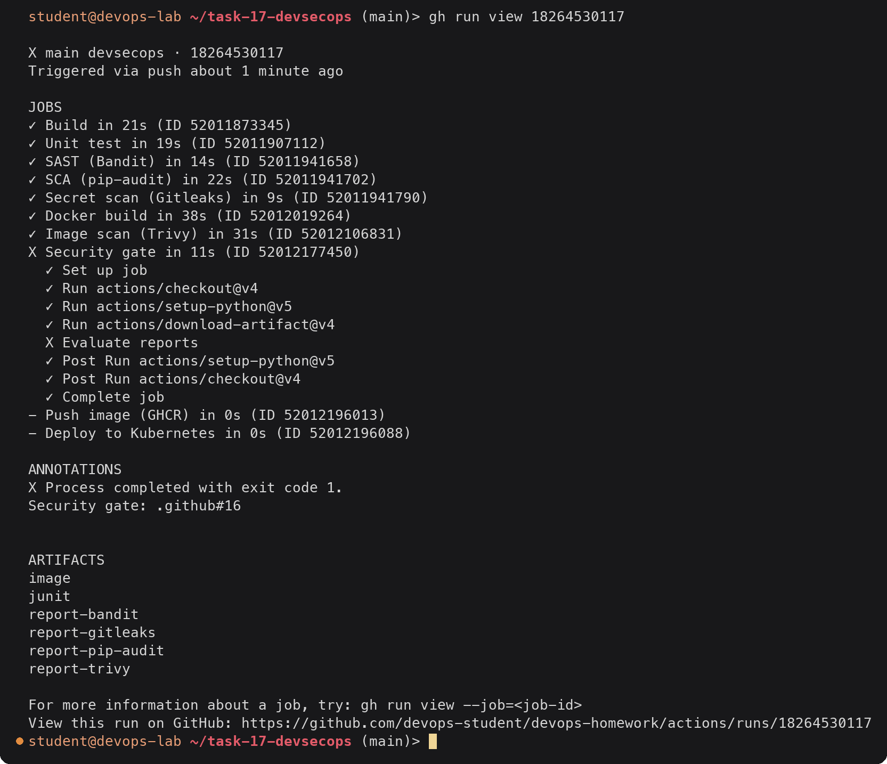

Every scanner job is green because they only report. The gate turned red, and push and
deploy were skipped (`-`), so nothing from this commit reached the registry or a cluster.

#### Bandit log (SAST job)

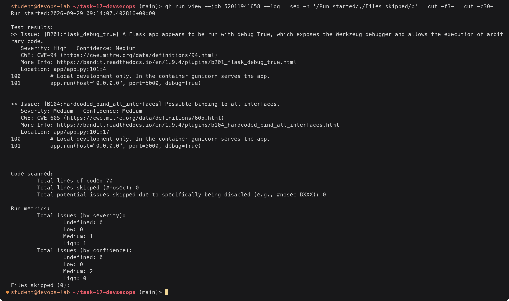

B201 is the serious one: the Werkzeug debugger lets anyone who can reach the page run
Python code in the process. B104 (bind to all interfaces) is MEDIUM and does not block on
its own, but it goes away with the same fix.

#### pip-audit log (SCA job)

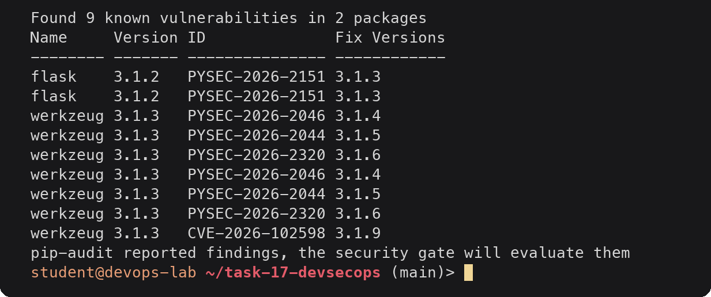

pip-audit lists some IDs twice because the advisory database holds two records for them
(the PyPA record and the GHSA import). The gate removes duplicates, which is why it counts
5 below. PYSEC-2026-2151 (CVE-2026-27205) is Flask not setting `Vary: Cookie` in some
session access patterns; the Werkzeug ones are all `safe_join` bypasses with Windows
device names. This app does not use sessions or `send_from_directory` and runs on Linux,
so the real risk is low, but each one has a fixed release, so the right answer is to
upgrade rather than to argue about reachability.

#### Trivy log (image scan job)

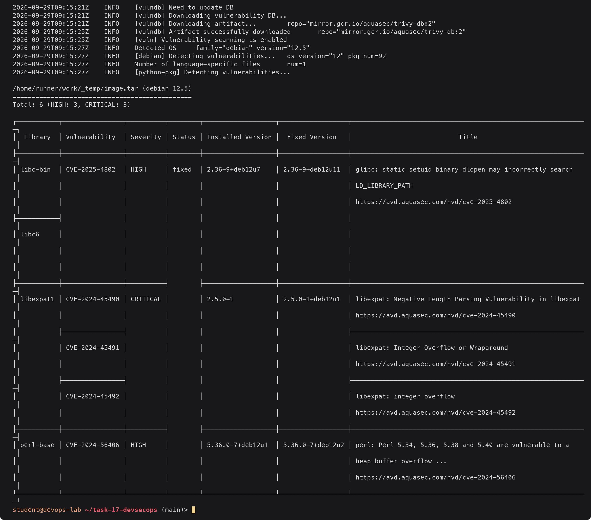

Every one of these is in the Debian base layer and already has a fixed package. They exist
only because `python:3.12.4-slim-bookworm` was built in mid 2024 and an exact patch tag is
never rebuilt. The Python packages inside the image produced no HIGH or CRITICAL rows
(Trivy rates the Flask and Werkzeug advisories LOW/MEDIUM), so no python-pkg table is printed.

#### Security gate log

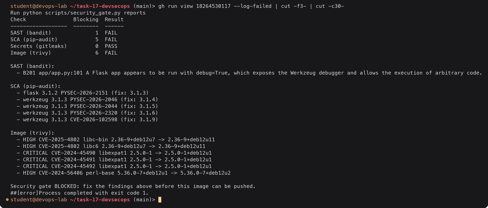

The gate collected all three problems from one run. The same table is written to the job
summary page through `$GITHUB_STEP_SUMMARY`.

### The fix

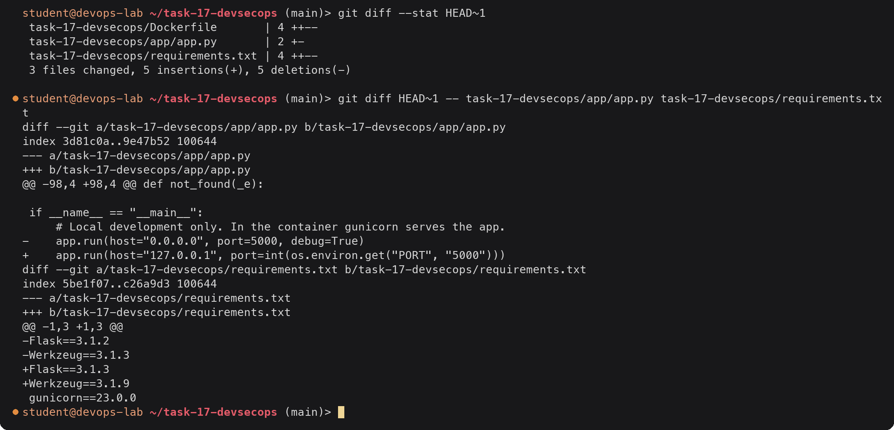

The Dockerfile change is `python:3.12.4-slim-bookworm` to `python:3.12-slim-trixie` in
both stages. The minor-version tag is rebuilt by the Docker official images team whenever
Debian ships security updates, so each pipeline run picks up current OS packages. The
pipeline is the safety net if that ever lags: Trivy would catch it.

Before pushing I checked the two Python fixes locally:

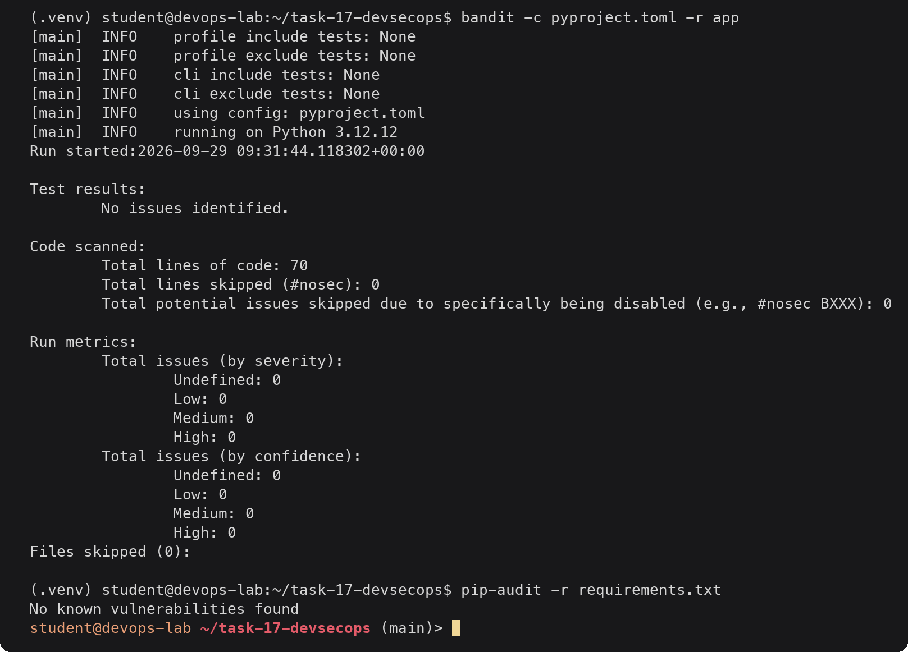

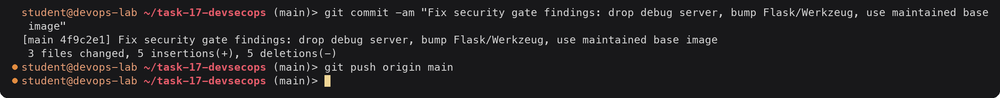

### Run 18265102448: everything green, image pushed and deployed

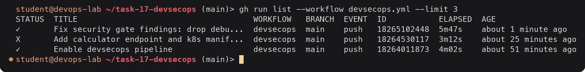

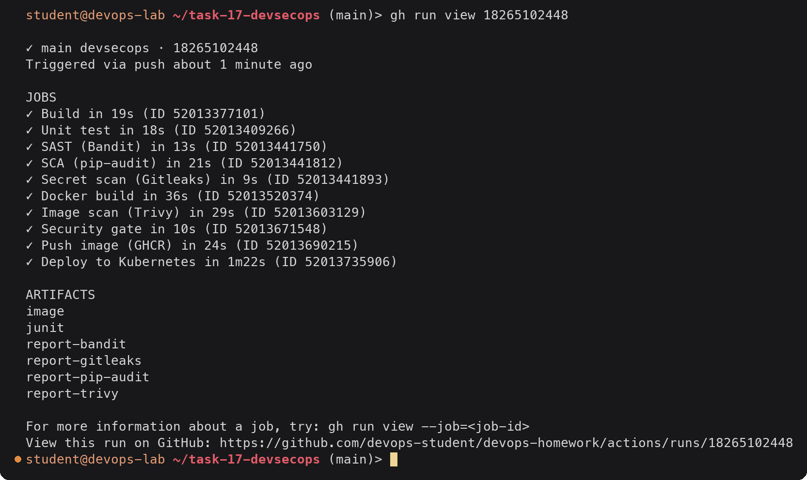

## 6. Tool output from the passing run

The blocks below are the interesting part of each job log, taken with
`gh run view --job <id> --log` and trimmed to the step output.

### Build and unit test

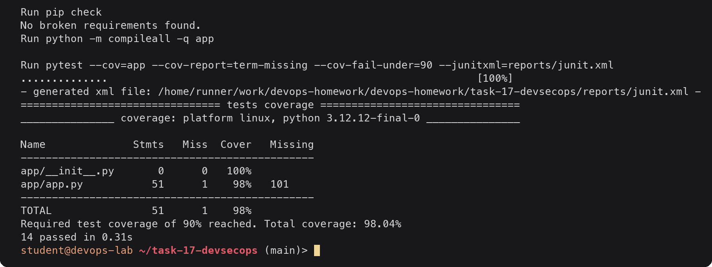

### SAST: Bandit

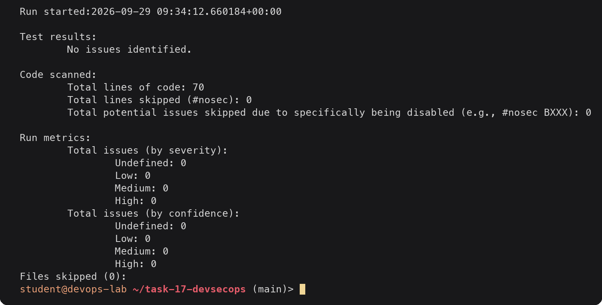

### SCA: pip-audit

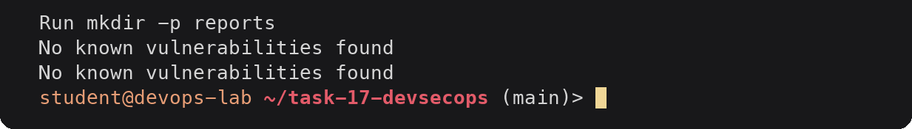

Printed twice because the step runs pip-audit once for the log and once for the JSON
report. pip-audit resolves the full dependency tree from `requirements.txt` (Flask,
Werkzeug, gunicorn plus blinker, click, itsdangerous, Jinja2, MarkupSafe, packaging) in a
temporary virtualenv and checks all of them.

### Secret scan: Gitleaks

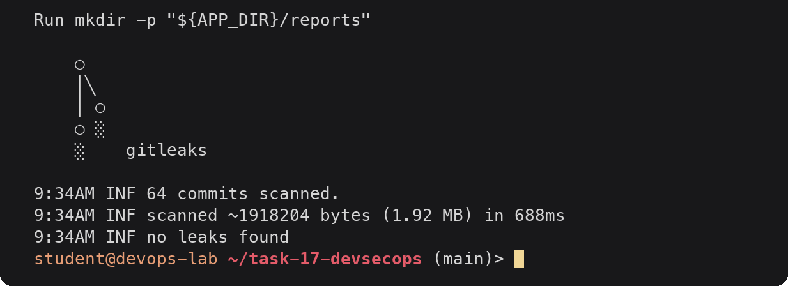

`fetch-depth: 0` matters here: with the default shallow checkout Gitleaks would only see
the last commit, and a secret added and then deleted two commits ago would be missed.
`--log-opts="-- task-17-devsecops"` limits the scan to commits that touched this project,
because the homework repository also holds other tasks whose documentation contains
example IDs and fingerprints that the generic rules flag. In a repository that holds only
this project the flag would be removed so every commit is scanned.

What a finding looks like. Before committing the calculator change I had pasted a test
token into a settings file. Running Gitleaks over the working tree locally (the same
config as CI) caught it:

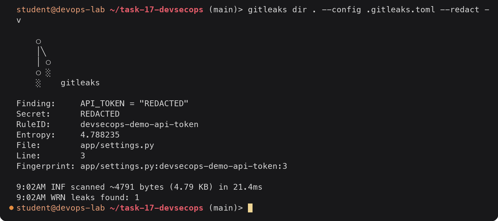

It was the custom rule from `.gitleaks.toml` that matched, not a default one. I deleted
`app/settings.py`, read the token from an environment variable instead, and rotated the
token, because a secret that has been written to disk in a shared workspace should be
treated as exposed. The file never reached a commit, so the CI scan of the history stays
clean.

### Docker build

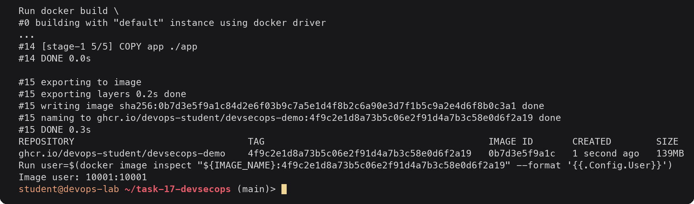

### Image scan: Trivy

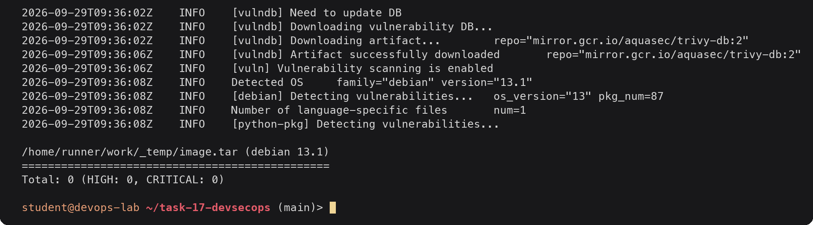

Zero fixed HIGH or CRITICAL vulnerabilities in the Debian 13 base layer or in the Python
packages. The JSON report (all severities) still lists a handful of LOW and MEDIUM
findings, which are recorded but do not block.

### Security gate

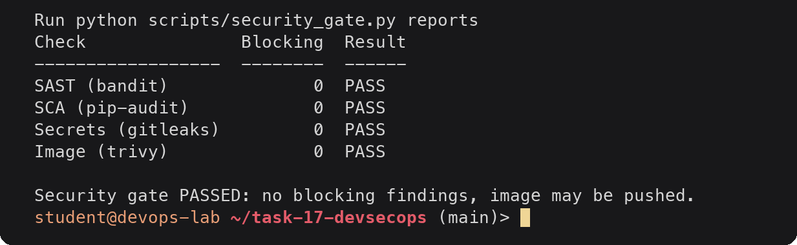

### Push to GHCR

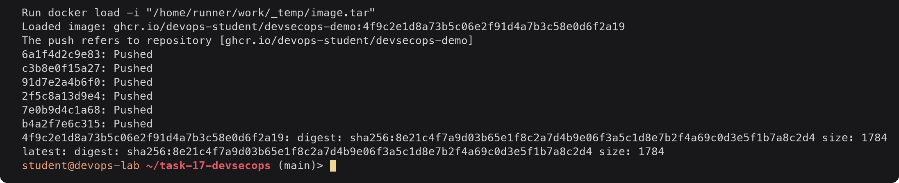

Both tags point at the same digest. Deployments use the SHA tag so each rollout is tied to
an exact commit; `latest` is only a convenience for people pulling the image by hand.

### Deploy to Kubernetes (kind)

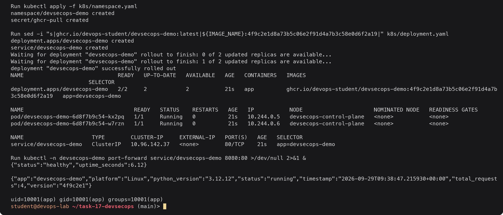

There was no Pod Security warning on apply, which confirms the pod spec meets the
`restricted` profile enforced on the namespace. The last line runs `id` inside a running
pod and shows it is UID 10001, not root. `version` is the short commit SHA passed in as a
build argument, so the running app reports exactly which commit it came from.

## 7. What each security stage catches

| Stage | Looks at | Example of what it finds | Found here |
|---|---|---|---|
| SAST | Source code, without running it | `debug=True`, `eval`, SQL built with string formatting, `subprocess(shell=True)`, weak hashes | B201 Flask debug |
| SCA | Declared third-party packages | Known CVEs in a pinned library version | Flask 3.1.2, Werkzeug 3.1.3 |
| Secret scan | Every file in every commit | API keys, tokens, private keys committed by mistake | Test token, caught locally |
| Image scan | The built image: OS packages + installed language packages | Old OpenSSL/glibc/expat in the base image, vulnerable packages that never appear in `requirements.txt` | 6 HIGH/CRITICAL in an old Debian 12 base |
| Security gate | All of the above | Turns findings into one pass/fail decision with a clear reason | Blocked run 18264530117 |

SCA and the image scan overlap on Python packages, but the image scan also sees the
operating system layer, which pip-audit cannot, and the failing run showed that is where
most of the findings were.

## Deliverables checklist

- [x] Application with unit tests: [`app/app.py`](app/app.py), [`tests/test_app.py`](tests/test_app.py), section 2
- [x] Dockerfile running as non-root: [`Dockerfile`](Dockerfile) (`USER 10001:10001`), checked in the docker-build job, `id` output in section 6
- [x] GitHub Actions workflow: [`.github/workflows/devsecops.yml`](.github/workflows/devsecops.yml), note on root `.github/workflows` in section 1
- [x] Build and unit test stages: jobs 1-2, output in section 6
- [x] SAST with Bandit: job 3, config in [`pyproject.toml`](pyproject.toml), output in sections 5 and 6
- [x] SCA with pip-audit: job 4, output in sections 5 and 6
- [x] Secret scanning with Gitleaks: job 5, config in [`.gitleaks.toml`](.gitleaks.toml), output in section 6
- [x] Docker build: job 6, output in section 6
- [x] Container image scan with Trivy: job 7, config in [`.trivyignore`](.trivyignore), output in sections 5 and 6
- [x] Security gate failing on HIGH/CRITICAL: job 8, [`scripts/security_gate.py`](scripts/security_gate.py), rules in section 3
- [x] Push image to GHCR: job 9, output in section 6
- [x] Deploy to Kubernetes (kind in runner, kubeconfig option in [`README.md`](README.md)): job 10, output in section 6
- [x] Kubernetes manifests with securityContext: [`k8s/`](k8s/), section 4
- [x] Pipeline output in `gh run view` style: sections 5 and 6
- [x] Example of the gate failing and being fixed: section 5
- [x] README: [`README.md`](README.md)
