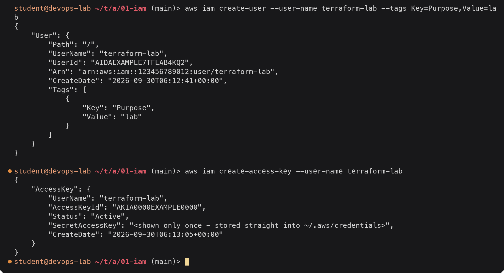
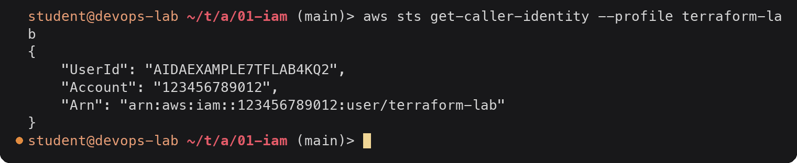
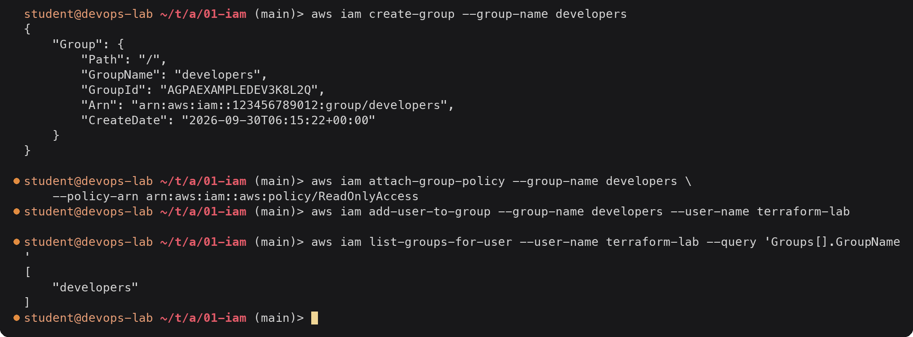
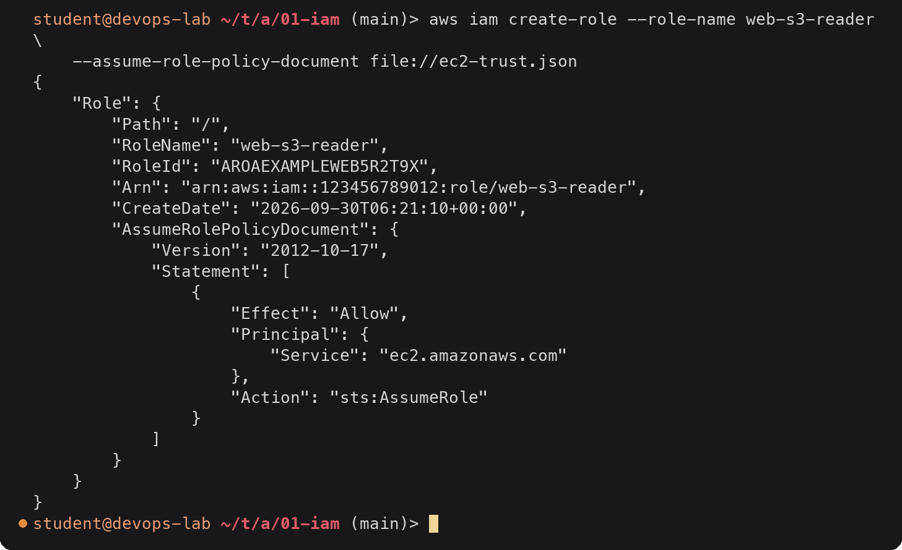
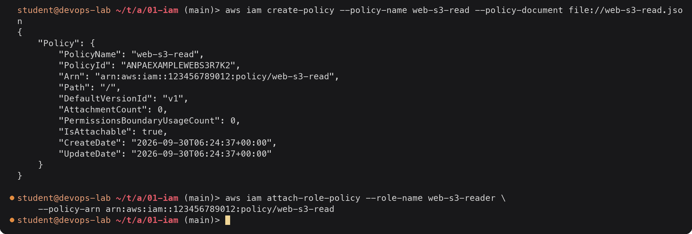
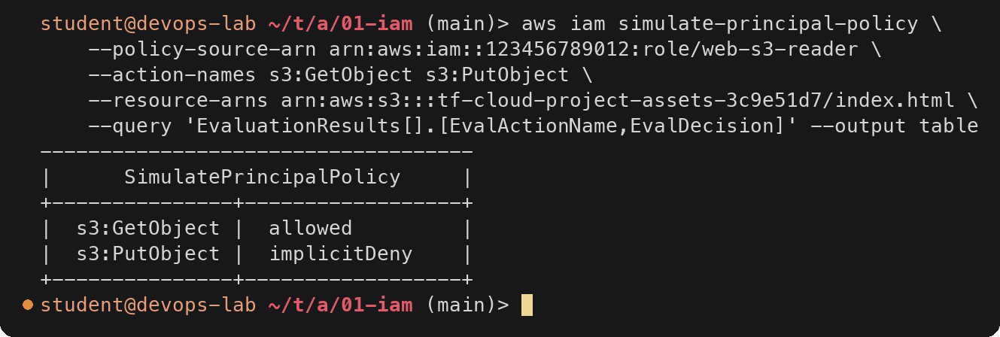

# IAM (Identity and Access Management)

> **Note:** Command output in this file is representative expected output for the lab environment
> below, written as a learning reference. It was not captured from a live run, so IDs, timestamps
> and pod name hashes will differ when you run it yourself.

Lab environment: see [`../../submission.md`](../../submission.md) (region `ap-south-1`,
account `123456789012`, AWS CLI v2 on `devops-lab`).

## What IAM is

IAM is the AWS service that answers two questions for every API call:

1. **Authentication**: who is making this request? (a user with a password or access key,
   or a role with temporary credentials)
2. **Authorization**: is that identity allowed to do this action on this resource?

Every action in AWS, from the console, the CLI, Terraform or an SDK, is an API call that
IAM evaluates. IAM is global (not tied to a region) and has no extra cost.

The starting point is the **root user**, the email address the account was created with.
It can do everything, including closing the account, and its access cannot be limited by
IAM policies. It should be locked away with MFA and used only for the few tasks that need
it (billing settings, account closure). Day-to-day work happens through IAM identities.

## Users

An IAM user is a long-lived identity for one person or one application. It can have:

- a **console password** (for the web console), ideally with MFA
- up to two **access keys** (access key ID + secret access key) for the CLI and SDKs



<details><summary>Text version</summary>

```console
$ aws iam create-user --user-name terraform-lab --tags Key=Purpose,Value=lab
{
    "User": {
        "Path": "/",
        "UserName": "terraform-lab",
        "UserId": "AIDAEXAMPLE7TFLAB4KQ2",
        "Arn": "arn:aws:iam::123456789012:user/terraform-lab",
        "CreateDate": "2026-09-30T06:12:41+00:00",
        "Tags": [
            {
                "Key": "Purpose",
                "Value": "lab"
            }
        ]
    }
}

$ aws iam create-access-key --user-name terraform-lab
{
    "AccessKey": {
        "UserName": "terraform-lab",
        "AccessKeyId": "AKIA0000EXAMPLE0000",
        "Status": "Active",
        "SecretAccessKey": "<shown only once - stored straight into ~/.aws/credentials>",
        "CreateDate": "2026-09-30T06:13:05+00:00"
    }
}
```

</details>

The secret access key is shown exactly once. I put it into `aws configure` immediately
and never into a file in the repository.



<details><summary>Text version</summary>

```console
$ aws sts get-caller-identity --profile terraform-lab
{
    "UserId": "AIDAEXAMPLE7TFLAB4KQ2",
    "Account": "123456789012",
    "Arn": "arn:aws:iam::123456789012:user/terraform-lab"
}
```

</details>

`sts get-caller-identity` is the first thing to run when something is "access denied": it
shows which identity the CLI is actually using.

## Groups

A group is a collection of users. Policies attached to a group apply to every member.
Groups cannot be nested and are not identities themselves (you cannot sign in as a group,
and a group cannot be named as a principal in a policy).

Instead of attaching policies to ten developers one by one, attach them once to a
`developers` group and add or remove people from it.



<details><summary>Text version</summary>

```console
$ aws iam create-group --group-name developers
{
    "Group": {
        "Path": "/",
        "GroupName": "developers",
        "GroupId": "AGPAEXAMPLEDEV3K8L2Q",
        "Arn": "arn:aws:iam::123456789012:group/developers",
        "CreateDate": "2026-09-30T06:15:22+00:00"
    }
}

$ aws iam attach-group-policy --group-name developers \
    --policy-arn arn:aws:iam::aws:policy/ReadOnlyAccess
$ aws iam add-user-to-group --group-name developers --user-name terraform-lab

$ aws iam list-groups-for-user --user-name terraform-lab --query 'Groups[].GroupName'
[
    "developers"
]
```

</details>

`attach-group-policy` and `add-user-to-group` print nothing on success.

## Roles

A role is an identity with permissions but **no long-term credentials**. Something
*assumes* the role and gets temporary credentials (access key, secret key, session token)
from AWS STS that expire after 15 minutes to 12 hours.

A role has two policies:

- **Trust policy**: who is allowed to assume the role (an AWS service like EC2, another
  account, a federated identity like GitHub Actions OIDC).
- **Permissions policy**: what the role can do once assumed.

Common uses: an EC2 instance reading from S3, a Lambda function writing to DynamoDB, a
GitHub Actions workflow deploying without stored keys, cross-account access.

Trust policy that lets EC2 instances assume the role (`ec2-trust.json`):

```json
{
  "Version": "2012-10-17",
  "Statement": [
    {
      "Effect": "Allow",
      "Principal": { "Service": "ec2.amazonaws.com" },
      "Action": "sts:AssumeRole"
    }
  ]
}
```



<details><summary>Text version</summary>

```console
$ aws iam create-role --role-name web-s3-reader \
    --assume-role-policy-document file://ec2-trust.json
{
    "Role": {
        "Path": "/",
        "RoleName": "web-s3-reader",
        "RoleId": "AROAEXAMPLEWEB5R2T9X",
        "Arn": "arn:aws:iam::123456789012:role/web-s3-reader",
        "CreateDate": "2026-09-30T06:21:10+00:00",
        "AssumeRolePolicyDocument": {
            "Version": "2012-10-17",
            "Statement": [
                {
                    "Effect": "Allow",
                    "Principal": {
                        "Service": "ec2.amazonaws.com"
                    },
                    "Action": "sts:AssumeRole"
                }
            ]
        }
    }
}
```

</details>

An EC2 instance uses a role through an **instance profile** (a wrapper that attaches the
role to the instance). Code on the instance then gets rotating credentials from the
instance metadata service automatically; no keys are ever copied onto the server.

Trust policy for GitHub Actions OIDC, limited to one repository's `main` branch:

```json
{
  "Version": "2012-10-17",
  "Statement": [
    {
      "Effect": "Allow",
      "Principal": {
        "Federated": "arn:aws:iam::123456789012:oidc-provider/token.actions.githubusercontent.com"
      },
      "Action": "sts:AssumeRoleWithWebIdentity",
      "Condition": {
        "StringEquals": {
          "token.actions.githubusercontent.com:aud": "sts.amazonaws.com",
          "token.actions.githubusercontent.com:sub": "repo:devops-student/devops-homework:ref:refs/heads/main"
        }
      }
    }
  ]
}
```

## Policies

A policy is a JSON document that allows or denies actions. Each statement has:

| Element | Meaning | Example |
|---|---|---|
| `Effect` | `Allow` or `Deny` | `"Allow"` |
| `Action` | API actions, `service:Action`, wildcards allowed | `"s3:GetObject"` |
| `Resource` | ARNs the statement applies to | `"arn:aws:s3:::my-bucket/*"` |
| `Condition` | Optional extra checks | `{"Bool": {"aws:SecureTransport": "true"}}` |
| `Principal` | Who the statement is about (only in resource-based and trust policies) | `{"Service": "ec2.amazonaws.com"}` |

Policy types:

| Type | Attached to | Notes |
|---|---|---|
| AWS managed | users, groups, roles | Written by AWS, e.g. `ReadOnlyAccess`, `AmazonS3ReadOnlyAccess`. Broad, updated by AWS |
| Customer managed | users, groups, roles | Written by you, reusable, versioned (up to 5 versions) |
| Inline | one user, group or role | Embedded in that one identity, deleted with it |
| Resource-based | a resource (S3 bucket policy, SQS queue policy, KMS key policy, role trust policy) | Has a `Principal` element |
| Permissions boundary | user or role | Maximum permissions the identity can ever have |
| Service control policy (SCP) | AWS Organizations account or OU | Maximum permissions for a whole account |

A customer managed policy that lets the web role read only its own bucket
(`web-s3-read.json`):

```json
{
  "Version": "2012-10-17",
  "Statement": [
    {
      "Sid": "ListOwnBucket",
      "Effect": "Allow",
      "Action": "s3:ListBucket",
      "Resource": "arn:aws:s3:::tf-cloud-project-assets-3c9e51d7"
    },
    {
      "Sid": "ReadOwnObjects",
      "Effect": "Allow",
      "Action": "s3:GetObject",
      "Resource": "arn:aws:s3:::tf-cloud-project-assets-3c9e51d7/*"
    }
  ]
}
```

`s3:ListBucket` acts on the bucket ARN and `s3:GetObject` on object ARNs (`/*`), so they
need separate statements; mixing them up is the most common S3 policy mistake.



<details><summary>Text version</summary>

```console
$ aws iam create-policy --policy-name web-s3-read --policy-document file://web-s3-read.json
{
    "Policy": {
        "PolicyName": "web-s3-read",
        "PolicyId": "ANPAEXAMPLEWEBS3R7K2",
        "Arn": "arn:aws:iam::123456789012:policy/web-s3-read",
        "Path": "/",
        "DefaultVersionId": "v1",
        "AttachmentCount": 0,
        "PermissionsBoundaryUsageCount": 0,
        "IsAttachable": true,
        "CreateDate": "2026-09-30T06:24:37+00:00",
        "UpdateDate": "2026-09-30T06:24:37+00:00"
    }
}

$ aws iam attach-role-policy --role-name web-s3-reader \
    --policy-arn arn:aws:iam::123456789012:policy/web-s3-read
```

</details>

## Permissions: how a request is evaluated

For a request inside one account, IAM combines every policy that applies:

1. Start with an **implicit deny**: nothing is allowed by default.
2. If any applicable policy has an **explicit `Deny`** that matches, the request is denied.
   Nothing can override an explicit deny.
3. Otherwise, if an SCP, permissions boundary or session policy applies, the action must be
   allowed by each of them too.
4. If an identity-based or resource-based policy has a matching **`Allow`**, the request
   is allowed.
5. Otherwise the implicit deny stands.

So the rule is: **explicit deny > explicit allow > implicit deny**.

The policy simulator shows the decision without making the real call:



<details><summary>Text version</summary>

```console
$ aws iam simulate-principal-policy \
    --policy-source-arn arn:aws:iam::123456789012:role/web-s3-reader \
    --action-names s3:GetObject s3:PutObject \
    --resource-arns arn:aws:s3:::tf-cloud-project-assets-3c9e51d7/index.html \
    --query 'EvaluationResults[].[EvalActionName,EvalDecision]' --output table
------------------------------------
|      SimulatePrincipalPolicy     |
+---------------+------------------+
|  s3:GetObject |  allowed         |
|  s3:PutObject |  implicitDeny    |
+---------------+------------------+
```

</details>

`GetObject` is allowed by `web-s3-read`; `PutObject` is not mentioned anywhere, so it
falls to the implicit deny.

An explicit deny is useful as a guard rail. This statement, added to any policy, refuses
every S3 request that does not use HTTPS, whatever else allows it:

```json
{
  "Sid": "DenyInsecureTransport",
  "Effect": "Deny",
  "Action": "s3:*",
  "Resource": "*",
  "Condition": { "Bool": { "aws:SecureTransport": "false" } }
}
```

## Least privilege

Give each identity only the actions and resources it needs for its job, and nothing more.

| Instead of | Use |
|---|---|
| `AdministratorAccess` for a CI pipeline | A policy listing only the services and ARNs the pipeline deploys |
| `"Action": "s3:*", "Resource": "*"` | `s3:GetObject` on `arn:aws:s3:::one-bucket/*` |
| One shared IAM user for the whole team | One identity per person, permissions through groups |
| Long-lived access keys on an EC2 instance | An instance role |
| Access keys in GitHub secrets | GitHub OIDC + role, limited to one repo and branch |

How to get there in practice: start from an AWS managed policy to get working, look at
what was actually used (IAM Access Analyzer can generate a policy from CloudTrail
activity, and "last accessed" data shows unused services), then replace the broad policy
with a narrow customer managed one.

For the Terraform labs, `terraform-lab` only needs the services those configurations
create. A trimmed policy for the S3 demo in this task:

```json
{
  "Version": "2012-10-17",
  "Statement": [
    {
      "Sid": "ManageDemoBuckets",
      "Effect": "Allow",
      "Action": [
        "s3:CreateBucket", "s3:DeleteBucket", "s3:ListBucket", "s3:ListBucketVersions",
        "s3:Get*", "s3:PutBucketTagging", "s3:PutBucketVersioning",
        "s3:PutEncryptionConfiguration", "s3:PutBucketPublicAccessBlock",
        "s3:DeleteObject", "s3:DeleteObjectVersion", "s3:PutObject"
      ],
      "Resource": [
        "arn:aws:s3:::tf-s3-demo-*",
        "arn:aws:s3:::tf-s3-demo-*/*"
      ]
    }
  ]
}
```

## Best practices

| Practice | Why |
|---|---|
| Lock the root user: MFA on, no access keys, use only for root-only tasks | Root cannot be restricted by IAM |
| MFA for every human user | A leaked password alone is not enough |
| Prefer roles and temporary credentials over access keys | Nothing long-lived to leak; credentials expire on their own |
| Better still, use IAM Identity Center (SSO) for people | One login, short-lived credentials per account, central off-boarding |
| Grant through groups, not to individual users | Easier to audit and to remove access |
| Least privilege, reviewed regularly with last-accessed data and Access Analyzer | Permissions only grow if nobody removes them |
| Rotate access keys that must exist, remove unused users and keys | Credential report: `aws iam generate-credential-report` |
| Use conditions (`aws:SourceIp`, `aws:SecureTransport`, `aws:PrincipalOrgID`, MFA) | Narrow when and from where a permission works |
| Permissions boundaries when delegating role creation | Developers can create roles but not more powerful than the boundary |
| Turn on CloudTrail | Every IAM decision is logged with who, what and when |
| Never commit credentials; scan for them (Gitleaks, see task 17) | Leaked keys are found by bots within minutes |

## Use cases

| Scenario | IAM setup |
|---|---|
| A team of developers with read access to production | Group `developers` with `ReadOnlyAccess`, MFA required |
| Terraform run from a laptop for a lab | IAM user `terraform-lab` with a scoped policy and an access key in a CLI profile |
| Terraform run from CI | GitHub OIDC provider + role trusted only for `repo:org/repo:ref:refs/heads/main` |
| Web server needs files from S3 | Instance role `web-s3-reader` with `s3:GetObject` on one bucket |
| Lambda writes to a DynamoDB table | Execution role with `dynamodb:PutItem` on that table ARN |
| Auditor from another company | Cross-account role with `SecurityAudit`, trust limited to their account ID and an external ID |
| Stop anyone disabling CloudTrail in any account | SCP with an explicit `Deny` on `cloudtrail:StopLogging` |
