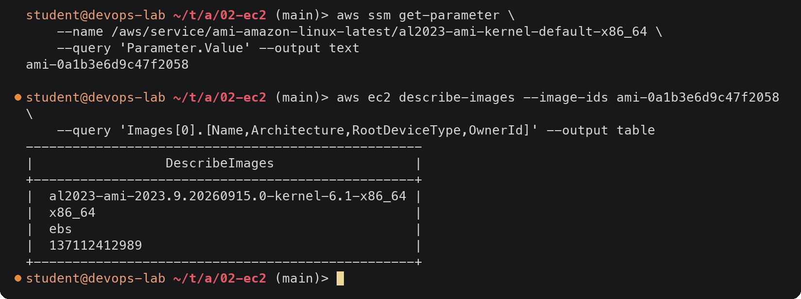
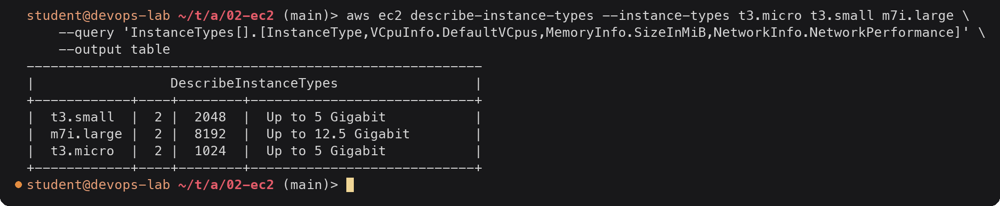
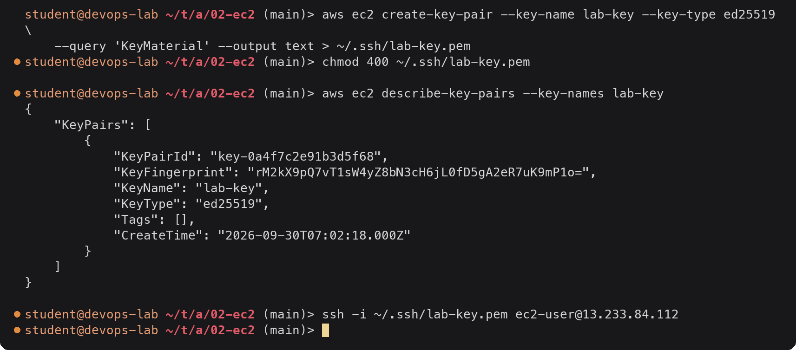
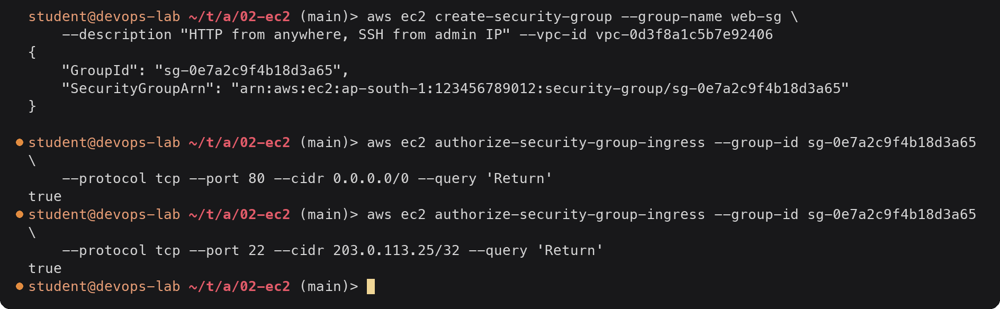
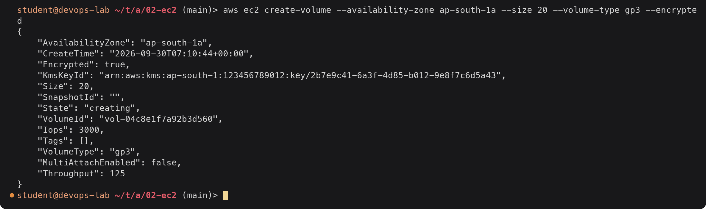
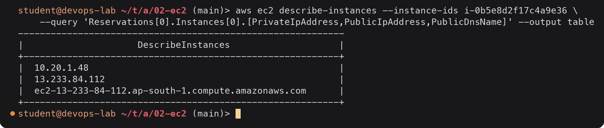
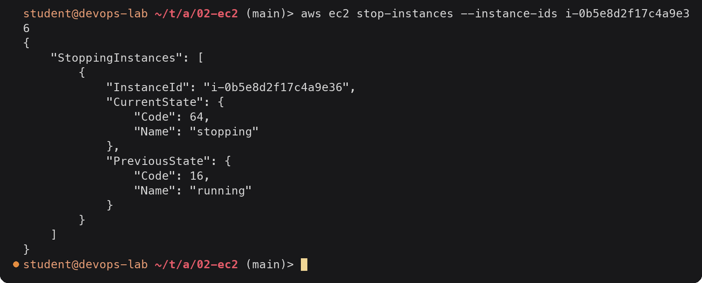

# EC2 (Elastic Compute Cloud)

> **Note:** Command output in this file is representative expected output for the lab environment
> below, written as a learning reference. It was not captured from a live run, so IDs, timestamps
> and pod name hashes will differ when you run it yourself.

Lab environment: see [`../../submission.md`](../../submission.md) (region `ap-south-1`,
account `123456789012`, AWS CLI v2 on `devops-lab`).

## What EC2 is

EC2 gives you virtual machines ("instances") in AWS data centres. You choose the operating
system image, the CPU and memory size, the disk, and the network it sits in, and you pay
per second while it runs (Linux, 60-second minimum). It is Infrastructure as a Service:
AWS runs the hardware and hypervisor, you manage everything from the OS upwards
(patches, software, firewall rules inside the OS).

An instance is always launched into a subnet of a VPC in one Availability Zone.

## AMI (Amazon Machine Image)

An AMI is the template an instance boots from: a root disk snapshot (OS plus any
pre-installed software), the architecture (`x86_64` or `arm64`), the virtualization type
and the default block device mapping.

| Source | Examples |
|---|---|
| AWS | Amazon Linux 2023 (Amazon Linux 2 reached end of support on 2026-06-30) |
| Vendors (verified owners) | Ubuntu (Canonical, owner `099720109477`), Red Hat, Debian, Windows Server |
| AWS Marketplace | Pre-built appliances, some with license fees |
| Your own | Created from a configured instance (`aws ec2 create-image`) or built with Packer |

AMI IDs are **per region**: the same Amazon Linux release has a different ID in
`ap-south-1` and `us-east-1`. Never hard-code one; look it up. AWS publishes the latest
Amazon Linux 2023 AMI ID in SSM Parameter Store:



<details><summary>Text version</summary>

```console
$ aws ssm get-parameter \
    --name /aws/service/ami-amazon-linux-latest/al2023-ami-kernel-default-x86_64 \
    --query 'Parameter.Value' --output text
ami-0a1b3e6d9c47f2058

$ aws ec2 describe-images --image-ids ami-0a1b3e6d9c47f2058 \
    --query 'Images[0].[Name,Architecture,RootDeviceType,OwnerId]' --output table
---------------------------------------------------
|                 DescribeImages                  |
+-------------------------------------------------+
|  al2023-ami-2023.9.20260915.0-kernel-6.1-x86_64 |
|  x86_64                                         |
|  ebs                                            |
|  137112412989                                   |
+-------------------------------------------------+
```

</details>

`137112412989` is the Amazon-owned account that publishes Amazon Linux AMIs. In Terraform
the same lookup is an `aws_ami` data source filtered by `owners` and `name` (task 19).

## Instance types

The type sets vCPUs, memory, network bandwidth and sometimes local storage. The name
reads as **family + generation + options + size**: `t3a.micro` = family `t`, generation
`3`, `a` = AMD CPU, size `micro`. A `g` after the generation (`t4g`, `m7g`) means AWS
Graviton (ARM).

| Family | Optimized for | Examples | Typical use |
|---|---|---|---|
| T (burstable) | Cheap baseline CPU with credits to burst | `t3.micro` 2 vCPU / 1 GiB, `t3.medium` 2 / 4 GiB | Dev, small web servers, CI agents |
| M (general purpose) | Balanced CPU and memory (1:4) | `m7i.large` 2 / 8 GiB | App servers, small databases |
| C (compute) | More CPU per GiB (1:2) | `c7i.xlarge` 4 / 8 GiB | Batch, encoding, high-traffic APIs |
| R / X (memory) | More memory per vCPU (1:8 and up) | `r7i.large` 2 / 16 GiB | In-memory caches, large databases |
| I / D (storage) | Fast local NVMe or dense HDD | `i4i.large` | Databases needing local IOPS |
| P / G / Inf / Trn (accelerated) | GPUs or ML chips | `g5.xlarge` | ML training/inference, graphics |



<details><summary>Text version</summary>

```console
$ aws ec2 describe-instance-types --instance-types t3.micro t3.small m7i.large \
    --query 'InstanceTypes[].[InstanceType,VCpuInfo.DefaultVCpus,MemoryInfo.SizeInMiB,NetworkInfo.NetworkPerformance]' \
    --output table
---------------------------------------------------------
|                 DescribeInstanceTypes                 |
+------------+----+--------+----------------------------+
|  t3.small  |  2 |  2048  |  Up to 5 Gigabit           |
|  m7i.large |  2 |  8192  |  Up to 12.5 Gigabit        |
|  t3.micro  |  2 |  1024  |  Up to 5 Gigabit           |
+------------+----+--------+----------------------------+
```

</details>

Pricing models: **On-Demand** (pay per second, no commitment), **Savings Plans / Reserved
Instances** (1 or 3 year commitment, up to ~70 % cheaper), **Spot** (spare capacity, up to
~90 % cheaper, can be reclaimed with 2 minutes' notice).

## Key pairs

A key pair is an SSH public/private key. AWS stores the public key and places it in
`~/.ssh/authorized_keys` of the default user (`ec2-user` on Amazon Linux, `ubuntu` on
Ubuntu) at first boot. The private key is shown once and AWS does not keep it.



<details><summary>Text version</summary>

```console
$ aws ec2 create-key-pair --key-name lab-key --key-type ed25519 \
    --query 'KeyMaterial' --output text > ~/.ssh/lab-key.pem
$ chmod 400 ~/.ssh/lab-key.pem

$ aws ec2 describe-key-pairs --key-names lab-key
{
    "KeyPairs": [
        {
            "KeyPairId": "key-0a4f7c2e91b3d5f68",
            "KeyFingerprint": "rM2kX9pQ7vT1sW4yZ8bN3cH6jL0fD5gA2eR7uK9mP1o=",
            "KeyName": "lab-key",
            "KeyType": "ed25519",
            "Tags": [],
            "CreateTime": "2026-09-30T07:02:18.000Z"
        }
    ]
}

$ ssh -i ~/.ssh/lab-key.pem ec2-user@13.233.84.112
```

</details>

You can also import your existing public key with `aws ec2 import-key-pair`. For
production, **EC2 Instance Connect** or **SSM Session Manager** avoid managing SSH keys and
open port 22 at all.

## Security groups

A security group is a **stateful** virtual firewall attached to an instance's network
interface.

- Rules are **allow only**; there are no deny rules. Anything not allowed is dropped.
- **Stateful**: if inbound traffic is allowed, the reply is allowed out automatically
  (and the other way round).
- Default for a new group: no inbound rules, all outbound allowed.
- A rule's source can be a CIDR or **another security group**, e.g. "allow 5432 from the
  `web-sg` group", so the rule follows instances as they scale.
- Changes apply immediately to every instance using the group.



<details><summary>Text version</summary>

```console
$ aws ec2 create-security-group --group-name web-sg \
    --description "HTTP from anywhere, SSH from admin IP" --vpc-id vpc-0d3f8a1c5b7e92406
{
    "GroupId": "sg-0e7a2c9f4b18d3a65",
    "SecurityGroupArn": "arn:aws:ec2:ap-south-1:123456789012:security-group/sg-0e7a2c9f4b18d3a65"
}

$ aws ec2 authorize-security-group-ingress --group-id sg-0e7a2c9f4b18d3a65 \
    --protocol tcp --port 80 --cidr 0.0.0.0/0 --query 'Return'
true
$ aws ec2 authorize-security-group-ingress --group-id sg-0e7a2c9f4b18d3a65 \
    --protocol tcp --port 22 --cidr 203.0.113.25/32 --query 'Return'
true
```

</details>

SSH is open only to one admin address (`/32`), never to `0.0.0.0/0`.

## EBS (Elastic Block Store)

EBS volumes are network-attached block disks for instances. A volume lives in one AZ and
can attach to instances in that AZ. It survives stopping the instance; whether it survives
terminating it depends on `DeleteOnTermination` (true by default for the root volume).

| Type | Kind | Baseline | Use |
|---|---|---|---|
| `gp3` | SSD general purpose | 3,000 IOPS and 125 MiB/s included, tunable independently of size | Default for almost everything |
| `gp2` | SSD general purpose (older) | 3 IOPS per GiB | Legacy; move to gp3, it is cheaper |
| `io2` Block Express | SSD provisioned IOPS | Up to 256,000 IOPS | Large transactional databases |
| `st1` | HDD throughput optimized | MB/s oriented | Big sequential data, logs |
| `sc1` | HDD cold | Cheapest | Rarely accessed data |

Other points: **snapshots** are incremental backups stored in S3 and can be copied to other
regions; volumes can be **encrypted** with KMS (turn on encryption by default per region);
volumes can be resized and changed type while in use. **Instance store** is different:
physical disks on the host, very fast but wiped when the instance stops.



<details><summary>Text version</summary>

```console
$ aws ec2 create-volume --availability-zone ap-south-1a --size 20 --volume-type gp3 --encrypted
{
    "AvailabilityZone": "ap-south-1a",
    "CreateTime": "2026-09-30T07:10:44+00:00",
    "Encrypted": true,
    "KmsKeyId": "arn:aws:kms:ap-south-1:123456789012:key/2b7e9c41-6a3f-4d85-b012-9e8f7c6d5a43",
    "Size": 20,
    "SnapshotId": "",
    "State": "creating",
    "VolumeId": "vol-04c8e1f7a92b3d560",
    "Iops": 3000,
    "Tags": [],
    "VolumeType": "gp3",
    "MultiAttachEnabled": false,
    "Throughput": 125
}
```

</details>

## Public vs private IP

| | Private IPv4 | Public IPv4 | Elastic IP |
|---|---|---|---|
| Assigned from | The subnet's CIDR | Amazon's pool | Amazon's pool, allocated to your account |
| Reachable from | Inside the VPC (and peered/VPN networks) | The internet (if routing and SG allow) | The internet |
| Survives stop/start | Yes | **No**, a new one is assigned | Yes, until you release it |
| Cost | Free | Charged per hour (since Feb 2024) | Charged per hour |

Every instance has a primary private IP. A public IP is added only if the subnet has
"auto-assign public IPv4" on, or you ask for one at launch. The instance OS never sees the
public IP: the Internet Gateway does one-to-one NAT between the public and private address.



<details><summary>Text version</summary>

```console
$ aws ec2 describe-instances --instance-ids i-0b5e8d2f17c4a9e36 \
    --query 'Reservations[0].Instances[0].[PrivateIpAddress,PublicIpAddress,PublicDnsName]' --output table
------------------------------------------------------------
|                     DescribeInstances                    |
+----------------------------------------------------------+
|  10.20.1.48                                              |
|  13.233.84.112                                           |
|  ec2-13-233-84-112.ap-south-1.compute.amazonaws.com      |
+----------------------------------------------------------+
```

</details>

## Instance lifecycle

```
            launch
              │
              ▼
          pending ──────────────► running ◄──────────── (start)
                                   │  │  │                  │
                         reboot ◄──┘  │  └── stop ──► stopping ──► stopped
                     (stays running)  │                             │
                                      │                             │
                                 terminate                      terminate
                                      │                             │
                                      ▼                             ▼
                                shutting-down ─────────────► terminated
```

| State | Billed for compute | Notes |
|---|---|---|
| `pending` | No | Booting |
| `running` | Yes | |
| `stopping` / `stopped` | No (EBS still billed) | Root EBS kept; RAM lost; public IP released; may move to new hardware on start |
| `rebooting` | Yes | Same host, same IPs |
| `shutting-down` / `terminated` | No | Instance gone; root volume deleted if `DeleteOnTermination`; stays visible for about an hour |

Spot instances can also be *interrupted*. A stop/start fixes many hardware problems
because the instance usually lands on a different host.



<details><summary>Text version</summary>

```console
$ aws ec2 stop-instances --instance-ids i-0b5e8d2f17c4a9e36
{
    "StoppingInstances": [
        {
            "InstanceId": "i-0b5e8d2f17c4a9e36",
            "CurrentState": {
                "Code": 64,
                "Name": "stopping"
            },
            "PreviousState": {
                "Code": 16,
                "Name": "running"
            }
        }
    ]
}
```

</details>

State codes: 0 pending, 16 running, 32 shutting-down, 48 terminated, 64 stopping, 80 stopped.

## Use cases

| Use case | Typical setup |
|---|---|
| Web or API server | `t3`/`m7i` in an Auto Scaling group behind an Application Load Balancer, in private subnets |
| Lab or dev machine | One `t3.micro` in a public subnet, stopped when not used |
| CI/CD build agents | Spot instances that start for a job and terminate after |
| Self-managed database | `r7i` or `i4i` with gp3/io2 volumes (or use RDS instead) |
| Batch and data processing | `c7i` or Spot fleets |
| ML training / inference | `p5`/`g5` GPU instances, or `trn1`/`inf2` |
| Kubernetes worker nodes | EKS managed node groups are EC2 instances |
| Legacy application that needs a full OS | Lift-and-shift onto EC2 |

When you do not need to manage the OS at all, Lambda, ECS on Fargate or a managed service
is usually less work than EC2.
