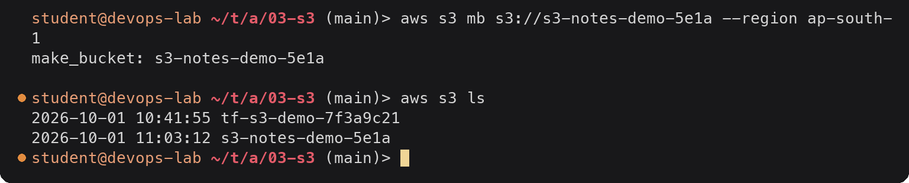
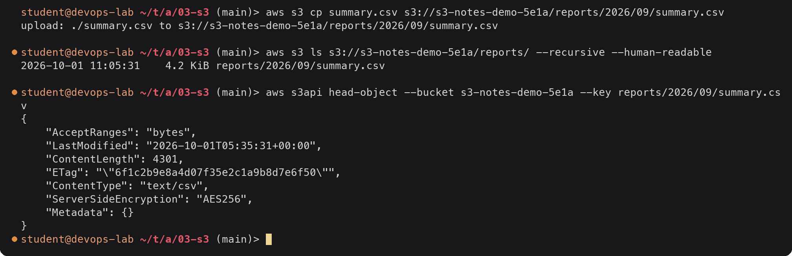
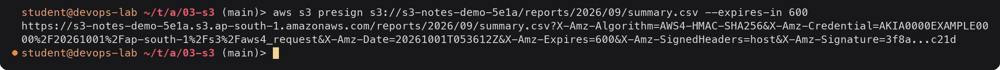
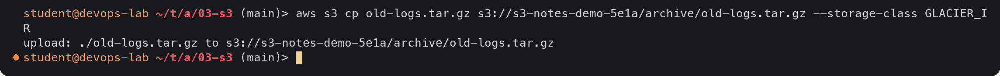
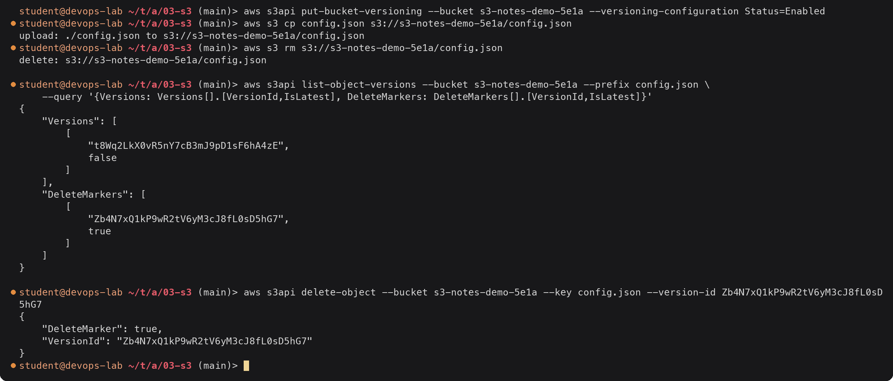
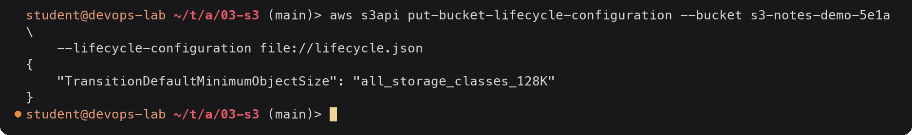
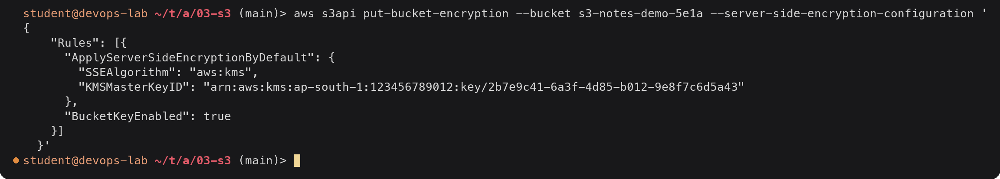
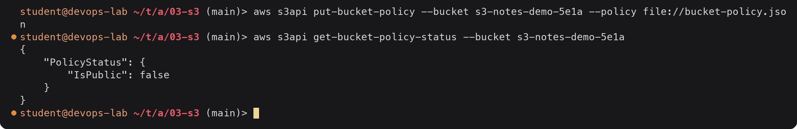

# S3 (Simple Storage Service)

> **Note:** Command output in this file is representative expected output for the lab environment
> below, written as a learning reference. It was not captured from a live run, so IDs, timestamps
> and pod name hashes will differ when you run it yourself.

Lab environment: see [`../../submission.md`](../../submission.md) (region `ap-south-1`,
account `123456789012`, AWS CLI v2 on `devops-lab`). The Terraform side of S3 is in
[`../../terraform-s3-demo/`](../../terraform-s3-demo/).

## What S3 is

S3 is object storage. You store files ("objects") of any type, from 0 bytes up to 5 TB
each, in containers called buckets, and read them over HTTPS by key. There is no file
system to mount, no disk size to choose and no server to run; you pay for what you store,
the requests you make and data transferred out.

- Durability is designed for 99.999999999 % (11 nines): objects are stored across at least
  three Availability Zones (except One Zone classes).
- Since December 2020 S3 is strongly consistent: a read right after a write returns the new
  data.
- It is regional: a bucket lives in one region, but bucket **names** are global.

## Buckets

A bucket is the top-level container.

- The name is unique across **all AWS accounts in the world**: 3-63 characters,
  lowercase letters, numbers, hyphens and dots, starting and ending with a letter or number.
  That is why the Terraform demo adds a random suffix.
- Created in one region; data does not leave it unless you replicate or copy it.
- Settings live on the bucket: versioning, default encryption, public access block,
  policy, lifecycle rules, logging, replication, object ownership.
- New buckets are private: Block Public Access on, ACLs disabled (Object Ownership
  "bucket owner enforced"), SSE-S3 encryption on.



<details><summary>Text version</summary>

```console
$ aws s3 mb s3://s3-notes-demo-5e1a --region ap-south-1
make_bucket: s3-notes-demo-5e1a

$ aws s3 ls
2026-10-01 10:41:55 tf-s3-demo-7f3a9c21
2026-10-01 11:03:12 s3-notes-demo-5e1a
```

</details>

## Objects

An object is the data plus metadata, addressed by a **key**:

| Part | Example |
|---|---|
| Key | `reports/2026/09/summary.csv` |
| Data | the file bytes |
| System metadata | `Content-Type`, `Content-Length`, `ETag`, `Last-Modified`, storage class, encryption |
| User metadata | `x-amz-meta-owner: devops` |
| Version ID | when versioning is on |
| Tags | up to 10 key/value pairs, usable in lifecycle rules and IAM conditions |

There are no real folders: `reports/2026/09/` is just a key prefix, and the console shows
prefixes as folders. Uploads over 100 MB should use multipart upload (the CLI does this
automatically).



<details><summary>Text version</summary>

```console
$ aws s3 cp summary.csv s3://s3-notes-demo-5e1a/reports/2026/09/summary.csv
upload: ./summary.csv to s3://s3-notes-demo-5e1a/reports/2026/09/summary.csv

$ aws s3 ls s3://s3-notes-demo-5e1a/reports/ --recursive --human-readable
2026-10-01 11:05:31    4.2 KiB reports/2026/09/summary.csv

$ aws s3api head-object --bucket s3-notes-demo-5e1a --key reports/2026/09/summary.csv
{
    "AcceptRanges": "bytes",
    "LastModified": "2026-10-01T05:35:31+00:00",
    "ContentLength": 4301,
    "ETag": "\"6f1c2b9e8a4d07f35e2c1a9b8d7e6f50\"",
    "ContentType": "text/csv",
    "ServerSideEncryption": "AES256",
    "Metadata": {}
}
```

</details>

`LastModified` is UTC; the `ls` listing shows local time (IST, UTC+5:30).

Sharing a private object for a limited time uses a **presigned URL**, signed with the
caller's credentials:



<details><summary>Text version</summary>

```console
$ aws s3 presign s3://s3-notes-demo-5e1a/reports/2026/09/summary.csv --expires-in 600
https://s3-notes-demo-5e1a.s3.ap-south-1.amazonaws.com/reports/2026/09/summary.csv?X-Amz-Algorithm=AWS4-HMAC-SHA256&X-Amz-Credential=AKIA0000EXAMPLE0000%2F20261001%2Fap-south-1%2Fs3%2Faws4_request&X-Amz-Date=20261001T053612Z&X-Amz-Expires=600&X-Amz-SignedHeaders=host&X-Amz-Signature=3f8a...c21d
```

</details>

## Storage classes

The storage class is set per object. All classes have the same 11 nines durability; they
differ in price, availability, minimum storage time and retrieval cost/time.

| Class | Use for | AZs | Min. duration | Retrieval |
|---|---|---|---|---|
| S3 Standard | Frequently accessed data | ≥ 3 | none | instant, no fee |
| S3 Intelligent-Tiering | Unknown or changing access patterns; moves objects between tiers automatically | ≥ 3 | none | instant (archive tiers optional), small monitoring fee |
| S3 Standard-IA | Accessed less than about once a month, needed fast | ≥ 3 | 30 days | instant, per-GB fee |
| S3 One Zone-IA | Re-creatable infrequent data | 1 | 30 days | instant, per-GB fee |
| S3 Express One Zone | Single-digit ms latency for hot data near compute | 1 | none | instant (directory buckets) |
| S3 Glacier Instant Retrieval | Archive read about once a quarter, needed in ms | ≥ 3 | 90 days | instant, higher per-GB fee |
| S3 Glacier Flexible Retrieval | Archive, minutes to hours is fine | ≥ 3 | 90 days | 1-5 min expedited, 3-5 h standard, 5-12 h bulk |
| S3 Glacier Deep Archive | Long-term compliance archives | ≥ 3 | 180 days | 12 h standard, 48 h bulk |



<details><summary>Text version</summary>

```console
$ aws s3 cp old-logs.tar.gz s3://s3-notes-demo-5e1a/archive/old-logs.tar.gz --storage-class GLACIER_IR
upload: ./old-logs.tar.gz to s3://s3-notes-demo-5e1a/archive/old-logs.tar.gz
```

</details>

## Versioning

With versioning on, every overwrite creates a new version and a delete only adds a
**delete marker**; older versions stay and can be restored.

- Bucket states: *unversioned* (default) → *enabled* → *suspended*. Once enabled, it can
  never go back to unversioned, only suspended.
- Every version is a billed object. Pair versioning with a lifecycle rule that expires
  noncurrent versions.
- MFA Delete (root user only) can require MFA to delete versions or change versioning.
- Versioning is required for replication and for S3 Object Lock.



<details><summary>Text version</summary>

```console
$ aws s3api put-bucket-versioning --bucket s3-notes-demo-5e1a --versioning-configuration Status=Enabled
$ aws s3 cp config.json s3://s3-notes-demo-5e1a/config.json
upload: ./config.json to s3://s3-notes-demo-5e1a/config.json
$ aws s3 rm s3://s3-notes-demo-5e1a/config.json
delete: s3://s3-notes-demo-5e1a/config.json

$ aws s3api list-object-versions --bucket s3-notes-demo-5e1a --prefix config.json \
    --query '{Versions: Versions[].[VersionId,IsLatest], DeleteMarkers: DeleteMarkers[].[VersionId,IsLatest]}'
{
    "Versions": [
        [
            "t8Wq2LkX0vR5nY7cB3mJ9pD1sF6hA4zE",
            false
        ]
    ],
    "DeleteMarkers": [
        [
            "Zb4N7xQ1kP9wR2tV6yM3cJ8fL0sD5hG7",
            true
        ]
    ]
}

$ aws s3api delete-object --bucket s3-notes-demo-5e1a --key config.json --version-id Zb4N7xQ1kP9wR2tV6yM3cJ8fL0sD5hG7
{
    "DeleteMarker": true,
    "VersionId": "Zb4N7xQ1kP9wR2tV6yM3cJ8fL0sD5hG7"
}
```

</details>

Deleting the delete marker "undeletes" the object: `config.json` is back.

## Lifecycle policies

Lifecycle rules act on objects automatically, filtered by prefix, tags or size:

- **Transition** actions move objects to a cheaper storage class after N days.
- **Expiration** actions delete objects (or noncurrent versions, or expired delete
  markers) after N days.
- **AbortIncompleteMultipartUpload** cleans up failed uploads that would otherwise be
  billed forever.

`lifecycle.json`:

```json
{
  "Rules": [
    {
      "ID": "logs-tiering",
      "Status": "Enabled",
      "Filter": { "Prefix": "logs/" },
      "Transitions": [
        { "Days": 30, "StorageClass": "STANDARD_IA" },
        { "Days": 90, "StorageClass": "GLACIER" }
      ],
      "Expiration": { "Days": 365 }
    },
    {
      "ID": "clean-old-versions",
      "Status": "Enabled",
      "Filter": {},
      "NoncurrentVersionExpiration": { "NoncurrentDays": 30, "NewerNoncurrentVersions": 3 },
      "AbortIncompleteMultipartUpload": { "DaysAfterInitiation": 7 }
    }
  ]
}
```



<details><summary>Text version</summary>

```console
$ aws s3api put-bucket-lifecycle-configuration --bucket s3-notes-demo-5e1a \
    --lifecycle-configuration file://lifecycle.json
{
    "TransitionDefaultMinimumObjectSize": "all_storage_classes_128K"
}
```

</details>

Logs stay in Standard for 30 days, move to Standard-IA, then to Glacier Flexible Retrieval
at 90 days and are deleted after a year. Old versions are kept for 30 days (always keeping
the 3 newest). By default objects smaller than 128 KB are not transitioned, because the
per-object overhead would cost more than it saves.

## Encryption

| Option | Keys managed by | Notes |
|---|---|---|
| SSE-S3 (`AES256`) | S3 | Default for every new object since Jan 2023, no cost, no setup |
| SSE-KMS (`aws:kms`) | AWS KMS (AWS managed or your customer managed key) | Key policy controls who can decrypt, every use is in CloudTrail; enable **S3 Bucket Keys** to cut KMS request costs |
| DSSE-KMS | KMS, two layers | For compliance rules that require dual-layer encryption |
| SSE-C | You send the key with every request | S3 never stores the key |
| Client-side | You, before upload | S3 only ever sees ciphertext |

Encryption **in transit** is HTTPS; enforce it with a bucket policy that denies
`aws:SecureTransport = false` (below).



<details><summary>Text version</summary>

```console
$ aws s3api put-bucket-encryption --bucket s3-notes-demo-5e1a --server-side-encryption-configuration '{
    "Rules": [{
      "ApplyServerSideEncryptionByDefault": {
        "SSEAlgorithm": "aws:kms",
        "KMSMasterKeyID": "arn:aws:kms:ap-south-1:123456789012:key/2b7e9c41-6a3f-4d85-b012-9e8f7c6d5a43"
      },
      "BucketKeyEnabled": true
    }]
  }'
```

</details>

## Bucket policies

A bucket policy is a resource-based IAM policy attached to the bucket. It has a
`Principal` and can grant access to other accounts, services or (if Block Public Access
allows) everyone. Access is granted if the caller's IAM policy **or** the bucket policy
allows it (same account), and no explicit `Deny` matches.

`bucket-policy.json`, which only allows HTTPS and lets one role read objects:

```json
{
  "Version": "2012-10-17",
  "Statement": [
    {
      "Sid": "DenyInsecureTransport",
      "Effect": "Deny",
      "Principal": "*",
      "Action": "s3:*",
      "Resource": [
        "arn:aws:s3:::s3-notes-demo-5e1a",
        "arn:aws:s3:::s3-notes-demo-5e1a/*"
      ],
      "Condition": { "Bool": { "aws:SecureTransport": "false" } }
    },
    {
      "Sid": "AllowWebRoleRead",
      "Effect": "Allow",
      "Principal": { "AWS": "arn:aws:iam::123456789012:role/web-s3-reader" },
      "Action": "s3:GetObject",
      "Resource": "arn:aws:s3:::s3-notes-demo-5e1a/*"
    }
  ]
}
```



<details><summary>Text version</summary>

```console
$ aws s3api put-bucket-policy --bucket s3-notes-demo-5e1a --policy file://bucket-policy.json
$ aws s3api get-bucket-policy-status --bucket s3-notes-demo-5e1a
{
    "PolicyStatus": {
        "IsPublic": false
    }
}
```

</details>

Other access controls, for completeness: **Block Public Access** (account and bucket
level, overrides any policy that would make data public), **ACLs** (legacy, disabled by
default), **access points** (named endpoints with their own policies for large shared
buckets) and **presigned URLs**.

## Use cases

| Use case | Relevant features |
|---|---|
| Static website assets / frontend hosting | Bucket behind CloudFront with Origin Access Control |
| Backups and disaster recovery | Versioning, lifecycle to Glacier, Cross-Region Replication, Object Lock |
| Logs (ALB, CloudTrail, VPC Flow Logs, app logs) | Lifecycle tiering and expiration, Athena to query in place |
| Data lake for analytics | Parquet files queried with Athena, Glue, EMR, Redshift Spectrum |
| Build artifacts and release packages | Versioned bucket, presigned URLs for downloads |
| Terraform remote state | Versioning + encryption + `use_lockfile` (or a DynamoDB lock table), see task 19 |
| User uploads for a web app | Presigned PUT URLs so uploads go straight to S3, not through the app server |
| Media storage and distribution | Intelligent-Tiering, CloudFront |
