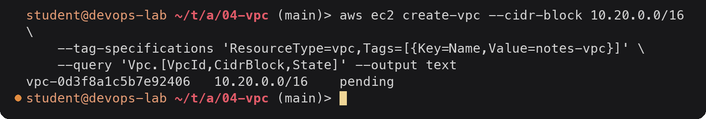
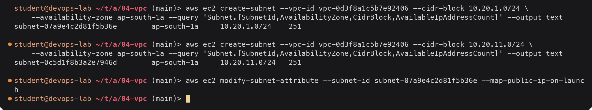
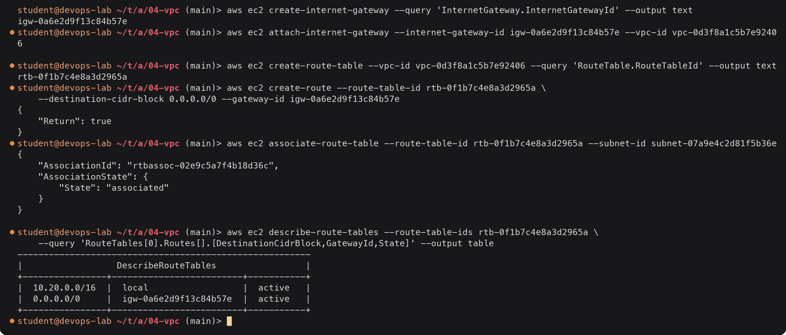
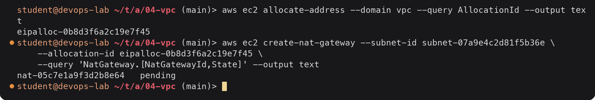
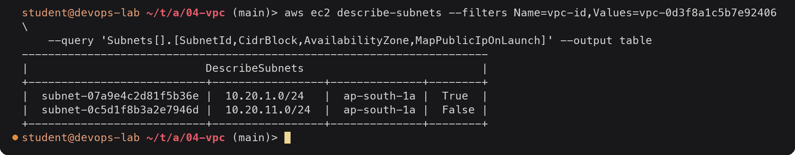
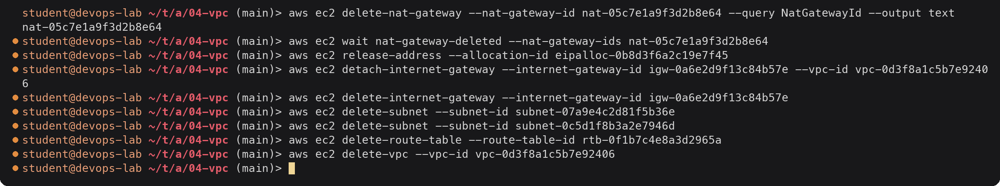

# VPC (Virtual Private Cloud)

> **Note:** Command output in this file is representative expected output for the lab environment
> below, written as a learning reference. It was not captured from a live run, so IDs, timestamps
> and pod name hashes will differ when you run it yourself.

Lab environment: see [`../../submission.md`](../../submission.md) (region `ap-south-1`,
account `123456789012`, AWS CLI v2 on `devops-lab`). Task 19 builds the same network
with Terraform.

## What a VPC is

A VPC is your own logically isolated network inside an AWS region. You choose its IP
range, split it into subnets, and decide how traffic is routed and filtered. EC2
instances, RDS databases, load balancers, EKS nodes and Lambda functions (when attached)
all get their network interfaces inside a VPC.

- A VPC belongs to **one region** and spans all of that region's Availability Zones.
- Each **subnet** lives in exactly **one AZ**.
- Every region has a **default VPC** (`172.31.0.0/16`, a public subnet in each AZ) so you
  can launch instances immediately. For real workloads you create your own.
- VPCs are free; NAT gateways, public IPv4 addresses, VPC endpoints and traffic across
  AZs are billed.

```
Region ap-south-1
└── VPC 10.20.0.0/16
    ├── AZ ap-south-1a
    │   ├── public subnet  10.20.1.0/24   ── route 0.0.0.0/0 → Internet Gateway
    │   └── private subnet 10.20.11.0/24  ── route 0.0.0.0/0 → NAT Gateway (in public subnet)
    └── AZ ap-south-1b
        ├── public subnet  10.20.2.0/24
        └── private subnet 10.20.12.0/24
```

## CIDR

CIDR (Classless Inter-Domain Routing) notation writes a range as `address/prefix`. The
prefix is how many leading bits are fixed; the remaining bits are host addresses.

| CIDR | Fixed bits | Addresses | Typical use |
|---|---|---|---|
| `10.20.0.0/16` | 16 | 65,536 | Whole VPC (the largest a VPC CIDR can be) |
| `10.20.1.0/24` | 24 | 256 (251 usable in AWS) | One subnet |
| `10.20.1.0/28` | 28 | 16 (11 usable) | Smallest subnet AWS allows |
| `203.0.113.25/32` | 32 | 1 | A single IP in a security group rule |
| `0.0.0.0/0` | 0 | everything | "Anywhere", default route |

Rules for VPC CIDRs:

- Use private ranges (RFC 1918): `10.0.0.0/8`, `172.16.0.0/12`, `192.168.0.0/16`.
- Size between `/16` and `/28`. More CIDR blocks can be added later.
- Plan ahead so VPCs that may ever be peered or connected by VPN / Transit Gateway do
  **not overlap**; overlapping ranges cannot be routed to each other.

AWS reserves 5 addresses in every subnet. In `10.20.1.0/24`: `.0` network, `.1` VPC
router, `.2` DNS resolver, `.3` reserved for future use, `.255` broadcast (unused but
reserved). That is why a /24 has 251 usable addresses.



<details><summary>Text version</summary>

```console
$ aws ec2 create-vpc --cidr-block 10.20.0.0/16 \
    --tag-specifications 'ResourceType=vpc,Tags=[{Key=Name,Value=notes-vpc}]' \
    --query 'Vpc.[VpcId,CidrBlock,State]' --output text
vpc-0d3f8a1c5b7e92406	10.20.0.0/16	pending
```

</details>

## Subnets

A subnet is a slice of the VPC CIDR in one AZ. Resources are launched into subnets, not
into the VPC directly. What makes a subnet "public" or "private" is not a setting on the
subnet but the **route table** associated with it.

Spreading subnets across at least two AZs is what gives high availability: if one AZ has
an outage, resources in the other keep running.



<details><summary>Text version</summary>

```console
$ aws ec2 create-subnet --vpc-id vpc-0d3f8a1c5b7e92406 --cidr-block 10.20.1.0/24 \
    --availability-zone ap-south-1a --query 'Subnet.[SubnetId,AvailabilityZone,CidrBlock,AvailableIpAddressCount]' --output text
subnet-07a9e4c2d81f5b36e	ap-south-1a	10.20.1.0/24	251

$ aws ec2 create-subnet --vpc-id vpc-0d3f8a1c5b7e92406 --cidr-block 10.20.11.0/24 \
    --availability-zone ap-south-1a --query 'Subnet.[SubnetId,AvailabilityZone,CidrBlock,AvailableIpAddressCount]' --output text
subnet-0c5d1f8b3a2e7946d	ap-south-1a	10.20.11.0/24	251

$ aws ec2 modify-subnet-attribute --subnet-id subnet-07a9e4c2d81f5b36e --map-public-ip-on-launch
```

</details>

The last command makes instances in the public subnet get a public IPv4 address
automatically.

## Route tables

A route table is a list of rules: "traffic for this destination CIDR goes to this target".
Each subnet is associated with exactly one route table; a route table can serve many
subnets. The most specific (longest prefix) matching route wins.

Every route table has the `local` route for the VPC CIDR, which cannot be removed: all
subnets in a VPC can always reach each other (security groups and NACLs still filter).

Public subnet route table:

| Destination | Target |
|---|---|
| `10.20.0.0/16` | `local` |
| `0.0.0.0/0` | `igw-...` (Internet Gateway) |

Private subnet route table:

| Destination | Target |
|---|---|
| `10.20.0.0/16` | `local` |
| `0.0.0.0/0` | `nat-...` (NAT Gateway) |

The VPC also has a **main route table** used by any subnet without an explicit
association. Leave it with only the `local` route, so a forgotten subnet is private by
default.

## Internet Gateway (IGW)

An Internet Gateway connects a VPC to the internet. It is horizontally scaled and highly
available by AWS, has no bandwidth limit, and costs nothing by itself.

- One IGW per VPC; it must be attached to the VPC.
- It performs one-to-one NAT between an instance's private IP and its public IP.
- An instance can be reached from the internet only if all of these hold: public IP,
  subnet route `0.0.0.0/0 → igw`, security group allows the port, NACL allows the traffic.



<details><summary>Text version</summary>

```console
$ aws ec2 create-internet-gateway --query 'InternetGateway.InternetGatewayId' --output text
igw-0a6e2d9f13c84b57e
$ aws ec2 attach-internet-gateway --internet-gateway-id igw-0a6e2d9f13c84b57e --vpc-id vpc-0d3f8a1c5b7e92406

$ aws ec2 create-route-table --vpc-id vpc-0d3f8a1c5b7e92406 --query 'RouteTable.RouteTableId' --output text
rtb-0f1b7c4e8a3d2965a
$ aws ec2 create-route --route-table-id rtb-0f1b7c4e8a3d2965a \
    --destination-cidr-block 0.0.0.0/0 --gateway-id igw-0a6e2d9f13c84b57e
{
    "Return": true
}
$ aws ec2 associate-route-table --route-table-id rtb-0f1b7c4e8a3d2965a --subnet-id subnet-07a9e4c2d81f5b36e
{
    "AssociationId": "rtbassoc-02e9c5a7f4b18d36c",
    "AssociationState": {
        "State": "associated"
    }
}

$ aws ec2 describe-route-tables --route-table-ids rtb-0f1b7c4e8a3d2965a \
    --query 'RouteTables[0].Routes[].[DestinationCidrBlock,GatewayId,State]' --output table
--------------------------------------------------------
|                  DescribeRouteTables                 |
+----------------+-------------------------+-----------+
|  10.20.0.0/16  |  local                  |  active   |
|  0.0.0.0/0     |  igw-0a6e2d9f13c84b57e  |  active   |
+----------------+-------------------------+-----------+
```

</details>

## NAT Gateway

A NAT Gateway lets instances in **private** subnets start connections **out** to the
internet (OS updates, pulling images, calling external APIs) while nothing on the
internet can start a connection **in** to them.

- It is placed in a **public** subnet and gets an Elastic IP.
- Private route tables send `0.0.0.0/0` to it; it sends traffic on through the IGW.
- It is zonal. For high availability, one NAT Gateway per AZ, with each AZ's private route
  table pointing at the NAT in the same AZ.
- It is billed per hour plus per GB processed, so it is often the largest line of a small
  VPC bill. VPC endpoints for S3/DynamoDB (gateway endpoints, free) keep that traffic off
  the NAT.



<details><summary>Text version</summary>

```console
$ aws ec2 allocate-address --domain vpc --query AllocationId --output text
eipalloc-0b8d3f6a2c19e7f45
$ aws ec2 create-nat-gateway --subnet-id subnet-07a9e4c2d81f5b36e \
    --allocation-id eipalloc-0b8d3f6a2c19e7f45 \
    --query 'NatGateway.[NatGatewayId,State]' --output text
nat-05c7e1a9f3d2b8e64	pending
```

</details>

| | Internet Gateway | NAT Gateway |
|---|---|---|
| Direction | In and out | Out only (plus replies) |
| Used by | Public subnets | Private subnets |
| Needs a public IP on the instance | Yes | No |
| Lives in | The VPC (attached) | A public subnet, one AZ |
| Cost | Free | Hourly + per GB |

## Security groups

Security groups are stateful firewalls attached to network interfaces (instances, RDS,
load balancers, Lambda ENIs). Covered in detail in the EC2 notes; in VPC terms:

- Allow rules only, evaluated together (no order).
- Stateful: return traffic is allowed automatically.
- Can reference other security groups as source, which is how tiers are connected:

| Group | Inbound rule |
|---|---|
| `alb-sg` | 443 from `0.0.0.0/0` |
| `web-sg` | 80 from `alb-sg` |
| `db-sg` | 5432 from `web-sg` |

The database accepts connections only from instances in the web tier, wherever they are
and however many there are.

## Network ACLs (NACLs)

A NACL is a **stateless** firewall at the **subnet** boundary.

- Has both **allow and deny** rules.
- Rules are numbered and evaluated **in order, lowest first**; the first match decides.
  The final `*` rule denies anything not matched.
- **Stateless**: return traffic must be allowed explicitly, which usually means allowing
  the ephemeral port range `1024-65535` outbound for replies (and inbound for responses to
  outbound requests).
- The default NACL allows everything in and out. A custom NACL denies everything until
  rules are added.

Example NACL for a public web subnet:

| Rule # | Direction | Protocol | Port | Source / Dest | Action |
|---|---|---|---|---|---|
| 90 | Inbound | TCP | 80 | `198.51.100.0/24` (known bad range) | DENY |
| 100 | Inbound | TCP | 80 | `0.0.0.0/0` | ALLOW |
| 110 | Inbound | TCP | 443 | `0.0.0.0/0` | ALLOW |
| 120 | Inbound | TCP | 1024-65535 | `0.0.0.0/0` | ALLOW (replies to the instance's own outbound calls) |
| * | Inbound | all | all | `0.0.0.0/0` | DENY |
| 100 | Outbound | TCP | 1024-65535 | `0.0.0.0/0` | ALLOW (replies to clients) |
| 110 | Outbound | TCP | 80, 443 | `0.0.0.0/0` | ALLOW (updates) |
| * | Outbound | all | all | `0.0.0.0/0` | DENY |

### Security group vs NACL

| | Security group | Network ACL |
|---|---|---|
| Applies to | Network interface (instance) | Subnet |
| State | Stateful | Stateless |
| Rules | Allow only | Allow and deny |
| Evaluation | All rules together | In number order, first match wins |
| Default | Deny in, allow out | Default NACL allows all |
| Typical use | Main access control, per tier | Coarse subnet-wide guard rail, blocking specific ranges |

## Public vs private subnet

| | Public subnet | Private subnet |
|---|---|---|
| Route `0.0.0.0/0` | → Internet Gateway | → NAT Gateway (or no internet route at all) |
| Instances get public IPs | Usually (auto-assign on) | No |
| Reachable from the internet | Yes, if SG/NACL allow | No |
| Can reach the internet | Directly | Outbound only through NAT |
| What goes there | Load balancers, NAT gateways, bastion hosts | App servers, databases, caches, EKS nodes |

The standard layout puts only the load balancer (and NAT gateways) in public subnets and
everything else in private subnets. In the task 19 project, the web server sits directly
in a public subnet to keep the lab small and avoid NAT gateway cost; the trade-off is
explained there.



<details><summary>Text version</summary>

```console
$ aws ec2 describe-subnets --filters Name=vpc-id,Values=vpc-0d3f8a1c5b7e92406 \
    --query 'Subnets[].[SubnetId,CidrBlock,AvailabilityZone,MapPublicIpOnLaunch]' --output table
-----------------------------------------------------------------------
|                           DescribeSubnets                           |
+---------------------------+-----------------+--------------+--------+
|  subnet-07a9e4c2d81f5b36e |  10.20.1.0/24   |  ap-south-1a |  True  |
|  subnet-0c5d1f8b3a2e7946d |  10.20.11.0/24  |  ap-south-1a |  False |
+---------------------------+-----------------+--------------+--------+
```

</details>

## Cleaning up the CLI example

The NAT gateway and Elastic IP are billed by the hour, so they go first:



<details><summary>Text version</summary>

```console
$ aws ec2 delete-nat-gateway --nat-gateway-id nat-05c7e1a9f3d2b8e64 --query NatGatewayId --output text
nat-05c7e1a9f3d2b8e64
$ aws ec2 wait nat-gateway-deleted --nat-gateway-ids nat-05c7e1a9f3d2b8e64
$ aws ec2 release-address --allocation-id eipalloc-0b8d3f6a2c19e7f45
$ aws ec2 detach-internet-gateway --internet-gateway-id igw-0a6e2d9f13c84b57e --vpc-id vpc-0d3f8a1c5b7e92406
$ aws ec2 delete-internet-gateway --internet-gateway-id igw-0a6e2d9f13c84b57e
$ aws ec2 delete-subnet --subnet-id subnet-07a9e4c2d81f5b36e
$ aws ec2 delete-subnet --subnet-id subnet-0c5d1f8b3a2e7946d
$ aws ec2 delete-route-table --route-table-id rtb-0f1b7c4e8a3d2965a
$ aws ec2 delete-vpc --vpc-id vpc-0d3f8a1c5b7e92406
```

</details>

Doing this by hand, in the right order, is exactly the work Terraform's dependency graph
does for `terraform destroy` in task 19.
