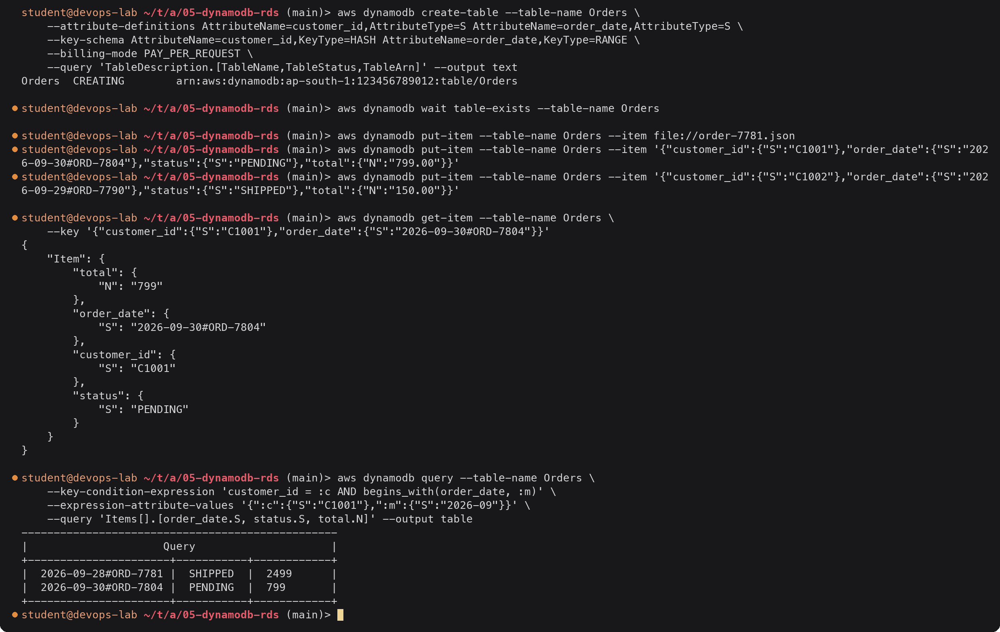
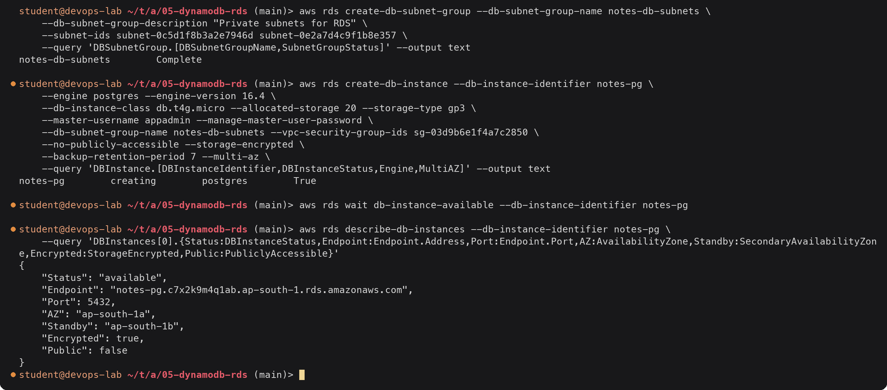
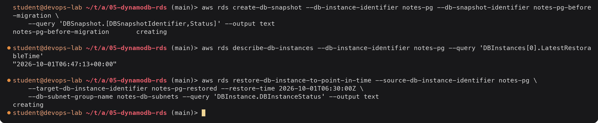
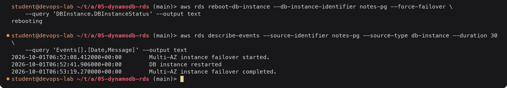
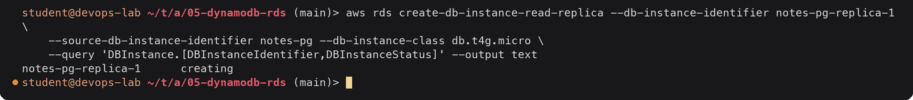

# DynamoDB and RDS

> **Note:** Command output in this file is representative expected output for the lab environment
> below, written as a learning reference. It was not captured from a live run, so IDs, timestamps
> and pod name hashes will differ when you run it yourself.

Lab environment: see [`../../submission.md`](../../submission.md) (region `ap-south-1`,
account `123456789012`, AWS CLI v2 on `devops-lab`).

AWS has two main managed database families. **DynamoDB** is a serverless NoSQL key-value
and document database. **RDS** runs classic relational engines (PostgreSQL, MySQL and
others) for you. The comparison at the end shows when to pick which.

---

# Part 1: DynamoDB

## NoSQL

"NoSQL" covers databases that do not use the relational table-with-joins model. DynamoDB
is a **key-value and document** store:

- No fixed schema: only the key attributes are declared; every item can have different
  other attributes.
- No joins and no ad-hoc SQL queries. You read by key, or by key range. Data is modelled
  around the **access patterns** (the questions the app will ask), often in one table.
- Scales horizontally without limits by partitioning data across servers by key, with
  single-digit millisecond latency at any size.
- Fully serverless: no instances, no patching, no storage to size. Billing is
  **on-demand** (per request) or **provisioned** (read/write capacity units, can
  auto-scale).
- Data is replicated across three AZs. Optional: point-in-time recovery (PITR) for the
  last 35 days, global tables (multi-region active-active), TTL to expire items, Streams
  for change events, transactions across items.

## Tables, items and attributes

| DynamoDB | Rough relational equivalent |
|---|---|
| Table | Table |
| Item | Row (max 400 KB) |
| Attribute | Column, but per item, not per table |

Attribute types: scalar (`S` string, `N` number, `B` binary, `BOOL`, `NULL`), document
(`M` map, `L` list) and sets (`SS`, `NS`, `BS`).

An item in an `Orders` table (DynamoDB JSON, with type tags):

```json
{
  "customer_id": { "S": "C1001" },
  "order_date":  { "S": "2026-09-28#ORD-7781" },
  "status":      { "S": "SHIPPED" },
  "total":       { "N": "2499.00" },
  "items": { "L": [
      { "M": { "sku": { "S": "KB-01" }, "qty": { "N": "1" } } },
      { "M": { "sku": { "S": "MS-02" }, "qty": { "N": "2" } } }
  ] }
}
```

## Partition key

Every table has a primary key. The **partition key** (also called hash key) is required.
DynamoDB hashes its value to decide which physical partition stores the item.

- With a partition key only, it must be **unique** per item (like `user_id`).
- Reads by partition key go straight to one partition: fast at any table size.
- Choose a key with **many distinct values and evenly spread traffic**. A key like
  `status` (few values) or "today's date" creates a **hot partition** that throttles
  while the rest of the table is idle.

## Sort key

The optional **sort key** (range key) makes the primary key composite:
`partition key + sort key` must be unique together.

- Items with the same partition key are stored together, ordered by sort key.
- Enables range queries inside a partition: `begins_with`, `between`, `<`, `>`.
- Common pattern: partition key = customer, sort key = date-prefixed order ID, so "all
  orders of customer C1001 in September 2026" is one `Query`.

For other access patterns, add secondary indexes: a **GSI** (global secondary index, a
different partition and sort key, e.g. `status` + `order_date`) or an **LSI** (same
partition key, different sort key, only at table creation).

## CLI walk-through



<details><summary>Text version</summary>

```console
$ aws dynamodb create-table --table-name Orders \
    --attribute-definitions AttributeName=customer_id,AttributeType=S AttributeName=order_date,AttributeType=S \
    --key-schema AttributeName=customer_id,KeyType=HASH AttributeName=order_date,KeyType=RANGE \
    --billing-mode PAY_PER_REQUEST \
    --query 'TableDescription.[TableName,TableStatus,TableArn]' --output text
Orders	CREATING	arn:aws:dynamodb:ap-south-1:123456789012:table/Orders

$ aws dynamodb wait table-exists --table-name Orders

$ aws dynamodb put-item --table-name Orders --item file://order-7781.json
$ aws dynamodb put-item --table-name Orders --item '{"customer_id":{"S":"C1001"},"order_date":{"S":"2026-09-30#ORD-7804"},"status":{"S":"PENDING"},"total":{"N":"799.00"}}'
$ aws dynamodb put-item --table-name Orders --item '{"customer_id":{"S":"C1002"},"order_date":{"S":"2026-09-29#ORD-7790"},"status":{"S":"SHIPPED"},"total":{"N":"150.00"}}'

$ aws dynamodb get-item --table-name Orders \
    --key '{"customer_id":{"S":"C1001"},"order_date":{"S":"2026-09-30#ORD-7804"}}'
{
    "Item": {
        "total": {
            "N": "799"
        },
        "order_date": {
            "S": "2026-09-30#ORD-7804"
        },
        "customer_id": {
            "S": "C1001"
        },
        "status": {
            "S": "PENDING"
        }
    }
}

$ aws dynamodb query --table-name Orders \
    --key-condition-expression 'customer_id = :c AND begins_with(order_date, :m)' \
    --expression-attribute-values '{":c":{"S":"C1001"},":m":{"S":"2026-09"}}' \
    --query 'Items[].[order_date.S, status.S, total.N]' --output table
-------------------------------------------------
|                     Query                     |
+----------------------+-----------+------------+
|  2026-09-28#ORD-7781 |  SHIPPED  |  2499      |
|  2026-09-30#ORD-7804 |  PENDING  |  799       |
+----------------------+-----------+------------+
```

</details>

The query read only customer C1001's partition and returned both September orders, sorted
by the sort key. Customer C1002's order was never read: a `Query` only touches one
partition, unlike a `Scan`, which reads the whole table. The CLI's `--query` option is a
client-side JMESPath filter that flattens DynamoDB's typed JSON into a table. Numbers come
back normalized (`2499.00` is stored as `2499`).

## DynamoDB use cases

| Use case | Why DynamoDB fits |
|---|---|
| User sessions, shopping carts | Key lookups, TTL removes expired items |
| Gaming leaderboards and player state | Huge write rates, predictable latency |
| IoT and event data (device ID + timestamp) | Partition by device, sort by time |
| Serverless apps (API Gateway + Lambda) | No connections to manage, pay per request |
| Metadata / catalog lookups | Simple access patterns at any scale |
| Terraform state locking | Classic `dynamodb_table` lock for the S3 backend (`LockID` partition key) |

---

# Part 2: RDS

## Relational databases

A relational database stores data in **tables with a fixed schema** (columns with
types), links tables with **foreign keys**, and is queried with **SQL**, including joins
across tables and ad-hoc queries nobody planned for. Transactions are **ACID** (atomic,
consistent, isolated, durable).

**Amazon RDS** runs these engines as a managed service. AWS handles provisioning,
OS and engine patching (in a maintenance window you choose), backups, failover and
monitoring. You still own the schema, queries, indexes and instance sizing. You do not get
SSH or OS access to the database host.

## Engines

| Engine | Notes |
|---|---|
| PostgreSQL | Feature-rich open source; common default for new apps |
| MySQL | Most widely used open source engine |
| MariaDB | MySQL fork |
| Oracle | Bring your own license or license included |
| Microsoft SQL Server | Express, Web, Standard, Enterprise editions |
| IBM Db2 | Added in 2023 |
| Amazon Aurora (MySQL- or PostgreSQL-compatible) | AWS-built storage layer: 6 copies across 3 AZs, up to 15 low-lag replicas, Aurora Serverless v2 |

## DB instances

A DB instance is the database server: an instance class plus storage.

- **Instance class**: `db.t4g.micro` (burstable, free-tier eligible), `db.m7g.large`
  (general), `db.r7g.xlarge` (memory optimized), and so on.
- **Storage**: gp3 (default), io1/io2 (provisioned IOPS), with storage autoscaling up to a
  limit you set.
- **Parameter groups** hold engine settings (`max_connections`, `work_mem`);
  **option groups** add features for some engines.
- The app connects to a DNS **endpoint**, not an IP, so failover can move it.



<details><summary>Text version</summary>

```console
$ aws rds create-db-subnet-group --db-subnet-group-name notes-db-subnets \
    --db-subnet-group-description "Private subnets for RDS" \
    --subnet-ids subnet-0c5d1f8b3a2e7946d subnet-0e2a7d4c9f1b8e357 \
    --query 'DBSubnetGroup.[DBSubnetGroupName,SubnetGroupStatus]' --output text
notes-db-subnets	Complete

$ aws rds create-db-instance --db-instance-identifier notes-pg \
    --engine postgres --engine-version 16.4 \
    --db-instance-class db.t4g.micro --allocated-storage 20 --storage-type gp3 \
    --master-username appadmin --manage-master-user-password \
    --db-subnet-group-name notes-db-subnets --vpc-security-group-ids sg-03d9b6e1f4a7c2850 \
    --no-publicly-accessible --storage-encrypted \
    --backup-retention-period 7 --multi-az \
    --query 'DBInstance.[DBInstanceIdentifier,DBInstanceStatus,Engine,MultiAZ]' --output text
notes-pg	creating	postgres	True

$ aws rds wait db-instance-available --db-instance-identifier notes-pg

$ aws rds describe-db-instances --db-instance-identifier notes-pg \
    --query 'DBInstances[0].{Status:DBInstanceStatus,Endpoint:Endpoint.Address,Port:Endpoint.Port,AZ:AvailabilityZone,Standby:SecondaryAvailabilityZone,Encrypted:StorageEncrypted,Public:PubliclyAccessible}'
{
    "Status": "available",
    "Endpoint": "notes-pg.c7x2k9m4q1ab.ap-south-1.rds.amazonaws.com",
    "Port": 5432,
    "AZ": "ap-south-1a",
    "Standby": "ap-south-1b",
    "Encrypted": true,
    "Public": false
}
```

</details>

`--manage-master-user-password` makes RDS generate the admin password and keep it in
Secrets Manager, so it never appears in the command, shell history or Terraform state.

## Security

| Layer | Control |
|---|---|
| Network | Run in **private subnets** (DB subnet group across ≥ 2 AZs), `PubliclyAccessible = false` |
| Firewall | Security group allowing the DB port only from the app tier's security group |
| Encryption at rest | `StorageEncrypted` with KMS; covers storage, backups, snapshots and replicas. Must be chosen at creation |
| Encryption in transit | TLS; force it with `rds.force_ssl = 1` (PostgreSQL) or `require_secure_transport` (MySQL) |
| Credentials | Master password in Secrets Manager with rotation; **IAM database authentication** for short-lived tokens instead of passwords |
| Access control | IAM controls who can manage the instance (`rds:*` APIs); database users and GRANTs control who can read data |
| Auditing | CloudTrail for API calls, engine logs exported to CloudWatch Logs, Database Activity Streams for Aurora |
| Protection | `DeletionProtection = true` for production |

## Backups

- **Automated backups**: a daily snapshot in the backup window plus transaction logs
  every 5 minutes. Retention is 0-35 days (the console suggests 7, the API default is 1,
  and 0 turns automated backups off). This enables **point-in-time restore** to any second
  inside the retention window.
- **Manual snapshots**: kept until you delete them, even after the instance is deleted.
  Can be copied to other regions or shared with other accounts.
- A restore always creates a **new** instance with a new endpoint; it never overwrites the
  existing one.
- AWS Backup can manage RDS backups centrally with policies.



<details><summary>Text version</summary>

```console
$ aws rds create-db-snapshot --db-instance-identifier notes-pg --db-snapshot-identifier notes-pg-before-migration \
    --query 'DBSnapshot.[DBSnapshotIdentifier,Status]' --output text
notes-pg-before-migration	creating

$ aws rds describe-db-instances --db-instance-identifier notes-pg --query 'DBInstances[0].LatestRestorableTime'
"2026-10-01T06:47:13+00:00"

$ aws rds restore-db-instance-to-point-in-time --source-db-instance-identifier notes-pg \
    --target-db-instance-identifier notes-pg-restored --restore-time 2026-10-01T06:30:00Z \
    --db-subnet-group-name notes-db-subnets --query 'DBInstance.DBInstanceStatus' --output text
creating
```

</details>

## Multi-AZ

Multi-AZ is for **high availability**, not performance.

- RDS keeps a **standby** in a second AZ and replicates to it **synchronously**: a write is
  confirmed only once it is on both.
- The standby does not serve reads (classic Multi-AZ instance deployment).
- On failure of the primary, its AZ, its storage, or during maintenance, RDS fails over
  automatically, usually in 60-120 seconds, by pointing the **same DNS endpoint** at the
  standby. The application only needs to reconnect.
- Backups are taken from the standby, so they do not pause I/O on the primary.
- A **Multi-AZ DB cluster** (MySQL and PostgreSQL) uses two readable standbys and fails
  over in about 35 seconds.



<details><summary>Text version</summary>

```console
$ aws rds reboot-db-instance --db-instance-identifier notes-pg --force-failover \
    --query 'DBInstance.DBInstanceStatus' --output text
rebooting

$ aws rds describe-events --source-identifier notes-pg --source-type db-instance --duration 30 \
    --query 'Events[].[Date,Message]' --output text
2026-10-01T06:52:08.412000+00:00	Multi-AZ instance failover started.
2026-10-01T06:52:41.906000+00:00	DB instance restarted
2026-10-01T06:53:19.270000+00:00	Multi-AZ instance failover completed.
```

</details>

After the failover, `AvailabilityZone` is `ap-south-1b` and `SecondaryAvailabilityZone`
is `ap-south-1a`; the endpoint name did not change.

## Read replicas

Read replicas are for **read scaling** (and can help with disaster recovery).

- Replication is **asynchronous**, so a replica can lag behind the primary by seconds.
- Each replica has its **own endpoint**; the application must send read-only queries
  there itself (reports, analytics, read-heavy pages).
- Up to 15 per source for MySQL, MariaDB and PostgreSQL. Can be in another AZ or another
  **region** (cross-region replica for DR and for users far away).
- A replica can be **promoted** to a standalone writable database, which breaks
  replication (a manual DR step).
- A replica can itself be Multi-AZ.



<details><summary>Text version</summary>

```console
$ aws rds create-db-instance-read-replica --db-instance-identifier notes-pg-replica-1 \
    --source-db-instance-identifier notes-pg --db-instance-class db.t4g.micro \
    --query 'DBInstance.[DBInstanceIdentifier,DBInstanceStatus]' --output text
notes-pg-replica-1	creating
```

</details>

| | Multi-AZ | Read replica |
|---|---|---|
| Purpose | High availability | Read scaling, cross-region DR |
| Replication | Synchronous | Asynchronous |
| Can serve reads | No (instance deployment) | Yes |
| Endpoint | Same as primary | Its own |
| Failover | Automatic | Manual promotion |
| Across regions | No | Yes |

## RDS use cases

| Use case | Why RDS fits |
|---|---|
| Web and business applications (users, orders, invoices) | Relations, constraints, transactions |
| E-commerce checkout and payments | ACID transactions across several tables |
| Existing apps moving to AWS that already use MySQL/PostgreSQL/SQL Server/Oracle | Same engine, managed |
| Reporting with ad-hoc SQL and joins | Flexible queries; offload to read replicas |
| CMS platforms (WordPress, Drupal) | Built for MySQL |
| Multi-tenant SaaS with complex data | Schemas, foreign keys, row-level security (PostgreSQL) |

---

## DynamoDB vs RDS

| | DynamoDB | RDS |
|---|---|---|
| Model | Key-value / document, schemaless | Relational tables, fixed schema |
| Query | By key and key range, plus indexes; no joins | Full SQL with joins and aggregations |
| Scaling | Automatic, horizontal, effectively unlimited | Vertical (bigger instance) + read replicas |
| Servers | None (serverless) | DB instances you size and pay for per hour |
| Latency | Single-digit ms at any scale | Low ms, depends on query and instance |
| Transactions | Yes, limited (up to 100 items) | Full ACID |
| HA | Built in, 3 AZs | Multi-AZ option |
| Pricing | Per request or provisioned capacity + storage | Per instance hour + storage + I/O |
| Best when | Access patterns are known and simple, scale is large or spiky | Data is relational, queries change, existing SQL skills or apps |
