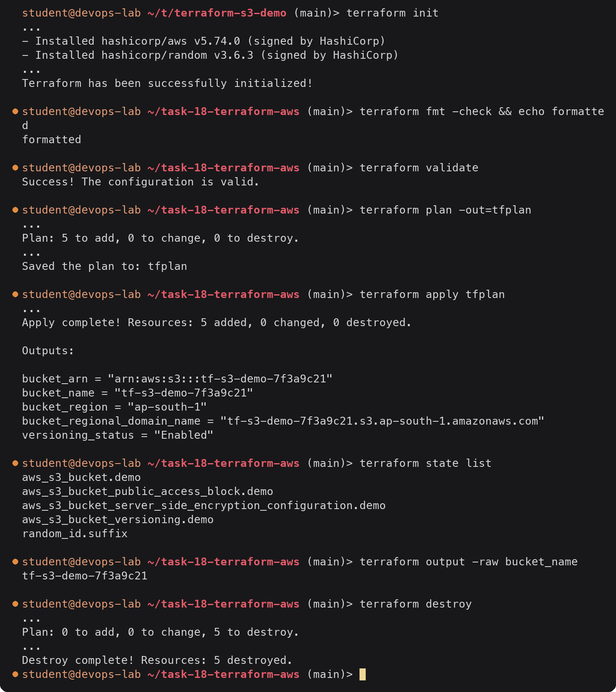

# Terraform and Core AWS Services

> **Note:** Command output in this file is representative expected output for the lab environment
> below, written as a learning reference. It was not captured from a live run, so IDs, timestamps
> and pod name hashes will differ when you run it yourself.

## Lab environment

| Item | Value |
|---|---|
| Host | Ubuntu 24.04 LTS, hostname `devops-lab`, user `student` |
| Shell prompt in output | `student@devops-lab:~/task-18-terraform-aws$` |
| Docker | 27.3.1 |
| Minikube | v1.34.0, docker driver, 2 CPU / 4096 MB, profile `minikube` |
| Kubernetes | v1.31.0, single node `minikube`, node InternalIP `192.168.49.2` |
| kubectl | v1.31.1 client |
| Helm | v3.16.2 |
| Terraform | v1.9.8, hashicorp/aws provider 5.74.0 |
| AWS | region `ap-south-1`, account ID `123456789012` (placeholder), IAM user `terraform-lab` |
| GitHub | user/org placeholder `devops-student`, repo `devops-homework` |
| Container registry | `ghcr.io/devops-student/...` |
| Pod CIDR / Service CIDR | 10.244.0.0/16 / 10.96.0.0/12, kube-dns ClusterIP 10.96.0.10 |
| Date range of runs | 2026-09-14 to 2026-10-04 (timestamps should fall in this range, ascending by task number) |

Also used here: AWS CLI v2 configured with a profile for `terraform-lab`, and the
hashicorp/random provider 3.6.3. The runs for this task are dated 2026-09-30 and 2026-10-01.

The task has two parts:

| Part | Folder | What it contains |
|---|---|---|
| Task 1: Terraform S3 demo | [`terraform-s3-demo/`](terraform-s3-demo/) | Working Terraform config and the full init → destroy walk-through |
| Task 2: AWS services | [`aws-services/`](aws-services/) | One write-up per service group, with JSON policies and CLI examples |

## Task 1: Terraform S3 demo

### Files

| File | Contents |
|---|---|
| [`provider.tf`](terraform-s3-demo/provider.tf) | `required_version >= 1.9.0`, `hashicorp/aws` pinned to `5.74.0`, `hashicorp/random` `3.6.3`; `aws` provider with region and `default_tags` |
| [`variables.tf`](terraform-s3-demo/variables.tf) | `aws_region`, `bucket_prefix` (with a validation rule), `project`, `environment`, `enable_versioning`, `force_destroy` |
| [`main.tf`](terraform-s3-demo/main.tf) | `random_id`, `aws_s3_bucket`, versioning, SSE-S3 encryption, public access block |
| [`outputs.tf`](terraform-s3-demo/outputs.tf) | name, ARN, region, regional domain name, versioning status |
| [`terraform.tfvars`](terraform-s3-demo/terraform.tfvars) | `ap-south-1`, prefix `tf-s3-demo`, `force_destroy = true` for the lab |
| [`.terraform.lock.hcl`](terraform-s3-demo/.terraform.lock.hcl) | Provider checksums, committed |
| [`.gitignore`](terraform-s3-demo/.gitignore) | `.terraform/`, `*.tfstate*`, plan files |
| [`README.md`](terraform-s3-demo/README.md) | Every command with its output |

### Bucket requirements and how they are met

| Requirement | Implementation |
|---|---|
| Unique name | `"${var.bucket_prefix}-${random_id.suffix.hex}"` → `tf-s3-demo-7f3a9c21` |
| Versioning | `aws_s3_bucket_versioning`, `status = "Enabled"` |
| Server-side encryption | `aws_s3_bucket_server_side_encryption_configuration`, `sse_algorithm = "AES256"` |
| No public access | `aws_s3_bucket_public_access_block` with all four flags `true` |
| Tags | Provider `default_tags` (`Project`, `Environment`, `ManagedBy`) + `Name` on the bucket |

### Workflow summary

The full output of every step is in [`terraform-s3-demo/README.md`](terraform-s3-demo/README.md).
The short version:



The `...` lines are cut here only; the README has them in full.

### What I learned from it

- `terraform plan` shows `bucket = (known after apply)` because the name depends on a
  resource (`random_id`) that only gets a value during apply. Unknown values flow through
  every reference.
- Saving the plan (`-out=tfplan`) and applying that file means what was reviewed is
  exactly what runs.
- The S3 settings are separate resources since AWS provider v4. One side effect, visible
  in `terraform show`: the bucket's own read-only `versioning` block said `enabled =
  false` right after apply, because it was read before the versioning resource ran. The
  next refresh fixed it.
- `force_destroy` is what allowed `destroy` to remove a bucket that still had object
  versions in it. For real data it stays `false` so Terraform cannot delete data by
  accident.
- `terraform fmt -check` and `terraform validate` need no AWS access, so they belong in CI
  on every pull request.

## Task 2: AWS services

Each folder has one README covering the listed topics, with JSON policy examples and AWS
CLI commands with sample output.

| Folder | Topics covered |
|---|---|
| [`aws-services/01-iam/`](aws-services/01-iam/README.md) | What IAM is, root user, users, groups, roles (trust + permissions, instance profiles, GitHub OIDC), policies (types, JSON structure), permission evaluation (explicit deny > allow > implicit deny, policy simulator), least privilege, best practices, use cases |
| [`aws-services/02-ec2/`](aws-services/02-ec2/README.md) | What EC2 is, AMIs (lookup through SSM), instance types and families, pricing models, key pairs, security groups, EBS volume types and snapshots, public vs private vs Elastic IP, instance lifecycle and states, use cases |
| [`aws-services/03-s3/`](aws-services/03-s3/README.md) | What S3 is, buckets, objects and keys, presigned URLs, storage classes, versioning and delete markers, lifecycle policies, encryption options, bucket policies, use cases |
| [`aws-services/04-vpc/`](aws-services/04-vpc/README.md) | What a VPC is, CIDR and reserved addresses, subnets, route tables, Internet Gateway, NAT Gateway, security groups, NACLs (and SG vs NACL), public vs private subnets, ordered clean-up |
| [`aws-services/05-dynamodb-rds/`](aws-services/05-dynamodb-rds/README.md) | DynamoDB: NoSQL, tables, items, attributes, partition key, sort key, query vs scan, use cases. RDS: relational model, engines, DB instances, security, backups and PITR, Multi-AZ (with forced failover), read replicas, use cases. DynamoDB vs RDS comparison |

### How the services connect

```
                 IAM (who can do what, for everything below)
                                   │
 Region ap-south-1                 ▼
 ┌───────────────────────── VPC 10.20.0.0/16 ─────────────────────────┐
 │  public subnet (route → IGW)          private subnet (route → NAT) │
 │  ┌──────────────────────────┐        ┌───────────────────────────┐ │
 │  │ EC2 web server           │  SG →  │ RDS PostgreSQL (Multi-AZ) │ │
 │  │ instance role ───────────┼──┐     └───────────────────────────┘ │
 │  └──────────────────────────┘  │                                   │
 └────────────────────────────────┼───────────────────────────────────┘
                                  │ (regional services, reached over the
                                  ▼  internet or through VPC endpoints)
                    S3 bucket            DynamoDB table
```

- **IAM** decides what every user, instance and pipeline can do. The EC2 instance reads S3
  through an instance role, not stored keys.
- **VPC** is the network the EC2 instance and the RDS database live in; security groups
  link the tiers.
- **S3** and **DynamoDB** are regional services outside the VPC; instances reach them
  through the Internet/NAT Gateway or, better, through VPC gateway endpoints.
- Task 19 builds the VPC + EC2 + S3 part of this picture with Terraform.

## Deliverables checklist

- [x] Task 1: `main.tf`, `variables.tf`, `outputs.tf`, `provider.tf`, `terraform.tfvars`, `README.md` in [`terraform-s3-demo/`](terraform-s3-demo/)
- [x] S3 bucket with unique name (random suffix), versioning, SSE, public access block and tags: [`main.tf`](terraform-s3-demo/main.tf), [`provider.tf`](terraform-s3-demo/provider.tf)
- [x] `terraform init`, `fmt`, `validate`, `plan`, `apply`, `show`, `output`, `destroy` documented with output: [`terraform-s3-demo/README.md`](terraform-s3-demo/README.md) sections 1-9
- [x] `.gitignore` for `.terraform/` and state files: [`terraform-s3-demo/.gitignore`](terraform-s3-demo/.gitignore)
- [x] IAM: what, users, groups, roles, policies, permissions, least privilege, best practices, use cases: [`aws-services/01-iam/README.md`](aws-services/01-iam/README.md)
- [x] EC2: what, AMI, instance types, key pairs, security groups, EBS, public vs private IP, lifecycle, use cases: [`aws-services/02-ec2/README.md`](aws-services/02-ec2/README.md)
- [x] S3: what, buckets, objects, storage classes, versioning, lifecycle policies, encryption, bucket policies, use cases: [`aws-services/03-s3/README.md`](aws-services/03-s3/README.md)
- [x] VPC: what, CIDR, subnets, route tables, IGW, NAT GW, security groups, NACLs, public vs private subnet: [`aws-services/04-vpc/README.md`](aws-services/04-vpc/README.md)
- [x] DynamoDB: NoSQL, tables, items, attributes, partition key, sort key, use cases: [`aws-services/05-dynamodb-rds/README.md`](aws-services/05-dynamodb-rds/README.md) part 1
- [x] RDS: relational, engines, DB instances, security, backups, Multi-AZ, read replicas, use cases: [`aws-services/05-dynamodb-rds/README.md`](aws-services/05-dynamodb-rds/README.md) part 2
- [x] Example JSON policies and AWS CLI commands with sample output: throughout `aws-services/`
