# Terraform S3 demo

> **Note:** Command output in this file is representative expected output for the lab environment
> below, written as a learning reference. It was not captured from a live run, so IDs, timestamps
> and pod name hashes will differ when you run it yourself.

Lab environment: the shared one described in [`../submission.md`](../submission.md)
(Ubuntu 24.04 `devops-lab`, Terraform v1.9.8, hashicorp/aws 5.74.0, region `ap-south-1`,
account `123456789012`, IAM user `terraform-lab`).

This configuration creates one private S3 bucket and walks it through the whole Terraform
lifecycle: `init`, `fmt`, `validate`, `plan`, `apply`, `show`, `output`, `destroy`.

## What gets created

| Resource | Why |
|---|---|
| `random_id.suffix` | 4 random bytes (8 hex characters) so the bucket name is globally unique |
| `aws_s3_bucket.demo` | The bucket, named `<bucket_prefix>-<suffix>` |
| `aws_s3_bucket_versioning.demo` | Versioning on: overwrites and deletes keep the old version |
| `aws_s3_bucket_server_side_encryption_configuration.demo` | Default encryption SSE-S3 (AES256) |
| `aws_s3_bucket_public_access_block.demo` | All four public access block settings on |

Tags `Project`, `Environment` and `ManagedBy` are added to everything through the
provider's `default_tags`; the bucket also gets a `Name` tag.

Since provider v4, versioning, encryption and public access are separate resources
instead of blocks inside `aws_s3_bucket`. Each maps to one S3 API call, so a change to one
setting never forces a change to the others.

## Files

| File | Contents |
|---|---|
| `provider.tf` | `terraform` block (Terraform >= 1.9.0, aws 5.74.0, random 3.6.3) and the `aws` provider with `default_tags` |
| `variables.tf` | Inputs with types, descriptions, defaults and a validation rule on `bucket_prefix` |
| `main.tf` | The five resources above |
| `outputs.tf` | Bucket name, ARN, region, regional domain name, versioning status |
| `terraform.tfvars` | Values for this lab (no secrets) |
| `.terraform.lock.hcl` | Exact provider versions and checksums, committed so every run uses the same build |
| `.gitignore` | Keeps `.terraform/`, state files and saved plans out of git |

## Prerequisites

Credentials come from the AWS CLI profile, never from `.tf` or `.tfvars` files.

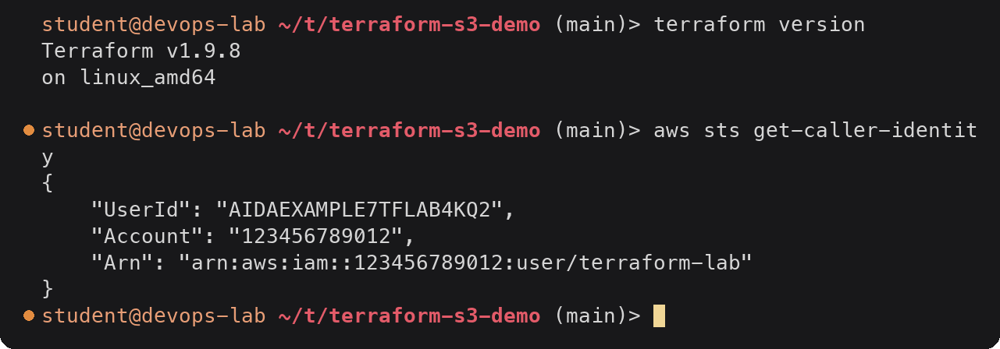

<details><summary>Text version</summary>

```console
student@devops-lab:~/task-18-terraform-aws/terraform-s3-demo$ terraform version
Terraform v1.9.8
on linux_amd64

student@devops-lab:~/task-18-terraform-aws/terraform-s3-demo$ aws sts get-caller-identity
{
    "UserId": "AIDAEXAMPLE7TFLAB4KQ2",
    "Account": "123456789012",
    "Arn": "arn:aws:iam::123456789012:user/terraform-lab"
}
```

</details>

Terraform will act as `terraform-lab`. That user needs S3 permissions on buckets named
`tf-s3-demo-*` (see the IAM write-up in `../aws-services/01-iam/README.md`).

## 1. terraform init

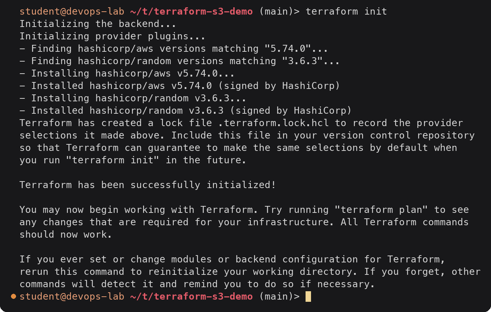

<details><summary>Text version</summary>

```console
$ terraform init
Initializing the backend...
Initializing provider plugins...
- Finding hashicorp/aws versions matching "5.74.0"...
- Finding hashicorp/random versions matching "3.6.3"...
- Installing hashicorp/aws v5.74.0...
- Installed hashicorp/aws v5.74.0 (signed by HashiCorp)
- Installing hashicorp/random v3.6.3...
- Installed hashicorp/random v3.6.3 (signed by HashiCorp)
Terraform has created a lock file .terraform.lock.hcl to record the provider
selections it made above. Include this file in your version control repository
so that Terraform can guarantee to make the same selections by default when
you run "terraform init" in the future.

Terraform has been successfully initialized!

You may now begin working with Terraform. Try running "terraform plan" to see
any changes that are required for your infrastructure. All Terraform commands
should now work.

If you ever set or change modules or backend configuration for Terraform,
rerun this command to reinitialize your working directory. If you forget, other
commands will detect it and remind you to do so if necessary.
```

</details>

`init` downloads the two providers into `.terraform/providers/` and writes the lock file.
No backend is configured, so state will be a local `terraform.tfstate` file.

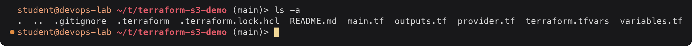

<details><summary>Text version</summary>

```console
$ ls -a
.  ..  .gitignore  .terraform  .terraform.lock.hcl  README.md  main.tf  outputs.tf  provider.tf  terraform.tfvars  variables.tf
```

</details>

## 2. terraform fmt

On the first try I had lined up the `=` signs in `variables.tf` by hand and got one wrong.

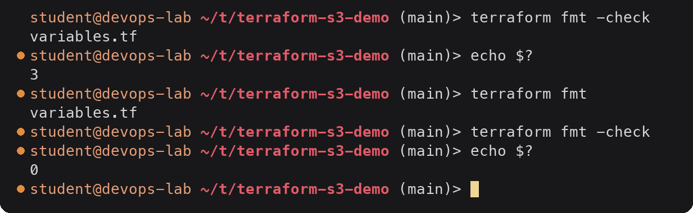

<details><summary>Text version</summary>

```console
$ terraform fmt -check
variables.tf
$ echo $?
3
$ terraform fmt
variables.tf
$ terraform fmt -check
$ echo $?
0
```

</details>

`-check` lists files that are not in canonical format and exits non-zero without changing
anything, which is what a CI job would run. Plain `fmt` rewrites them and prints the names
of the files it changed.

## 3. terraform validate

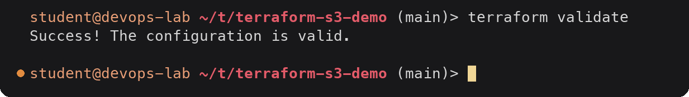

<details><summary>Text version</summary>

```console
$ terraform validate
Success! The configuration is valid.

```

</details>

`validate` checks syntax, references and types without contacting AWS. It also runs the
`validation` block on `bucket_prefix`, but only for literal values; tfvars values are
checked at plan time. Passing an invalid prefix shows the custom message:

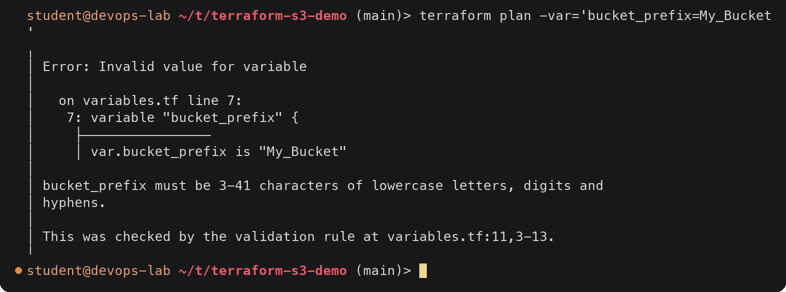

<details><summary>Text version</summary>

```console
$ terraform plan -var='bucket_prefix=My_Bucket'
╷
│ Error: Invalid value for variable
│ 
│   on variables.tf line 7:
│    7: variable "bucket_prefix" {
│     ├────────────────
│     │ var.bucket_prefix is "My_Bucket"
│ 
│ bucket_prefix must be 3-41 characters of lowercase letters, digits and
│ hyphens.
│ 
│ This was checked by the validation rule at variables.tf:11,3-13.
╵
```

</details>

## 4. terraform plan

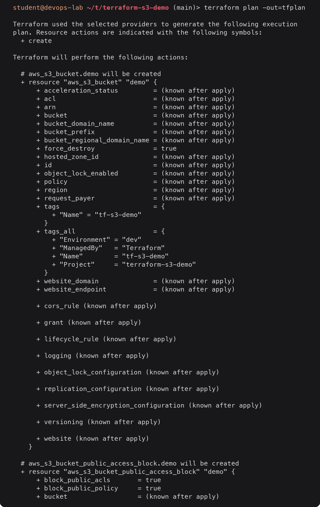
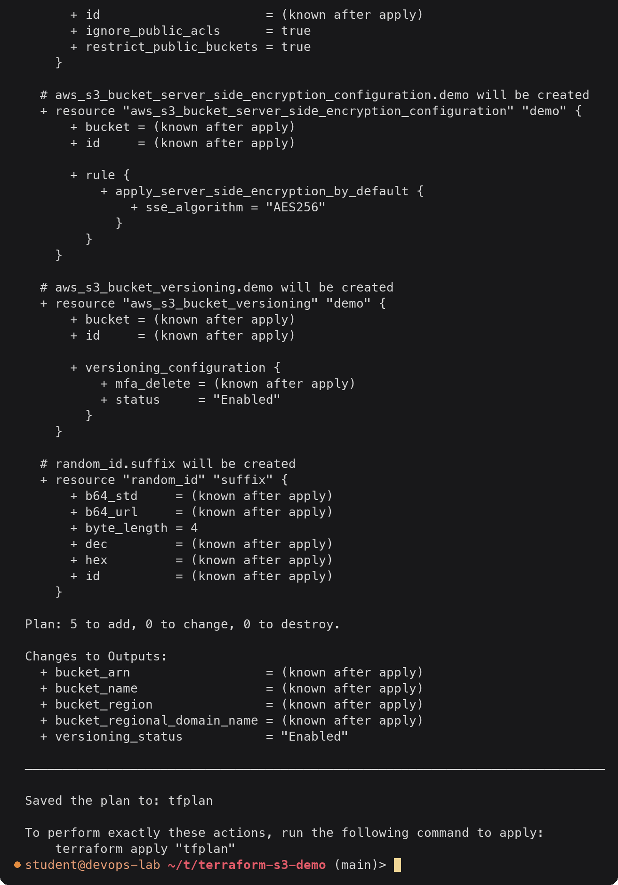

<details><summary>Text version</summary>

```console
$ terraform plan -out=tfplan

Terraform used the selected providers to generate the following execution
plan. Resource actions are indicated with the following symbols:
  + create

Terraform will perform the following actions:

  # aws_s3_bucket.demo will be created
  + resource "aws_s3_bucket" "demo" {
      + acceleration_status         = (known after apply)
      + acl                         = (known after apply)
      + arn                         = (known after apply)
      + bucket                      = (known after apply)
      + bucket_domain_name          = (known after apply)
      + bucket_prefix               = (known after apply)
      + bucket_regional_domain_name = (known after apply)
      + force_destroy               = true
      + hosted_zone_id              = (known after apply)
      + id                          = (known after apply)
      + object_lock_enabled         = (known after apply)
      + policy                      = (known after apply)
      + region                      = (known after apply)
      + request_payer               = (known after apply)
      + tags                        = {
          + "Name" = "tf-s3-demo"
        }
      + tags_all                    = {
          + "Environment" = "dev"
          + "ManagedBy"   = "Terraform"
          + "Name"        = "tf-s3-demo"
          + "Project"     = "terraform-s3-demo"
        }
      + website_domain              = (known after apply)
      + website_endpoint            = (known after apply)

      + cors_rule (known after apply)

      + grant (known after apply)

      + lifecycle_rule (known after apply)

      + logging (known after apply)

      + object_lock_configuration (known after apply)

      + replication_configuration (known after apply)

      + server_side_encryption_configuration (known after apply)

      + versioning (known after apply)

      + website (known after apply)
    }

  # aws_s3_bucket_public_access_block.demo will be created
  + resource "aws_s3_bucket_public_access_block" "demo" {
      + block_public_acls       = true
      + block_public_policy     = true
      + bucket                  = (known after apply)
      + id                      = (known after apply)
      + ignore_public_acls      = true
      + restrict_public_buckets = true
    }

  # aws_s3_bucket_server_side_encryption_configuration.demo will be created
  + resource "aws_s3_bucket_server_side_encryption_configuration" "demo" {
      + bucket = (known after apply)
      + id     = (known after apply)

      + rule {
          + apply_server_side_encryption_by_default {
              + sse_algorithm = "AES256"
            }
        }
    }

  # aws_s3_bucket_versioning.demo will be created
  + resource "aws_s3_bucket_versioning" "demo" {
      + bucket = (known after apply)
      + id     = (known after apply)

      + versioning_configuration {
          + mfa_delete = (known after apply)
          + status     = "Enabled"
        }
    }

  # random_id.suffix will be created
  + resource "random_id" "suffix" {
      + b64_std     = (known after apply)
      + b64_url     = (known after apply)
      + byte_length = 4
      + dec         = (known after apply)
      + hex         = (known after apply)
      + id          = (known after apply)
    }

Plan: 5 to add, 0 to change, 0 to destroy.

Changes to Outputs:
  + bucket_arn                  = (known after apply)
  + bucket_name                 = (known after apply)
  + bucket_region               = (known after apply)
  + bucket_regional_domain_name = (known after apply)
  + versioning_status           = "Enabled"

─────────────────────────────────────────────────────────────────────────────

Saved the plan to: tfplan

To perform exactly these actions, run the following command to apply:
    terraform apply "tfplan"
```

</details>

Points worth noticing:

- `bucket` is `(known after apply)` because it depends on `random_id.suffix.hex`, which does
  not exist until apply. Everything that references the bucket is unknown too.
- `tags_all` already shows the merge of `default_tags` and the resource's own `tags`.
- `versioning_status` is known at plan time because it comes straight from a variable.
- `-out=tfplan` saves the plan, so apply does exactly what was reviewed and nothing else.

## 5. terraform apply

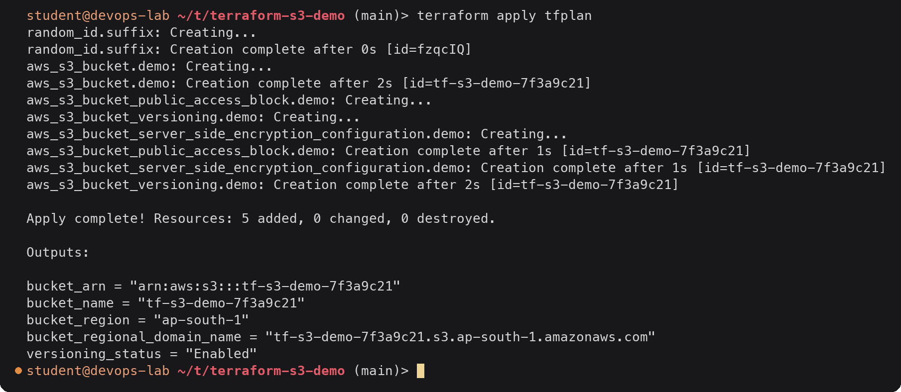

<details><summary>Text version</summary>

```console
$ terraform apply tfplan
random_id.suffix: Creating...
random_id.suffix: Creation complete after 0s [id=fzqcIQ]
aws_s3_bucket.demo: Creating...
aws_s3_bucket.demo: Creation complete after 2s [id=tf-s3-demo-7f3a9c21]
aws_s3_bucket_public_access_block.demo: Creating...
aws_s3_bucket_versioning.demo: Creating...
aws_s3_bucket_server_side_encryption_configuration.demo: Creating...
aws_s3_bucket_public_access_block.demo: Creation complete after 1s [id=tf-s3-demo-7f3a9c21]
aws_s3_bucket_server_side_encryption_configuration.demo: Creation complete after 1s [id=tf-s3-demo-7f3a9c21]
aws_s3_bucket_versioning.demo: Creation complete after 2s [id=tf-s3-demo-7f3a9c21]

Apply complete! Resources: 5 added, 0 changed, 0 destroyed.

Outputs:

bucket_arn = "arn:aws:s3:::tf-s3-demo-7f3a9c21"
bucket_name = "tf-s3-demo-7f3a9c21"
bucket_region = "ap-south-1"
bucket_regional_domain_name = "tf-s3-demo-7f3a9c21.s3.ap-south-1.amazonaws.com"
versioning_status = "Enabled"
```

</details>

Applying a saved plan does not ask for confirmation, because the plan was already reviewed.
The order follows the dependency graph: the random suffix first, then the bucket, then the
three bucket settings in parallel because they only depend on the bucket. The random_id
`id` is the base64url form of the same 4 bytes that `hex` shows (`fzqcIQ` = `7f3a9c21`).

### Checking the result with the AWS CLI

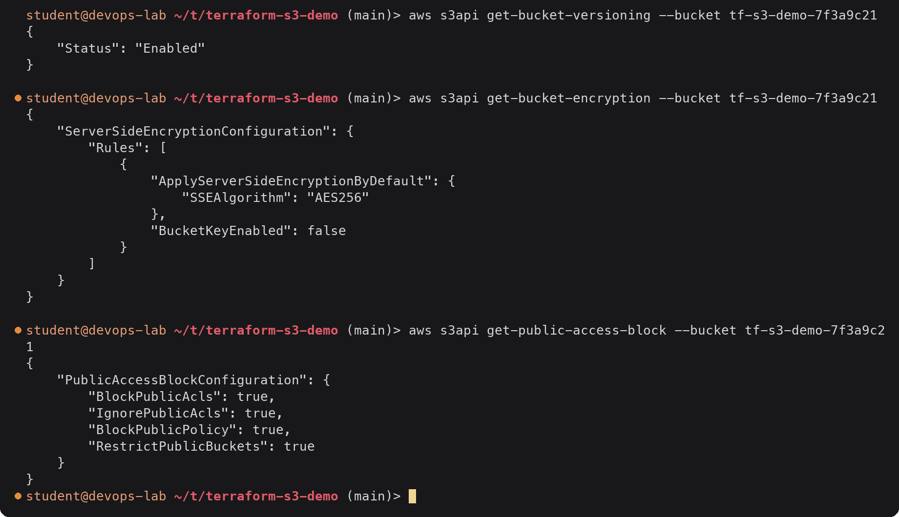

<details><summary>Text version</summary>

```console
$ aws s3api get-bucket-versioning --bucket tf-s3-demo-7f3a9c21
{
    "Status": "Enabled"
}

$ aws s3api get-bucket-encryption --bucket tf-s3-demo-7f3a9c21
{
    "ServerSideEncryptionConfiguration": {
        "Rules": [
            {
                "ApplyServerSideEncryptionByDefault": {
                    "SSEAlgorithm": "AES256"
                },
                "BucketKeyEnabled": false
            }
        ]
    }
}

$ aws s3api get-public-access-block --bucket tf-s3-demo-7f3a9c21
{
    "PublicAccessBlockConfiguration": {
        "BlockPublicAcls": true,
        "IgnorePublicAcls": true,
        "BlockPublicPolicy": true,
        "RestrictPublicBuckets": true
    }
}
```

</details>

Versioning in action: uploading the same key twice keeps both versions.

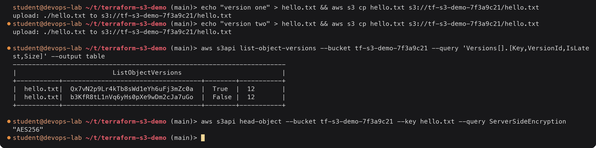

<details><summary>Text version</summary>

```console
$ echo "version one" > hello.txt && aws s3 cp hello.txt s3://tf-s3-demo-7f3a9c21/hello.txt
upload: ./hello.txt to s3://tf-s3-demo-7f3a9c21/hello.txt
$ echo "version two" > hello.txt && aws s3 cp hello.txt s3://tf-s3-demo-7f3a9c21/hello.txt
upload: ./hello.txt to s3://tf-s3-demo-7f3a9c21/hello.txt

$ aws s3api list-object-versions --bucket tf-s3-demo-7f3a9c21 --query 'Versions[].[Key,VersionId,IsLatest,Size]' --output table
-----------------------------------------------------------------------
|                         ListObjectVersions                          |
+-----------+------------------------------------+--------+-----------+
|  hello.txt|  Qx7vN2p9Lr4kTb8sWd1eYh6uFj3mZc0a  |  True  |  12       |
|  hello.txt|  b3KfR8tL1nVq6yHs0pXe9wDm2cJa7uGo  |  False |  12       |
+-----------+------------------------------------+--------+-----------+

$ aws s3api head-object --bucket tf-s3-demo-7f3a9c21 --key hello.txt --query ServerSideEncryption
"AES256"
```

</details>

Anonymous access is refused, because of the public access block and because there is no
bucket policy granting it:

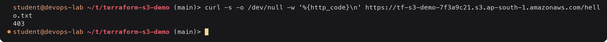

<details><summary>Text version</summary>

```console
$ curl -s -o /dev/null -w '%{http_code}\n' https://tf-s3-demo-7f3a9c21.s3.ap-south-1.amazonaws.com/hello.txt
403
```

</details>

## 6. terraform show

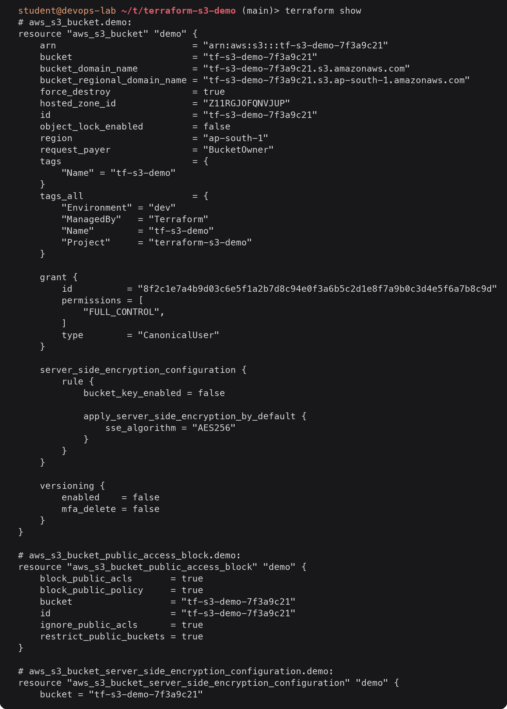
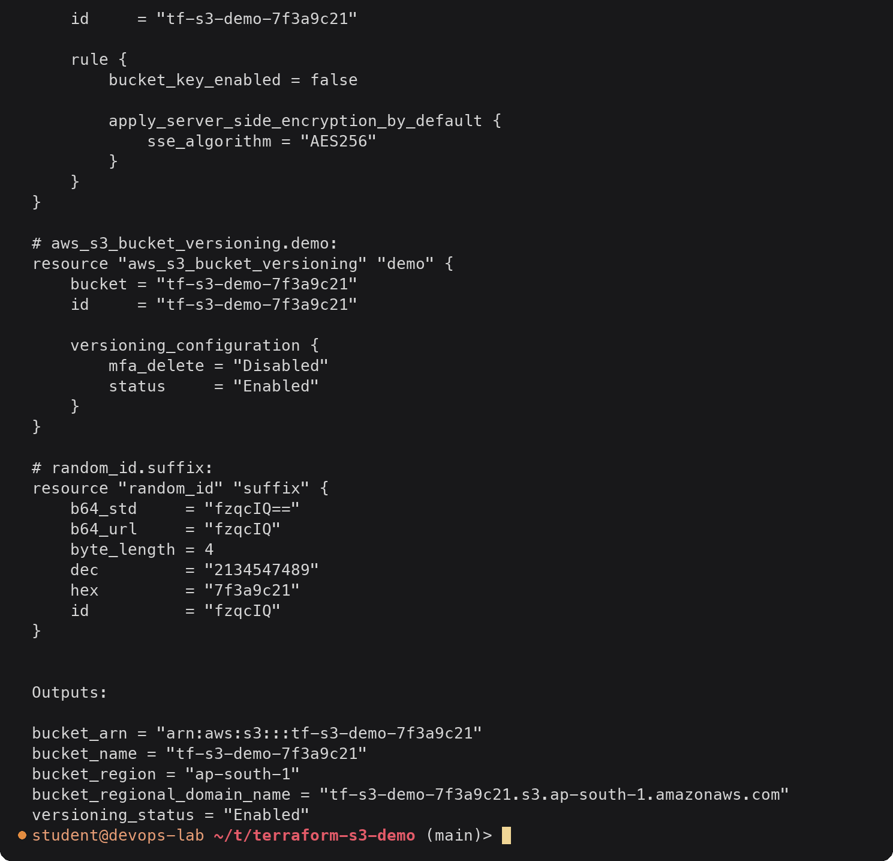

<details><summary>Text version</summary>

```console
$ terraform show
# aws_s3_bucket.demo:
resource "aws_s3_bucket" "demo" {
    arn                         = "arn:aws:s3:::tf-s3-demo-7f3a9c21"
    bucket                      = "tf-s3-demo-7f3a9c21"
    bucket_domain_name          = "tf-s3-demo-7f3a9c21.s3.amazonaws.com"
    bucket_regional_domain_name = "tf-s3-demo-7f3a9c21.s3.ap-south-1.amazonaws.com"
    force_destroy               = true
    hosted_zone_id              = "Z11RGJOFQNVJUP"
    id                          = "tf-s3-demo-7f3a9c21"
    object_lock_enabled         = false
    region                      = "ap-south-1"
    request_payer               = "BucketOwner"
    tags                        = {
        "Name" = "tf-s3-demo"
    }
    tags_all                    = {
        "Environment" = "dev"
        "ManagedBy"   = "Terraform"
        "Name"        = "tf-s3-demo"
        "Project"     = "terraform-s3-demo"
    }

    grant {
        id          = "8f2c1e7a4b9d03c6e5f1a2b7d8c94e0f3a6b5c2d1e8f7a9b0c3d4e5f6a7b8c9d"
        permissions = [
            "FULL_CONTROL",
        ]
        type        = "CanonicalUser"
    }

    server_side_encryption_configuration {
        rule {
            bucket_key_enabled = false

            apply_server_side_encryption_by_default {
                sse_algorithm = "AES256"
            }
        }
    }

    versioning {
        enabled    = false
        mfa_delete = false
    }
}

# aws_s3_bucket_public_access_block.demo:
resource "aws_s3_bucket_public_access_block" "demo" {
    block_public_acls       = true
    block_public_policy     = true
    bucket                  = "tf-s3-demo-7f3a9c21"
    id                      = "tf-s3-demo-7f3a9c21"
    ignore_public_acls      = true
    restrict_public_buckets = true
}

# aws_s3_bucket_server_side_encryption_configuration.demo:
resource "aws_s3_bucket_server_side_encryption_configuration" "demo" {
    bucket = "tf-s3-demo-7f3a9c21"
    id     = "tf-s3-demo-7f3a9c21"

    rule {
        bucket_key_enabled = false

        apply_server_side_encryption_by_default {
            sse_algorithm = "AES256"
        }
    }
}

# aws_s3_bucket_versioning.demo:
resource "aws_s3_bucket_versioning" "demo" {
    bucket = "tf-s3-demo-7f3a9c21"
    id     = "tf-s3-demo-7f3a9c21"

    versioning_configuration {
        mfa_delete = "Disabled"
        status     = "Enabled"
    }
}

# random_id.suffix:
resource "random_id" "suffix" {
    b64_std     = "fzqcIQ=="
    b64_url     = "fzqcIQ"
    byte_length = 4
    dec         = "2134547489"
    hex         = "7f3a9c21"
    id          = "fzqcIQ"
}


Outputs:

bucket_arn = "arn:aws:s3:::tf-s3-demo-7f3a9c21"
bucket_name = "tf-s3-demo-7f3a9c21"
bucket_region = "ap-south-1"
bucket_regional_domain_name = "tf-s3-demo-7f3a9c21.s3.ap-south-1.amazonaws.com"
versioning_status = "Enabled"
```

</details>

`terraform show` prints the state file in readable form. One detail: the `versioning`
block inside `aws_s3_bucket.demo` still says `enabled = false`. The bucket resource read its
attributes right after it was created, before `aws_s3_bucket_versioning` switched
versioning on. The source of truth is the separate versioning resource (`status =
"Enabled"`). After the next `terraform plan` or `terraform apply -refresh-only`, the bucket's
copy is refreshed as well. This is why the provider docs say not to read those deprecated
inline blocks.

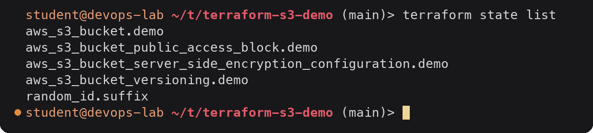

<details><summary>Text version</summary>

```console
$ terraform state list
aws_s3_bucket.demo
aws_s3_bucket_public_access_block.demo
aws_s3_bucket_server_side_encryption_configuration.demo
aws_s3_bucket_versioning.demo
random_id.suffix
```

</details>

## 7. terraform output

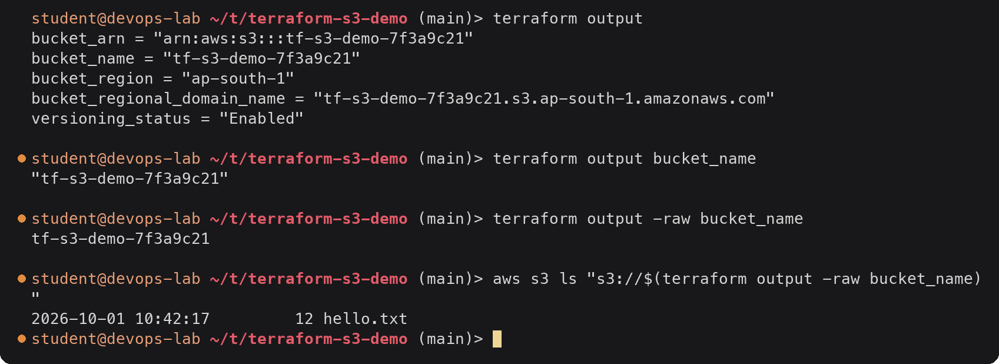

<details><summary>Text version</summary>

```console
$ terraform output
bucket_arn = "arn:aws:s3:::tf-s3-demo-7f3a9c21"
bucket_name = "tf-s3-demo-7f3a9c21"
bucket_region = "ap-south-1"
bucket_regional_domain_name = "tf-s3-demo-7f3a9c21.s3.ap-south-1.amazonaws.com"
versioning_status = "Enabled"

$ terraform output bucket_name
"tf-s3-demo-7f3a9c21"

$ terraform output -raw bucket_name
tf-s3-demo-7f3a9c21

$ aws s3 ls "s3://$(terraform output -raw bucket_name)"
2026-10-01 10:42:17         12 hello.txt
```

</details>

`-raw` drops the quotes so the value can be used in shell commands; `-json` gives all
outputs as JSON for scripts.

## 8. A second plan: no drift

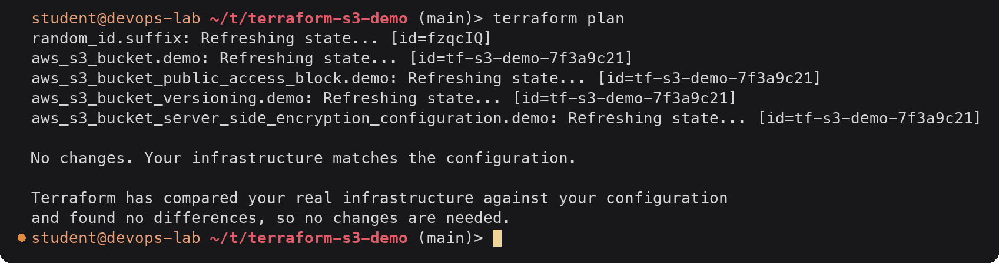

<details><summary>Text version</summary>

```console
$ terraform plan
random_id.suffix: Refreshing state... [id=fzqcIQ]
aws_s3_bucket.demo: Refreshing state... [id=tf-s3-demo-7f3a9c21]
aws_s3_bucket_public_access_block.demo: Refreshing state... [id=tf-s3-demo-7f3a9c21]
aws_s3_bucket_versioning.demo: Refreshing state... [id=tf-s3-demo-7f3a9c21]
aws_s3_bucket_server_side_encryption_configuration.demo: Refreshing state... [id=tf-s3-demo-7f3a9c21]

No changes. Your infrastructure matches the configuration.

Terraform has compared your real infrastructure against your configuration
and found no differences, so no changes are needed.
```

</details>

Running plan again is how you check that nobody changed the bucket by hand in the console.

## 9. terraform destroy

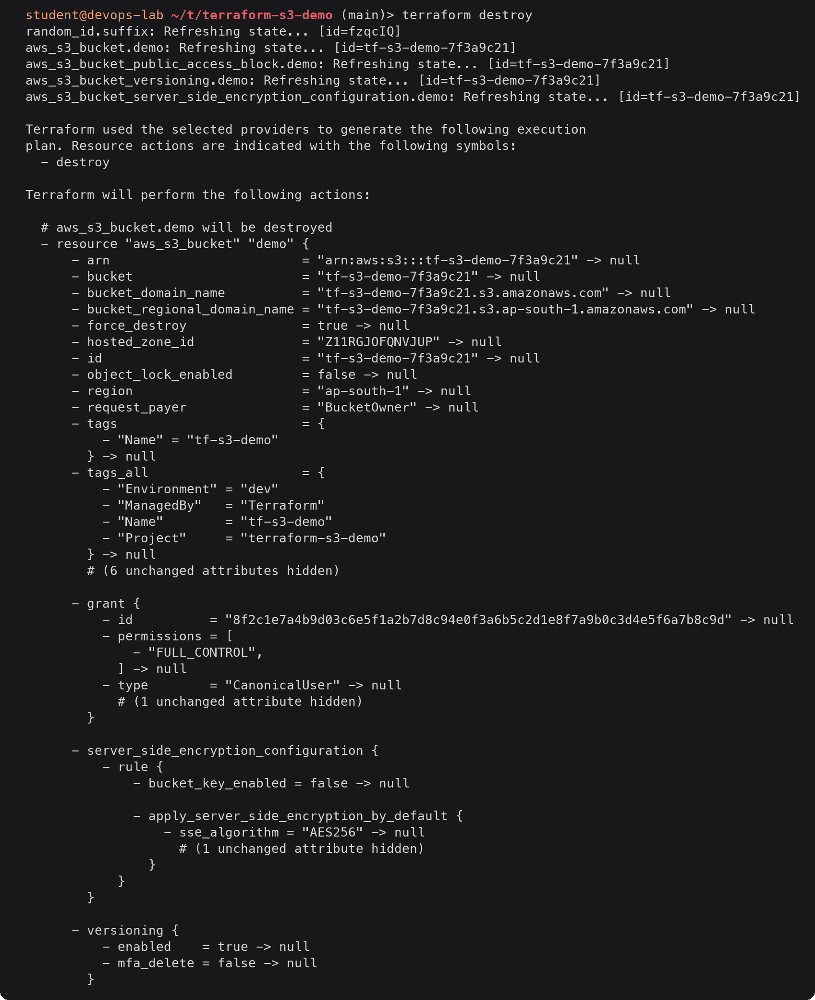
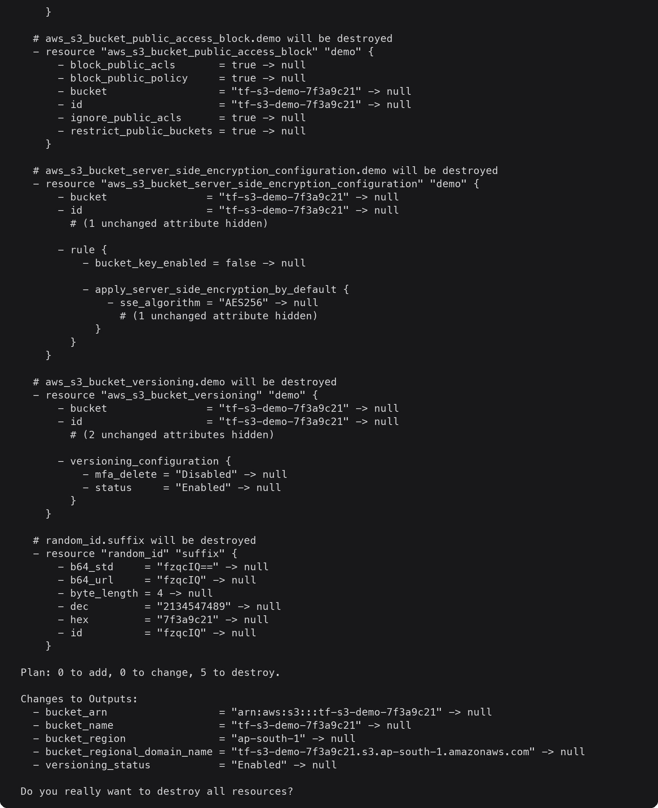
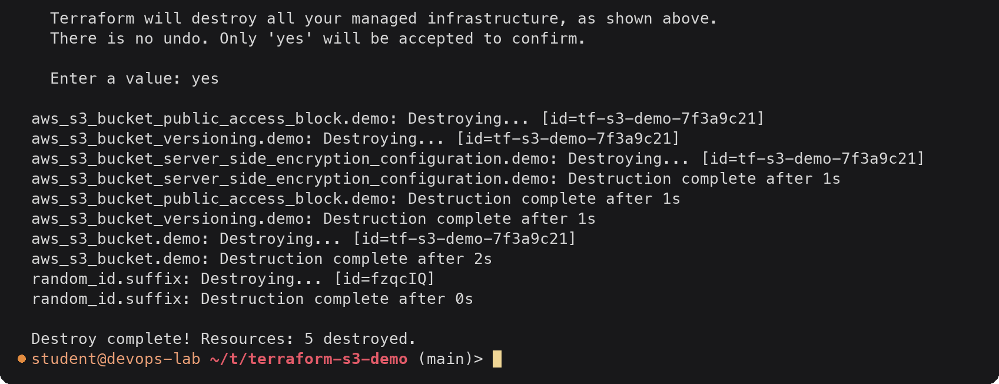

<details><summary>Text version</summary>

```console
$ terraform destroy
random_id.suffix: Refreshing state... [id=fzqcIQ]
aws_s3_bucket.demo: Refreshing state... [id=tf-s3-demo-7f3a9c21]
aws_s3_bucket_public_access_block.demo: Refreshing state... [id=tf-s3-demo-7f3a9c21]
aws_s3_bucket_versioning.demo: Refreshing state... [id=tf-s3-demo-7f3a9c21]
aws_s3_bucket_server_side_encryption_configuration.demo: Refreshing state... [id=tf-s3-demo-7f3a9c21]

Terraform used the selected providers to generate the following execution
plan. Resource actions are indicated with the following symbols:
  - destroy

Terraform will perform the following actions:

  # aws_s3_bucket.demo will be destroyed
  - resource "aws_s3_bucket" "demo" {
      - arn                         = "arn:aws:s3:::tf-s3-demo-7f3a9c21" -> null
      - bucket                      = "tf-s3-demo-7f3a9c21" -> null
      - bucket_domain_name          = "tf-s3-demo-7f3a9c21.s3.amazonaws.com" -> null
      - bucket_regional_domain_name = "tf-s3-demo-7f3a9c21.s3.ap-south-1.amazonaws.com" -> null
      - force_destroy               = true -> null
      - hosted_zone_id              = "Z11RGJOFQNVJUP" -> null
      - id                          = "tf-s3-demo-7f3a9c21" -> null
      - object_lock_enabled         = false -> null
      - region                      = "ap-south-1" -> null
      - request_payer               = "BucketOwner" -> null
      - tags                        = {
          - "Name" = "tf-s3-demo"
        } -> null
      - tags_all                    = {
          - "Environment" = "dev"
          - "ManagedBy"   = "Terraform"
          - "Name"        = "tf-s3-demo"
          - "Project"     = "terraform-s3-demo"
        } -> null
        # (6 unchanged attributes hidden)

      - grant {
          - id          = "8f2c1e7a4b9d03c6e5f1a2b7d8c94e0f3a6b5c2d1e8f7a9b0c3d4e5f6a7b8c9d" -> null
          - permissions = [
              - "FULL_CONTROL",
            ] -> null
          - type        = "CanonicalUser" -> null
            # (1 unchanged attribute hidden)
        }

      - server_side_encryption_configuration {
          - rule {
              - bucket_key_enabled = false -> null

              - apply_server_side_encryption_by_default {
                  - sse_algorithm = "AES256" -> null
                    # (1 unchanged attribute hidden)
                }
            }
        }

      - versioning {
          - enabled    = true -> null
          - mfa_delete = false -> null
        }
    }

  # aws_s3_bucket_public_access_block.demo will be destroyed
  - resource "aws_s3_bucket_public_access_block" "demo" {
      - block_public_acls       = true -> null
      - block_public_policy     = true -> null
      - bucket                  = "tf-s3-demo-7f3a9c21" -> null
      - id                      = "tf-s3-demo-7f3a9c21" -> null
      - ignore_public_acls      = true -> null
      - restrict_public_buckets = true -> null
    }

  # aws_s3_bucket_server_side_encryption_configuration.demo will be destroyed
  - resource "aws_s3_bucket_server_side_encryption_configuration" "demo" {
      - bucket                = "tf-s3-demo-7f3a9c21" -> null
      - id                    = "tf-s3-demo-7f3a9c21" -> null
        # (1 unchanged attribute hidden)

      - rule {
          - bucket_key_enabled = false -> null

          - apply_server_side_encryption_by_default {
              - sse_algorithm = "AES256" -> null
                # (1 unchanged attribute hidden)
            }
        }
    }

  # aws_s3_bucket_versioning.demo will be destroyed
  - resource "aws_s3_bucket_versioning" "demo" {
      - bucket                = "tf-s3-demo-7f3a9c21" -> null
      - id                    = "tf-s3-demo-7f3a9c21" -> null
        # (2 unchanged attributes hidden)

      - versioning_configuration {
          - mfa_delete = "Disabled" -> null
          - status     = "Enabled" -> null
        }
    }

  # random_id.suffix will be destroyed
  - resource "random_id" "suffix" {
      - b64_std     = "fzqcIQ==" -> null
      - b64_url     = "fzqcIQ" -> null
      - byte_length = 4 -> null
      - dec         = "2134547489" -> null
      - hex         = "7f3a9c21" -> null
      - id          = "fzqcIQ" -> null
    }

Plan: 0 to add, 0 to change, 5 to destroy.

Changes to Outputs:
  - bucket_arn                  = "arn:aws:s3:::tf-s3-demo-7f3a9c21" -> null
  - bucket_name                 = "tf-s3-demo-7f3a9c21" -> null
  - bucket_region               = "ap-south-1" -> null
  - bucket_regional_domain_name = "tf-s3-demo-7f3a9c21.s3.ap-south-1.amazonaws.com" -> null
  - versioning_status           = "Enabled" -> null

Do you really want to destroy all resources?
  Terraform will destroy all your managed infrastructure, as shown above.
  There is no undo. Only 'yes' will be accepted to confirm.

  Enter a value: yes

aws_s3_bucket_public_access_block.demo: Destroying... [id=tf-s3-demo-7f3a9c21]
aws_s3_bucket_versioning.demo: Destroying... [id=tf-s3-demo-7f3a9c21]
aws_s3_bucket_server_side_encryption_configuration.demo: Destroying... [id=tf-s3-demo-7f3a9c21]
aws_s3_bucket_server_side_encryption_configuration.demo: Destruction complete after 1s
aws_s3_bucket_public_access_block.demo: Destruction complete after 1s
aws_s3_bucket_versioning.demo: Destruction complete after 1s
aws_s3_bucket.demo: Destroying... [id=tf-s3-demo-7f3a9c21]
aws_s3_bucket.demo: Destruction complete after 2s
random_id.suffix: Destroying... [id=fzqcIQ]
random_id.suffix: Destruction complete after 0s

Destroy complete! Resources: 5 destroyed.
```

</details>

Destroy runs the graph in reverse: the three settings first, then the bucket, then the
suffix. The bucket still held two versions of `hello.txt`; deleting a non-empty bucket
normally fails with `BucketNotEmpty`, but `force_destroy = true` (set in `terraform.tfvars`
for this lab) makes the provider delete every object version first. The refresh at the
start also updated the bucket's own `versioning` block to `enabled = true`.

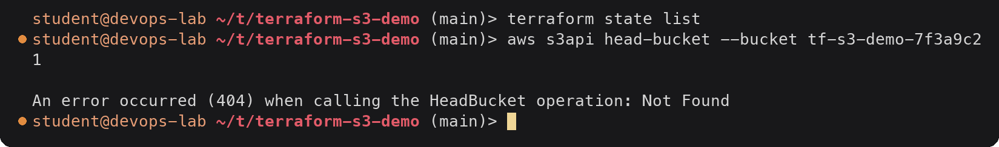

<details><summary>Text version</summary>

```console
$ terraform state list
$ aws s3api head-bucket --bucket tf-s3-demo-7f3a9c21

An error occurred (404) when calling the HeadBucket operation: Not Found
```

</details>

State is empty and the bucket no longer exists.

## Command summary

| Command | Contacts AWS | Changes infrastructure | Purpose |
|---|---|---|---|
| `terraform init` | No (registry only) | No | Download providers, set up backend, write lock file |
| `terraform fmt` | No | No | Rewrite files in canonical style |
| `terraform validate` | No | No | Check syntax, references and types |
| `terraform plan` | Yes (read) | No | Refresh state and show the diff between code and reality |
| `terraform apply` | Yes | Yes | Make reality match the code, update state |
| `terraform show` | No | No | Print state (or a saved plan) in readable form |
| `terraform output` | No | No | Print output values from state |
| `terraform destroy` | Yes | Yes | Delete everything in state |
