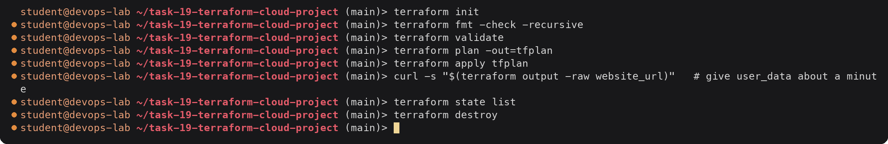
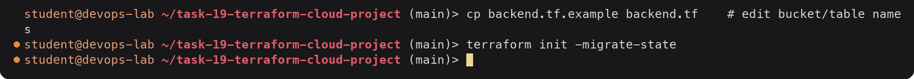

# tf-cloud-project

Terraform configuration for a small AWS environment: VPC, public subnet, Internet Gateway
and route table, security group, an EC2 web server (Amazon Linux 2023 + nginx via
user_data) and a private, versioned S3 bucket.

The full write-up (architecture diagram, plan/apply/state/destroy output, dependency
graph, remote backend) is in [`submission.md`](submission.md).

## Usage

Requirements: Terraform >= 1.9, AWS credentials for an IAM identity that can manage EC2,
VPC and S3 in `ap-south-1` (for example `export AWS_PROFILE=terraform-lab`).



<details><summary>Text version</summary>

```console
$ terraform init
$ terraform fmt -check -recursive
$ terraform validate
$ terraform plan -out=tfplan
$ terraform apply tfplan
$ curl -s "$(terraform output -raw website_url)"   # give user_data about a minute
$ terraform state list
$ terraform destroy
```

</details>

Change values in `terraform.tfvars`, for example limit HTTP to your own address:

```hcl
allowed_http_cidrs = ["203.0.113.25/32"]
```

## Cost

A `t3.micro` instance, its public IPv4 address and an 8 GiB gp3 volume are billed while
they exist (the instance is free-tier eligible on new accounts; the public IPv4 address
is not). Run `terraform destroy` when you are done.

## Remote state

State is local by default. To keep it in S3 with locking, create the state bucket and a
DynamoDB table with partition key `LockID` (String), then:



<details><summary>Text version</summary>

```console
$ cp backend.tf.example backend.tf    # edit bucket/table names
$ terraform init -migrate-state
```

</details>
