# Monitoring, Observability and GitOps

> **Note:** Command output in this file is representative expected output for the lab environment
> below, written as a learning reference. It was not captured from a live run, so IDs, timestamps
> and pod name hashes will differ when you run it yourself.

## Lab environment

| Item | Value |
|---|---|
| Host | Ubuntu 24.04 LTS, hostname `devops-lab`, user `student` |
| Shell prompt in output | `student@devops-lab:~/<task-folder>$` |
| Docker | 27.3.1 |
| Minikube | v1.34.0, docker driver, 2 CPU / 4096 MB, profile `minikube` |
| Kubernetes | v1.31.0, single node `minikube`, node InternalIP `192.168.49.2` |
| kubectl | v1.31.1 client |
| Helm | v3.16.2 |
| Terraform | v1.9.8, hashicorp/aws provider 5.74.0 |
| AWS | region `ap-south-1`, account ID `123456789012` (placeholder), IAM user `terraform-lab` |
| GitHub | user/org placeholder `devops-student`, repo `devops-homework` |
| Container registry | `ghcr.io/devops-student/...` |
| Pod CIDR / Service CIDR | 10.244.0.0/16 / 10.96.0.0/12, kube-dns ClusterIP 10.96.0.10 |
| Date range of runs | 2026-09-14 to 2026-10-04 (timestamps should fall in this range, ascending by task number) |

Extra versions used only in this task:

| Component | Version |
|---|---|
| kube-prometheus-stack chart | 65.1.1 (Prometheus v2.54.1, Alertmanager v0.27.0, Grafana 11.2.1, node-exporter 1.8.2, kube-state-metrics 2.13.0) |
| loki-stack chart | 2.10.2 (Loki 2.9.3, Promtail 2.9.3) |
| Argo CD | v2.12.4 (server and `argocd` CLI) |

## Files in this folder

```text
task-20-monitoring-gitops/
├── submission.md                         this write-up
├── README.md                             short index
├── monitoring/
│   ├── app/                              demo app with /metrics, /health, /ready (Flask + prometheus_client)
│   │   ├── app.py
│   │   ├── requirements.txt
│   │   └── Dockerfile
│   ├── k8s/
│   │   ├── 00-namespace.yaml             namespace monitoring-demo
│   │   ├── deployment.yaml               2 replicas, probes, requests/limits
│   │   ├── service.yaml
│   │   ├── servicemonitor.yaml           tells Prometheus to scrape the app
│   │   ├── prometheusrule.yaml           alert + recording rules for the Operator
│   │   └── alert-sink.yaml               webhook receiver that logs Alertmanager notifications
│   ├── rules/
│   │   ├── metrics-demo-rules.yaml       same rules as a plain Prometheus rules file
│   │   └── metrics-demo-rules.test.yaml  promtool unit tests
│   ├── helm-values/
│   │   ├── kube-prometheus-stack-values.yaml
│   │   └── loki-stack-values.yaml
│   └── grafana/
│       └── metrics-demo-dashboard.yaml   dashboard ConfigMap picked up by the Grafana sidecar
└── gitops/
    ├── argocd/application.yaml           Argo CD Application (applied once by hand)
    └── manifests/                        what Argo CD deploys: configmap, deployment, service
```

---

## Task 1: Monitoring demo

### 1.1 What I built

```text
                         minikube (single node 192.168.49.2)
 ┌────────────────────────────────────────────────────────────────────────────┐
 │  namespace monitoring-demo                namespace monitoring             │
 │  ┌──────────────────────┐   scrape      ┌───────────────────────────────┐  │
 │  │ metrics-demo x2      │◄──/metrics────│ Prometheus  (rules, alerts)   │  │
 │  │  /health  /ready     │   every 15s   │   ▲ node-exporter (node CPU)  │  │
 │  │  /work /alloc /error │               │   ▲ kube-state-metrics        │  │
 │  └──────────┬───────────┘               │   ▲ kubelet/cAdvisor (pod CPU)│  │
 │             │ stdout JSON logs          └──────┬───────────────┬────────┘  │
 │             ▼                                  │ alerts        │ queries   │
 │      Promtail ──push──► Loki ◄─────────────────┼───────── Grafana          │
 │                                                ▼                           │
 │  ┌──────────────────────┐   webhook      Alertmanager                      │
 │  │ alert-sink           │◄────────────────────┘                            │
 │  └──────────────────────┘                                                  │
 └────────────────────────────────────────────────────────────────────────────┘
```

| Signal asked for | Where it comes from in this demo |
|---|---|
| Metrics | app `/metrics` (request count, latency histogram), cAdvisor, node-exporter, kube-state-metrics |
| Logs | app writes one JSON line per request to stdout, `kubectl logs`, Promtail ships them to Loki |
| Alerts | `PrometheusRule` → Prometheus evaluates → Alertmanager → webhook receiver |
| CPU utilisation | `container_cpu_usage_seconds_total` per pod, `node_cpu_seconds_total` for the node |
| Memory utilisation | `container_memory_working_set_bytes` per pod, `node_memory_*` for the node |
| Application health | liveness `/health`, readiness `/ready`, `up`, `kube_deployment_status_replicas_available` |

The demo app ([monitoring/app/app.py](monitoring/app/app.py)) has a few endpoints that exist only
to make the graphs move: `/work?ms=300` burns CPU, `/alloc?mb=100` holds memory, `/error` returns 500.

### 1.2 Install the monitoring stack

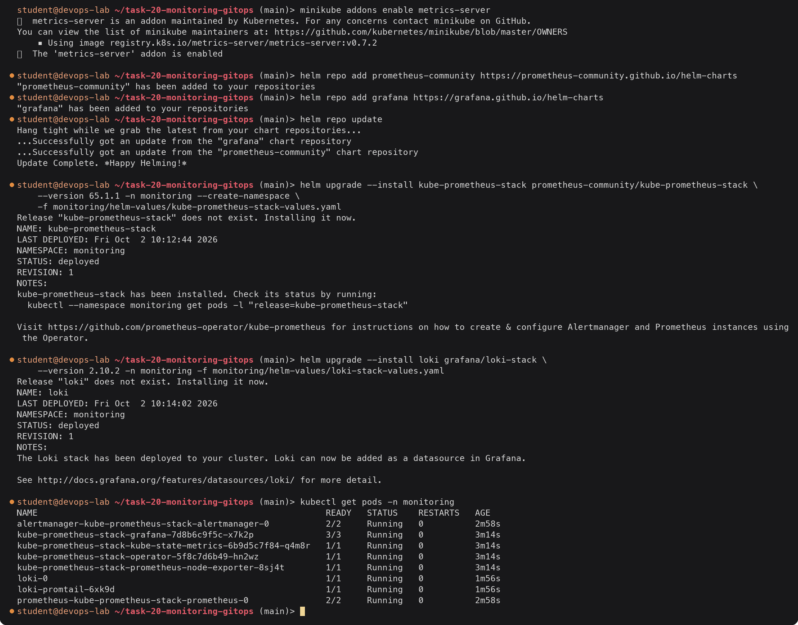

Things worth noting in the values file:

- `kubeControllerManager`, `kubeScheduler`, `kubeEtcd` and `kubeProxy` are disabled. On minikube those
  components listen on 127.0.0.1 only, so Prometheus would mark them down and fire `TargetDown` forever.
- The three `*SelectorNilUsesHelmValues: false` settings make Prometheus load every `ServiceMonitor`
  and `PrometheusRule` in the cluster, not only ones carrying the Helm release label.
- Alertmanager routes anything with `namespace="monitoring-demo"` to the `alert-sink` webhook.
- Grafana gets Loki as an extra data source, so metrics and logs sit in the same UI.

Before installing I checked the Alertmanager part of the values file on its own:

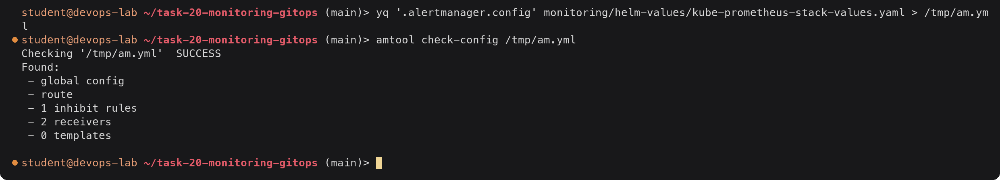

### 1.3 Deploy the demo app, ServiceMonitor, rules and dashboard

The image is built straight into minikube's container runtime, so no registry is needed.

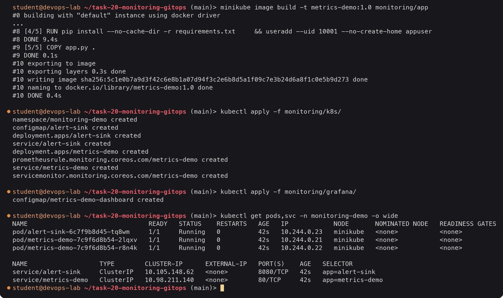

`00-namespace.yaml` has the `00-` prefix so `kubectl apply -f <dir>` (which goes in file name order)
creates the namespace before anything that lives in it.

For the rest of the demo I kept four port-forwards open in a second terminal:

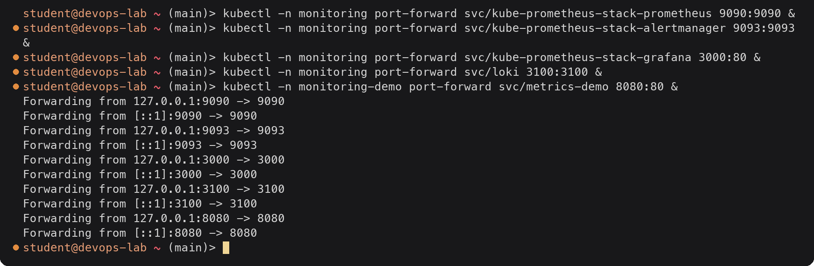

### 1.4 Application health

#### Output

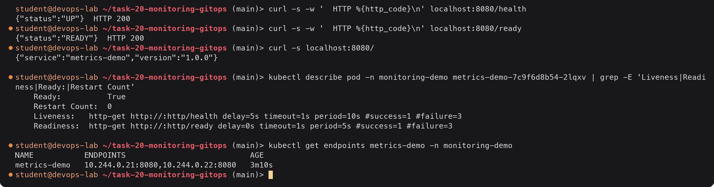

Kubernetes uses the two probes for different decisions. If `/health` fails three times the kubelet
restarts the container. If `/ready` fails the pod stays running but is removed from the Service
endpoints, so it stops getting traffic. Both pods are listed as endpoints, so both are ready.

The same health picture from Prometheus, which is what dashboards and alerts use:

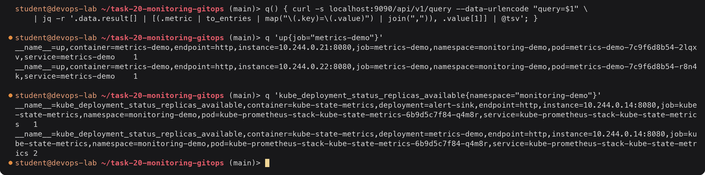

`up` is 1 for each scraped pod. The labels `namespace`, `pod`, `service` and `endpoint` were added by
the ServiceMonitor, which is what lets one query be filtered or grouped by pod. The second query
comes from kube-state-metrics, so its `pod` label is the kube-state-metrics pod itself and the
interesting label is `deployment`.

### 1.5 Metrics

#### The raw /metrics endpoint

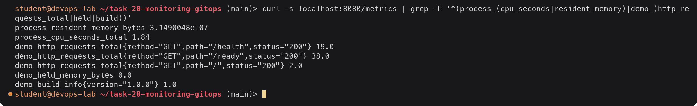

This is the Prometheus text format: a metric name, labels in braces, and a value. The kubelet's
probes are already showing up as `/health` and `/ready` requests.

#### Prometheus is scraping both pods

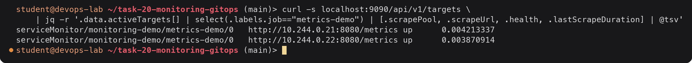

#### Generating load

Two throwaway pods: one hits `/` and `/work?ms=300` in a loop (CPU), the other mixes `/` with `/error`.

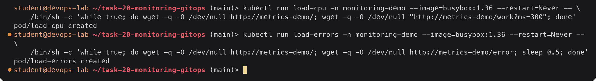

Started at 10:40 UTC. The queries below were run at about 10:50, after I also pushed one pod's memory
up (shown in 1.6).

#### PromQL queries and results

| # | Question | PromQL |
|---|---|---|
| 1 | Requests per second by status | `sum by (status) (rate(demo_http_requests_total{job="metrics-demo"}[5m]))` |
| 2 | Error ratio (recording rule) | `job:demo_http_errors:ratio_rate5m` |
| 3 | p95 latency per path | `histogram_quantile(0.95, sum by (le, path) (rate(demo_http_request_duration_seconds_bucket{job="metrics-demo"}[5m])))` |
| 4 | Pod CPU (cores) | `sum by (pod) (rate(container_cpu_usage_seconds_total{namespace="monitoring-demo", container="metrics-demo"}[2m]))` |
| 5 | Pod CPU as fraction of limit | query 4 divided by `sum by (pod) (kube_pod_container_resource_limits{namespace="monitoring-demo", container="metrics-demo", resource="cpu"})` |
| 6 | Pod memory working set | `sum by (pod) (container_memory_working_set_bytes{namespace="monitoring-demo", container="metrics-demo"})` |
| 7 | Node CPU % | `100 * (1 - avg by (instance) (rate(node_cpu_seconds_total{mode="idle"}[5m])))` |
| 8 | Node memory % | `100 * (1 - node_memory_MemAvailable_bytes / node_memory_MemTotal_bytes)` |

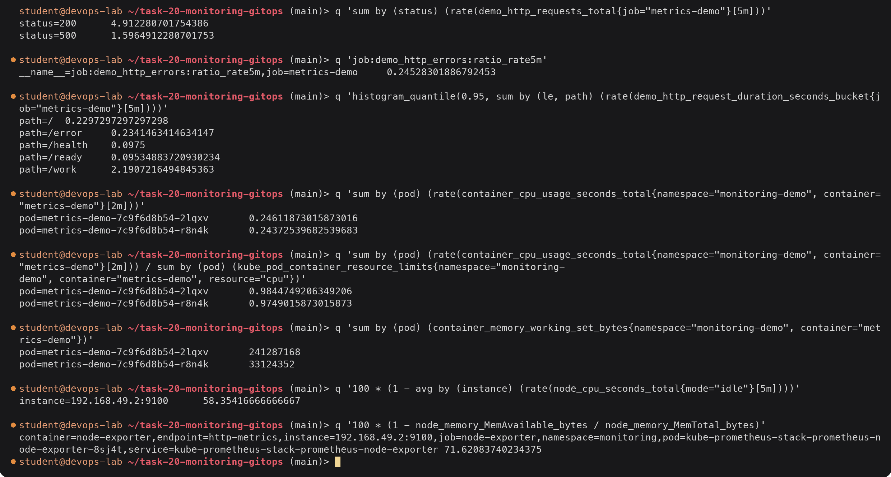

What the numbers say:

- About 6.5 requests per second, a quarter of them 500s. That is far above the 5% alert threshold.
- `/work` p95 is about 2.2 s even though it only burns 300 ms of CPU. Both pods sit at about 0.245
  cores against a 250m limit (98% of the limit), so the kernel is throttling them. Throttling also slows
  the cheap endpoints: `/` has a p95 of 230 ms, which would normally be a few milliseconds. This is
  the kind of thing a CPU graph alone does not tell you, but CPU plus latency together does.
- Pod `2lqxv` uses 230 MiB of its 256 MiB memory limit (because of the `/alloc` calls in 1.6), the
  other pod 31.6 MiB.
- The node itself is at 58% CPU and 72% memory, so the problem is the pod limits, not the node.

The same CPU and memory numbers from metrics-server, for comparison:

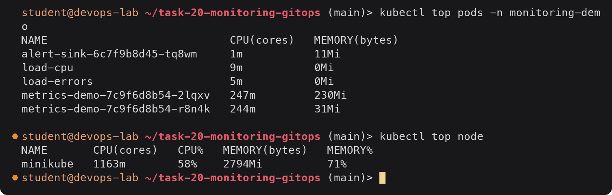

`kubectl top` only shows the current value. Prometheus keeps the history, which is what you need to
answer "when did this start?".

### 1.6 Alerts

The rules are in [monitoring/rules/metrics-demo-rules.yaml](monitoring/rules/metrics-demo-rules.yaml)
and, wrapped as a `PrometheusRule`, in [monitoring/k8s/prometheusrule.yaml](monitoring/k8s/prometheusrule.yaml).

| Alert | Fires when | for | Severity |
|---|---|---|---|
| `MetricsDemoDown` | `up == 0` for a pod | 1m | critical |
| `MetricsDemoHighErrorRate` | more than 5% of requests are 5xx | 2m | warning |
| `MetricsDemoHighCPU` | pod CPU above 80% of its limit | 2m | warning |
| `MetricsDemoHighMemory` | pod working set above 80% of its memory limit | 2m | warning |
| `MetricsDemoReplicasUnavailable` | desired replicas minus available replicas > 0 | 2m | warning |

#### Checking the rules before deploying them

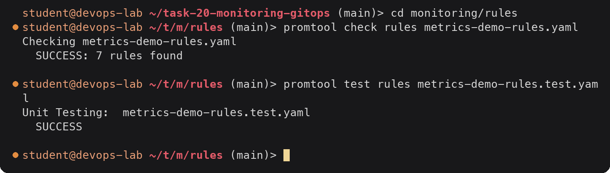

The unit test feeds fake series into the rules: a target that goes from `up=1` to `up=0` (expects
`MetricsDemoDown` to fire after the 1 minute `for`), and a counter where 20% of requests are 500s
(expects `MetricsDemoHighErrorRate` with the description `20% of requests failed`).

#### Pushing memory up on one pod

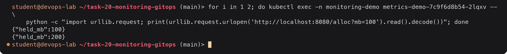

#### Output: alerts pending, then firing

At 10:43, one minute after the CPU crossed 80% of the limit:

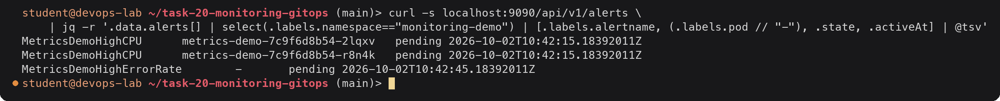

At 10:50:

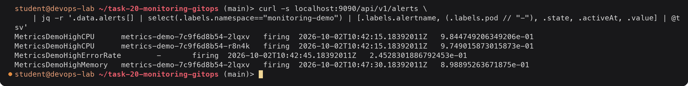

`pending` means the expression is true but the `for` duration has not passed yet. This avoids paging
someone for a one-scrape spike. After 2 minutes the state changes to `firing` and Prometheus sends the
alert to Alertmanager.

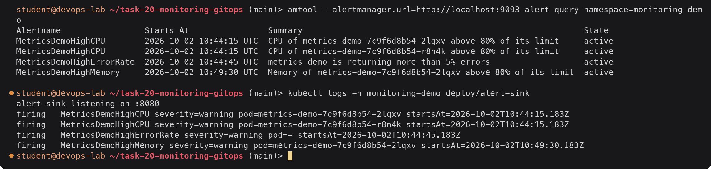

Alertmanager's "Starts At" is when the alert started firing (`activeAt` + `for`). The webhook receiver
got one notification per alert group. Alerts are grouped by `alertname` and `namespace`, so both CPU
alerts arrived in the same POST. In a real setup the receiver would be Slack, PagerDuty or e-mail instead
of `alert-sink`.

### 1.7 Logs

The app writes one JSON line per request (health and readiness probes are skipped unless they fail).

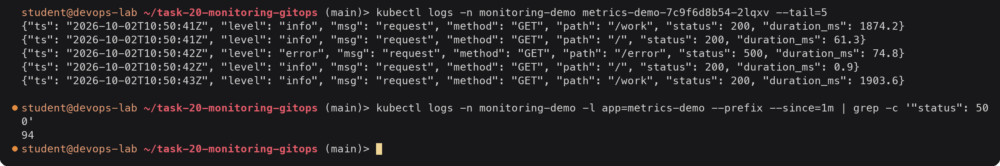

`kubectl logs` is fine for one pod right now, but it only shows what the container runtime still has
for pods that still exist. Loki keeps the logs from every pod after the pods are gone and can be
queried with LogQL:

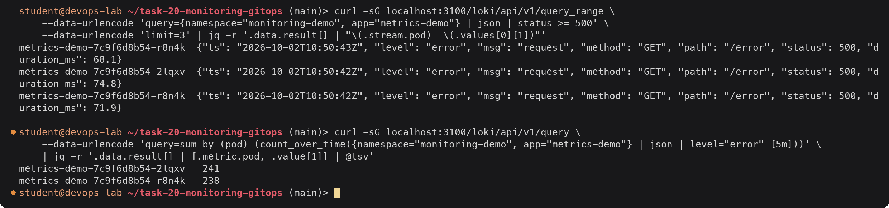

The `| json` stage turns each JSON field into a label, so the query can filter on `status >= 500`
without any regex. The second query turns logs into a number (errors per pod over 5 minutes), which is
how you can graph or alert on logs too. Promtail added the `namespace`, `pod` and `app` labels from
the Kubernetes metadata.

### 1.8 Grafana dashboards

Grafana runs as part of kube-prometheus-stack. The dashboard sidecar container watches for ConfigMaps
labelled `grafana_dashboard: "1"` and loads them, so the dashboard is code in
[monitoring/grafana/metrics-demo-dashboard.yaml](monitoring/grafana/metrics-demo-dashboard.yaml).

#### Output

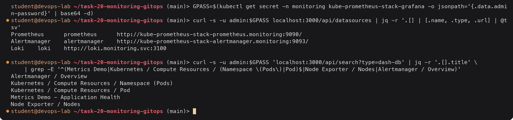

What the "Metrics Demo - Application Health" dashboard showed at 10:50 (the panels are defined in the
ConfigMap):

| Panel | Query (short) | Value at 10:50 |
|---|---|---|
| Targets up (stat) | `sum(up{job="metrics-demo"})` | 2 |
| Request rate (stat) | `sum(rate(demo_http_requests_total[5m]))` | 6.51 req/s |
| Error ratio (stat) | 5xx rate / total rate | 24.5% (red) |
| Firing alerts (stat) | `count(ALERTS{alertstate="firing", namespace="monitoring-demo"})` | 4 |
| Requests per second by path and status | `sum by (path, status) (rate(...))` | `/work 200` and `/ 200` lines high, `/error 500` line at about 1.6 |
| Latency p50 / p95 / p99 | `histogram_quantile(...)` | p95 climbed from 5 ms to about 2 s at 10:41 |
| CPU usage vs limit | cAdvisor CPU and kube-state-metrics limit | both pods flat against the 0.25 limit line |
| Memory working set vs limit | cAdvisor memory and the limit | pod `2lqxv` steps up to 230 MiB at 10:47, limit line at 256 MiB |
| Node CPU and memory utilisation | node-exporter | CPU 58%, memory 72% |
| Pod readiness and restarts | `kube_pod_status_ready`, `kube_pod_container_status_restarts_total` | 1 ready per pod, 0 restarts |
| Error logs (Loki) | `{namespace="monitoring-demo", app="metrics-demo"} \| json \| level="error"` | stream of `/error` lines |

The stock dashboards from the chart covered the cluster side: "Kubernetes / Compute Resources /
Namespace (Pods)" showed CPU and memory per pod against requests and limits, and "Node Exporter /
Nodes" showed the node CPU, load, memory and disk.

### 1.9 Recovery

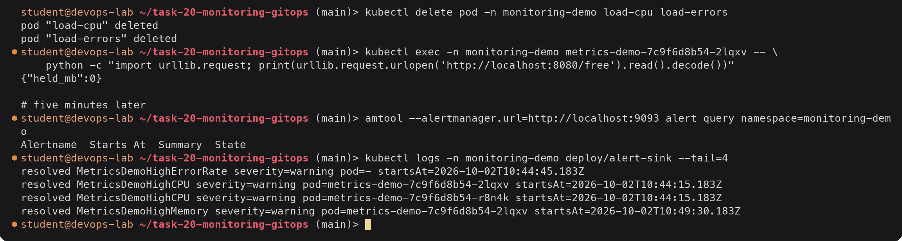

Because the receiver has `send_resolved: true`, Alertmanager also tells it when each alert clears.

### 1.10 Clean up

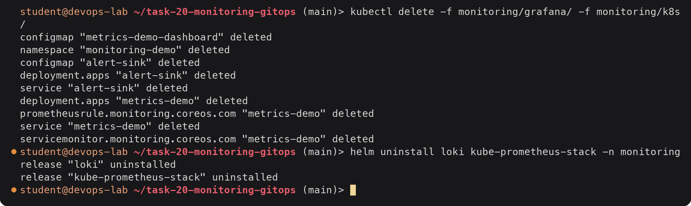

The Prometheus Operator CRDs stay installed after `helm uninstall`. They can be removed with
`kubectl get crd -o name | grep monitoring.coreos.com | xargs kubectl delete`.

---

## Task 2: Observability

### What observability means

Monitoring answers questions you already knew to ask: "is CPU above 80%?", "is the site returning
200?". You decide the checks in advance and get an alert when one fails.

Observability is the ability to work out what is happening inside a system from the data it sends
out, including for problems nobody predicted. A system is observable when an engineer can go from
"checkout is slow for some users" to "the slow requests all go through pod X, which is waiting on a
database query that started timing out after the 14:02 deploy" without adding new code first.

Monitoring is one thing you do with observability data. You need the data (metrics, logs, traces)
before you can either monitor or investigate.

### The three signals

| | Metrics | Logs | Traces |
|---|---|---|---|
| What it is | Numbers measured over time, with labels | Timestamped text records of single events | The path of one request through every service it touched, with timing for each step |
| Example | `http_requests_total{status="500"} 1532` | `{"level":"error","path":"/error","status":500}` | `GET /checkout` 840 ms = frontend 20 ms → orders-api 60 ms → payments-api 740 ms |
| Answers | Is something wrong? How much? Since when? | What exactly happened in this event? | Where in the chain did the time or the error come from? |
| Cost | Cheap. Size depends on the number of label combinations, not on traffic | Grows with traffic. The most expensive to store | Grows with traffic, so it is usually sampled |
| Good for | Dashboards, alerts, trends, capacity planning | Debugging a specific error, audit, security | Latency in microservices, finding the failing dependency |
| In this task | Prometheus (`/metrics`, cAdvisor, node-exporter) | stdout → Promtail → Loki, `kubectl logs` | not deployed, see "Traces" below |

#### Metrics

A metric is a name, a set of labels and a value sampled at regular intervals. The common types are:

- **Counter**: only goes up (requests served, errors). You look at its `rate()`.
- **Gauge**: goes up and down (memory in use, queue length, temperature).
- **Histogram**: counts observations into buckets (request duration). Used for percentiles such as p95.

Two well-known checklists say which metrics to have:

- **RED** for services: Rate (requests per second), Errors (failed requests per second), Duration (latency).
- **USE** for resources: Utilisation (CPU %), Saturation (run queue, throttling), Errors (disk/network errors).

Google's SRE book calls the same idea the four golden signals: latency, traffic, errors, saturation.

#### Logs

A log is a record of one event. Logs are best structured (JSON) so tools can filter on fields
(`status >= 500`) instead of searching free text. In Kubernetes the rule is to write logs to
stdout/stderr and let the platform collect them. The container runtime stores them on the node, and an
agent (Promtail, Fluent Bit, the OpenTelemetry Collector) ships them to central storage, because the
node copy disappears when the pod is deleted.

#### Traces

A trace follows one request. Each step is a span with a start time, a duration and attributes. Spans
share a trace ID that is passed between services in an HTTP header (`traceparent` in the W3C standard).

```text
trace 4bf92f3577b34da6a3ce929d0e0e4736              total 840 ms
└─ frontend        GET /checkout                    0 ─────────────────────────── 840
   ├─ orders-api   POST /orders                     20 ──── 80
   │  └─ postgres  INSERT orders                    30 ─ 70
   └─ payments-api POST /charge                     90 ─────────────────────── 830
      └─ bank-api  POST /authorize  (timeout 700ms) 100 ────────────────────── 800
```

From the metrics alone you would know `/checkout` is slow. The trace shows that the time goes to the
external bank call, not to your own code or database.

#### How they connect

The usual flow during an incident is: an **alert** (from metrics) says error rate is high. The
**dashboard** (metrics) shows which service and when. An **exemplar** or a trace ID in the log line
takes you to a **trace** of a failing request. The trace shows the failing span, and that span's
**logs** show the exact exception. Putting the same labels (`namespace`, `pod`, `service`) on all three
signals is what makes this jump possible. In this task Grafana already shows Prometheus metrics and
Loki logs for the same `namespace`/`pod` side by side.

### Why observability is required

- **Distributed systems fail in new ways.** One request may touch ten services, a queue and two
  databases. Without traces and correlated logs nobody can say where it broke.
- **Pods are short-lived.** A crashed pod and its local logs are gone in seconds. You need the data to
  be collected and stored outside the pod.
- **Faster recovery (MTTR).** Most outage time is spent finding the cause, not fixing it. Good
  signals turn hours of guessing into minutes.
- **Finding problems before users do.** Alerts on error rate, latency and saturation catch problems
  while they are still small.
- **Safe deployments.** Comparing error rate and latency before and after a release, or between canary
  and stable, is how you decide to continue or roll back.
- **Capacity and cost.** CPU and memory history show whether requests and limits are right and when
  to scale. In this task the CPU graph showed pods pinned at their limit and being throttled.
- **SLOs.** Reliability targets such as "99.9% of requests under 300 ms" can only be measured with metrics.

### Common tools

| Area | Tools |
|---|---|
| Metrics collection and storage | Prometheus, VictoriaMetrics, Thanos / Mimir / Cortex (long-term, multi-cluster), Amazon Managed Prometheus |
| Exporters | node-exporter (hosts), kube-state-metrics (Kubernetes objects), cAdvisor (containers), blackbox-exporter (HTTP/TCP probes), postgres/redis/nginx exporters |
| Dashboards | Grafana, Kibana, cloud consoles |
| Alerting | Alertmanager, Grafana Alerting, PagerDuty / Opsgenie for on-call |
| Logs | Loki + Promtail/Grafana Alloy, Elasticsearch/OpenSearch + Fluent Bit/Fluentd + Kibana (EFK/ELK), CloudWatch Logs |
| Traces | Jaeger, Grafana Tempo, Zipkin, AWS X-Ray |
| Instrumentation standard | OpenTelemetry (SDKs + Collector) for metrics, logs and traces in one format |
| All-in-one SaaS | Datadog, New Relic, Dynatrace, Grafana Cloud, Honeycomb |

### Observability in Kubernetes

Kubernetes adds layers that all need watching:

| Layer | What to watch | Where the data comes from |
|---|---|---|
| Cluster / control plane | API server latency and errors, etcd health, scheduler queue | API server and etcd `/metrics`, managed by the cloud provider on EKS/GKE/AKS |
| Nodes | CPU, memory, disk, network, `NotReady` nodes | node-exporter, kubelet |
| Kubernetes objects | Desired vs available replicas, pod phase, restarts, OOMKilled, pending pods, HPA state | kube-state-metrics |
| Containers | CPU usage and throttling, memory working set vs limit | cAdvisor inside the kubelet |
| Application | RED metrics, business metrics, logs, traces | the app's `/metrics`, stdout, OpenTelemetry SDK |
| Events | Scheduling failures, image pull errors, probe failures | `kubectl get events`, event exporter to Loki |

Kubernetes-specific points I learned while doing this:

- **Labels are the glue.** Prometheus service discovery, Promtail and the Operator all read pod labels
  and namespaces. Consistent `app` labels mean one label selector works in PromQL, LogQL and kubectl.
- **The Prometheus Operator makes monitoring declarative.** `ServiceMonitor` says what to scrape and
  `PrometheusRule` says what to alert on. Both are YAML next to the app, versioned in Git.
- **Probes are health signals too.** A failing readiness probe shows up as fewer Service endpoints and
  `kube_deployment_status_replicas_available` dropping, which is what `MetricsDemoReplicasUnavailable` watches.
- **Limits change behaviour.** CPU limits cause throttling (slow, not crashing). Memory limits cause
  OOMKilled restarts. Both are only visible if container metrics are compared against the limits.
- **`kubectl top` and metrics-server are for autoscaling and quick checks**, not for history or alerting.
- **Logs must leave the node.** A DaemonSet log agent is the standard pattern.
- **Service meshes (Istio, Linkerd) and eBPF tools (Cilium Hubble, Pixie)** can give request metrics
  and traces between pods without changing application code.

---

## Task 3: GitOps

### What GitOps is

GitOps is a way of running deployments where the desired state of the system is described in files in
a Git repository, and an agent inside the cluster keeps the cluster matching those files. To deploy
you make a commit. Nobody runs `kubectl apply` or `helm upgrade` against production by hand.

The OpenGitOps project describes four principles:

| Principle | Meaning |
|---|---|
| Declarative | The system is described as the end state you want (YAML, Helm values), not as a list of commands |
| Versioned and immutable | That description is stored in Git, so every change has an author, a review and a history |
| Pulled automatically | An agent in the cluster pulls the desired state from Git, CI does not push into the cluster |
| Continuously reconciled | The agent keeps comparing desired and actual state and fixes any difference |

### Git as the single source of truth

Whatever is on the `main` branch is what should be running. Some consequences:

- **Audit trail.** `git log` answers who changed what, when and why. Pull requests give review and approval.
- **Rollback is `git revert`.** The agent then puts the cluster back to the previous state.
- **Disaster recovery.** A new cluster pointed at the same repo ends up with the same workloads.
- **No hidden changes.** A change made with `kubectl` that is not in Git is drift, and the agent either
  reports it or reverts it.
- **Fewer credentials.** CI no longer needs cluster admin credentials. Only the in-cluster agent
  talks to the API server, and it only needs read access to Git.

### Declarative configuration

Imperative: "run 3 more pods", `kubectl scale --replicas=3`, `kubectl set image ...`. The result
depends on what state the cluster was in before.

Declarative: "there should be a Deployment `web` with 3 replicas of image X". Applying it once or ten
times gives the same result. Kubernetes is already built this way (controllers reconcile objects to
their spec), and GitOps applies the same idea one level up: Git → cluster.

### Continuous reconciliation

```text
           ┌──────────────┐  desired state
           │  Git repo    │──────────────────┐
           └──────────────┘                  ▼
                                    ┌──────────────────┐
                                    │  Argo CD         │
                                    │  1. fetch + render (repo-server)
                                    │  2. compare with live objects
                                    │  3. Synced / OutOfSync
                                    │  4. apply the difference
                                    └────────┬─────────┘
                                             │ every 3 min (or on webhook),
                                             │ and on every watched change
                                             ▼
           ┌──────────────┐  actual state
           │ Kubernetes   │◄─────────────────┘
           └──────────────┘
```

Argo CD polls the repo every 3 minutes by default (a GitHub webhook makes it immediate) and also
watches the live objects. With `selfHeal: true` any manual change is reverted within seconds. With
`prune: true` objects deleted from Git are deleted from the cluster.

### GitOps workflow

```text
Developer ── PR (change replicas / image tag) ──► review ──► merge to main
                                                                │
CI (GitHub Actions): test, build image, push ghcr.io/...:<sha>, │
commit the new tag into the manifests repo ────────────────────►│
                                                                ▼
                                                      Git: desired state
                                                                │ pull
                                                                ▼
                                                    Argo CD in the cluster
                                                                │ apply
                                                                ▼
                                                     Kubernetes: actual state
```

CI builds and tests. It stops at "image pushed and tag committed". Argo CD does the deploy. This is
the pull model. The push model is CI running `kubectl apply` or `helm upgrade` itself.

| | Push (CI deploys) | Pull (GitOps) |
|---|---|---|
| Who talks to the cluster | CI runner, needs kubeconfig | Agent inside the cluster |
| Drift detection | None, until the next pipeline run | Continuous |
| Rollback | Re-run an old pipeline | `git revert` |
| Multi-cluster | One pipeline step per cluster | Each cluster pulls from the same repo |

### Kubernetes and GitOps

Kubernetes fits GitOps well because every object is already declarative YAML, the API server can
report the live state of any object, and controllers already reconcile. Argo CD and Flux are
Kubernetes controllers themselves, configured with CRDs (`Application`, `AppProject` for Argo CD;
`GitRepository`, `Kustomization`, `HelmRelease` for Flux). Plain YAML, Kustomize overlays and Helm
charts are all supported as the source. Secrets are the one thing that cannot go into Git in plain
text, so they are handled with Sealed Secrets, SOPS or External Secrets Operator.

### GitOps demo with Argo CD

Files:

- [gitops/manifests/](gitops/manifests/) — `configmap.yaml`, `deployment.yaml` (3 replicas of an
  unprivileged nginx serving the ConfigMap), `service.yaml`. This is what Argo CD deploys.
- [gitops/argocd/application.yaml](gitops/argocd/application.yaml) — the `Application`. It points at
  `https://github.com/devops-student/devops-homework.git`, branch `main`, path
  `task-20-monitoring-gitops/gitops/manifests`, with automated sync, `prune` and `selfHeal`. It is kept
  outside the manifests folder so Argo CD does not try to manage its own Application.

#### Install Argo CD

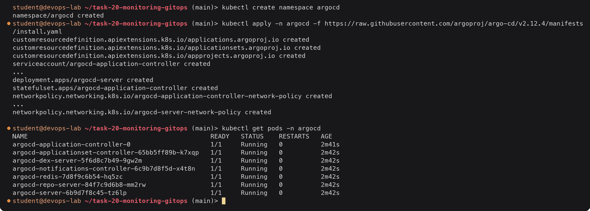

| Pod | Job |
|---|---|
| `argocd-application-controller` | compares Git with the cluster and syncs, the reconciler |
| `argocd-repo-server` | clones the repo and renders the manifests (plain YAML, Helm, Kustomize) |
| `argocd-server` | API, web UI and the endpoint the `argocd` CLI talks to |
| `argocd-redis` | cache for rendered manifests and app state |
| `argocd-dex-server` | SSO (GitHub, OIDC) login |
| `argocd-applicationset-controller` | generates many Applications from one template |
| `argocd-notifications-controller` | Slack/e-mail messages on sync events |

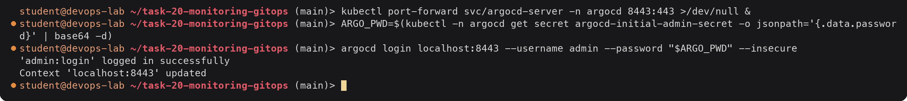

#### Create the Application and let it sync

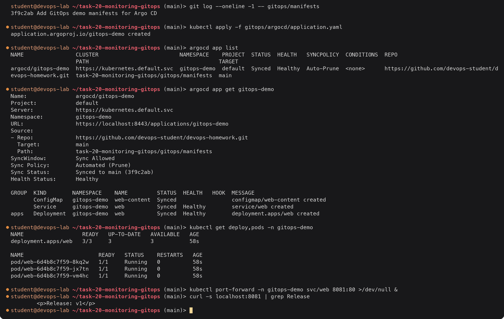

I never ran `kubectl apply` on the manifests folder. Argo CD created the namespace (`CreateNamespace=true`)
and the three objects from Git. `Synced` means the cluster matches the commit `3f9c2ab`. `Healthy`
means the Deployment has all its replicas available.

#### Deploy a change through Git

I changed `replicas: 3` to `replicas: 4` in `deployment.yaml` and `Release: v1` to `Release: v2` in
`configmap.yaml`, and pushed.

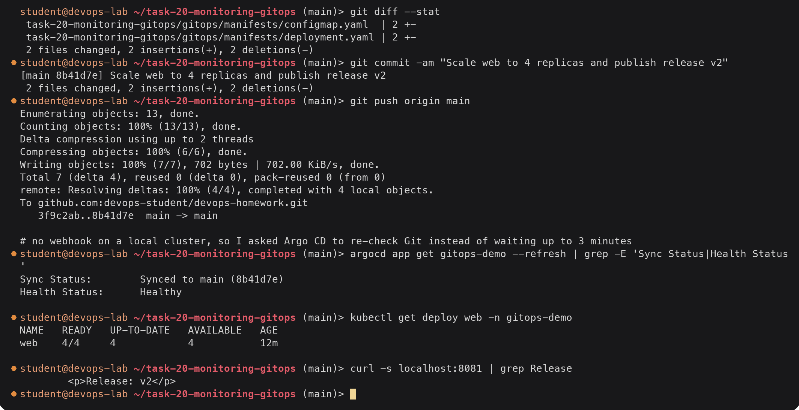

The page updated without a pod restart because ConfigMap volumes are refreshed by the kubelet (it took
about 40 seconds). The replica change was applied by Argo CD as soon as it saw the new commit.

#### Drift and self-heal

Now the "someone changed production by hand" case:

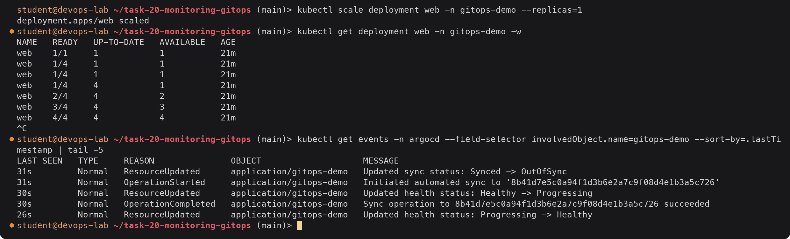

The scale to 1 lasted about a second. Argo CD saw that the live Deployment no longer matched Git
(`OutOfSync`), started an automated sync to the same commit, and the Deployment went back to 4. This
is the reconciliation loop doing its job: Git says 4, so the cluster gets 4. The correct way to run 1
replica would have been a commit that changes the YAML.

Without `selfHeal: true` the app would have stayed `OutOfSync` and the UI would show the diff, but
nothing would be reverted until the next commit or a manual sync.

#### History and rollback

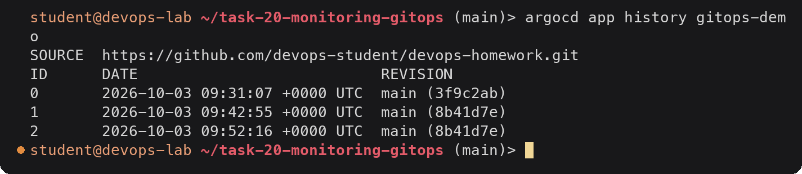

Entry 2 is the self-heal sync to the same commit. To roll back in GitOps you use
`git revert 8b41d7e && git push`, not `argocd app rollback`. Argo CD refuses a rollback while
automated sync is enabled, because the next reconcile would undo it anyway.

#### Clean up

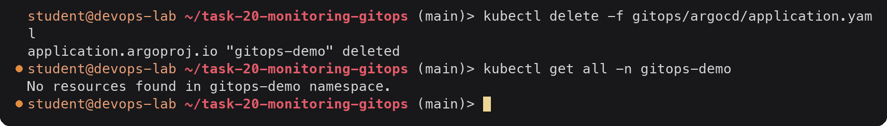

The `resources-finalizer.argocd.argoproj.io` finalizer on the Application made Argo CD delete the
Deployment, Service and ConfigMap before the Application itself was removed.

---

## Deliverables checklist

- [x] Monitoring demo: kube-prometheus-stack + Loki installed with Helm, values in [monitoring/helm-values/](monitoring/helm-values/) (1.2)
- [x] Metrics: app `/metrics`, ServiceMonitor, Prometheus targets and eight PromQL queries with results (1.5)
- [x] CPU utilisation: pod CPU vs limit, node CPU %, `kubectl top` (1.5)
- [x] Memory utilisation: pod working set vs limit, node memory % (1.5)
- [x] Application health: `/health`, `/ready`, probes, endpoints, `up`, available replicas (1.4)
- [x] Alerts: [prometheusrule.yaml](monitoring/k8s/prometheusrule.yaml), `promtool check`/`test`, alerts pending → firing → resolved, `amtool`, webhook receiver (1.6, 1.9)
- [x] Logs: `kubectl logs` and Loki LogQL queries (1.7)
- [x] Grafana dashboards: dashboard as code in [monitoring/grafana/](monitoring/grafana/), data sources and panels described (1.8)
- [x] Observability document: metrics, logs, traces, why observability is needed, tools, Kubernetes observability (Task 2)
- [x] GitOps concepts: Git as source of truth, declarative config, continuous reconciliation, workflow, Kubernetes + GitOps (Task 3)
- [x] GitOps demo with Argo CD: install, [Application](gitops/argocd/application.yaml) pointing at [gitops/manifests/](gitops/manifests/), sync, change through Git, drift self-heal, `argocd app list/get/history` (Task 3)
- [x] README: [README.md](README.md)
