# Final DevOps Project: TaskBoard from commit to monitored Kubernetes

> **Note:** Command output in this file is representative expected output for the lab environment
> below, written as a learning reference. It was not captured from a live run, so IDs, timestamps
> and pod name hashes will differ when you run it yourself.

## Lab environment

| Item | Value |
|---|---|
| Host | Ubuntu 24.04 LTS, hostname `devops-lab`, user `student` |
| Shell prompt in output | `student@devops-lab:~/<task-folder>$` |
| Docker | 27.3.1 |
| Minikube | v1.34.0, docker driver, 2 CPU / 4096 MB, profile `minikube` |
| Kubernetes | v1.31.0, single node `minikube`, node InternalIP `192.168.49.2` |
| kubectl | v1.31.1 client |
| Helm | v3.16.2 |
| Terraform | v1.9.8, hashicorp/aws provider 5.74.0 |
| AWS | region `ap-south-1`, account ID `123456789012` (placeholder), IAM user `terraform-lab` |
| GitHub | user/org placeholder `devops-student`, repo `devops-homework` |
| Container registry | `ghcr.io/devops-student/...` |
| Pod CIDR / Service CIDR | 10.244.0.0/16 / 10.96.0.0/12, kube-dns ClusterIP 10.96.0.10 |
| Date range of runs | 2026-09-14 to 2026-10-04 (timestamps should fall in this range, ascending by task number) |

Project-specific additions:

| Item | Value |
|---|---|
| Project repository | this folder is pushed as the root of `github.com/devops-student/final-devops-project` (GitHub Actions only reads `.github/workflows/` at a repository root) |
| Images | `ghcr.io/devops-student/taskboard-backend:<sha7>`, `ghcr.io/devops-student/taskboard-frontend:<sha7>` |
| Deployed version in the outputs | commit `4c2e9d1` |
| Monitoring | kube-prometheus-stack 65.1.1, loki-stack 2.10.2 |
| GitOps | Argo CD v2.12.4 |
| Runs | 2026-10-03 (build, cloud, deploy) and 2026-10-04 (troubleshooting) |

## Contents

1. [Project overview](#1-project-overview)
2. [Architecture](#2-architecture)
3. [Technologies used](#3-technologies-used)
4. [Repository layout](#4-repository-layout)
5. [Application setup](#5-application-setup)
6. [Docker setup](#6-docker-setup)
7. [Kubernetes deployment](#7-kubernetes-deployment)
8. [Helm deployment](#8-helm-deployment)
9. [Terraform infrastructure](#9-terraform-infrastructure)
10. [CI/CD pipeline](#10-cicd-pipeline)
11. [DevSecOps implementation](#11-devsecops-implementation)
12. [Monitoring](#12-monitoring)
13. [GitOps](#13-gitops)
14. [Troubleshooting challenge](#14-troubleshooting-challenge)
15. [Final state output](#15-final-state-output)
16. [Lessons learned](#16-lessons-learned)

---

## 1. Project overview

TaskBoard is a small project-management app: a React dashboard where a team creates tasks, moves
them through TODO → IN PROGRESS → DONE, and sees counts per status. The application code is taken
from the course capstone (`devops-heros-main/session21-python`) and cleaned up. The work in this
project is everything around it:

```text
Application → Git → GitHub → CI → Build & Test → Security scanning → Docker image
  → Registry (GHCR) → Kubernetes → Helm → Monitoring → GitOps
```

What changed in the application compared with the course version, and why:

| Change | Reason |
|---|---|
| Config split into `DB_HOST`, `DB_USER`, `DB_PASSWORD`, ... | so the non-secret part comes from a ConfigMap and the credentials from a Secret |
| `/ready` runs `SELECT 1` and returns 503 when the database is down | readiness should fail when the pod cannot serve requests |
| JSON request logs, `/version`, a `taskboard_tasks_created_total` counter | logs that Loki can parse, and one business metric |
| Wildcard CORS removed | flagged by Semgrep; the UI and API share one origin through nginx/Ingress, so CORS is not needed |
| FastAPI 0.115.6 → 0.142.2 (Starlette 0.41.3 → 1.7.0) | the SCA gate failed on seven Starlette advisories (section 11) |
| Alembic takes a Postgres advisory lock | several backend pods run `alembic upgrade head` at the same time |
| Test suite grew from 3 to 13 tests, with fixtures and a throwaway SQLite DB | each test starts from an empty database |
| Personal names removed from the UI | |

## 2. Architecture

```text
 Developer ──git push──► GitHub: devops-student/final-devops-project
                               │
                               ▼  GitHub Actions (.github/workflows/ci-cd.yml)
   ┌──────────────┬────────────┬──────────┬──────────────┬──────────────────┐
   │ lint + test  │ SAST       │ SCA      │ secrets      │ IaC / manifests  │   all must pass
   │ ruff, pytest │ Semgrep,   │ pip-audit│ Gitleaks     │ Trivy config     │
   │ vite build   │ Bandit     │ npm audit│              │                  │
   └──────────────┴────────────┴──────────┴──────────────┴──────────────────┘
                               │
                               ▼
         docker build (backend, frontend) → Trivy image scan (gate) → SBOM
                               │
                               ▼
         push ghcr.io/devops-student/taskboard-{backend,frontend}:<sha7>, cosign sign
                               │
                               ▼
         commit image.tag=<sha7> into helm/taskboard/values-dev.yaml  [skip ci]
                               │  (Git is the desired state)
                               ▼
 ┌───────────────────────── Kubernetes (minikube, or EKS from terraform/) ─────────────────────────┐
 │  Argo CD ── pulls helm/taskboard + values-dev.yaml ── renders ── applies ── self-heals drift      │
 │                                                                                                   │
 │  ingress-nginx  (taskboard.local)                                                                 │
 │     ├── /      → Service taskboard-frontend:80  → Deployment (nginx, 2 pods) ──/api/ proxy──┐     │
 │     └── /api   → Service taskboard-backend:8000 → Deployment (FastAPI, 2-6 pods, HPA) ◄─────┘     │
 │                                                    │  ConfigMap taskboard-config               │
 │                                                    │  Secret    taskboard-db                   │
 │                                                    ▼                                           │
 │                                     StatefulSet taskboard-postgres + PVC (1Gi)                 │
 │                                                                                                   │
 │  monitoring ns: Prometheus ◄─ServiceMonitor─ /metrics   Alertmanager ◄─ PrometheusRule           │
 │                 Grafana (dashboard ConfigMap)            Loki ◄─ Promtail ◄─ pod stdout          │
 └───────────────────────────────────────────────────────────────────────────────────────────────────┘

 terraform/ ── AWS ap-south-1: VPC (2 public + 2 private subnets, NAT) + EKS + managed node group
```

## 3. Technologies used

| Area | Tool | Version / detail |
|---|---|---|
| Frontend | React, Vite | React 19.3.0, Vite 8.3.3, built with Node 22, served by nginx-unprivileged 1.28 |
| Backend | FastAPI, Uvicorn, SQLAlchemy, Alembic, Pydantic Settings | FastAPI 0.142.2, SQLAlchemy 2.0.54, Alembic 1.20.0, Python 3.12 |
| Database | PostgreSQL | 16 (alpine) |
| Metrics in code | prometheus-fastapi-instrumentator | 8.1.0 |
| Tests and lint | pytest, pytest-cov, Ruff | pytest 9.1.1, Ruff 0.16.10 |
| Containers | Docker, Docker Compose, BuildKit | Docker 27.3.1 |
| Registry | GitHub Container Registry | `ghcr.io/devops-student` |
| CI/CD | GitHub Actions | `ubuntu-24.04` runners |
| SAST | Semgrep, Bandit | Semgrep 1.179.0, Bandit 1.9.4 |
| SCA | pip-audit, npm audit, Trivy (image) | pip-audit 2.10.1, Trivy 0.75.0 |
| Secret scanning | Gitleaks | gitleaks-action v3 (Gitleaks 8.30.1) |
| IaC scanning | Trivy config | Terraform, Kubernetes YAML, Helm, Dockerfiles |
| Supply chain | Trivy SBOM (CycloneDX), cosign keyless signing | |
| Infrastructure as code | Terraform, terraform-aws-modules | Terraform 1.9.8, AWS provider 5.74.0, vpc 5.13.0, eks 20.26.0 |
| Kubernetes | minikube (lab), EKS (cloud) | 1.31 (minikube), 1.33 (EKS) |
| Packaging | Helm | 3.16.2 |
| Ingress / autoscaling | ingress-nginx (minikube addon), metrics-server, HPA autoscaling/v2 | |
| Monitoring | Prometheus, Alertmanager, Grafana, node-exporter, kube-state-metrics, Loki, Promtail | kube-prometheus-stack 65.1.1, loki-stack 2.10.2 |
| GitOps | Argo CD | v2.12.4 |

## 4. Repository layout

```text
task-21-final-devops-project/            (= root of final-devops-project)
├── README.md                            this document
├── submission.md                        deliverable → file mapping and checklist
├── .github/workflows/ci-cd.yml          CI/CD + security gates + deploy
├── .dockerignore  .gitignore
├── application/
│   ├── backend/                         FastAPI app, Alembic migrations, pytest suite
│   │   ├── app/ (main, config, db, models, schemas, logging_config)
│   │   ├── alembic/ alembic.ini
│   │   ├── tests/ (conftest.py, test_api.py)
│   │   ├── requirements.txt requirements-dev.txt pytest.ini ruff.toml .env.example
│   └── frontend/                        React + Vite (package-lock.json committed)
├── docker/
│   ├── backend.Dockerfile               multi-stage, venv, non-root uid 10001
│   ├── frontend.Dockerfile              node build → nginx-unprivileged, uid 101
│   ├── nginx/default.conf.template      SPA + /api proxy, BACKEND_URL substituted at start
│   └── docker-compose.yml               postgres + backend + frontend
├── kubernetes/                          plain manifests (namespace, ConfigMap, Secret, Postgres
│   │                                    StatefulSet+PVC, backend, frontend, Ingress, HPA)
│   └── troubleshooting/                 the six broken changes used in section 14
├── helm/taskboard/                      Helm chart (same objects + ServiceMonitor, PrometheusRule,
│                                        dashboard, NetworkPolicy, helm test), values-dev/prod
├── terraform/                           VPC + EKS + EBS CSI IRSA, tfvars example, lock file
├── security/                            gitleaks, trivy, bandit, semgrep configs; accepted risks
├── monitoring/                          kube-prometheus-stack + Loki values, dashboard, raw
│                                        ServiceMonitor/PrometheusRule for the kubectl path
└── gitops/argocd/                       AppProject + Application (taskboard)
```

---

## 5. Application setup

### API

| Method | Path | Purpose |
|---|---|---|
| GET | `/health` | liveness, no dependencies |
| GET | `/ready` | readiness, checks the database |
| GET | `/metrics` | Prometheus metrics |
| GET | `/version` | deployed version (image tag) |
| GET | `/api/tasks` | list tasks, newest first |
| GET | `/api/tasks/{id}` | one task |
| POST | `/api/tasks` | create |
| PUT | `/api/tasks/{id}` | partial update |
| DELETE | `/api/tasks/{id}` | delete |
| GET | `/api/tasks/stats` | counts per status |

### Run the tests

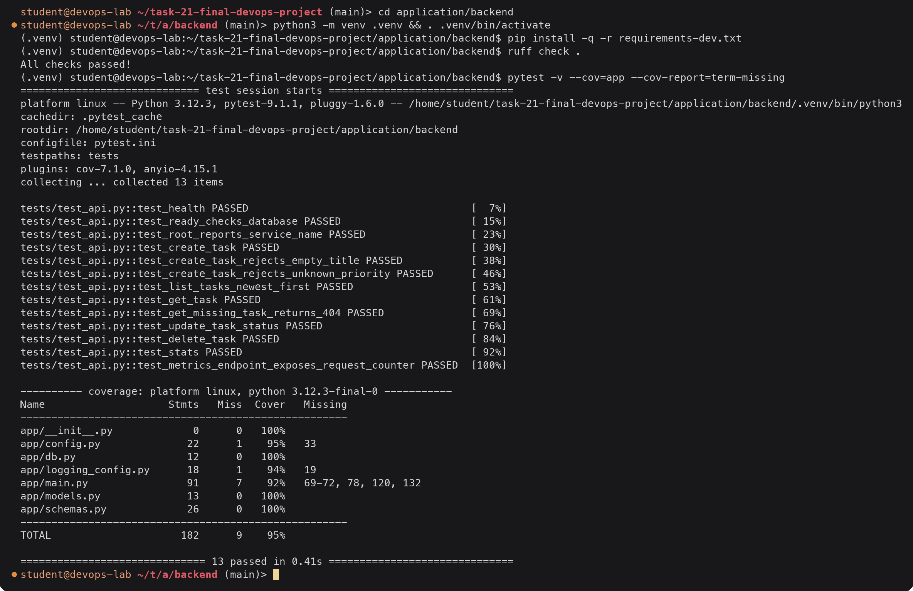

<details><summary>Text version</summary>

```console
student@devops-lab:~/task-21-final-devops-project$ cd application/backend
student@devops-lab:~/task-21-final-devops-project/application/backend$ python3 -m venv .venv && . .venv/bin/activate
(.venv) student@devops-lab:~/task-21-final-devops-project/application/backend$ pip install -q -r requirements-dev.txt
(.venv) student@devops-lab:~/task-21-final-devops-project/application/backend$ ruff check .
All checks passed!
(.venv) student@devops-lab:~/task-21-final-devops-project/application/backend$ pytest -v --cov=app --cov-report=term-missing
============================= test session starts ==============================
platform linux -- Python 3.12.3, pytest-9.1.1, pluggy-1.6.0 -- /home/student/task-21-final-devops-project/application/backend/.venv/bin/python3
cachedir: .pytest_cache
rootdir: /home/student/task-21-final-devops-project/application/backend
configfile: pytest.ini
testpaths: tests
plugins: cov-7.1.0, anyio-4.15.1
collecting ... collected 13 items

tests/test_api.py::test_health PASSED                                    [  7%]
tests/test_api.py::test_ready_checks_database PASSED                     [ 15%]
tests/test_api.py::test_root_reports_service_name PASSED                 [ 23%]
tests/test_api.py::test_create_task PASSED                               [ 30%]
tests/test_api.py::test_create_task_rejects_empty_title PASSED           [ 38%]
tests/test_api.py::test_create_task_rejects_unknown_priority PASSED      [ 46%]
tests/test_api.py::test_list_tasks_newest_first PASSED                   [ 53%]
tests/test_api.py::test_get_task PASSED                                  [ 61%]
tests/test_api.py::test_get_missing_task_returns_404 PASSED              [ 69%]
tests/test_api.py::test_update_task_status PASSED                        [ 76%]
tests/test_api.py::test_delete_task PASSED                               [ 84%]
tests/test_api.py::test_stats PASSED                                     [ 92%]
tests/test_api.py::test_metrics_endpoint_exposes_request_counter PASSED  [100%]

---------- coverage: platform linux, python 3.12.3-final-0 -----------
Name                    Stmts   Miss  Cover   Missing
-----------------------------------------------------
app/__init__.py             0      0   100%
app/config.py              22      1    95%   33
app/db.py                  12      0   100%
app/logging_config.py      18      1    94%   19
app/main.py                91      7    92%   69-72, 78, 120, 132
app/models.py              13      0   100%
app/schemas.py             26      0   100%
-----------------------------------------------------
TOTAL                     182      9    95%

============================== 13 passed in 0.41s ==============================
```

</details>

The tests run against a SQLite file (`tests/conftest.py` sets `DATABASE_URL` and
`CREATE_TABLES_ON_STARTUP` before importing the app), and every test gets a fresh schema from a
fixture. The lines not covered are the `/ready` failure branch, the Postgres URL builder and
404 branches of update/delete.

### Frontend build

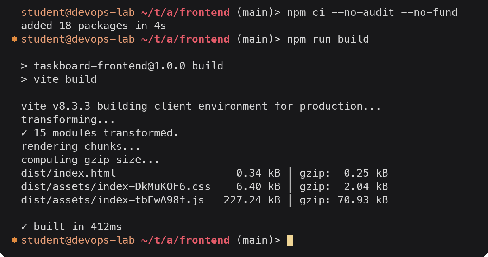

<details><summary>Text version</summary>

```console
student@devops-lab:~/task-21-final-devops-project/application/frontend$ npm ci --no-audit --no-fund
added 18 packages in 4s
student@devops-lab:~/task-21-final-devops-project/application/frontend$ npm run build

> taskboard-frontend@1.0.0 build
> vite build

vite v8.3.3 building client environment for production...
transforming...
✓ 15 modules transformed.
rendering chunks...
computing gzip size...
dist/index.html                   0.34 kB │ gzip:  0.25 kB
dist/assets/index-DkMuKOF6.css    6.40 kB │ gzip:  2.04 kB
dist/assets/index-tbEwA98f.js   227.24 kB │ gzip: 70.93 kB

✓ built in 412ms
```

</details>

### Running without containers

```bash
cd application/backend && cp .env.example .env      # point DB_* at a local Postgres
alembic upgrade head && uvicorn app.main:app --reload --port 8000
cd application/frontend && npm run dev               # http://localhost:5173, /api proxied to :8000
```

---

## 6. Docker setup

Both images build with the project root as context (`docker build -f docker/<x>.Dockerfile .`), so
one root `.dockerignore` keeps `.git`, `node_modules`, Terraform and docs out of the build context.

| | Backend ([docker/backend.Dockerfile](docker/backend.Dockerfile)) | Frontend ([docker/frontend.Dockerfile](docker/frontend.Dockerfile)) |
|---|---|---|
| Stages | `python:3.12-slim` builds a venv → fresh `python:3.12-slim` copies only the venv and code | `node:22-alpine` runs `npm ci && npm run build` → `nginxinc/nginx-unprivileged:1.28-alpine` serves `dist/` |
| User | uid 10001 (`appuser`) | uid 101 (`nginx`) |
| Port | 8000 | 8080 (non-root cannot bind 80) |
| Start | `alembic upgrade head && exec uvicorn ...` (`exec` makes uvicorn PID 1 so it gets SIGTERM) | nginx entrypoint renders `default.conf.template`, replacing `${BACKEND_URL}` |
| Health | `HEALTHCHECK` calling `/health` with Python's urllib (no curl in the image) | `/healthz` served by nginx itself |
| Version | `APP_VERSION` build arg → env + OCI label | OCI label |

### Output

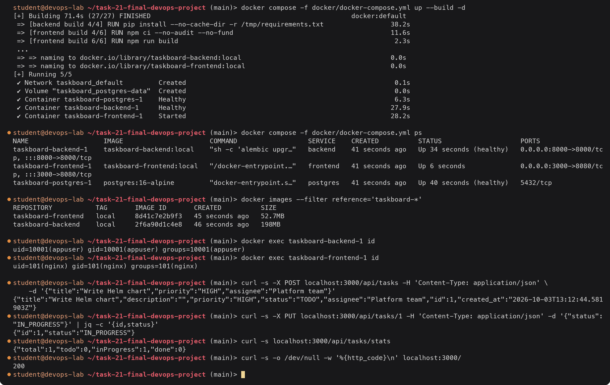

<details><summary>Text version</summary>

```console
student@devops-lab:~/task-21-final-devops-project$ docker compose -f docker/docker-compose.yml up --build -d
[+] Building 71.4s (27/27) FINISHED                                                   docker:default
 => [backend build 4/4] RUN pip install --no-cache-dir -r /tmp/requirements.txt                 38.2s
 => [frontend build 4/6] RUN npm ci --no-audit --no-fund                                        11.6s
 => [frontend build 6/6] RUN npm run build                                                       2.3s
 ...
 => => naming to docker.io/library/taskboard-backend:local                                      0.0s
 => => naming to docker.io/library/taskboard-frontend:local                                     0.0s
[+] Running 5/5
 ✔ Network taskboard_default         Created                                                     0.1s
 ✔ Volume "taskboard_postgres-data"  Created                                                     0.0s
 ✔ Container taskboard-postgres-1    Healthy                                                     6.3s
 ✔ Container taskboard-backend-1     Healthy                                                    27.9s
 ✔ Container taskboard-frontend-1    Started                                                    28.2s

student@devops-lab:~/task-21-final-devops-project$ docker compose -f docker/docker-compose.yml ps
NAME                   IMAGE                      COMMAND                  SERVICE    CREATED          STATUS                    PORTS
taskboard-backend-1    taskboard-backend:local    "sh -c 'alembic upgr…"   backend    41 seconds ago   Up 34 seconds (healthy)   0.0.0.0:8000->8000/tcp, :::8000->8000/tcp
taskboard-frontend-1   taskboard-frontend:local   "/docker-entrypoint.…"   frontend   41 seconds ago   Up 6 seconds              0.0.0.0:3000->8080/tcp, :::3000->8080/tcp
taskboard-postgres-1   postgres:16-alpine         "docker-entrypoint.s…"   postgres   41 seconds ago   Up 40 seconds (healthy)   5432/tcp

student@devops-lab:~/task-21-final-devops-project$ docker images --filter reference='taskboard-*'
REPOSITORY           TAG       IMAGE ID       CREATED          SIZE
taskboard-frontend   local     8d41c7e2b9f3   45 seconds ago   52.7MB
taskboard-backend    local     2f6a90d1c4e8   46 seconds ago   198MB

student@devops-lab:~/task-21-final-devops-project$ docker exec taskboard-backend-1 id
uid=10001(appuser) gid=10001(appuser) groups=10001(appuser)
student@devops-lab:~/task-21-final-devops-project$ docker exec taskboard-frontend-1 id
uid=101(nginx) gid=101(nginx) groups=101(nginx)

student@devops-lab:~/task-21-final-devops-project$ curl -s -X POST localhost:3000/api/tasks -H 'Content-Type: application/json' \
    -d '{"title":"Write Helm chart","priority":"HIGH","assignee":"Platform team"}'
{"title":"Write Helm chart","description":"","priority":"HIGH","status":"TODO","assignee":"Platform team","id":1,"created_at":"2026-10-03T13:12:44.581903Z"}
student@devops-lab:~/task-21-final-devops-project$ curl -s -X PUT localhost:3000/api/tasks/1 -H 'Content-Type: application/json' -d '{"status":"IN_PROGRESS"}' | jq -c '{id,status}'
{"id":1,"status":"IN_PROGRESS"}
student@devops-lab:~/task-21-final-devops-project$ curl -s localhost:3000/api/tasks/stats
{"total":1,"todo":0,"inProgress":1,"done":0}
student@devops-lab:~/task-21-final-devops-project$ curl -s -o /dev/null -w '%{http_code}\n' localhost:3000/
200
```

</details>

The request to port 3000 went to nginx in the frontend container, which proxied `/api/` to the
`backend` service name on the Compose network. The browser only ever talks to one origin. The backend
image is about 200 MB (Debian slim + Python + dependencies), and the frontend image is about 53 MB
because Node and `node_modules` stay in the build stage.

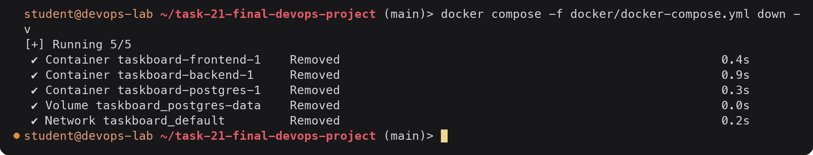

<details><summary>Text version</summary>

```console
student@devops-lab:~/task-21-final-devops-project$ docker compose -f docker/docker-compose.yml down -v
[+] Running 5/5
 ✔ Container taskboard-frontend-1    Removed                                                     0.4s
 ✔ Container taskboard-backend-1     Removed                                                     0.9s
 ✔ Container taskboard-postgres-1    Removed                                                     0.3s
 ✔ Volume taskboard_postgres-data    Removed                                                     0.0s
 ✔ Network taskboard_default         Removed                                                     0.2s
```

</details>

---

## 7. Kubernetes deployment

Plain manifests in [kubernetes/](kubernetes/), numbered so `kubectl apply -f kubernetes/` creates
them in a working order.

| File | Objects | Notes |
|---|---|---|
| `00-namespace.yaml` | Namespace `taskboard` | |
| `01-configmap.yaml` | ConfigMap `taskboard-config` | `APP_ENV`, `LOG_LEVEL`, `DB_HOST`, `DB_PORT`, `DB_NAME` |
| `02-secret.yaml` | Secret `taskboard-db` | `DB_USER`, `DB_PASSWORD` (lab-only value; Helm/GitOps path uses an out-of-band Secret) |
| `03-postgres.yaml` | Service + StatefulSet `taskboard-postgres` | `volumeClaimTemplates` → PVC `data-taskboard-postgres-0` (1Gi), runs as uid 70, read-only root FS |
| `04-backend.yaml` | Service + Deployment `taskboard-backend` | 2 replicas, `wait-for-db` init container, startup/liveness `/health`, readiness `/ready`, requests/limits, read-only root FS |
| `05-frontend.yaml` | Service + Deployment `taskboard-frontend` | 2 replicas, probes on `/healthz`, `BACKEND_URL=http://taskboard-backend:8000` |
| `06-ingress.yaml` | Ingress `taskboard` | `taskboard.local`: `/api` → backend:8000, `/` → frontend:80 |
| `07-hpa.yaml` | HPA `taskboard-backend` | 2-6 replicas at 70% CPU of the request |

### Output

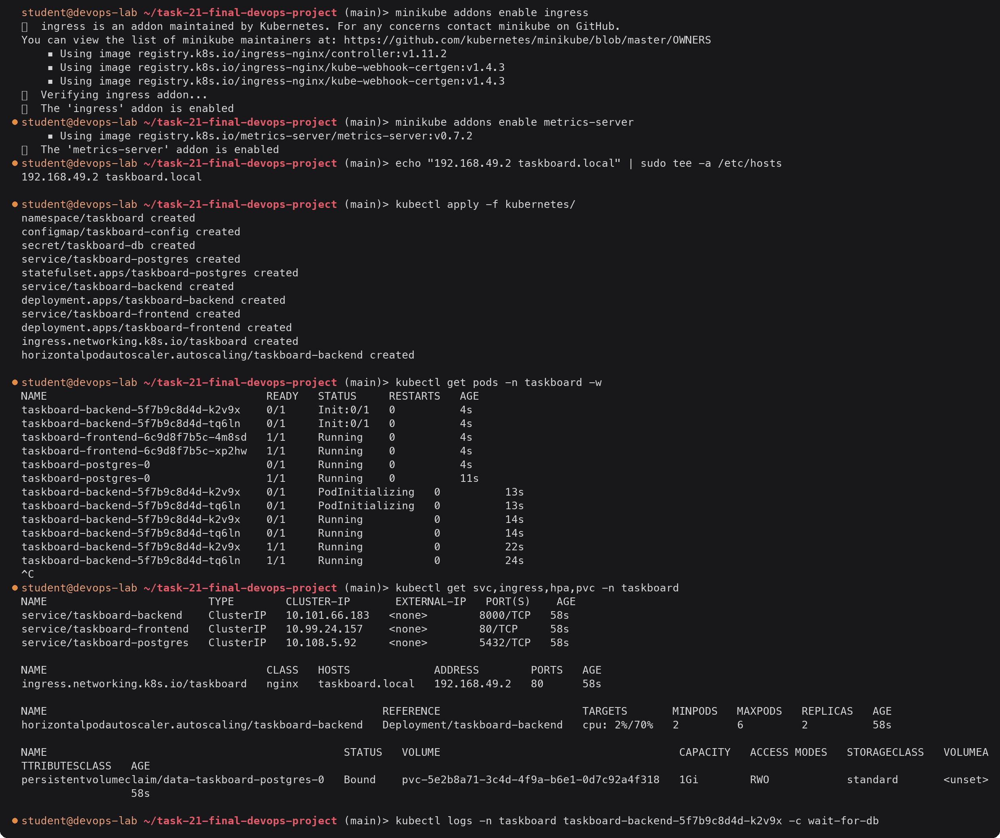
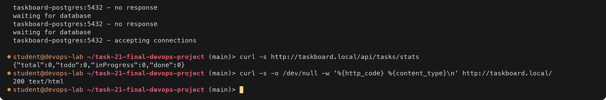

<details><summary>Text version</summary>

```console
student@devops-lab:~/task-21-final-devops-project$ minikube addons enable ingress
💡  ingress is an addon maintained by Kubernetes. For any concerns contact minikube on GitHub.
You can view the list of minikube maintainers at: https://github.com/kubernetes/minikube/blob/master/OWNERS
    ▪ Using image registry.k8s.io/ingress-nginx/controller:v1.11.2
    ▪ Using image registry.k8s.io/ingress-nginx/kube-webhook-certgen:v1.4.3
    ▪ Using image registry.k8s.io/ingress-nginx/kube-webhook-certgen:v1.4.3
🔎  Verifying ingress addon...
🌟  The 'ingress' addon is enabled
student@devops-lab:~/task-21-final-devops-project$ minikube addons enable metrics-server
    ▪ Using image registry.k8s.io/metrics-server/metrics-server:v0.7.2
🌟  The 'metrics-server' addon is enabled
student@devops-lab:~/task-21-final-devops-project$ echo "192.168.49.2 taskboard.local" | sudo tee -a /etc/hosts
192.168.49.2 taskboard.local

student@devops-lab:~/task-21-final-devops-project$ kubectl apply -f kubernetes/
namespace/taskboard created
configmap/taskboard-config created
secret/taskboard-db created
service/taskboard-postgres created
statefulset.apps/taskboard-postgres created
service/taskboard-backend created
deployment.apps/taskboard-backend created
service/taskboard-frontend created
deployment.apps/taskboard-frontend created
ingress.networking.k8s.io/taskboard created
horizontalpodautoscaler.autoscaling/taskboard-backend created

student@devops-lab:~/task-21-final-devops-project$ kubectl get pods -n taskboard -w
NAME                                  READY   STATUS     RESTARTS   AGE
taskboard-backend-5f7b9c8d4d-k2v9x    0/1     Init:0/1   0          4s
taskboard-backend-5f7b9c8d4d-tq6ln    0/1     Init:0/1   0          4s
taskboard-frontend-6c9d8f7b5c-4m8sd   1/1     Running    0          4s
taskboard-frontend-6c9d8f7b5c-xp2hw   1/1     Running    0          4s
taskboard-postgres-0                  0/1     Running    0          4s
taskboard-postgres-0                  1/1     Running    0          11s
taskboard-backend-5f7b9c8d4d-k2v9x    0/1     PodInitializing   0          13s
taskboard-backend-5f7b9c8d4d-tq6ln    0/1     PodInitializing   0          13s
taskboard-backend-5f7b9c8d4d-k2v9x    0/1     Running           0          14s
taskboard-backend-5f7b9c8d4d-tq6ln    0/1     Running           0          14s
taskboard-backend-5f7b9c8d4d-k2v9x    1/1     Running           0          22s
taskboard-backend-5f7b9c8d4d-tq6ln    1/1     Running           0          24s
^C
student@devops-lab:~/task-21-final-devops-project$ kubectl get svc,ingress,hpa,pvc -n taskboard
NAME                         TYPE        CLUSTER-IP       EXTERNAL-IP   PORT(S)    AGE
service/taskboard-backend    ClusterIP   10.101.66.183   <none>        8000/TCP   58s
service/taskboard-frontend   ClusterIP   10.99.24.157    <none>        80/TCP     58s
service/taskboard-postgres   ClusterIP   10.108.5.92     <none>        5432/TCP   58s

NAME                                  CLASS   HOSTS             ADDRESS        PORTS   AGE
ingress.networking.k8s.io/taskboard   nginx   taskboard.local   192.168.49.2   80      58s

NAME                                                    REFERENCE                      TARGETS       MINPODS   MAXPODS   REPLICAS   AGE
horizontalpodautoscaler.autoscaling/taskboard-backend   Deployment/taskboard-backend   cpu: 2%/70%   2         6         2          58s

NAME                                              STATUS   VOLUME                                     CAPACITY   ACCESS MODES   STORAGECLASS   VOLUMEATTRIBUTESCLASS   AGE
persistentvolumeclaim/data-taskboard-postgres-0   Bound    pvc-5e2b8a71-3c4d-4f9a-b6e1-0d7c92a4f318   1Gi        RWO            standard       <unset>                 58s

student@devops-lab:~/task-21-final-devops-project$ kubectl logs -n taskboard taskboard-backend-5f7b9c8d4d-k2v9x -c wait-for-db
taskboard-postgres:5432 - no response
waiting for database
taskboard-postgres:5432 - no response
waiting for database
taskboard-postgres:5432 - accepting connections

student@devops-lab:~/task-21-final-devops-project$ curl -s http://taskboard.local/api/tasks/stats
{"total":0,"todo":0,"inProgress":0,"done":0}
student@devops-lab:~/task-21-final-devops-project$ curl -s -o /dev/null -w '%{http_code} %{content_type}\n' http://taskboard.local/
200 text/html
```

</details>

The backend pods waited in `Init:0/1` until PostgreSQL accepted connections, then ran the
migration and became ready once `/ready` could reach the database. The frontend pods were ready
straight away because their probe does not depend on anything. The Ingress sends `/api` straight to
the backend Service and everything else to the frontend.

This path was only a first check. I removed it before installing the chart, so the Helm release and
later Argo CD own every object:

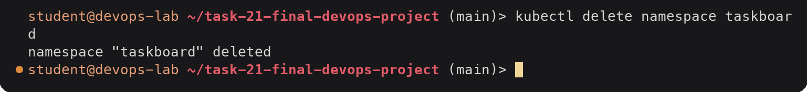

<details><summary>Text version</summary>

```console
student@devops-lab:~/task-21-final-devops-project$ kubectl delete namespace taskboard
namespace "taskboard" deleted
```

</details>

---

## 8. Helm deployment

The chart in [helm/taskboard/](helm/taskboard/) renders the same objects as section 7, plus a
ServiceMonitor, PrometheusRule, Grafana dashboard ConfigMap, optional NetworkPolicy and a
`helm test` pod.

| Value | Default | Purpose |
|---|---|---|
| `image.registry` / `image.tag` | `ghcr.io/devops-student` / `4c2e9d1` | one tag for both images, CI writes it |
| `database.existingSecret` | `""` | use a Secret created outside Git. If empty the chart creates one and `database.password` becomes **required** |
| `postgres.enabled` / `postgres.storage.*` | `true`, 1Gi, default class | in-cluster Postgres; turn off for RDS |
| `backend.resources`, `frontend.resources` | requests + limits | HPA needs CPU requests |
| `ingress.*` | nginx, `taskboard.local` | prod adds TLS via cert-manager |
| `hpa.*` | 2-6, 70% | the Deployment omits `replicas` when HPA is on so Helm/Argo do not fight the HPA |
| `monitoring.*` | ServiceMonitor, rules, dashboard on | needs the Prometheus Operator CRDs |
| `networkPolicy.enabled` | `false` (dev), `true` (prod) | only the backend may reach Postgres |

Pod template annotations carry a checksum of the ConfigMap, so changing a config value rolls the
backend pods.

### Output

The monitoring stack has to exist first because the chart contains `ServiceMonitor` and
`PrometheusRule` objects (installation shown in section 12). The database Secret is created by hand,
with the password kept in a local file instead of Git:

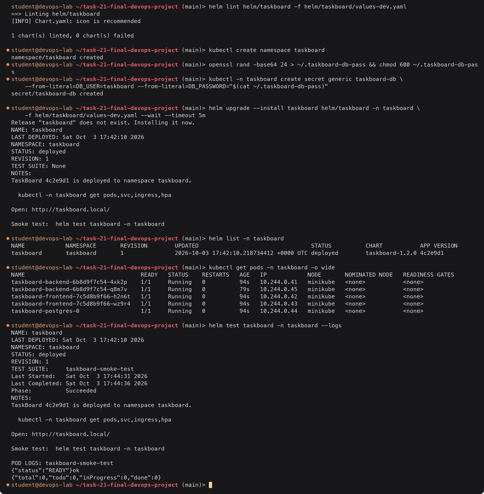

<details><summary>Text version</summary>

```console
student@devops-lab:~/task-21-final-devops-project$ helm lint helm/taskboard -f helm/taskboard/values-dev.yaml
==> Linting helm/taskboard
[INFO] Chart.yaml: icon is recommended

1 chart(s) linted, 0 chart(s) failed

student@devops-lab:~/task-21-final-devops-project$ kubectl create namespace taskboard
namespace/taskboard created
student@devops-lab:~/task-21-final-devops-project$ openssl rand -base64 24 > ~/.taskboard-db-pass && chmod 600 ~/.taskboard-db-pass
student@devops-lab:~/task-21-final-devops-project$ kubectl -n taskboard create secret generic taskboard-db \
    --from-literal=DB_USER=taskboard --from-literal=DB_PASSWORD="$(cat ~/.taskboard-db-pass)"
secret/taskboard-db created

student@devops-lab:~/task-21-final-devops-project$ helm upgrade --install taskboard helm/taskboard -n taskboard \
    -f helm/taskboard/values-dev.yaml --wait --timeout 5m
Release "taskboard" does not exist. Installing it now.
NAME: taskboard
LAST DEPLOYED: Sat Oct  3 17:42:10 2026
NAMESPACE: taskboard
STATUS: deployed
REVISION: 1
TEST SUITE: None
NOTES:
TaskBoard 4c2e9d1 is deployed to namespace taskboard.

  kubectl -n taskboard get pods,svc,ingress,hpa

Open: http://taskboard.local/

Smoke test:  helm test taskboard -n taskboard

student@devops-lab:~/task-21-final-devops-project$ helm list -n taskboard
NAME     	NAMESPACE	REVISION	UPDATED                                	STATUS  	CHART          	APP VERSION
taskboard	taskboard	1       	2026-10-03 17:42:10.218734412 +0000 UTC	deployed	taskboard-1.2.0	4c2e9d1

student@devops-lab:~/task-21-final-devops-project$ kubectl get pods -n taskboard -o wide
NAME                                  READY   STATUS    RESTARTS   AGE   IP            NODE       NOMINATED NODE   READINESS GATES
taskboard-backend-6b8d9f7c54-4xk2p    1/1     Running   0          94s   10.244.0.41   minikube   <none>           <none>
taskboard-backend-6b8d9f7c54-q8m7v    1/1     Running   0          79s   10.244.0.45   minikube   <none>           <none>
taskboard-frontend-7c5d8b9f66-h2n6t   1/1     Running   0          94s   10.244.0.42   minikube   <none>           <none>
taskboard-frontend-7c5d8b9f66-wz9r4   1/1     Running   0          94s   10.244.0.43   minikube   <none>           <none>
taskboard-postgres-0                  1/1     Running   0          94s   10.244.0.44   minikube   <none>           <none>

student@devops-lab:~/task-21-final-devops-project$ helm test taskboard -n taskboard --logs
NAME: taskboard
LAST DEPLOYED: Sat Oct  3 17:42:10 2026
NAMESPACE: taskboard
STATUS: deployed
REVISION: 1
TEST SUITE:     taskboard-smoke-test
Last Started:   Sat Oct  3 17:44:31 2026
Last Completed: Sat Oct  3 17:44:36 2026
Phase:          Succeeded
NOTES:
TaskBoard 4c2e9d1 is deployed to namespace taskboard.

  kubectl -n taskboard get pods,svc,ingress,hpa

Open: http://taskboard.local/

Smoke test:  helm test taskboard -n taskboard

POD LOGS: taskboard-smoke-test
{"status":"READY"}ok
{"total":0,"todo":0,"inProgress":0,"done":0}
```

</details>

The second backend pod is 15 seconds younger: the Deployment has no `replicas` field (the HPA owns
it), so it started with one pod and the HPA raised it to `minReplicas: 2`. `helm test` called the
backend's `/ready`, the frontend's `/healthz` and an API call through the frontend's nginx proxy.

The backend log shows the migration running once. The second pod waited on the advisory lock and
found nothing to do:

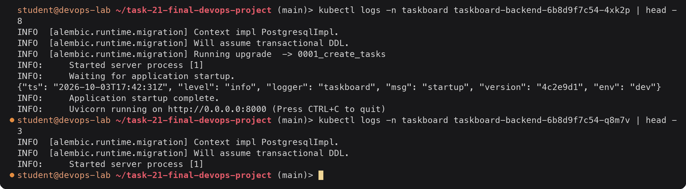

<details><summary>Text version</summary>

```console
student@devops-lab:~/task-21-final-devops-project$ kubectl logs -n taskboard taskboard-backend-6b8d9f7c54-4xk2p | head -8
INFO  [alembic.runtime.migration] Context impl PostgresqlImpl.
INFO  [alembic.runtime.migration] Will assume transactional DDL.
INFO  [alembic.runtime.migration] Running upgrade  -> 0001_create_tasks
INFO:     Started server process [1]
INFO:     Waiting for application startup.
{"ts": "2026-10-03T17:42:31Z", "level": "info", "logger": "taskboard", "msg": "startup", "version": "4c2e9d1", "env": "dev"}
INFO:     Application startup complete.
INFO:     Uvicorn running on http://0.0.0.0:8000 (Press CTRL+C to quit)
student@devops-lab:~/task-21-final-devops-project$ kubectl logs -n taskboard taskboard-backend-6b8d9f7c54-q8m7v | head -3
INFO  [alembic.runtime.migration] Context impl PostgresqlImpl.
INFO  [alembic.runtime.migration] Will assume transactional DDL.
INFO:     Started server process [1]
```

</details>

Changing a value and rolling back:

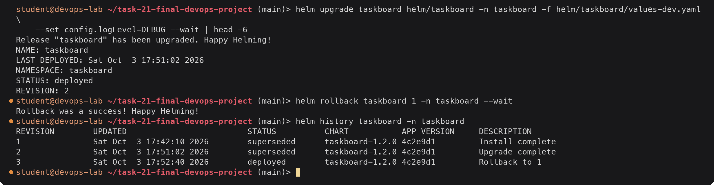

<details><summary>Text version</summary>

```console
student@devops-lab:~/task-21-final-devops-project$ helm upgrade taskboard helm/taskboard -n taskboard -f helm/taskboard/values-dev.yaml \
    --set config.logLevel=DEBUG --wait | head -6
Release "taskboard" has been upgraded. Happy Helming!
NAME: taskboard
LAST DEPLOYED: Sat Oct  3 17:51:02 2026
NAMESPACE: taskboard
STATUS: deployed
REVISION: 2
student@devops-lab:~/task-21-final-devops-project$ helm rollback taskboard 1 -n taskboard --wait
Rollback was a success! Happy Helming!
student@devops-lab:~/task-21-final-devops-project$ helm history taskboard -n taskboard
REVISION	UPDATED                 	STATUS    	CHART          	APP VERSION	DESCRIPTION
1       	Sat Oct  3 17:42:10 2026	superseded	taskboard-1.2.0	4c2e9d1    	Install complete
2       	Sat Oct  3 17:51:02 2026	superseded	taskboard-1.2.0	4c2e9d1    	Upgrade complete
3       	Sat Oct  3 17:52:40 2026	deployed  	taskboard-1.2.0	4c2e9d1    	Rollback to 1
```

</details>

The `--set config.logLevel=DEBUG` changed only the ConfigMap, but the checksum annotation made the
backend roll. The rollback rolled it again. Revision 3 is the same as revision 1.

---

## 9. Terraform infrastructure

[terraform/](terraform/) builds the cloud version of the cluster in `ap-south-1`:

| Resource | Module / detail |
|---|---|
| VPC `10.20.0.0/16` | `terraform-aws-modules/vpc/aws` 5.13.0 |
| 2 public subnets `10.20.101.0/24`, `10.20.102.0/24` | tagged `kubernetes.io/role/elb` for internet-facing load balancers |
| 2 private subnets `10.20.1.0/24`, `10.20.2.0/24` | worker nodes, tagged `kubernetes.io/role/internal-elb` |
| Internet gateway, 1 NAT gateway | single NAT to keep the lab cheap |
| EKS cluster `taskboard-eks` (1.33) | `terraform-aws-modules/eks/aws` 20.26.0, public API limited to `api_allowed_cidrs`, secrets encrypted with a KMS key, creator gets cluster-admin |
| Managed node group `default` | 2 × `t3.medium` (min 2, max 4) in the private subnets |
| Add-ons | coredns, kube-proxy, vpc-cni, eks-pod-identity-agent, aws-ebs-csi-driver |
| IAM role for the EBS CSI driver (IRSA) | so PostgreSQL PVCs can be EBS volumes |

Variables have types, descriptions and validation (`api_allowed_cidrs` cannot contain `0.0.0.0/0`).
Credentials are never in the code: the provider reads the AWS CLI profile. `terraform.tfvars` is
git-ignored and [terraform.tfvars.example](terraform/terraform.tfvars.example) is committed.
[backend.tf](terraform/backend.tf) has a commented S3 backend with native S3 locking for team use.
`.terraform.lock.hcl` is committed so everybody gets the same provider builds.

### Output

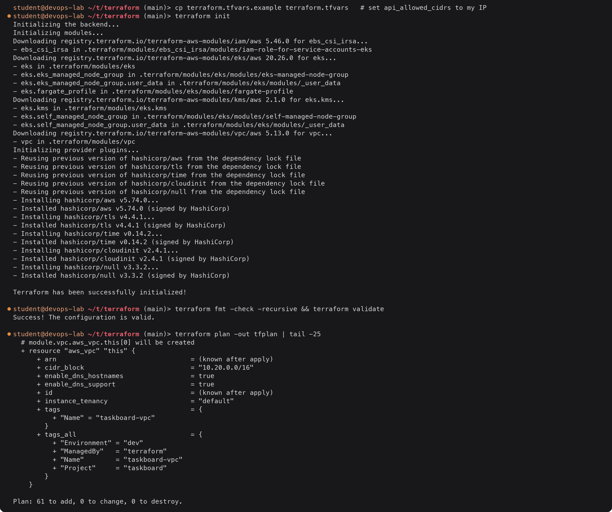
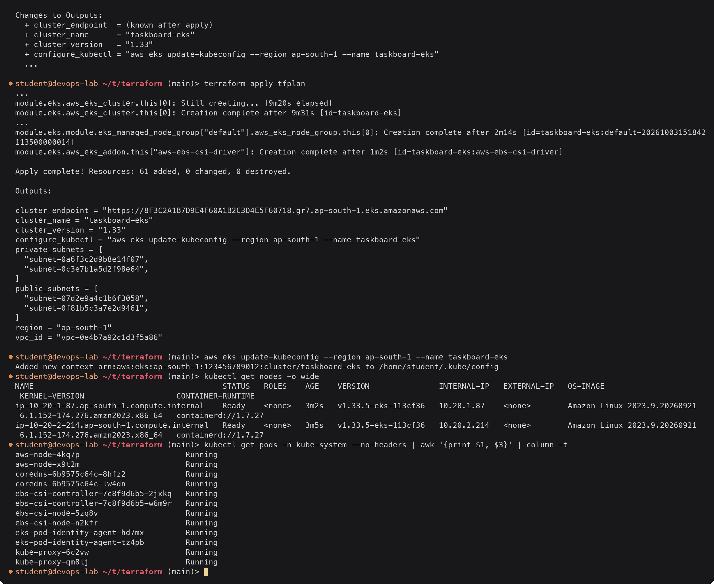

<details><summary>Text version</summary>

```console
student@devops-lab:~/task-21-final-devops-project/terraform$ cp terraform.tfvars.example terraform.tfvars   # set api_allowed_cidrs to my IP
student@devops-lab:~/task-21-final-devops-project/terraform$ terraform init
Initializing the backend...
Initializing modules...
Downloading registry.terraform.io/terraform-aws-modules/iam/aws 5.46.0 for ebs_csi_irsa...
- ebs_csi_irsa in .terraform/modules/ebs_csi_irsa/modules/iam-role-for-service-accounts-eks
Downloading registry.terraform.io/terraform-aws-modules/eks/aws 20.26.0 for eks...
- eks in .terraform/modules/eks
- eks.eks_managed_node_group in .terraform/modules/eks/modules/eks-managed-node-group
- eks.eks_managed_node_group.user_data in .terraform/modules/eks/modules/_user_data
- eks.fargate_profile in .terraform/modules/eks/modules/fargate-profile
Downloading registry.terraform.io/terraform-aws-modules/kms/aws 2.1.0 for eks.kms...
- eks.kms in .terraform/modules/eks.kms
- eks.self_managed_node_group in .terraform/modules/eks/modules/self-managed-node-group
- eks.self_managed_node_group.user_data in .terraform/modules/eks/modules/_user_data
Downloading registry.terraform.io/terraform-aws-modules/vpc/aws 5.13.0 for vpc...
- vpc in .terraform/modules/vpc
Initializing provider plugins...
- Reusing previous version of hashicorp/aws from the dependency lock file
- Reusing previous version of hashicorp/tls from the dependency lock file
- Reusing previous version of hashicorp/time from the dependency lock file
- Reusing previous version of hashicorp/cloudinit from the dependency lock file
- Reusing previous version of hashicorp/null from the dependency lock file
- Installing hashicorp/aws v5.74.0...
- Installed hashicorp/aws v5.74.0 (signed by HashiCorp)
- Installing hashicorp/tls v4.4.1...
- Installed hashicorp/tls v4.4.1 (signed by HashiCorp)
- Installing hashicorp/time v0.14.2...
- Installed hashicorp/time v0.14.2 (signed by HashiCorp)
- Installing hashicorp/cloudinit v2.4.1...
- Installed hashicorp/cloudinit v2.4.1 (signed by HashiCorp)
- Installing hashicorp/null v3.3.2...
- Installed hashicorp/null v3.3.2 (signed by HashiCorp)

Terraform has been successfully initialized!

student@devops-lab:~/task-21-final-devops-project/terraform$ terraform fmt -check -recursive && terraform validate
Success! The configuration is valid.

student@devops-lab:~/task-21-final-devops-project/terraform$ terraform plan -out tfplan | tail -25
  # module.vpc.aws_vpc.this[0] will be created
  + resource "aws_vpc" "this" {
      + arn                                  = (known after apply)
      + cidr_block                           = "10.20.0.0/16"
      + enable_dns_hostnames                 = true
      + enable_dns_support                   = true
      + id                                   = (known after apply)
      + instance_tenancy                     = "default"
      + tags                                 = {
          + "Name" = "taskboard-vpc"
        }
      + tags_all                             = {
          + "Environment" = "dev"
          + "ManagedBy"   = "terraform"
          + "Name"        = "taskboard-vpc"
          + "Project"     = "taskboard"
        }
    }

Plan: 61 to add, 0 to change, 0 to destroy.

Changes to Outputs:
  + cluster_endpoint  = (known after apply)
  + cluster_name      = "taskboard-eks"
  + cluster_version   = "1.33"
  + configure_kubectl = "aws eks update-kubeconfig --region ap-south-1 --name taskboard-eks"
  ...

student@devops-lab:~/task-21-final-devops-project/terraform$ terraform apply tfplan
...
module.eks.aws_eks_cluster.this[0]: Still creating... [9m20s elapsed]
module.eks.aws_eks_cluster.this[0]: Creation complete after 9m31s [id=taskboard-eks]
...
module.eks.module.eks_managed_node_group["default"].aws_eks_node_group.this[0]: Creation complete after 2m14s [id=taskboard-eks:default-20261003151842113500000014]
module.eks.aws_eks_addon.this["aws-ebs-csi-driver"]: Creation complete after 1m2s [id=taskboard-eks:aws-ebs-csi-driver]

Apply complete! Resources: 61 added, 0 changed, 0 destroyed.

Outputs:

cluster_endpoint = "https://8F3C2A1B7D9E4F60A1B2C3D4E5F60718.gr7.ap-south-1.eks.amazonaws.com"
cluster_name = "taskboard-eks"
cluster_version = "1.33"
configure_kubectl = "aws eks update-kubeconfig --region ap-south-1 --name taskboard-eks"
private_subnets = [
  "subnet-0a6f3c2d9b8e14f07",
  "subnet-0c3e7b1a5d2f98e64",
]
public_subnets = [
  "subnet-07d2e9a4c1b6f3058",
  "subnet-0f81b5c3a7e2d9461",
]
region = "ap-south-1"
vpc_id = "vpc-0e4b7a92c1d3f5a86"

student@devops-lab:~/task-21-final-devops-project/terraform$ aws eks update-kubeconfig --region ap-south-1 --name taskboard-eks
Added new context arn:aws:eks:ap-south-1:123456789012:cluster/taskboard-eks to /home/student/.kube/config
student@devops-lab:~/task-21-final-devops-project/terraform$ kubectl get nodes -o wide
NAME                                         STATUS   ROLES    AGE    VERSION               INTERNAL-IP   EXTERNAL-IP   OS-IMAGE                       KERNEL-VERSION                    CONTAINER-RUNTIME
ip-10-20-1-87.ap-south-1.compute.internal    Ready    <none>   3m2s   v1.33.5-eks-113cf36   10.20.1.87    <none>        Amazon Linux 2023.9.20260921   6.1.152-174.276.amzn2023.x86_64   containerd://1.7.27
ip-10-20-2-214.ap-south-1.compute.internal   Ready    <none>   3m5s   v1.33.5-eks-113cf36   10.20.2.214   <none>        Amazon Linux 2023.9.20260921   6.1.152-174.276.amzn2023.x86_64   containerd://1.7.27
student@devops-lab:~/task-21-final-devops-project/terraform$ kubectl get pods -n kube-system --no-headers | awk '{print $1, $3}' | column -t
aws-node-4kq7p                       Running
aws-node-x9t2m                       Running
coredns-6b9575c64c-8hfz2             Running
coredns-6b9575c64c-lw4dn             Running
ebs-csi-controller-7c8f9d6b5-2jxkq   Running
ebs-csi-controller-7c8f9d6b5-w6m9r   Running
ebs-csi-node-5zq8v                   Running
ebs-csi-node-n2kfr                   Running
eks-pod-identity-agent-hd7mx         Running
eks-pod-identity-agent-tz4pb         Running
kube-proxy-6c2vw                     Running
kube-proxy-qm8lj                     Running
```

</details>

Both nodes are in the private subnets (10.20.1.x and 10.20.2.x), one per availability zone, and
the EBS CSI driver is running so a PVC on `gp2` can be provisioned. The same Helm chart deploys here
with `-f values-prod.yaml`. I destroyed the stack the same afternoon, because the EKS control plane
and the NAT gateway are billed by the hour:

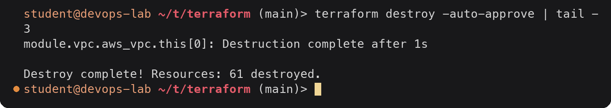

<details><summary>Text version</summary>

```console
student@devops-lab:~/task-21-final-devops-project/terraform$ terraform destroy -auto-approve | tail -3
module.vpc.aws_vpc.this[0]: Destruction complete after 1s

Destroy complete! Resources: 61 destroyed.
```

</details>

---

## 10. CI/CD pipeline

[.github/workflows/ci-cd.yml](.github/workflows/ci-cd.yml) runs on every push and pull request to
`main`.

| Job | What it does | Fails the build when |
|---|---|---|
| Lint and test | `ruff check`, `pytest` with coverage (min 80%), `npm ci && npm run build`, `helm lint` + `helm template` | any lint error, failing test, coverage < 80%, frontend or chart does not build |
| SAST | Semgrep (`p/python`, `p/javascript`, `p/react`, `p/dockerfile`, [project rules](security/semgrep-rules.yaml)), Bandit | any Semgrep finding, Bandit medium+ |
| SCA | `pip-audit --strict`, `npm audit --audit-level=high` | any known Python vulnerability, npm high/critical |
| Secret scanning | Gitleaks over the full Git history | any secret not in the allowlist |
| IaC scan | Trivy config on Terraform, Kubernetes YAML, Helm chart, Dockerfiles | HIGH/CRITICAL misconfiguration not accepted in [security/trivyignore.yaml](security/trivyignore.yaml) |
| Build, scan and push (matrix: backend, frontend) | Buildx build with GHA cache → Trivy image scan → CycloneDX SBOM → push to GHCR → cosign keyless sign | HIGH/CRITICAL fixable CVE in the image |
| Deploy (GitOps tag bump) | `yq` sets `image.tag` in `helm/taskboard/values-dev.yaml`, commits `Deploy <sha> to dev [skip ci]` | |
| Deploy (helm upgrade) | only if repo variable `DEPLOY_MODE=helm`: `helm upgrade --install --atomic --wait`, `helm test` | rollout fails (Helm rolls back) |

Design points:

- **Image tag = short commit SHA.** Every running pod can be traced to a commit. `latest` is never
  used, and a Semgrep rule blocks `:latest` in `kubernetes/`.
- **Scan before push.** The image is built with `load: true`, scanned locally, and pushed only if the
  scan passes. A vulnerable image never reaches the registry.
- **PRs build and scan, but do not push or deploy.** The login, push, sign and deploy steps are guarded
  by `github.event_name == 'push' && github.ref == 'refs/heads/main'`.
- **Least privilege.** The workflow default is `contents: read`. Only the build job gets
  `packages: write` + `id-token: write`, and only the GitOps job gets `contents: write`.
- **Default deploy is pull-based.** CI never holds cluster credentials. Argo CD pulls the new tag from Git.
- **No pipeline loops.** The bot commit carries `[skip ci]`, and pushes that only touch
  `helm/taskboard/values-dev.yaml` are in `paths-ignore`, so a values-only change never rebuilds images.

### Output

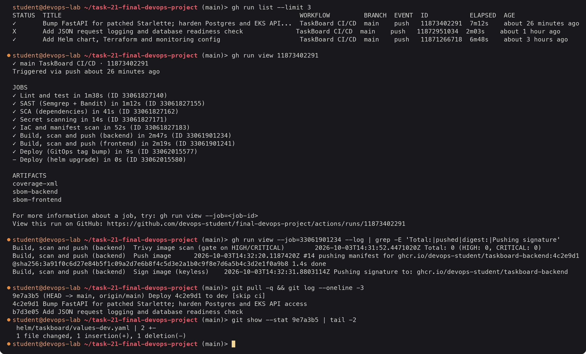

<details><summary>Text version</summary>

```console
student@devops-lab:~/task-21-final-devops-project$ gh run list --limit 3
STATUS  TITLE                                                               WORKFLOW         BRANCH  EVENT  ID           ELAPSED  AGE
✓       Bump FastAPI for patched Starlette; harden Postgres and EKS API...  TaskBoard CI/CD  main    push   11873402291  7m12s    about 26 minutes ago
X       Add JSON request logging and database readiness check              TaskBoard CI/CD  main    push   11872951034  2m03s    about 1 hour ago
✓       Add Helm chart, Terraform and monitoring config                     TaskBoard CI/CD  main    push   11871266718  6m48s    about 3 hours ago

student@devops-lab:~/task-21-final-devops-project$ gh run view 11873402291
✓ main TaskBoard CI/CD · 11873402291
Triggered via push about 26 minutes ago

JOBS
✓ Lint and test in 1m38s (ID 33061827140)
✓ SAST (Semgrep + Bandit) in 1m12s (ID 33061827155)
✓ SCA (dependencies) in 41s (ID 33061827162)
✓ Secret scanning in 14s (ID 33061827171)
✓ IaC and manifest scan in 52s (ID 33061827183)
✓ Build, scan and push (backend) in 2m47s (ID 33061901234)
✓ Build, scan and push (frontend) in 2m19s (ID 33061901241)
✓ Deploy (GitOps tag bump) in 9s (ID 33062015577)
- Deploy (helm upgrade) in 0s (ID 33062015580)

ARTIFACTS
coverage-xml
sbom-backend
sbom-frontend

For more information about a job, try: gh run view --job=<job-id>
View this run on GitHub: https://github.com/devops-student/final-devops-project/actions/runs/11873402291

student@devops-lab:~/task-21-final-devops-project$ gh run view --job=33061901234 --log | grep -E 'Total:|pushed|digest:|Pushing signature' 
Build, scan and push (backend)	Trivy image scan (gate on HIGH/CRITICAL)	2026-10-03T14:31:52.4471020Z Total: 0 (HIGH: 0, CRITICAL: 0)
Build, scan and push (backend)	Push image	2026-10-03T14:32:20.1187420Z #14 pushing manifest for ghcr.io/devops-student/taskboard-backend:4c2e9d1@sha256:3a91f0c6d27e84b5f1c09a2d7e6b8f4c5d3e2a1b0c9f8e7d6a5b4c3d2e1f0a9b8 1.4s done
Build, scan and push (backend)	Sign image (keyless)	2026-10-03T14:32:31.8803114Z Pushing signature to: ghcr.io/devops-student/taskboard-backend

student@devops-lab:~/task-21-final-devops-project$ git pull -q && git log --oneline -3
9e7a3b5 (HEAD -> main, origin/main) Deploy 4c2e9d1 to dev [skip ci]
4c2e9d1 Bump FastAPI for patched Starlette; harden Postgres and EKS API access
b7d3e05 Add JSON request logging and database readiness check
student@devops-lab:~/task-21-final-devops-project$ git show --stat 9e7a3b5 | tail -2
 helm/taskboard/values-dev.yaml | 2 +-
 1 file changed, 1 insertion(+), 1 deletion(-)
```

</details>

The deploy job is skipped (`-`) because `DEPLOY_MODE` is not `helm`. The bot commit `9e7a3b5` is the
deployment: it changed one line in `values-dev.yaml`, and `[skip ci]` stops it from triggering
another pipeline run.

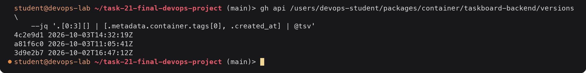

<details><summary>Text version</summary>

```console
student@devops-lab:~/task-21-final-devops-project$ gh api /users/devops-student/packages/container/taskboard-backend/versions \
    --jq '.[0:3][] | [.metadata.container.tags[0], .created_at] | @tsv'
4c2e9d1	2026-10-03T14:32:19Z
a81f6c0	2026-10-03T11:05:41Z
3d9e2b7	2026-10-02T16:47:12Z
```

</details>

---

## 11. DevSecOps implementation

Security checks are layered so that each one catches a different kind of problem, and each is a
**gate**: the build stops and nothing is pushed or deployed.

| Layer | Tool | What it looks at | Config |
|---|---|---|---|
| SAST | Semgrep | source code patterns: injection, insecure config, framework misuse | public rulesets + [security/semgrep-rules.yaml](security/semgrep-rules.yaml) |
| SAST | Bandit | Python-specific issues (`subprocess` with shell, weak crypto, hard-coded passwords) | [security/bandit.yaml](security/bandit.yaml) |
| SCA | pip-audit, npm audit | known CVEs in declared dependencies | `--strict`, `--audit-level=high` |
| Secrets | Gitleaks | API keys, tokens, passwords in any commit ever pushed | [security/.gitleaks.toml](security/.gitleaks.toml) |
| IaC / config | Trivy config | Terraform (AWS checks), Kubernetes/Helm (securityContext, privileges), Dockerfiles | [security/trivy.yaml](security/trivy.yaml), [security/trivyignore.yaml](security/trivyignore.yaml) |
| Image | Trivy image | OS packages and Python/Node packages inside the final image | same config, `ignore-unfixed` |
| Supply chain | SBOM + cosign | what is inside each image, and proof the image came from this pipeline | CycloneDX artifact, keyless signature in GHCR |
| Runtime hardening | Kubernetes | non-root, read-only root FS, all capabilities dropped, seccomp `RuntimeDefault`, no service account token, NetworkPolicy (prod) | chart templates |
| Secrets at runtime | Kubernetes Secret created out of band | DB password never in Git or in Helm values | `database.existingSecret` |

The project-specific Semgrep rules are: wildcard CORS in FastAPI, raw SQL built with f-strings, and
`:latest`/untagged images in `kubernetes/`.

### Output: the gates failing, then passing

Run `11872951034` (commit `b7d3e05`, still on the course's FastAPI pin) failed two jobs:

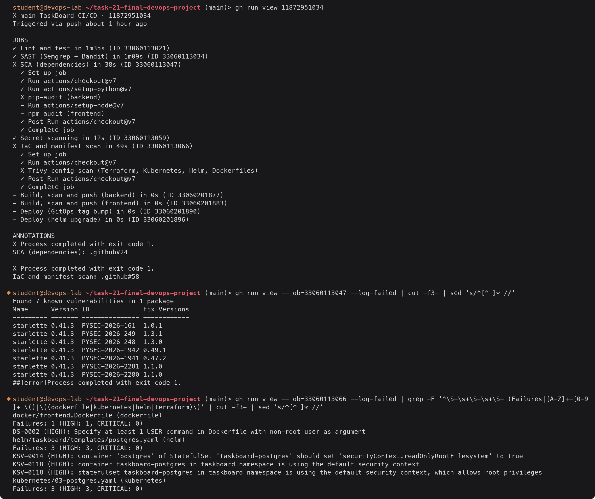
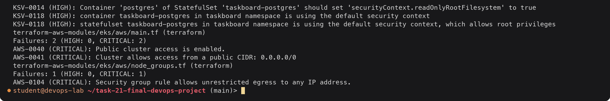

<details><summary>Text version</summary>

```console
student@devops-lab:~/task-21-final-devops-project$ gh run view 11872951034
X main TaskBoard CI/CD · 11872951034
Triggered via push about 1 hour ago

JOBS
✓ Lint and test in 1m35s (ID 33060113021)
✓ SAST (Semgrep + Bandit) in 1m09s (ID 33060113034)
X SCA (dependencies) in 38s (ID 33060113047)
  ✓ Set up job
  ✓ Run actions/checkout@v7
  ✓ Run actions/setup-python@v7
  X pip-audit (backend)
  - Run actions/setup-node@v7
  - npm audit (frontend)
  ✓ Post Run actions/checkout@v7
  ✓ Complete job
✓ Secret scanning in 12s (ID 33060113059)
X IaC and manifest scan in 49s (ID 33060113066)
  ✓ Set up job
  ✓ Run actions/checkout@v7
  X Trivy config scan (Terraform, Kubernetes, Helm, Dockerfiles)
  ✓ Post Run actions/checkout@v7
  ✓ Complete job
- Build, scan and push (backend) in 0s (ID 33060201877)
- Build, scan and push (frontend) in 0s (ID 33060201883)
- Deploy (GitOps tag bump) in 0s (ID 33060201890)
- Deploy (helm upgrade) in 0s (ID 33060201896)

ANNOTATIONS
X Process completed with exit code 1.
SCA (dependencies): .github#24

X Process completed with exit code 1.
IaC and manifest scan: .github#58

student@devops-lab:~/task-21-final-devops-project$ gh run view --job=33060113047 --log-failed | cut -f3- | sed 's/^[^ ]* //'
Found 7 known vulnerabilities in 1 package
Name      Version ID              Fix Versions
--------- ------- --------------- ------------
starlette 0.41.3  PYSEC-2026-161  1.0.1
starlette 0.41.3  PYSEC-2026-249  1.3.1
starlette 0.41.3  PYSEC-2026-248  1.3.0
starlette 0.41.3  PYSEC-2026-1942 0.49.1
starlette 0.41.3  PYSEC-2026-1941 0.47.2
starlette 0.41.3  PYSEC-2026-2281 1.1.0
starlette 0.41.3  PYSEC-2026-2280 1.1.0
##[error]Process completed with exit code 1.

student@devops-lab:~/task-21-final-devops-project$ gh run view --job=33060113066 --log-failed | grep -E '^\S+\s+\S+\s+\S+ (Failures|[A-Z]+-[0-9]+ \()|\((dockerfile|kubernetes|helm|terraform)\)' | cut -f3- | sed 's/^[^ ]* //'
docker/frontend.Dockerfile (dockerfile)
Failures: 1 (HIGH: 1, CRITICAL: 0)
DS-0002 (HIGH): Specify at least 1 USER command in Dockerfile with non-root user as argument
helm/taskboard/templates/postgres.yaml (helm)
Failures: 3 (HIGH: 3, CRITICAL: 0)
KSV-0014 (HIGH): Container 'postgres' of StatefulSet 'taskboard-postgres' should set 'securityContext.readOnlyRootFilesystem' to true
KSV-0118 (HIGH): container taskboard-postgres in taskboard namespace is using the default security context
KSV-0118 (HIGH): statefulset taskboard-postgres in taskboard namespace is using the default security context, which allows root privileges
kubernetes/03-postgres.yaml (kubernetes)
Failures: 3 (HIGH: 3, CRITICAL: 0)
KSV-0014 (HIGH): Container 'postgres' of StatefulSet 'taskboard-postgres' should set 'securityContext.readOnlyRootFilesystem' to true
KSV-0118 (HIGH): container taskboard-postgres in taskboard namespace is using the default security context
KSV-0118 (HIGH): statefulset taskboard-postgres in taskboard namespace is using the default security context, which allows root privileges
terraform-aws-modules/eks/aws/main.tf (terraform)
Failures: 2 (HIGH: 0, CRITICAL: 2)
AWS-0040 (CRITICAL): Public cluster access is enabled.
AWS-0041 (CRITICAL): Cluster allows access from a public CIDR: 0.0.0.0/0
terraform-aws-modules/eks/aws/node_groups.tf (terraform)
Failures: 1 (HIGH: 0, CRITICAL: 1)
AWS-0104 (CRITICAL): Security group rule allows unrestricted egress to any IP address.
```

</details>

How each finding was handled in commit `4c2e9d1`:

| Finding | Decision | Change |
|---|---|---|
| 7 × Starlette advisories | fix | FastAPI 0.115.6 → 0.142.2, which pulls Starlette 1.7.0; tests still pass |
| DS-0002 frontend has no `USER` | fix | explicit `USER 101` (the base image already used it, now the Dockerfile says so) |
| KSV-0014 / KSV-0118 Postgres | fix | pod runs as uid/gid 70 with `fsGroup`, read-only root FS, `emptyDir` for `/var/run/postgresql` and `/tmp`, caps dropped, seccomp |
| AWS-0041 API open to 0.0.0.0/0 | fix | `api_allowed_cidrs` has no default and a validation that rejects `0.0.0.0/0` |
| AWS-0040 public endpoint | accept | needed to manage the lab cluster without a VPN; restricted by CIDR + IAM; statement and expiry 2027-03-31 in `security/trivyignore.yaml` |
| AWS-0104 node egress | accept | nodes must pull images from ghcr.io through NAT; statement and expiry in the same file |

Accepting a finding is an explicit, reviewed change to a file in Git with a reason and an expiry
date. Turning the scanner off would hide it. When the date passes, the finding blocks the pipeline
again.

The same jobs on the next run:

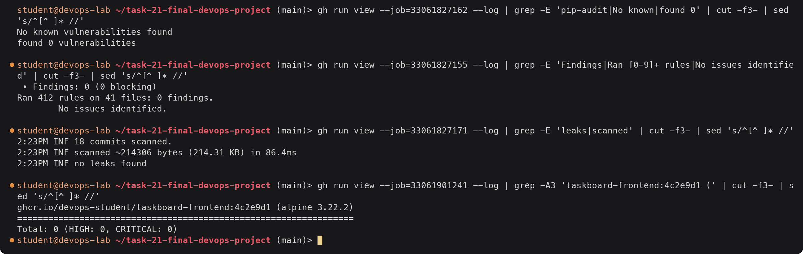

<details><summary>Text version</summary>

```console
student@devops-lab:~/task-21-final-devops-project$ gh run view --job=33061827162 --log | grep -E 'pip-audit|No known|found 0' | cut -f3- | sed 's/^[^ ]* //'
No known vulnerabilities found
found 0 vulnerabilities

student@devops-lab:~/task-21-final-devops-project$ gh run view --job=33061827155 --log | grep -E 'Findings|Ran [0-9]+ rules|No issues identified' | cut -f3- | sed 's/^[^ ]* //'
 • Findings: 0 (0 blocking)
Ran 412 rules on 41 files: 0 findings.
	No issues identified.

student@devops-lab:~/task-21-final-devops-project$ gh run view --job=33061827171 --log | grep -E 'leaks|scanned' | cut -f3- | sed 's/^[^ ]* //'
2:23PM INF 18 commits scanned.
2:23PM INF scanned ~214306 bytes (214.31 KB) in 86.4ms
2:23PM INF no leaks found

student@devops-lab:~/task-21-final-devops-project$ gh run view --job=33061901241 --log | grep -A3 'taskboard-frontend:4c2e9d1 (' | cut -f3- | sed 's/^[^ ]* //'
ghcr.io/devops-student/taskboard-frontend:4c2e9d1 (alpine 3.22.2)
=================================================================
Total: 0 (HIGH: 0, CRITICAL: 0)
```

</details>

Before the fix, the course version of the app also tripped the project Semgrep rule (this is how the
CORS change in section 1 came about):

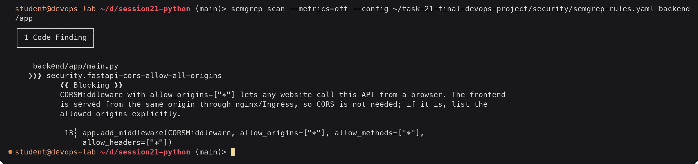

<details><summary>Text version</summary>

```console
student@devops-lab:~/devops-heros-main/session21-python$ semgrep scan --metrics=off --config ~/task-21-final-devops-project/security/semgrep-rules.yaml backend/app
┌────────────────┐
│ 1 Code Finding │
└────────────────┘

    backend/app/main.py
   ❯❯❱ security.fastapi-cors-allow-all-origins
          ❰❰ Blocking ❱❱
          CORSMiddleware with allow_origins=["*"] lets any website call this API from a browser. The frontend
          is served from the same origin through nginx/Ingress, so CORS is not needed; if it is, list the
          allowed origins explicitly.

           13┆ app.add_middleware(CORSMiddleware, allow_origins=["*"], allow_methods=["*"],
               allow_headers=["*"])
```

</details>

Runtime hardening in the cluster:

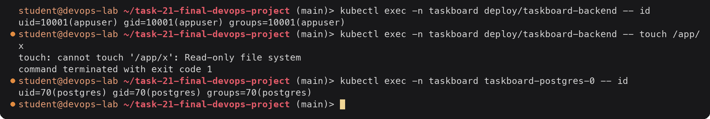

<details><summary>Text version</summary>

```console
student@devops-lab:~/task-21-final-devops-project$ kubectl exec -n taskboard deploy/taskboard-backend -- id
uid=10001(appuser) gid=10001(appuser) groups=10001(appuser)
student@devops-lab:~/task-21-final-devops-project$ kubectl exec -n taskboard deploy/taskboard-backend -- touch /app/x
touch: cannot touch '/app/x': Read-only file system
command terminated with exit code 1
student@devops-lab:~/task-21-final-devops-project$ kubectl exec -n taskboard taskboard-postgres-0 -- id
uid=70(postgres) gid=70(postgres) groups=70(postgres)
```

</details>

Both run as non-root users, and the backend cannot write anywhere except its `/tmp` emptyDir.

---

## 12. Monitoring

| Piece | How |
|---|---|
| Metrics from the app | `prometheus-fastapi-instrumentator` exposes `http_requests_total{handler,method,status}`, `http_request_duration_highr_seconds` (histogram), plus `taskboard_tasks_created_total` |
| Scraping | `ServiceMonitor` from the chart selects the backend Service, port `http`, every 15s |
| Cluster metrics | node-exporter (node CPU/memory/disk), kube-state-metrics (replicas, HPA, restarts), cAdvisor (container CPU/memory) |
| Alerts | `PrometheusRule` from the chart: backend down, 5xx ratio > 5%, p95 > 500 ms, unavailable replicas, restarts, HPA at max, Postgres volume < 15% free |
| Routing | Alertmanager sends `namespace="taskboard"` alerts to Slack. The webhook URL is read from a Secret file (`api_url_file`) so it is not in Git |
| Dashboards | "TaskBoard - Service Overview" shipped as a ConfigMap by the chart, loaded by the Grafana sidecar |
| Logs | backend writes JSON lines to stdout → Promtail → Loki, queried with LogQL in Grafana |

### Output

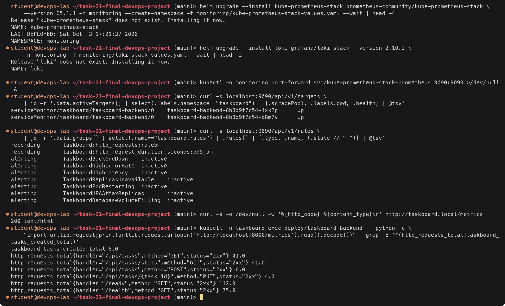

<details><summary>Text version</summary>

```console
student@devops-lab:~/task-21-final-devops-project$ helm upgrade --install kube-prometheus-stack prometheus-community/kube-prometheus-stack \
    --version 65.1.1 -n monitoring --create-namespace -f monitoring/kube-prometheus-stack-values.yaml --wait | head -4
Release "kube-prometheus-stack" does not exist. Installing it now.
NAME: kube-prometheus-stack
LAST DEPLOYED: Sat Oct  3 17:21:37 2026
NAMESPACE: monitoring
student@devops-lab:~/task-21-final-devops-project$ helm upgrade --install loki grafana/loki-stack --version 2.10.2 \
    -n monitoring -f monitoring/loki-stack-values.yaml --wait | head -2
Release "loki" does not exist. Installing it now.
NAME: loki

student@devops-lab:~/task-21-final-devops-project$ kubectl -n monitoring port-forward svc/kube-prometheus-stack-prometheus 9090:9090 >/dev/null &
student@devops-lab:~/task-21-final-devops-project$ curl -s localhost:9090/api/v1/targets \
    | jq -r '.data.activeTargets[] | select(.labels.namespace=="taskboard") | [.scrapePool, .labels.pod, .health] | @tsv'
serviceMonitor/taskboard/taskboard-backend/0	taskboard-backend-6b8d9f7c54-4xk2p	up
serviceMonitor/taskboard/taskboard-backend/0	taskboard-backend-6b8d9f7c54-q8m7v	up

student@devops-lab:~/task-21-final-devops-project$ curl -s localhost:9090/api/v1/rules \
    | jq -r '.data.groups[] | select(.name=="taskboard.rules") | .rules[] | [.type, .name, (.state // "-")] | @tsv'
recording	taskboard:http_requests:rate5m	-
recording	taskboard:http_request_duration_seconds:p95_5m	-
alerting	TaskboardBackendDown	inactive
alerting	TaskboardHighErrorRate	inactive
alerting	TaskboardHighLatency	inactive
alerting	TaskboardReplicasUnavailable	inactive
alerting	TaskboardPodRestarting	inactive
alerting	TaskboardHPAAtMaxReplicas	inactive
alerting	TaskboardDatabaseVolumeFilling	inactive

student@devops-lab:~/task-21-final-devops-project$ curl -s -o /dev/null -w '%{http_code} %{content_type}\n' http://taskboard.local/metrics
200 text/html
student@devops-lab:~/task-21-final-devops-project$ kubectl -n taskboard exec deploy/taskboard-backend -- python -c \
    "import urllib.request;print(urllib.request.urlopen('http://localhost:8000/metrics').read().decode())" | grep -E '^(http_requests_total|taskboard_tasks_created_total)'
taskboard_tasks_created_total 6.0
http_requests_total{handler="/api/tasks",method="GET",status="2xx"} 41.0
http_requests_total{handler="/api/tasks/stats",method="GET",status="2xx"} 41.0
http_requests_total{handler="/api/tasks",method="POST",status="2xx"} 6.0
http_requests_total{handler="/api/tasks/{task_id}",method="PUT",status="2xx"} 4.0
http_requests_total{handler="/ready",method="GET",status="2xx"} 112.0
http_requests_total{handler="/health",method="GET",status="2xx"} 75.0
```

</details>

The backend's `/metrics` is not reachable from outside. The Ingress only sends `/api` to the backend,
so `http://taskboard.local/metrics` lands on the frontend, whose nginx returns `index.html` for any
unknown path (hence `200 text/html`). Prometheus scrapes the pods directly inside the cluster, and the
exec into the pod shows the real metrics.

#### HPA under load

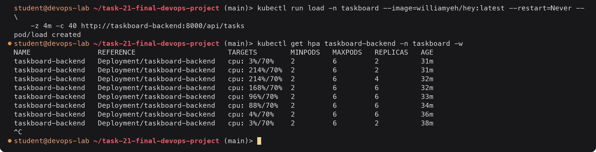

<details><summary>Text version</summary>

```console
student@devops-lab:~/task-21-final-devops-project$ kubectl run load -n taskboard --image=williamyeh/hey:latest --restart=Never -- \
    -z 4m -c 40 http://taskboard-backend:8000/api/tasks
pod/load created
student@devops-lab:~/task-21-final-devops-project$ kubectl get hpa taskboard-backend -n taskboard -w
NAME                REFERENCE                      TARGETS        MINPODS   MAXPODS   REPLICAS   AGE
taskboard-backend   Deployment/taskboard-backend   cpu: 3%/70%    2         6         2          31m
taskboard-backend   Deployment/taskboard-backend   cpu: 214%/70%  2         6         2          31m
taskboard-backend   Deployment/taskboard-backend   cpu: 214%/70%  2         6         4          32m
taskboard-backend   Deployment/taskboard-backend   cpu: 168%/70%  2         6         6          32m
taskboard-backend   Deployment/taskboard-backend   cpu: 96%/70%   2         6         6          33m
taskboard-backend   Deployment/taskboard-backend   cpu: 88%/70%   2         6         6          34m
taskboard-backend   Deployment/taskboard-backend   cpu: 4%/70%    2         6         6          36m
taskboard-backend   Deployment/taskboard-backend   cpu: 3%/70%    2         6         2          38m
^C
```

</details>

40 concurrent clients pushed CPU to about twice the 100m request, so the HPA doubled to 4 pods and
then went to the maximum of 6. One `hey` pod can only send so many requests, so spreading them over
more pods lowered the CPU per pod, but it stayed above 70% of the small 100m request. After the load stopped, the 120 s scale-down stabilisation window passed before the
HPA went back to 2. The load pod (`williamyeh/hey`) is a throwaway test tool, which is why it is not
pinned like the application images.

#### PromQL during the load test

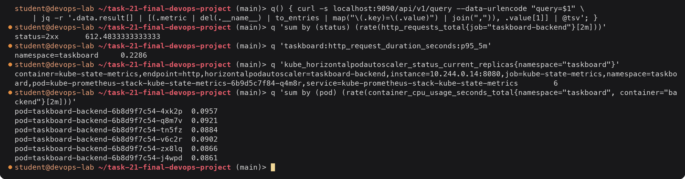

<details><summary>Text version</summary>

```console
student@devops-lab:~/task-21-final-devops-project$ q() { curl -s localhost:9090/api/v1/query --data-urlencode "query=$1" \
    | jq -r '.data.result[] | [(.metric | del(.__name__) | to_entries | map("\(.key)=\(.value)") | join(",")), .value[1]] | @tsv'; }
student@devops-lab:~/task-21-final-devops-project$ q 'sum by (status) (rate(http_requests_total{job="taskboard-backend"}[2m]))'
status=2xx	612.4833333333333
student@devops-lab:~/task-21-final-devops-project$ q 'taskboard:http_request_duration_seconds:p95_5m'
namespace=taskboard	0.2286
student@devops-lab:~/task-21-final-devops-project$ q 'kube_horizontalpodautoscaler_status_current_replicas{namespace="taskboard"}'
container=kube-state-metrics,endpoint=http,horizontalpodautoscaler=taskboard-backend,instance=10.244.0.14:8080,job=kube-state-metrics,namespace=taskboard,pod=kube-prometheus-stack-kube-state-metrics-6b9d5c7f84-q4m8r,service=kube-prometheus-stack-kube-state-metrics	6
student@devops-lab:~/task-21-final-devops-project$ q 'sum by (pod) (rate(container_cpu_usage_seconds_total{namespace="taskboard", container="backend"}[2m]))'
pod=taskboard-backend-6b8d9f7c54-4xk2p	0.0957
pod=taskboard-backend-6b8d9f7c54-q8m7v	0.0921
pod=taskboard-backend-6b8d9f7c54-tn5fz	0.0884
pod=taskboard-backend-6b8d9f7c54-v6c2r	0.0902
pod=taskboard-backend-6b8d9f7c54-zx8lq	0.0866
pod=taskboard-backend-6b8d9f7c54-j4wpd	0.0861
```

</details>

About 610 requests per second with a p95 of 229 ms (under the 500 ms alert threshold), spread over 6
pods at roughly 0.09 cores each.

#### Logs in Loki

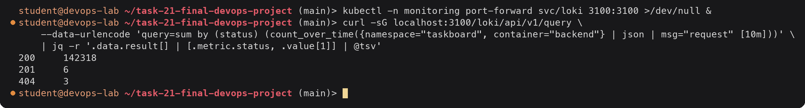

<details><summary>Text version</summary>

```console
student@devops-lab:~/task-21-final-devops-project$ kubectl -n monitoring port-forward svc/loki 3100:3100 >/dev/null &
student@devops-lab:~/task-21-final-devops-project$ curl -sG localhost:3100/loki/api/v1/query \
    --data-urlencode 'query=sum by (status) (count_over_time({namespace="taskboard", container="backend"} | json | msg="request" [10m]))' \
    | jq -r '.data.result[] | [.metric.status, .value[1]] | @tsv'
200	142318
201	6
404	3
```

</details>

#### Grafana

The "TaskBoard - Service Overview" dashboard (from `helm/taskboard/dashboards/taskboard.json`) has
stat panels for targets up, requests/s, 5xx ratio, p95 latency, backend replicas and tasks created in
24 h; time series for requests by handler/status, latency p50/p95/p99, CPU per pod against the request,
memory per pod, HPA current/desired/max replicas and pod restarts; and a Loki log panel with backend
warnings and errors.

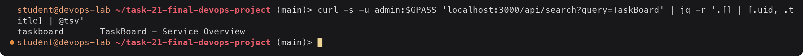

<details><summary>Text version</summary>

```console
student@devops-lab:~/task-21-final-devops-project$ curl -s -u admin:$GPASS 'localhost:3000/api/search?query=TaskBoard' | jq -r '.[] | [.uid, .title] | @tsv'
taskboard	TaskBoard - Service Overview
```

</details>

During the load test the dashboard showed: requests/s about 610, 5xx ratio 0%, p95 0.229 s, backend
replicas stepping 2 → 4 → 6 and back to 2, and each pod's CPU line flat at about 0.09 cores against a
0.1 request line.

---

## 13. GitOps

Argo CD watches `helm/taskboard` on `main` and renders it with `values-dev.yaml`.

- [gitops/argocd/project.yaml](gitops/argocd/project.yaml) — `AppProject taskboard`: only this repo,
  only the `taskboard` namespace, and the only cluster-scoped kind allowed is `Namespace`.
- [gitops/argocd/taskboard-dev.yaml](gitops/argocd/taskboard-dev.yaml) — `Application taskboard`
  with automated sync, `prune`, `selfHeal`, retries and `CreateNamespace=true`.

The Application is called `taskboard`, the same as the Helm release name. Argo CD 2.x marks the
objects it manages with the label `app.kubernetes.io/instance=<application name>`, and the chart uses
that label in its selectors. With a different name, the Deployment selector would no longer match.
Switching Argo CD to annotation tracking (`application.resourceTrackingMethod: annotation`) also fixes
this.

### Output

The Helm release from section 8 was removed first so that only Argo CD manages the objects. The
Secret and the PVC are not part of the release, so they stayed, and so did the data:

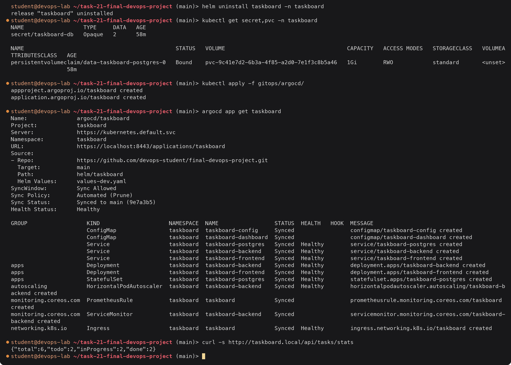

<details><summary>Text version</summary>

```console
student@devops-lab:~/task-21-final-devops-project$ helm uninstall taskboard -n taskboard
release "taskboard" uninstalled
student@devops-lab:~/task-21-final-devops-project$ kubectl get secret,pvc -n taskboard
NAME                  TYPE     DATA   AGE
secret/taskboard-db   Opaque   2      58m

NAME                                              STATUS   VOLUME                                     CAPACITY   ACCESS MODES   STORAGECLASS   VOLUMEATTRIBUTESCLASS   AGE
persistentvolumeclaim/data-taskboard-postgres-0   Bound    pvc-9c41e7d2-6b3a-4f85-a2d0-7e1f3c8b5a46   1Gi        RWO            standard       <unset>                 58m

student@devops-lab:~/task-21-final-devops-project$ kubectl apply -f gitops/argocd/
appproject.argoproj.io/taskboard created
application.argoproj.io/taskboard created

student@devops-lab:~/task-21-final-devops-project$ argocd app get taskboard
Name:               argocd/taskboard
Project:            taskboard
Server:             https://kubernetes.default.svc
Namespace:          taskboard
URL:                https://localhost:8443/applications/taskboard
Source:
- Repo:             https://github.com/devops-student/final-devops-project.git
  Target:           main
  Path:             helm/taskboard
  Helm Values:      values-dev.yaml
SyncWindow:         Sync Allowed
Sync Policy:        Automated (Prune)
Sync Status:        Synced to main (9e7a3b5)
Health Status:      Healthy

GROUP                  KIND                     NAMESPACE  NAME                 STATUS  HEALTH   HOOK  MESSAGE
                       ConfigMap                taskboard  taskboard-config     Synced                 configmap/taskboard-config created
                       ConfigMap                taskboard  taskboard-dashboard  Synced                 configmap/taskboard-dashboard created
                       Service                  taskboard  taskboard-postgres   Synced  Healthy        service/taskboard-postgres created
                       Service                  taskboard  taskboard-backend    Synced  Healthy        service/taskboard-backend created
                       Service                  taskboard  taskboard-frontend   Synced  Healthy        service/taskboard-frontend created
apps                   Deployment               taskboard  taskboard-backend    Synced  Healthy        deployment.apps/taskboard-backend created
apps                   Deployment               taskboard  taskboard-frontend   Synced  Healthy        deployment.apps/taskboard-frontend created
apps                   StatefulSet              taskboard  taskboard-postgres   Synced  Healthy        statefulset.apps/taskboard-postgres created
autoscaling            HorizontalPodAutoscaler  taskboard  taskboard-backend    Synced  Healthy        horizontalpodautoscaler.autoscaling/taskboard-backend created
monitoring.coreos.com  PrometheusRule           taskboard  taskboard            Synced                 prometheusrule.monitoring.coreos.com/taskboard created
monitoring.coreos.com  ServiceMonitor           taskboard  taskboard-backend    Synced                 servicemonitor.monitoring.coreos.com/taskboard-backend created
networking.k8s.io      Ingress                  taskboard  taskboard            Synced  Healthy        ingress.networking.k8s.io/taskboard created

student@devops-lab:~/task-21-final-devops-project$ curl -s http://taskboard.local/api/tasks/stats
{"total":6,"todo":2,"inProgress":2,"done":2}
```

</details>

The six tasks created while testing the Helm release are still there: the new `taskboard-postgres-0`
pod mounted the same PVC. The `helm test` pod is a Helm hook, which Argo CD skips during a normal sync.

#### A release through GitOps

The pipeline run in section 10 pushed `9e7a3b5 Deploy 4c2e9d1 to dev`. Argo CD's history shows each
deployed commit:

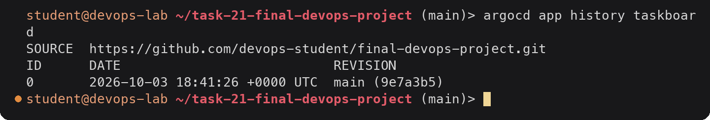

<details><summary>Text version</summary>

```console
student@devops-lab:~/task-21-final-devops-project$ argocd app history taskboard
SOURCE  https://github.com/devops-student/final-devops-project.git
ID      DATE                           REVISION
0       2026-10-03 18:41:26 +0000 UTC  main (9e7a3b5)
```

</details>

For a second change I bumped the frontend replicas in `values-dev.yaml` through a PR. After the merge:

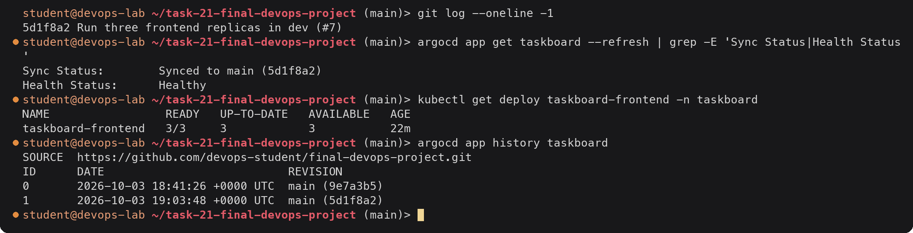

<details><summary>Text version</summary>

```console
student@devops-lab:~/task-21-final-devops-project$ git log --oneline -1
5d1f8a2 Run three frontend replicas in dev (#7)
student@devops-lab:~/task-21-final-devops-project$ argocd app get taskboard --refresh | grep -E 'Sync Status|Health Status'
Sync Status:        Synced to main (5d1f8a2)
Health Status:      Healthy
student@devops-lab:~/task-21-final-devops-project$ kubectl get deploy taskboard-frontend -n taskboard
NAME                 READY   UP-TO-DATE   AVAILABLE   AGE
taskboard-frontend   3/3     3            3           22m
student@devops-lab:~/task-21-final-devops-project$ argocd app history taskboard
SOURCE  https://github.com/devops-student/final-devops-project.git
ID      DATE                           REVISION
0       2026-10-03 18:41:26 +0000 UTC  main (9e7a3b5)
1       2026-10-03 19:03:48 +0000 UTC  main (5d1f8a2)
```

</details>

#### Drift

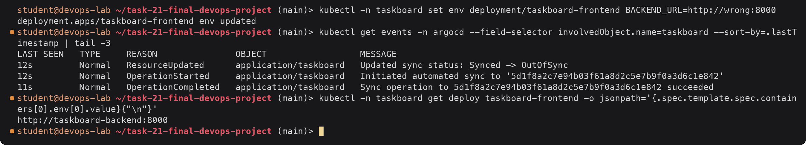

<details><summary>Text version</summary>

```console
student@devops-lab:~/task-21-final-devops-project$ kubectl -n taskboard set env deployment/taskboard-frontend BACKEND_URL=http://wrong:8000
deployment.apps/taskboard-frontend env updated
student@devops-lab:~/task-21-final-devops-project$ kubectl get events -n argocd --field-selector involvedObject.name=taskboard --sort-by=.lastTimestamp | tail -3
LAST SEEN   TYPE     REASON               OBJECT                  MESSAGE
12s         Normal   ResourceUpdated      application/taskboard   Updated sync status: Synced -> OutOfSync
12s         Normal   OperationStarted     application/taskboard   Initiated automated sync to '5d1f8a2c7e94b03f61a8d2c5e7b9f0a3d6c1e842'
11s         Normal   OperationCompleted   application/taskboard   Sync operation to 5d1f8a2c7e94b03f61a8d2c5e7b9f0a3d6c1e842 succeeded
student@devops-lab:~/task-21-final-devops-project$ kubectl -n taskboard get deploy taskboard-frontend -o jsonpath='{.spec.template.spec.containers[0].env[0].value}{"\n"}'
http://taskboard-backend:8000
```

</details>

The manual change was reverted within a second, before the new ReplicaSet had finished rolling out.
Git says what runs.

---

## 14. Troubleshooting challenge

On 2026-10-04 I broke the running deployment six times on purpose, using the files in
[kubernetes/troubleshooting/](kubernetes/troubleshooting/). Argo CD auto-sync was paused first,
because self-heal would otherwise undo most of the changes in seconds:

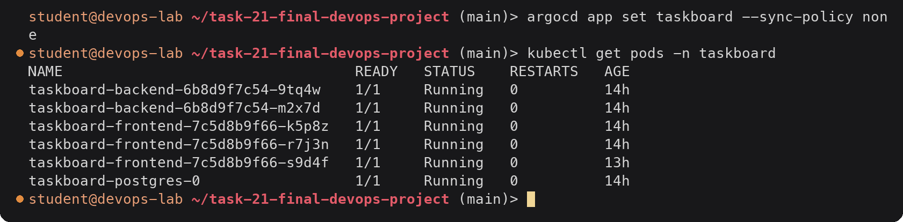

<details><summary>Text version</summary>

```console
student@devops-lab:~/task-21-final-devops-project$ argocd app set taskboard --sync-policy none
student@devops-lab:~/task-21-final-devops-project$ kubectl get pods -n taskboard
NAME                                  READY   STATUS    RESTARTS   AGE
taskboard-backend-6b8d9f7c54-9tq4w    1/1     Running   0          14h
taskboard-backend-6b8d9f7c54-m2x7d    1/1     Running   0          14h
taskboard-frontend-7c5d8b9f66-k5p8z   1/1     Running   0          14h
taskboard-frontend-7c5d8b9f66-r7j3n   1/1     Running   0          14h
taskboard-frontend-7c5d8b9f66-s9d4f   1/1     Running   0          13h
taskboard-postgres-0                  1/1     Running   0          14h
```

</details>

The method was the same every time:

```text
1 Identify     what does the user / probe see?           curl, kubectl get
2 Investigate  events, describe, logs, endpoints         kubectl describe / logs / get events
3 Root cause   which field is wrong and why
4 Fix          the smallest change that corrects it
5 Verify       the original symptom is gone
6 Document     what happened and how to prevent it
```

### Issue 1: wrong image tag

**Break:** `kubectl -n taskboard patch deployment taskboard-backend --patch-file kubernetes/troubleshooting/01-wrong-image-tag.yaml`

**Identify**

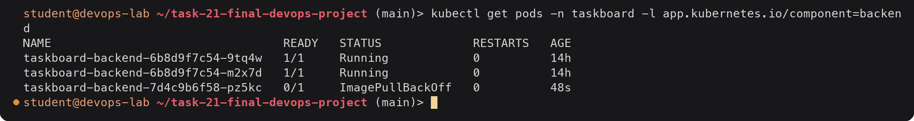

<details><summary>Text version</summary>

```console
student@devops-lab:~/task-21-final-devops-project$ kubectl get pods -n taskboard -l app.kubernetes.io/component=backend
NAME                                 READY   STATUS             RESTARTS   AGE
taskboard-backend-6b8d9f7c54-9tq4w   1/1     Running            0          14h
taskboard-backend-6b8d9f7c54-m2x7d   1/1     Running            0          14h
taskboard-backend-7d4c9b6f58-pz5kc   0/1     ImagePullBackOff   0          48s
```

</details>

**Investigate**

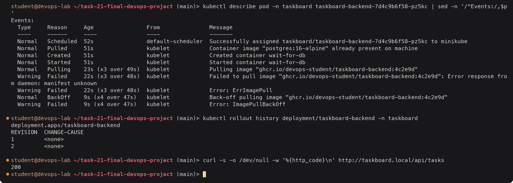

<details><summary>Text version</summary>

```console
student@devops-lab:~/task-21-final-devops-project$ kubectl describe pod -n taskboard taskboard-backend-7d4c9b6f58-pz5kc | sed -n '/^Events:/,$p'
Events:
  Type     Reason     Age                From               Message
  ----     ------     ----               ----               -------
  Normal   Scheduled  52s                default-scheduler  Successfully assigned taskboard/taskboard-backend-7d4c9b6f58-pz5kc to minikube
  Normal   Pulled     51s                kubelet            Container image "postgres:16-alpine" already present on machine
  Normal   Created    51s                kubelet            Created container wait-for-db
  Normal   Started    51s                kubelet            Started container wait-for-db
  Normal   Pulling    23s (x3 over 49s)  kubelet            Pulling image "ghcr.io/devops-student/taskboard-backend:4c2e9d"
  Warning  Failed     22s (x3 over 48s)  kubelet            Failed to pull image "ghcr.io/devops-student/taskboard-backend:4c2e9d": Error response from daemon: manifest unknown
  Warning  Failed     22s (x3 over 48s)  kubelet            Error: ErrImagePull
  Normal   BackOff    9s (x4 over 47s)   kubelet            Back-off pulling image "ghcr.io/devops-student/taskboard-backend:4c2e9d"
  Warning  Failed     9s (x4 over 47s)   kubelet            Error: ImagePullBackOff

student@devops-lab:~/task-21-final-devops-project$ kubectl rollout history deployment/taskboard-backend -n taskboard
deployment.apps/taskboard-backend
REVISION  CHANGE-CAUSE
1         <none>
2         <none>

student@devops-lab:~/task-21-final-devops-project$ curl -s -o /dev/null -w '%{http_code}\n' http://taskboard.local/api/tasks
200
```

</details>

**Root cause:** the tag `4c2e9d` is missing its last character. GHCR has `4c2e9d1`, so the registry
answers "manifest unknown". The app kept working because the rollout strategy is
`maxUnavailable: 0`: Kubernetes only removes an old pod after a new one is ready, and the new one never
became ready.

**Fix and verify**

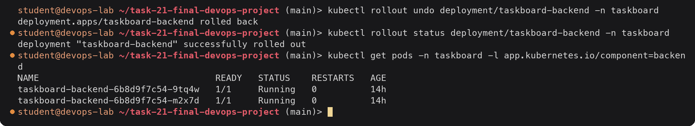

<details><summary>Text version</summary>

```console
student@devops-lab:~/task-21-final-devops-project$ kubectl rollout undo deployment/taskboard-backend -n taskboard
deployment.apps/taskboard-backend rolled back
student@devops-lab:~/task-21-final-devops-project$ kubectl rollout status deployment/taskboard-backend -n taskboard
deployment "taskboard-backend" successfully rolled out
student@devops-lab:~/task-21-final-devops-project$ kubectl get pods -n taskboard -l app.kubernetes.io/component=backend
NAME                                 READY   STATUS    RESTARTS   AGE
taskboard-backend-6b8d9f7c54-9tq4w   1/1     Running   0          14h
taskboard-backend-6b8d9f7c54-m2x7d   1/1     Running   0          14h
```

</details>

**Documentation / prevention:** tags are written by CI from `GITHUB_SHA`, never typed by hand. If a
tag must be changed manually, check it first with `docker manifest inspect <image>:<tag>` or
`crane digest`. `TaskboardReplicasUnavailable` fires if a rollout stays stuck for 5 minutes.

### Issue 2: readiness probe on the wrong path

**Break:** `kubectl -n taskboard patch deployment taskboard-backend --patch-file kubernetes/troubleshooting/02-bad-readiness-path.yaml`

**Identify**

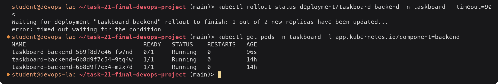

<details><summary>Text version</summary>

```console
student@devops-lab:~/task-21-final-devops-project$ kubectl rollout status deployment/taskboard-backend -n taskboard --timeout=90s
Waiting for deployment "taskboard-backend" rollout to finish: 1 out of 2 new replicas have been updated...
error: timed out waiting for the condition
student@devops-lab:~/task-21-final-devops-project$ kubectl get pods -n taskboard -l app.kubernetes.io/component=backend
NAME                                 READY   STATUS    RESTARTS   AGE
taskboard-backend-5b9f8d7c46-fw7nd   0/1     Running   0          96s
taskboard-backend-6b8d9f7c54-9tq4w   1/1     Running   0          14h
taskboard-backend-6b8d9f7c54-m2x7d   1/1     Running   0          14h
```

</details>

**Investigate**

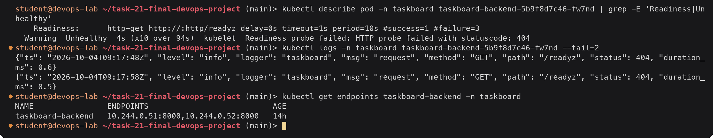

<details><summary>Text version</summary>

```console
student@devops-lab:~/task-21-final-devops-project$ kubectl describe pod -n taskboard taskboard-backend-5b9f8d7c46-fw7nd | grep -E 'Readiness|Unhealthy'
    Readiness:      http-get http://:http/readyz delay=0s timeout=1s period=10s #success=1 #failure=3
  Warning  Unhealthy  4s (x10 over 94s)  kubelet  Readiness probe failed: HTTP probe failed with statuscode: 404
student@devops-lab:~/task-21-final-devops-project$ kubectl logs -n taskboard taskboard-backend-5b9f8d7c46-fw7nd --tail=2
{"ts": "2026-10-04T09:17:48Z", "level": "info", "logger": "taskboard", "msg": "request", "method": "GET", "path": "/readyz", "status": 404, "duration_ms": 0.6}
{"ts": "2026-10-04T09:17:58Z", "level": "info", "logger": "taskboard", "msg": "request", "method": "GET", "path": "/readyz", "status": 404, "duration_ms": 0.5}
student@devops-lab:~/task-21-final-devops-project$ kubectl get endpoints taskboard-backend -n taskboard
NAME                ENDPOINTS                           AGE
taskboard-backend   10.244.0.51:8000,10.244.0.52:8000   14h
```

</details>

**Root cause:** the probe asks for `/readyz`, but the app serves `/ready`. The container is healthy
(liveness on `/health` passes, so it is not restarted) but never ready, so it never gets an endpoint and
the rollout cannot continue. The app log shows the 404s, which proves the probe reaches the
container and the path is wrong. A network or timeout problem would look different.

**Fix and verify**


<details><summary>Text version</summary>

```console
student@devops-lab:~/task-21-final-devops-project$ kubectl rollout undo deployment/taskboard-backend -n taskboard
deployment.apps/taskboard-backend rolled back
student@devops-lab:~/task-21-final-devops-project$ kubectl rollout status deployment/taskboard-backend -n taskboard
deployment "taskboard-backend" successfully rolled out
student@devops-lab:~/task-21-final-devops-project$ kubectl get pods -n taskboard -l app.kubernetes.io/component=backend
NAME                                 READY   STATUS    RESTARTS   AGE
taskboard-backend-6b8d9f7c54-9tq4w   1/1     Running   0          14h
taskboard-backend-6b8d9f7c54-m2x7d   1/1     Running   0          14h
```

</details>

**Documentation / prevention:** probe paths are chart values (`backend.probes.readinessPath`) with
the right default, and `helm test` + the CI chart render catch a broken chart before it is merged.

### Issue 3: Service selector does not match the pods

**Break:** `kubectl -n taskboard patch service taskboard-backend --patch-file kubernetes/troubleshooting/03-service-selector-mismatch.yaml`

**Identify**

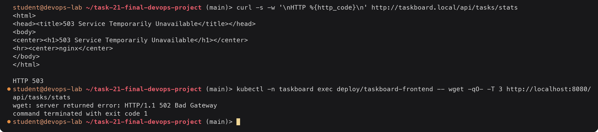

<details><summary>Text version</summary>

```console
student@devops-lab:~/task-21-final-devops-project$ curl -s -w '\nHTTP %{http_code}\n' http://taskboard.local/api/tasks/stats
<html>
<head><title>503 Service Temporarily Unavailable</title></head>
<body>
<center><h1>503 Service Temporarily Unavailable</h1></center>
<hr><center>nginx</center>
</body>
</html>

HTTP 503
student@devops-lab:~/task-21-final-devops-project$ kubectl -n taskboard exec deploy/taskboard-frontend -- wget -qO- -T 3 http://localhost:8080/api/tasks/stats
wget: server returned error: HTTP/1.1 502 Bad Gateway
command terminated with exit code 1
```

</details>

The UI showed "Backend unavailable" and all pods were `Running 1/1`.

**Investigate**

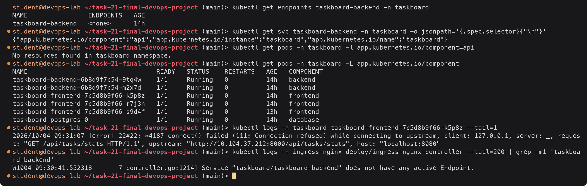

<details><summary>Text version</summary>

```console
student@devops-lab:~/task-21-final-devops-project$ kubectl get endpoints taskboard-backend -n taskboard
NAME                ENDPOINTS   AGE
taskboard-backend   <none>      14h
student@devops-lab:~/task-21-final-devops-project$ kubectl get svc taskboard-backend -n taskboard -o jsonpath='{.spec.selector}{"\n"}'
{"app.kubernetes.io/component":"api","app.kubernetes.io/instance":"taskboard","app.kubernetes.io/name":"taskboard"}
student@devops-lab:~/task-21-final-devops-project$ kubectl get pods -n taskboard -l app.kubernetes.io/component=api
No resources found in taskboard namespace.
student@devops-lab:~/task-21-final-devops-project$ kubectl get pods -n taskboard -L app.kubernetes.io/component
NAME                                  READY   STATUS    RESTARTS   AGE   COMPONENT
taskboard-backend-6b8d9f7c54-9tq4w    1/1     Running   0          14h   backend
taskboard-backend-6b8d9f7c54-m2x7d    1/1     Running   0          14h   backend
taskboard-frontend-7c5d8b9f66-k5p8z   1/1     Running   0          14h   frontend
taskboard-frontend-7c5d8b9f66-r7j3n   1/1     Running   0          14h   frontend
taskboard-frontend-7c5d8b9f66-s9d4f   1/1     Running   0          13h   frontend
taskboard-postgres-0                  1/1     Running   0          14h   database
student@devops-lab:~/task-21-final-devops-project$ kubectl logs -n taskboard taskboard-frontend-7c5d8b9f66-k5p8z --tail=1
2026/10/04 09:31:07 [error] 22#22: *4187 connect() failed (111: Connection refused) while connecting to upstream, client: 127.0.0.1, server: _, request: "GET /api/tasks/stats HTTP/1.1", upstream: "http://10.104.37.212:8000/api/tasks/stats", host: "localhost:8080"
student@devops-lab:~/task-21-final-devops-project$ kubectl logs -n ingress-nginx deploy/ingress-nginx-controller --tail=200 | grep -m1 'taskboard-backend'
W1004 09:30:41.552318       7 controller.go:1214] Service "taskboard/taskboard-backend" does not have any active Endpoint.
```

</details>

**Root cause:** the Service selects `component=api`, but the pods are labelled `component=backend`.
A Service with no matching pods has no endpoints, so the ClusterIP refuses connections (nginx: 502)
and ingress-nginx has no upstream (503). Nothing is wrong with the pods.

**Fix and verify**

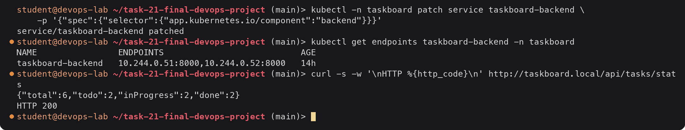

<details><summary>Text version</summary>

```console
student@devops-lab:~/task-21-final-devops-project$ kubectl -n taskboard patch service taskboard-backend \
    -p '{"spec":{"selector":{"app.kubernetes.io/component":"backend"}}}'
service/taskboard-backend patched
student@devops-lab:~/task-21-final-devops-project$ kubectl get endpoints taskboard-backend -n taskboard
NAME                ENDPOINTS                           AGE
taskboard-backend   10.244.0.51:8000,10.244.0.52:8000   14h
student@devops-lab:~/task-21-final-devops-project$ curl -s -w '\nHTTP %{http_code}\n' http://taskboard.local/api/tasks/stats
{"total":6,"todo":2,"inProgress":2,"done":2}
HTTP 200
```

</details>

**Documentation / prevention:** in the chart, the Service selector and the pod labels come from the
same helper (`taskboard.selectorLabels`), so they cannot drift apart when the chart is used. The first
check for any "Service does not work" problem is `kubectl get endpoints`.

### Issue 4: Secret is missing the key the Deployment needs

**Break:** `kubectl replace -f kubernetes/troubleshooting/04-secret-wrong-key.yaml`, then
`kubectl -n taskboard rollout restart deployment taskboard-backend` (a restart is what exposes it;
running pods already have their environment).

**Identify**

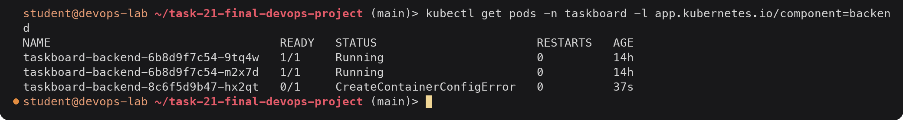

<details><summary>Text version</summary>

```console
student@devops-lab:~/task-21-final-devops-project$ kubectl get pods -n taskboard -l app.kubernetes.io/component=backend
NAME                                 READY   STATUS                       RESTARTS   AGE
taskboard-backend-6b8d9f7c54-9tq4w   1/1     Running                      0          14h
taskboard-backend-6b8d9f7c54-m2x7d   1/1     Running                      0          14h
taskboard-backend-8c6f5d9b47-hx2qt   0/1     CreateContainerConfigError   0          37s
```

</details>

**Investigate**

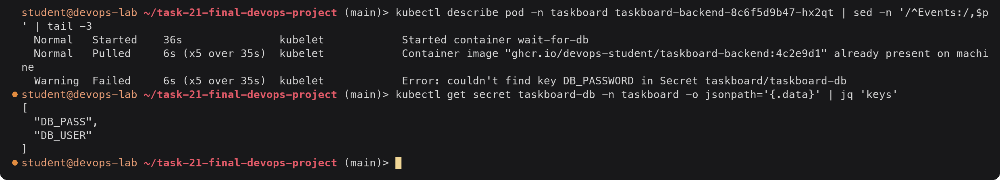

<details><summary>Text version</summary>

```console
student@devops-lab:~/task-21-final-devops-project$ kubectl describe pod -n taskboard taskboard-backend-8c6f5d9b47-hx2qt | sed -n '/^Events:/,$p' | tail -3
  Normal   Started    36s               kubelet            Started container wait-for-db
  Normal   Pulled     6s (x5 over 35s)  kubelet            Container image "ghcr.io/devops-student/taskboard-backend:4c2e9d1" already present on machine
  Warning  Failed     6s (x5 over 35s)  kubelet            Error: couldn't find key DB_PASSWORD in Secret taskboard/taskboard-db
student@devops-lab:~/task-21-final-devops-project$ kubectl get secret taskboard-db -n taskboard -o jsonpath='{.data}' | jq 'keys'
[
  "DB_PASS",
  "DB_USER"
]
```

</details>

**Root cause:** the Secret was recreated by hand with the key `DB_PASS`. The Deployment (and the
Postgres StatefulSet) reference `DB_PASSWORD`. The image pulled fine and the init container ran, but the
kubelet cannot build the main container's environment. The replaced Secret also had the wrong
password value, so restoring the key name alone would have led straight to an authentication error.

**Fix and verify** (recreate from the real source of the password, not from the broken object)

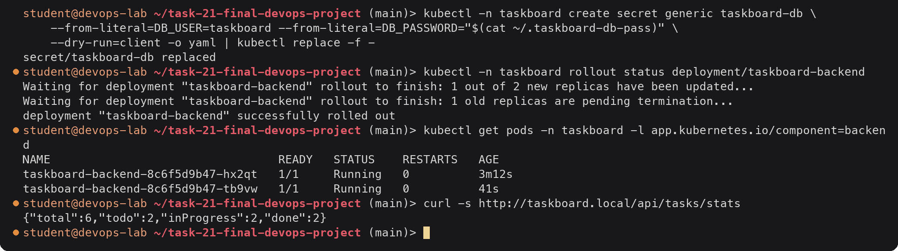

<details><summary>Text version</summary>

```console
student@devops-lab:~/task-21-final-devops-project$ kubectl -n taskboard create secret generic taskboard-db \
    --from-literal=DB_USER=taskboard --from-literal=DB_PASSWORD="$(cat ~/.taskboard-db-pass)" \
    --dry-run=client -o yaml | kubectl replace -f -
secret/taskboard-db replaced
student@devops-lab:~/task-21-final-devops-project$ kubectl -n taskboard rollout status deployment/taskboard-backend
Waiting for deployment "taskboard-backend" rollout to finish: 1 out of 2 new replicas have been updated...
Waiting for deployment "taskboard-backend" rollout to finish: 1 old replicas are pending termination...
deployment "taskboard-backend" successfully rolled out
student@devops-lab:~/task-21-final-devops-project$ kubectl get pods -n taskboard -l app.kubernetes.io/component=backend
NAME                                 READY   STATUS    RESTARTS   AGE
taskboard-backend-8c6f5d9b47-hx2qt   1/1     Running   0          3m12s
taskboard-backend-8c6f5d9b47-tb9vw   1/1     Running   0          41s
student@devops-lab:~/task-21-final-devops-project$ curl -s http://taskboard.local/api/tasks/stats
{"total":6,"todo":2,"inProgress":2,"done":2}
```

</details>

The stuck pod picked up the corrected Secret on its next retry. No pod had to be deleted.

**Documentation / prevention:** keep Secrets declarative (Sealed Secrets or External Secrets Operator
reading from AWS Secrets Manager) instead of `kubectl create` by hand, and keep the password in one
real source. The `TaskboardReplicasUnavailable` alert covers the stuck rollout.

### Issue 5: HPA cannot compute CPU utilisation

**Break:** `kubectl -n taskboard patch deployment taskboard-backend --type json --patch-file kubernetes/troubleshooting/05-hpa-no-requests.json`
(simulates a values override `backend.resources: {}`)

**Identify**

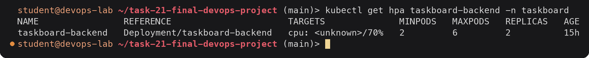

<details><summary>Text version</summary>

```console
student@devops-lab:~/task-21-final-devops-project$ kubectl get hpa taskboard-backend -n taskboard
NAME                REFERENCE                      TARGETS              MINPODS   MAXPODS   REPLICAS   AGE
taskboard-backend   Deployment/taskboard-backend   cpu: <unknown>/70%   2         6         2          15h
```

</details>

**Investigate**

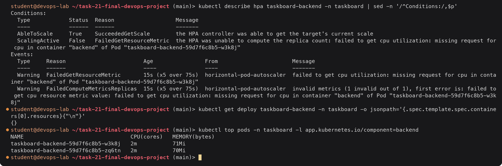

<details><summary>Text version</summary>

```console
student@devops-lab:~/task-21-final-devops-project$ kubectl describe hpa taskboard-backend -n taskboard | sed -n '/^Conditions:/,$p'
Conditions:
  Type            Status  Reason                   Message
  ----            ------  ------                   -------
  AbleToScale     True    SucceededGetScale        the HPA controller was able to get the target's current scale
  ScalingActive   False   FailedGetResourceMetric  the HPA was unable to compute the replica count: failed to get cpu utilization: missing request for cpu in container "backend" of Pod "taskboard-backend-59d7f6c8b5-w3k8j"
Events:
  Type     Reason                        Age                From                       Message
  ----     ------                        ----               ----                       -------
  Warning  FailedGetResourceMetric       15s (x5 over 75s)  horizontal-pod-autoscaler  failed to get cpu utilization: missing request for cpu in container "backend" of Pod "taskboard-backend-59d7f6c8b5-w3k8j"
  Warning  FailedComputeMetricsReplicas  15s (x5 over 75s)  horizontal-pod-autoscaler  invalid metrics (1 invalid out of 1), first error is: failed to get cpu resource metric value: failed to get cpu utilization: missing request for cpu in container "backend" of Pod "taskboard-backend-59d7f6c8b5-w3k8j"
student@devops-lab:~/task-21-final-devops-project$ kubectl get deploy taskboard-backend -n taskboard -o jsonpath='{.spec.template.spec.containers[0].resources}{"\n"}'
{}
student@devops-lab:~/task-21-final-devops-project$ kubectl top pods -n taskboard -l app.kubernetes.io/component=backend
NAME                                 CPU(cores)   MEMORY(bytes)
taskboard-backend-59d7f6c8b5-w3k8j   2m           71Mi
taskboard-backend-59d7f6c8b5-zq6tn   2m           70Mi
```

</details>

**Root cause:** a `Utilization` target means "usage divided by the CPU request". metrics-server still
reports usage (`kubectl top` works), but the container has no request, so there is nothing to divide
by. The HPA stops scaling (`ScalingActive False`) and stays at its current replica count. The pods also
lost their limits, so under load they could starve the node.

**Fix and verify**

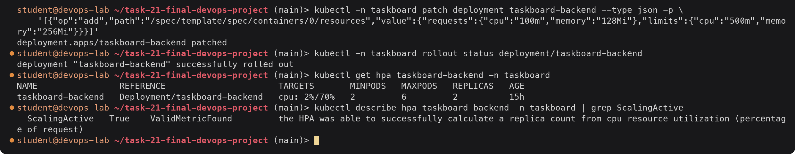

<details><summary>Text version</summary>

```console
student@devops-lab:~/task-21-final-devops-project$ kubectl -n taskboard patch deployment taskboard-backend --type json -p \
    '[{"op":"add","path":"/spec/template/spec/containers/0/resources","value":{"requests":{"cpu":"100m","memory":"128Mi"},"limits":{"cpu":"500m","memory":"256Mi"}}}]'
deployment.apps/taskboard-backend patched
student@devops-lab:~/task-21-final-devops-project$ kubectl -n taskboard rollout status deployment/taskboard-backend
deployment "taskboard-backend" successfully rolled out
student@devops-lab:~/task-21-final-devops-project$ kubectl get hpa taskboard-backend -n taskboard
NAME                REFERENCE                      TARGETS       MINPODS   MAXPODS   REPLICAS   AGE
taskboard-backend   Deployment/taskboard-backend   cpu: 2%/70%   2         6         2          15h
student@devops-lab:~/task-21-final-devops-project$ kubectl describe hpa taskboard-backend -n taskboard | grep ScalingActive
  ScalingActive   True    ValidMetricFound         the HPA was able to successfully calculate a replica count from cpu resource utilization (percentage of request)
```

</details>

**Documentation / prevention:** a namespace `LimitRange` with default requests would catch containers
that forget them. Trivy config also flags missing requests and limits (KSV-0011/0015, low severity, so
they do not block the build).

### Issue 6: Ingress points at the wrong Service port

**Break:** `kubectl -n taskboard patch ingress taskboard --type json --patch-file kubernetes/troubleshooting/06-ingress-wrong-port.json`

**Identify**

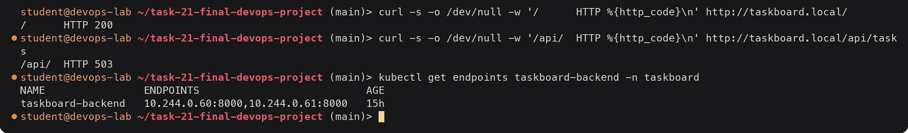

<details><summary>Text version</summary>

```console
student@devops-lab:~/task-21-final-devops-project$ curl -s -o /dev/null -w '/      HTTP %{http_code}\n' http://taskboard.local/
/      HTTP 200
student@devops-lab:~/task-21-final-devops-project$ curl -s -o /dev/null -w '/api/  HTTP %{http_code}\n' http://taskboard.local/api/tasks
/api/  HTTP 503
student@devops-lab:~/task-21-final-devops-project$ kubectl get endpoints taskboard-backend -n taskboard
NAME                ENDPOINTS                           AGE
taskboard-backend   10.244.0.60:8000,10.244.0.61:8000   15h
```

</details>

Only the API path fails, and the Service has endpoints. So the problem is between the Ingress and the
Service, not in the pods.

**Investigate**

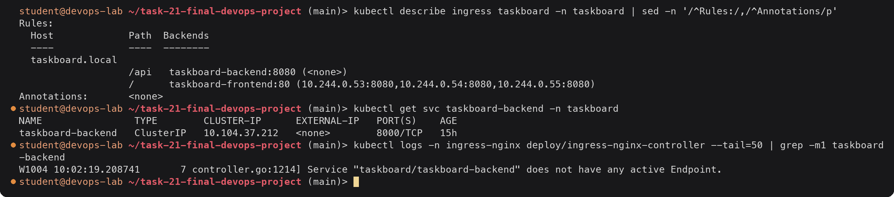

<details><summary>Text version</summary>

```console
student@devops-lab:~/task-21-final-devops-project$ kubectl describe ingress taskboard -n taskboard | sed -n '/^Rules:/,/^Annotations/p'
Rules:
  Host             Path  Backends
  ----             ----  --------
  taskboard.local
                   /api   taskboard-backend:8080 (<none>)
                   /      taskboard-frontend:80 (10.244.0.53:8080,10.244.0.54:8080,10.244.0.55:8080)
Annotations:       <none>
student@devops-lab:~/task-21-final-devops-project$ kubectl get svc taskboard-backend -n taskboard
NAME                TYPE        CLUSTER-IP      EXTERNAL-IP   PORT(S)    AGE
taskboard-backend   ClusterIP   10.104.37.212   <none>        8000/TCP   15h
student@devops-lab:~/task-21-final-devops-project$ kubectl logs -n ingress-nginx deploy/ingress-nginx-controller --tail=50 | grep -m1 taskboard-backend
W1004 10:02:19.208741       7 controller.go:1214] Service "taskboard/taskboard-backend" does not have any active Endpoint.
```

</details>

**Root cause:** the Ingress sends `/api` to port 8080 (the frontend's container port), but the
backend Service only exposes 8000. ingress-nginx finds no endpoints for that Service port and answers
503. `kubectl describe ingress` shows it directly: `(<none>)` next to the backend, while the frontend
line lists pod IPs.

**Fix and verify**

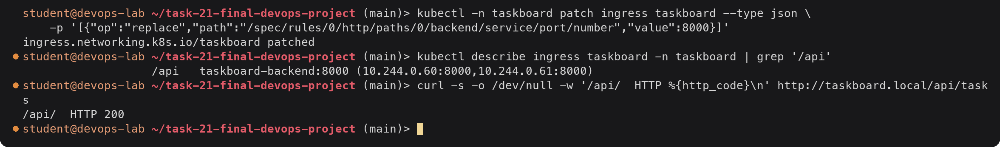

<details><summary>Text version</summary>

```console
student@devops-lab:~/task-21-final-devops-project$ kubectl -n taskboard patch ingress taskboard --type json \
    -p '[{"op":"replace","path":"/spec/rules/0/http/paths/0/backend/service/port/number","value":8000}]'
ingress.networking.k8s.io/taskboard patched
student@devops-lab:~/task-21-final-devops-project$ kubectl describe ingress taskboard -n taskboard | grep '/api'
                   /api   taskboard-backend:8000 (10.244.0.60:8000,10.244.0.61:8000)
student@devops-lab:~/task-21-final-devops-project$ curl -s -o /dev/null -w '/api/  HTTP %{http_code}\n' http://taskboard.local/api/tasks
/api/  HTTP 200
```

</details>

**Documentation / prevention:** the chart builds the Ingress port from `backend.port`, the same value
the Service uses. Referring to the Service port by name (`port.name: http`) instead of a number also
avoids this.

### Back to GitOps

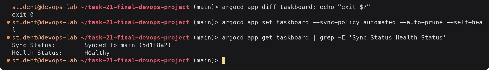

<details><summary>Text version</summary>

```console
student@devops-lab:~/task-21-final-devops-project$ argocd app diff taskboard; echo "exit $?"
exit 0
student@devops-lab:~/task-21-final-devops-project$ argocd app set taskboard --sync-policy automated --auto-prune --self-heal
student@devops-lab:~/task-21-final-devops-project$ argocd app get taskboard | grep -E 'Sync Status|Health Status'
Sync Status:        Synced to main (5d1f8a2)
Health Status:      Healthy
```

</details>

`argocd app diff` returned nothing, so every manual fix brought the cluster back exactly to what Git
describes. In real work the fix would be a commit, and Argo CD would apply it. Here the commit already
held the correct state, because only the cluster had been broken.

### Summary

| # | Symptom | Where the evidence was | Root cause | Fix |
|---|---|---|---|---|
| 1 | new pod `ImagePullBackOff`, rollout stuck | pod events: `manifest unknown` | typo in image tag | `rollout undo` / correct tag |
| 2 | new pod `0/1 Running`, rollout times out | events: probe 404, app log `/readyz 404` | wrong readiness path | `rollout undo` / correct path |
| 3 | 502 from nginx, 503 from Ingress, all pods healthy | `kubectl get endpoints` = `<none>` | Service selector `component=api` | restore selector |
| 4 | `CreateContainerConfigError` after restart | pod events: `couldn't find key DB_PASSWORD` | Secret recreated with key `DB_PASS` | recreate Secret from the password source |
| 5 | HPA `cpu: <unknown>/70%` | HPA conditions: `missing request for cpu` | container resources removed | restore requests/limits |
| 6 | `/api` 503, `/` fine | `describe ingress`: `taskboard-backend:8080 (<none>)` | Ingress uses port 8080, Service has 8000 | port 8000 |

---

## 15. Final state output

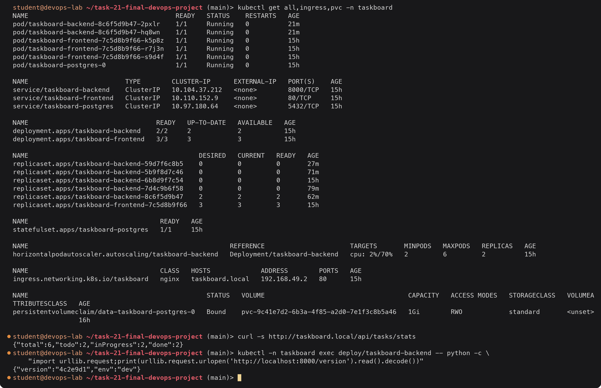

<details><summary>Text version</summary>

```console
student@devops-lab:~/task-21-final-devops-project$ kubectl get all,ingress,pvc -n taskboard
NAME                                      READY   STATUS    RESTARTS   AGE
pod/taskboard-backend-8c6f5d9b47-2pxlr    1/1     Running   0          21m
pod/taskboard-backend-8c6f5d9b47-hq8wn    1/1     Running   0          21m
pod/taskboard-frontend-7c5d8b9f66-k5p8z   1/1     Running   0          15h
pod/taskboard-frontend-7c5d8b9f66-r7j3n   1/1     Running   0          15h
pod/taskboard-frontend-7c5d8b9f66-s9d4f   1/1     Running   0          15h
pod/taskboard-postgres-0                  1/1     Running   0          15h

NAME                         TYPE        CLUSTER-IP      EXTERNAL-IP   PORT(S)    AGE
service/taskboard-backend    ClusterIP   10.104.37.212   <none>        8000/TCP   15h
service/taskboard-frontend   ClusterIP   10.110.152.9    <none>        80/TCP     15h
service/taskboard-postgres   ClusterIP   10.97.180.64    <none>        5432/TCP   15h

NAME                                 READY   UP-TO-DATE   AVAILABLE   AGE
deployment.apps/taskboard-backend    2/2     2            2           15h
deployment.apps/taskboard-frontend   3/3     3            3           15h

NAME                                            DESIRED   CURRENT   READY   AGE
replicaset.apps/taskboard-backend-59d7f6c8b5    0         0         0       27m
replicaset.apps/taskboard-backend-5b9f8d7c46    0         0         0       71m
replicaset.apps/taskboard-backend-6b8d9f7c54    0         0         0       15h
replicaset.apps/taskboard-backend-7d4c9b6f58    0         0         0       79m
replicaset.apps/taskboard-backend-8c6f5d9b47    2         2         2       62m
replicaset.apps/taskboard-frontend-7c5d8b9f66   3         3         3       15h

NAME                                  READY   AGE
statefulset.apps/taskboard-postgres   1/1     15h

NAME                                                    REFERENCE                      TARGETS       MINPODS   MAXPODS   REPLICAS   AGE
horizontalpodautoscaler.autoscaling/taskboard-backend   Deployment/taskboard-backend   cpu: 2%/70%   2         6         2          15h

NAME                                  CLASS   HOSTS             ADDRESS        PORTS   AGE
ingress.networking.k8s.io/taskboard   nginx   taskboard.local   192.168.49.2   80      15h

NAME                                              STATUS   VOLUME                                     CAPACITY   ACCESS MODES   STORAGECLASS   VOLUMEATTRIBUTESCLASS   AGE
persistentvolumeclaim/data-taskboard-postgres-0   Bound    pvc-9c41e7d2-6b3a-4f85-a2d0-7e1f3c8b5a46   1Gi        RWO            standard       <unset>                 16h

student@devops-lab:~/task-21-final-devops-project$ curl -s http://taskboard.local/api/tasks/stats
{"total":6,"todo":2,"inProgress":2,"done":2}
student@devops-lab:~/task-21-final-devops-project$ kubectl -n taskboard exec deploy/taskboard-backend -- python -c \
    "import urllib.request;print(urllib.request.urlopen('http://localhost:8000/version').read().decode())"
{"version":"4c2e9d1","env":"dev"}
```

</details>

The backend now runs from ReplicaSet `8c6f5d9b47` instead of `6b8d9f7c54`. Issue 4's
`rollout restart` added a `restartedAt` annotation to the pod template. Issue 5 removed the resources
(ReplicaSet `59d7f6c8b5`), and putting them back produced the `8c6f5d9b47` template again, so the
Deployment scaled that ReplicaSet back up instead of creating a new one. Argo CD only compares the
fields it manages, so the annotation added by `rollout restart` does not count as drift and the app
stays `Synced`. The ReplicaSets at 0 are the broken revisions from the troubleshooting session.

---

## 16. Lessons learned

- **Gates are only useful if they block.** The first real run failed on seven Starlette advisories
  and seven misconfigurations. Fixing them took about an hour. Without the gate those images would have
  been in the registry and running.
- **Accepting a risk is a code change.** The two Terraform findings I kept are in
  `security/trivyignore.yaml` with a reason and an expiry, reviewed like any other change. The scanner
  stays on.
- **Old pins rot.** The course app's dependency versions had become vulnerable since they were
  written. Pinning is right for reproducibility, but it needs regular updates (Dependabot or Renovate).
- **`maxUnavailable: 0` saved the app twice** in the troubleshooting lab. A bad image or a bad probe
  stopped the rollout but never took serving pods away.
- **"All pods Running" does not mean the app works.** Issues 3 and 6 had healthy pods and a broken
  app. `kubectl get endpoints` and `kubectl describe ingress` find this kind of problem fastest.
- **Readiness and liveness answer different questions.** Liveness on `/health` (process alive) and
  readiness on `/ready` (database reachable) meant a DB outage removes pods from the Service instead of
  restart-looping them.
- **The HPA depends on requests.** Utilisation is relative to the request, so the request value
  decides when scaling starts, and with no request there is no scaling at all.
- **Labels are an API.** Service selectors, ServiceMonitor selectors and Argo CD's tracking label all
  depend on them. Naming the Argo CD Application differently from the Helm release would have broken
  the selectors.
- **GitOps changes how you fix things.** With self-heal on, `kubectl` fixes are reverted. The fix has
  to go into Git, and that is also how a team gets an audit trail of what changed.
- **Run migrations once, safely.** Several pods running `alembic upgrade head` at once needed a
  database lock. A Kubernetes Job or Argo CD PreSync hook would be the next step.
- **Clean up the cloud.** EKS + NAT gateway cost money every hour. Applying and destroying in the
  same session, with all of it in Terraform, made that easy.
