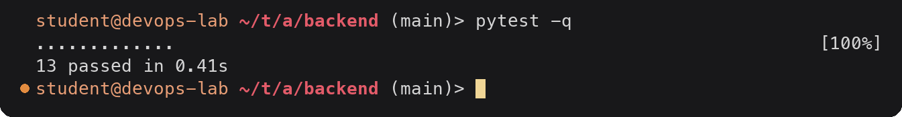
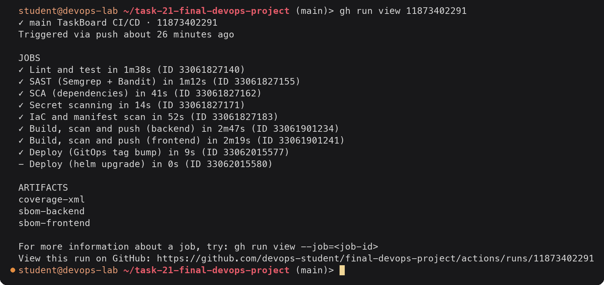
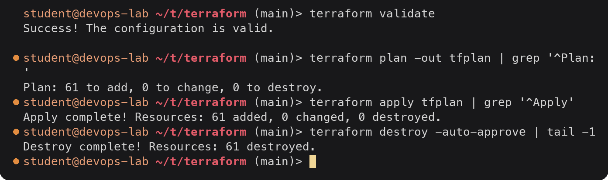
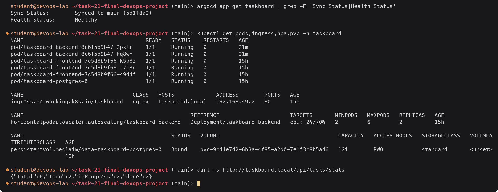
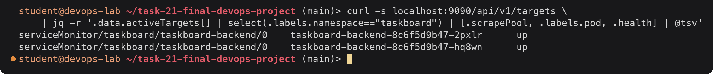

# Final DevOps Project: Submission

> **Note:** Command output in this file is representative expected output for the lab environment
> below, written as a learning reference. It was not captured from a live run, so IDs, timestamps
> and pod name hashes will differ when you run it yourself.

## Lab environment

| Item | Value |
|---|---|
| Host | Ubuntu 24.04 LTS, hostname `devops-lab`, user `student` |
| Shell prompt in output | `student@devops-lab:~/<task-folder>$` |
| Docker | 27.3.1 |
| Minikube | v1.34.0, docker driver, 2 CPU / 4096 MB, profile `minikube` |
| Kubernetes | v1.31.0, single node `minikube`, node InternalIP `192.168.49.2` |
| kubectl | v1.31.1 client |
| Helm | v3.16.2 |
| Terraform | v1.9.8, hashicorp/aws provider 5.74.0 |
| AWS | region `ap-south-1`, account ID `123456789012` (placeholder), IAM user `terraform-lab` |
| GitHub | user/org placeholder `devops-student`, repo `devops-homework` |
| Container registry | `ghcr.io/devops-student/...` |
| Pod CIDR / Service CIDR | 10.244.0.0/16 / 10.96.0.0/12, kube-dns ClusterIP 10.96.0.10 |
| Date range of runs | 2026-09-14 to 2026-10-04 (timestamps should fall in this range, ascending by task number) |

The full write-up (all sections the assignment asks for, every command with its output, and the
troubleshooting challenge) is in **[README.md](README.md)**. This file maps each deliverable to where
it is and repeats the headline outputs.

This folder is meant to be the root of its own repository (`devops-student/final-devops-project`),
because GitHub Actions only runs workflows from `.github/workflows/` at a repository root.

## Flow and where each step lives

| Step | Implementation | Files | README section |
|---|---|---|---|
| Application | React + FastAPI + PostgreSQL TaskBoard, 13 pytest tests | [application/](application/) | 5 |
| Git → GitHub | repo `final-devops-project`, PRs into `main` | [.gitignore](.gitignore) | 10 |
| CI | GitHub Actions on push/PR | [.github/workflows/ci-cd.yml](.github/workflows/ci-cd.yml) | 10 |
| Build & test | Ruff, pytest (coverage ≥ 80%), Vite build, Helm lint/template | same workflow, job `lint-test` | 5, 10 |
| Security scanning | Semgrep, Bandit, pip-audit, npm audit, Gitleaks, Trivy config, Trivy image, SBOM, cosign | [security/](security/), jobs `sast`, `sca`, `secrets`, `iac-scan`, `build-scan-push` | 11 |
| Docker image | multi-stage, non-root, health check | [docker/](docker/) | 6 |
| Registry | GHCR, tag = short commit SHA, signed | job `build-scan-push` | 10 |
| Kubernetes | Namespace, ConfigMap, Secret, StatefulSet + PVC, Deployments, Services, Ingress, HPA, probes | [kubernetes/](kubernetes/) | 7 |
| Helm | chart with dev/prod values, ServiceMonitor, PrometheusRule, dashboard, NetworkPolicy, `helm test` | [helm/taskboard/](helm/taskboard/) | 8 |
| Terraform | VPC (2 public + 2 private subnets, NAT) + EKS + node group + EBS CSI IRSA | [terraform/](terraform/) | 9 |
| Monitoring | kube-prometheus-stack, Loki, alert rules, Grafana dashboard | [monitoring/](monitoring/), chart templates | 12 |
| GitOps | Argo CD AppProject + Application, CI commits the image tag | [gitops/argocd/](gitops/argocd/) | 13 |
| Troubleshooting | six broken changes, each identified, investigated, fixed and verified | [kubernetes/troubleshooting/](kubernetes/troubleshooting/) | 14 |

## Headline outputs

### Tests

### Pipeline

The run before it failed the SCA gate (seven Starlette advisories) and the IaC gate (Postgres without
a securityContext, frontend Dockerfile without `USER`, EKS API open to `0.0.0.0/0`). README section 11
shows both failures and how each finding was fixed or formally accepted.

### Terraform

### Kubernetes, Helm and GitOps

### Monitoring

### Troubleshooting challenge

| # | Broken change | Symptom | Root cause found with | Fix |
|---|---|---|---|---|
| 1 | image tag `4c2e9d` | `ImagePullBackOff`, rollout stuck, app still up | pod events: `manifest unknown` | `kubectl rollout undo` |
| 2 | readiness path `/readyz` | new pod `0/1`, rollout timeout | events: probe 404; app log shows `/readyz 404` | `kubectl rollout undo` |
| 3 | Service selector `component=api` | 502 from nginx, 503 from Ingress | `kubectl get endpoints` → `<none>` | restore selector |
| 4 | Secret key `DB_PASS` | `CreateContainerConfigError` after restart | events: `couldn't find key DB_PASSWORD` | recreate Secret from the password source |
| 5 | container resources removed | HPA `cpu: <unknown>/70%` | HPA condition: `missing request for cpu` | restore requests/limits |
| 6 | Ingress port 8080 | `/api` 503, `/` 200 | `describe ingress`: `taskboard-backend:8080 (<none>)` | port 8000 |

Each one is written up in README section 14 as identify → investigate → root cause → fix → verify →
documentation, with the before and after output.

## Deliverables checklist

- [x] Exact layout: `application/ docker/ kubernetes/ helm/ terraform/ .github/workflows/ security/ monitoring/ gitops/ README.md`, plus this `submission.md`
- [x] Application with tests: [application/backend/tests/](application/backend/tests/) (13 tests, 95% coverage), frontend build (README §5)
- [x] Docker: multi-stage, non-root images and Compose stack ([docker/](docker/), README §6)
- [x] Kubernetes: Deployment, Service, ConfigMap, Secret, Ingress, HPA, startup/liveness/readiness probes, StatefulSet with PVC storage ([kubernetes/](kubernetes/), README §7)
- [x] Helm: chart with dev/prod values, install, test, upgrade, rollback ([helm/taskboard/](helm/taskboard/), README §8)
- [x] Terraform: VPC + EKS, validated, plan/apply/destroy ([terraform/](terraform/), README §9)
- [x] CI/CD: build, test, Docker build, push to GHCR, deploy (GitOps tag bump, or `helm upgrade`) ([ci-cd.yml](.github/workflows/ci-cd.yml), README §10)
- [x] DevSecOps: SAST (Semgrep, Bandit), SCA (pip-audit, npm audit), secret scanning (Gitleaks), IaC scanning and image scanning (Trivy), SBOM, signing, gates that block, documented risk acceptance ([security/](security/), README §11)
- [x] Monitoring: ServiceMonitor, PrometheusRule, Grafana dashboard, Loki logs, PromQL/LogQL outputs, HPA under load ([monitoring/](monitoring/), README §12)
- [x] GitOps: Argo CD AppProject + Application, release by commit, drift self-heal ([gitops/argocd/](gitops/argocd/), README §13)
- [x] Troubleshooting challenge: 6 issues with identify, investigate, root cause, fix, verify, documentation and before/after output ([kubernetes/troubleshooting/](kubernetes/troubleshooting/), README §14)
- [x] README with overview, architecture diagram, technologies, setup for each layer, outputs instead of screenshots and lessons learned ([README.md](README.md))
