# Kubernetes Fundamentals with Minikube

> **Note:** Command output in this file is representative expected output for the lab environment
> below, written as a learning reference. It was not captured from a live run, so IDs, timestamps
> and pod name hashes will differ when you run it yourself.

| Item | Value |
|---|---|
| Host | Ubuntu 24.04 LTS, hostname `devops-lab`, user `student` |
| Shell prompt in output | `student@devops-lab:~/task-9-kubernetes-fundamentals$` (shortened to `$` below) |
| Docker | 27.3.1 |
| Minikube | v1.34.0, docker driver, 2 CPU / 4096 MB, profile `minikube` |
| Kubernetes | v1.31.0, single node `minikube`, node InternalIP `192.168.49.2` |
| kubectl | v1.31.1 client |
| Pod CIDR / Service CIDR | 10.244.0.0/16 / 10.96.0.0/12, kube-dns ClusterIP 10.96.0.10 |
| Date of run | 2026-09-14 |

Files in this folder:

| File | What it is |
|---|---|
| [`install-minikube.sh`](install-minikube.sh) | Installs kubectl and minikube and starts the cluster (Task 1) |
| [`manifests/nginx-pod.yaml`](manifests/nginx-pod.yaml) | A single Pod, used in Task 4 |
| [`manifests/kubernetes-bootcamp.yaml`](manifests/kubernetes-bootcamp.yaml) | Declarative version of the tutorial Deployment and Service (Task 5) |

---

## Task 1: Install and configure Minikube

Minikube runs a whole Kubernetes cluster inside one Docker container on my machine. Docker
was already installed from the earlier Docker tasks, so I only needed `kubectl` and
`minikube`. The same steps are in [`install-minikube.sh`](install-minikube.sh).

### Install kubectl

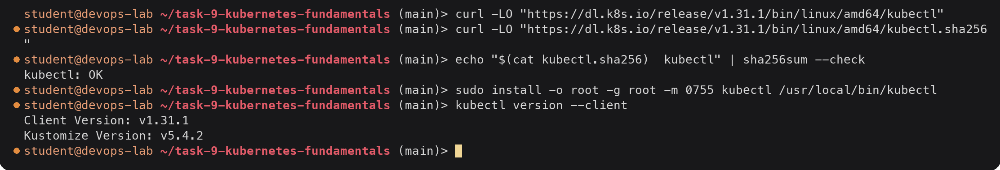

The checksum line matters: it proves the binary I downloaded is the one the Kubernetes
project published.

### Install minikube

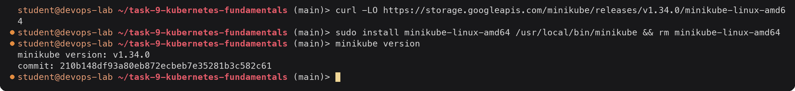

### Configure and start the cluster

I set the driver and size once with `minikube config` so I do not have to repeat the flags
on every start. `MINIKUBE_IN_STYLE=false` makes minikube print plain `*` bullets instead of
emoji.

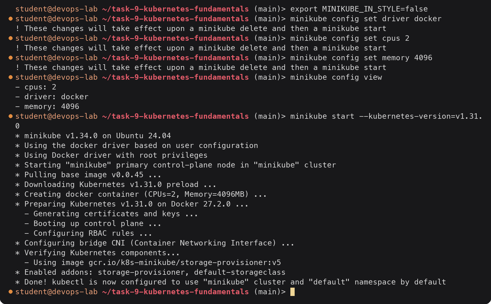

What `minikube start` did, in order: pulled the `kicbase` image, created a container named
`minikube` from it, ran `kubeadm` inside that container to bootstrap a control plane, set up
the bridge CNI for pod networking, and wrote a `minikube` context into `~/.kube/config`.
Inside the node the container runtime is Docker 27.2.0 (the one shipped in kicbase), which
is separate from the Docker 27.3.1 on my host.

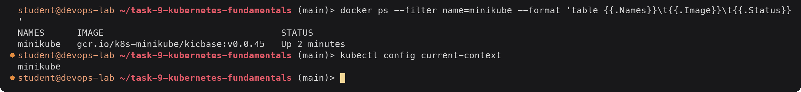

The whole "node" is that one container.

---

## Task 2: Verify Kubernetes cluster status

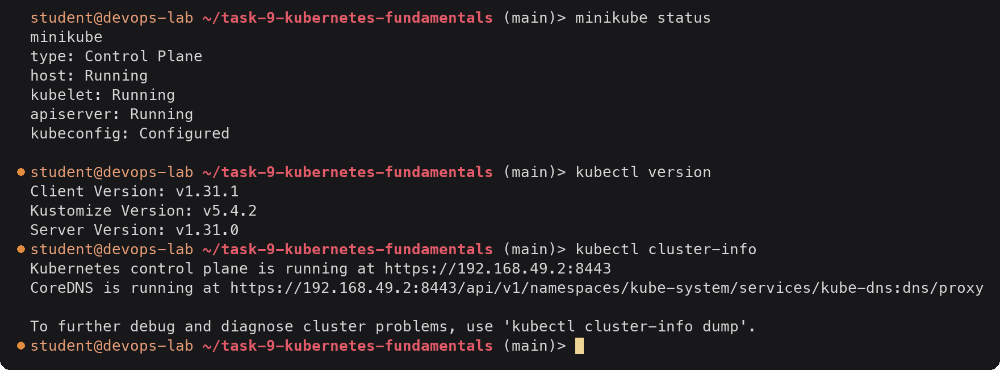

All four status lines are good: the container is up, kubelet is running inside it, the API
server answers, and my kubeconfig points at it. `cluster-info` shows the API server on the
node IP `192.168.49.2`, port 8443.

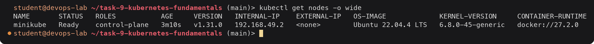

One node, `Ready`, with the `control-plane` role. Because minikube is single node, the same
node also runs my workloads. The OS image is the Ubuntu 22.04 inside kicbase, while the kernel
is my host's kernel, since a container shares the host kernel.

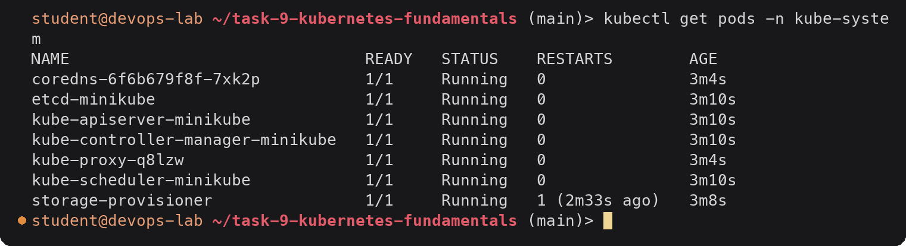

Every system component is running. `storage-provisioner` shows one restart; it starts before
the API server is fully ready, exits, and the kubelet restarts it. That is normal on a fresh
minikube cluster.

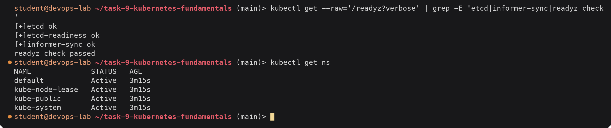

`/readyz` is the API server's own health endpoint; it confirms the API server can reach etcd.
(`kubectl get componentstatuses` is deprecated since v1.19, so I used this instead.)

---

## Task 3: Kubernetes architecture

A cluster has two halves. The **control plane** decides what should run and where. The
**nodes** actually run the containers. Everything talks through the API server; no component
talks to etcd except the API server.

```text
                         kubectl / CI / users
                                 |
                                 | HTTPS (REST), port 8443 on minikube
                                 v
+------------------------------- CONTROL PLANE --------------------------------+
|                                                                              |
|   +------------------+        +----------------------------------------+     |
|   |      etcd        |<------>|            kube-apiserver              |     |
|   | key-value store, |        | authn/authz, admission, validation,    |     |
|   | all cluster state|        | the only door into etcd                |     |
|   +------------------+        +----------------------------------------+     |
|                                   ^            ^               ^             |
|                    watch/update   |            |               |             |
|        +--------------------------+--+   +-----+----------+  +-+-----------+ |
|        |   kube-controller-manager    |   | kube-scheduler |  | cloud-ctrl- | |
|        | Deployment, ReplicaSet, Node,|   | picks a node   |  | manager     | |
|        | Endpoint, Job ... controllers|   | for new Pods   |  | (cloud only)| |
|        +------------------------------+   +----------------+  +-------------+ |
+------------------------------------------------------------------------------+
                                 ^
                                 | kubelet watches its Pods, reports status
                                 v
+------------------------------------ NODE ------------------------------------+
|                                                                              |
|   +-------------+     CRI      +-------------------+     +-----------------+ |
|   |   kubelet   |------------->| container runtime |---->|  Pod  |  Pod    | |
|   | node agent  |              | (docker via       |     | [ctr] | [ctr]   | |
|   +-------------+              |  cri-dockerd)     |     +-----------------+ |
|                                +-------------------+                         |
|   +-------------+                                                            |
|   | kube-proxy  |  programs iptables so Service IPs reach Pod IPs            |
|   +-------------+                                                            |
+------------------------------------------------------------------------------+
```

### Control plane components

| Component | Job |
|---|---|
| **kube-apiserver** | Front door of the cluster. Every request (from kubectl, from controllers, from kubelets) is authenticated, authorised, run through admission, validated and then stored. It is stateless; the state lives in etcd. |
| **etcd** | Consistent, distributed key-value store holding every object (Pods, Deployments, Secrets...). If etcd is lost without a backup, the cluster's desired state is lost. |
| **kube-scheduler** | Watches for Pods with no `nodeName`. Filters nodes that can fit the Pod (resources, taints, affinity), scores the rest, and binds the Pod to the best one. It does not start anything itself. |
| **kube-controller-manager** | One binary running many control loops. Each loop compares desired state with actual state and acts: the ReplicaSet controller creates missing Pods, the Node controller marks dead nodes, the Endpoints controller keeps Service endpoints up to date, and so on. |
| **cloud-controller-manager** | The cloud-specific loops (create a cloud load balancer for a `LoadBalancer` Service, set node addresses, routes). It only exists on cloud clusters such as EKS/GKE/AKS. Minikube does not run one, which is why it needs `minikube tunnel` for LoadBalancer Services. |

### Node components

| Component | Job |
|---|---|
| **kubelet** | Agent on every node. Watches the API server for Pods bound to its node, tells the runtime to start them, runs probes, and reports Pod and node status back. It also runs the static Pods in `/etc/kubernetes/manifests`. |
| **kube-proxy** | Watches Services and EndpointSlices and writes iptables (or IPVS) rules so traffic sent to a Service ClusterIP or NodePort lands on one of the backing Pods. |
| **Container runtime** | Actually pulls images and runs containers through the CRI. Common ones are containerd and CRI-O. In this minikube setup it is Docker Engine behind `cri-dockerd`. |

### Seeing the architecture on minikube

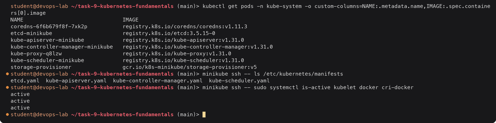

What I took from this:

- The four control plane components run as **static Pods**. The kubelet reads those four
  files from `/etc/kubernetes/manifests` and starts them directly, which is how the API server
  can run "inside" the cluster it serves. Their names end in `-minikube` (the node name).
- The kubelet and the container runtime are **not** Pods. They are systemd services on the
  node, because something has to exist before any Pod can start.
- `kube-proxy` is a DaemonSet Pod (one per node) and CoreDNS is a normal Deployment, so
  their names carry generated suffixes.
- There is no cloud-controller-manager, as expected for a local cluster.

### What happens on `kubectl create deployment`

1. kubectl sends the Deployment to the **API server**, which validates it and stores it in **etcd**.
2. The Deployment controller in **controller-manager** sees it and creates a ReplicaSet.
3. The ReplicaSet controller sees the ReplicaSet wants 1 Pod and creates a Pod object (no node yet).
4. The **scheduler** sees an unscheduled Pod and binds it to `minikube`.
5. The **kubelet** on `minikube` sees a Pod bound to it and asks the **runtime** to pull the image and start the container.
6. The kubelet reports the Pod as `Running`; if a Service selects it, the endpoint list is updated and **kube-proxy** adds it to the iptables rules.

---

## Task 4: Basic Kubernetes objects and commands

### The objects I used

| Object | What it is | Short name |
|---|---|---|
| Pod | Smallest unit: one or more containers sharing a network namespace (one IP) and volumes | `po` |
| ReplicaSet | Keeps N identical Pods running, matched by label selector | `rs` |
| Deployment | Manages ReplicaSets to give rolling updates and rollbacks | `deploy` |
| Service | Stable virtual IP and DNS name in front of a changing set of Pods | `svc` |
| Namespace | Logical partition for names, quotas and access control | `ns` |
| ConfigMap / Secret | Configuration and sensitive values injected into Pods | `cm` / none |
| Node | A machine (here, the minikube container) that runs Pods | `no` |
| Labels / selectors | Key-value tags on objects; selectors are how a Service or ReplicaSet finds its Pods | |

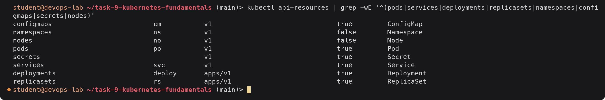

The fourth column is NAMESPACED: Nodes and Namespaces are cluster-wide, everything else lives
inside a namespace. The APIVERSION column is what goes in `apiVersion:` in YAML.

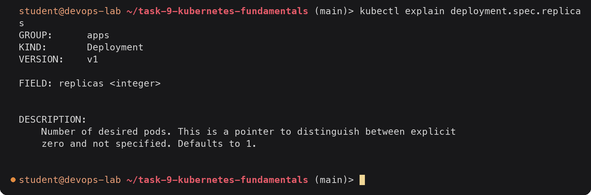

`kubectl explain` is the built-in schema reference, useful when writing YAML.

### A Pod from YAML

[`manifests/nginx-pod.yaml`](manifests/nginx-pod.yaml):

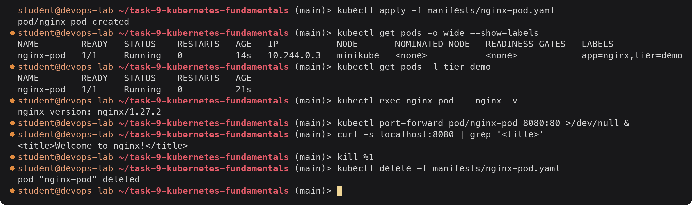

The Pod got an IP from the pod CIDR (10.244.0.0/16). CoreDNS already holds `10.244.0.2`, so
this was the next free one. Deleting a bare Pod deletes it for good: nothing recreates it,
which is the reason to use Deployments.

### Command reference

| Command | Purpose |
|---|---|
| `kubectl get <kind> [-o wide\|yaml\|json] [-l key=val] [-A]` | List objects |
| `kubectl describe <kind> <name>` | Detailed view including Events (first place to look when debugging) |
| `kubectl apply -f file.yaml` / `kubectl delete -f file.yaml` | Declarative create/update and delete |
| `kubectl create deployment NAME --image=IMG` | Imperative create |
| `kubectl expose deployment NAME --type=NodePort --port=P` | Create a Service for a Deployment |
| `kubectl scale deployment NAME --replicas=N` | Change replica count |
| `kubectl set image deployment/NAME CONTAINER=IMG` | Trigger a rolling update |
| `kubectl rollout status\|history\|undo deployment/NAME` | Watch, list and roll back rollouts |
| `kubectl logs POD [-c CONTAINER] [-f] [--previous]` | Container logs |
| `kubectl exec -it POD -- sh` | Shell inside a container |
| `kubectl port-forward pod/NAME LOCAL:REMOTE` | Reach a Pod from localhost without a Service |
| `kubectl label pod NAME key=val` | Add/change labels |
| `kubectl explain <kind>.<field>` | Field documentation |
| `kubectl config get-contexts` / `use-context` | Switch clusters |

---

## Task 5: Kubernetes Basics tutorial, hands-on

This follows the six modules of the kubernetes.io "Learn Kubernetes Basics" tutorial on my
minikube cluster. Module 1 (create a cluster) is Task 1 above.

### Module 2: Deploy an app

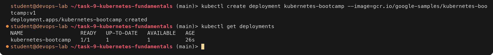

One Deployment, one replica ready. Pods are on a private network, so to reach the app before
creating a Service the tutorial uses `kubectl proxy`, which opens an authenticated tunnel
to the API server on localhost.

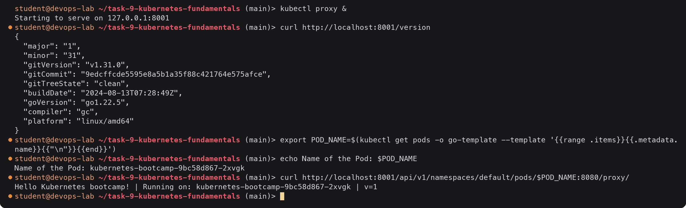

The request went kubectl proxy -> API server -> Pod port 8080. The Pod name is
`<deployment>-<pod-template-hash>-<random>`: `9bc58d867` identifies the ReplicaSet created for
this Pod template.

### Module 3: Explore the app (Pods and Nodes)

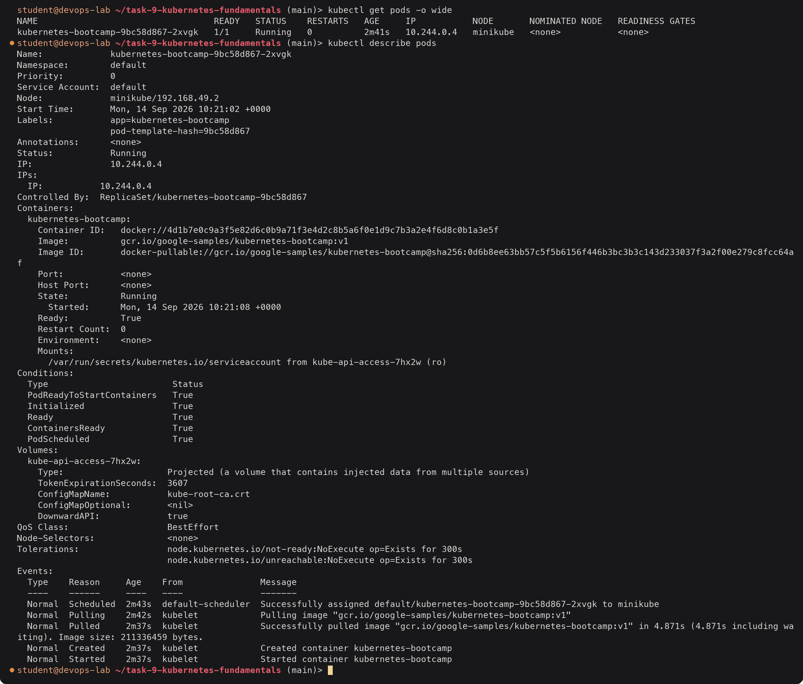

The Events section tells the Task 3 story in order: the scheduler assigned the Pod to
`minikube`, then the kubelet pulled the image and started the container. `Controlled By`
shows the Pod is owned by a ReplicaSet, not directly by the Deployment. QoS is `BestEffort`
because no requests or limits were set. (The Pod IP is `10.244.0.4`; `.3` had gone to
the nginx Pod in Task 4.)

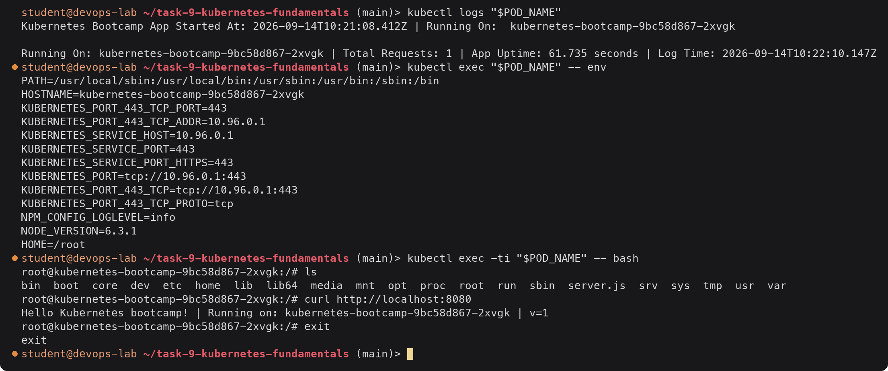

The log line with `Total Requests: 1` is my earlier proxy request. The `KUBERNETES_*`
variables are injected into every Pod so it can find the API server (`10.96.0.1` is the
first IP of the Service CIDR, the `kubernetes` Service). Inside the container the app
answers on localhost:8080 and the hostname is the Pod name.

### Module 4: Expose the app with a Service, and labels

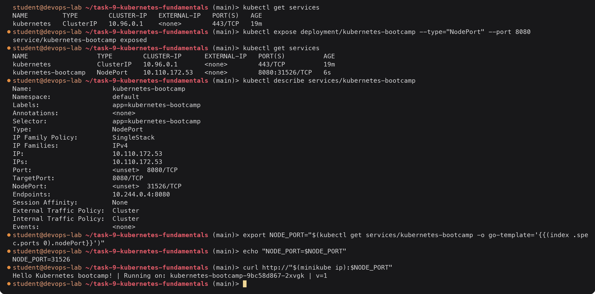

The Service got a stable ClusterIP `10.110.172.53` and a random NodePort from the
30000-32767 range. `Endpoints` is the Pod IP, found through the selector
`app=kubernetes-bootcamp` (the label `kubectl create deployment` put on the Pod template).
With the docker driver on Linux the node IP `192.168.49.2` is directly reachable from the
host, so the NodePort works from outside the cluster.

Labels:

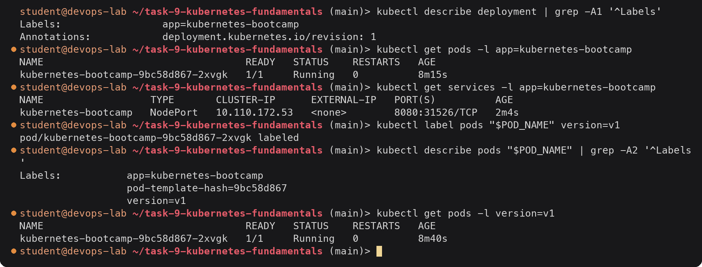

Deleting the Service:

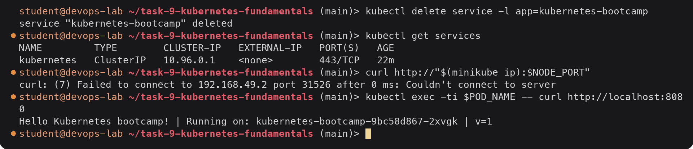

With the Service gone the NodePort is closed, but the app itself is still running: the
Service only provides the network path, it does not own the Pods.

### Module 5: Scale the app

I exposed the Deployment again so I could watch load balancing while scaling.

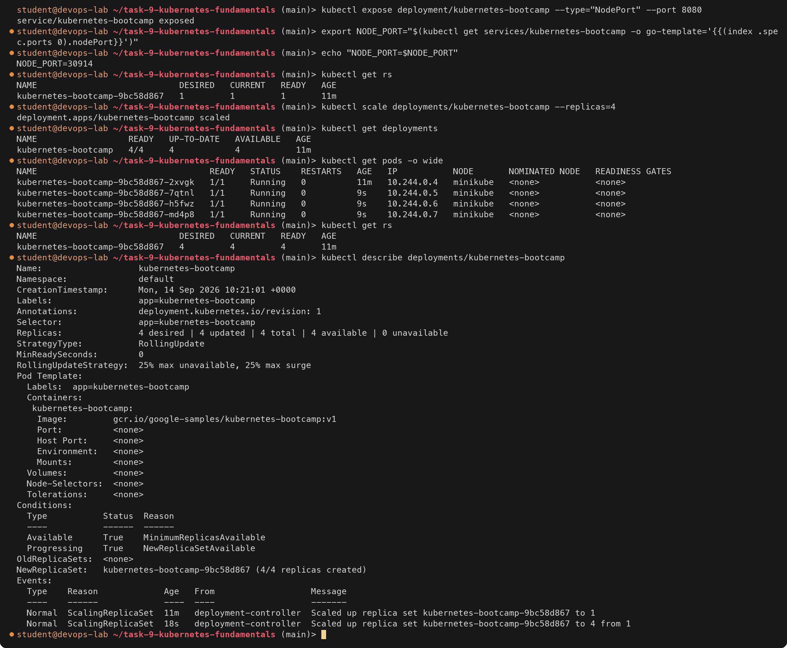

Scaling only changed the replica count on the existing ReplicaSet; the Pod template did not
change, so there was no new ReplicaSet and the revision stayed at 1. The three new Pods got
the next IPs. The label I added by hand (`version=v1`) is only on the first Pod, because it
was never part of the template.

Load balancing across the four Pods:

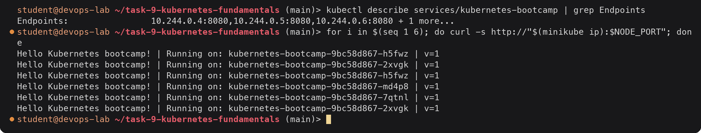

Each request can land on a different Pod. kube-proxy in iptables mode picks a backend at
random per connection, so it is not a strict round robin.

Scaling down:

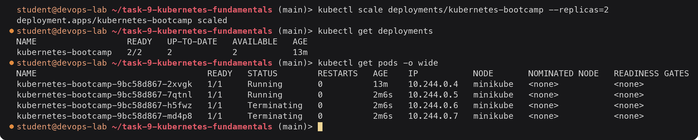

Two Pods are terminating. The node app does not handle SIGTERM gracefully, so they sit in
`Terminating` until the 30 second grace period ends and the kubelet sends SIGKILL.

### Module 6: Rolling update and rollback

Update to v2 (image from the tutorial):

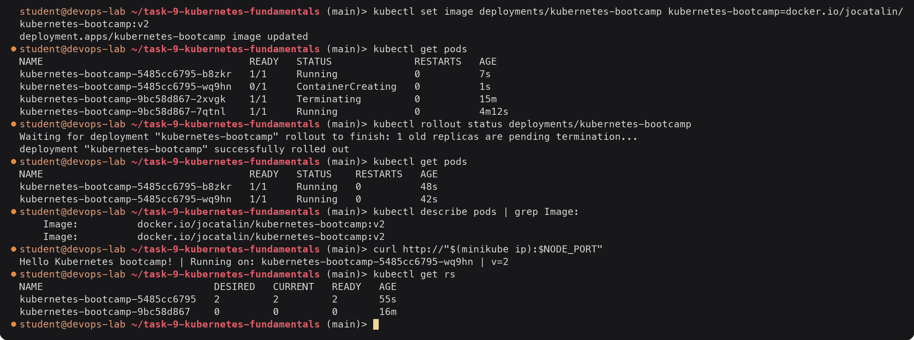

Changing the image changed the Pod template, so the Deployment created a new ReplicaSet
(`5485cc6795`) and moved Pods across one at a time. With 2 replicas, 25% surge rounds up to
1 extra Pod and 25% unavailable rounds down to 0, so there were always at least 2 ready
Pods. The old ReplicaSet is kept at 0 replicas; that is what makes rollback possible.

A bad update, then rollback:

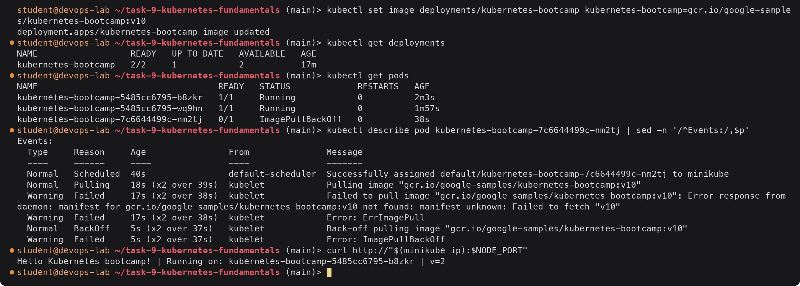

The `v10` tag does not exist. Because `maxUnavailable` is 0 here, the rollout created one new
Pod and stopped: the new Pod never became ready, so no old Pod was removed and the app kept
serving v2. The Deployment shows `UP-TO-DATE 1` but `AVAILABLE 2`.

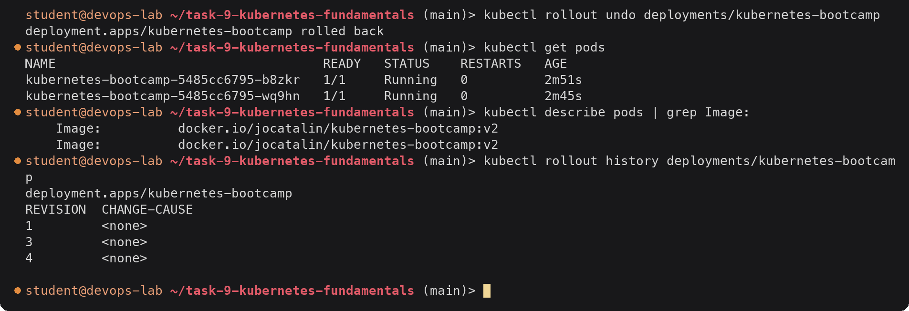

`rollout undo` went back to the previous revision (v2). The broken Pod was deleted and the two
v2 Pods were untouched. In the history, revision 2 (v2) was re-used as revision 4, so it no
longer appears under its old number; revision 3 is the broken v10.

### Clean up

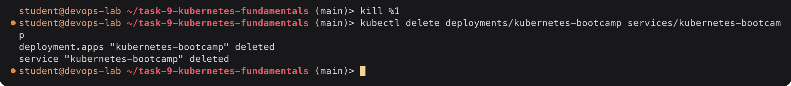

The same Deployment and Service can be created declaratively with
[`manifests/kubernetes-bootcamp.yaml`](manifests/kubernetes-bootcamp.yaml)
(`kubectl apply -f manifests/kubernetes-bootcamp.yaml`); the only difference is that the
NodePort number is again picked at random.

---

## Deliverables checklist

- [x] Minikube and kubectl installed and configured: [Task 1](#task-1-install-and-configure-minikube), [`install-minikube.sh`](install-minikube.sh)
- [x] Cluster status verified (`minikube status`, `cluster-info`, nodes, system Pods, `/readyz`): [Task 2](#task-2-verify-kubernetes-cluster-status)
- [x] Architecture notes: control plane (kube-apiserver, etcd, scheduler, controller-manager, cloud-controller-manager) and node (kubelet, kube-proxy, runtime), with text diagram: [Task 3](#task-3-kubernetes-architecture)
- [x] Basic objects and commands, with a YAML Pod: [Task 4](#task-4-basic-kubernetes-objects-and-commands), [`manifests/nginx-pod.yaml`](manifests/nginx-pod.yaml)
- [x] Kubernetes Basics tutorial: deploy, explore (pods, logs, exec), expose with NodePort and labels, scale up/down, rolling update to v2 and rollback: [Task 5](#task-5-kubernetes-basics-tutorial-hands-on)
- [x] Commands used and their output: in every section above
